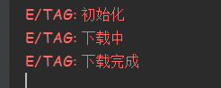

### 简介

android提供AsynvTask，==目的是为了不阻塞主线程(UI线程)==，且UI的更新只能在主线程中完成，因此异步处理是不可避免的。Handler与Thread封装的轻量级框架

Android为了降低开发难度，提供了AsyncTask.AsyncTask 是一个封装过的后台任务类，就是==异步任务==。

AsyncTask定义了三种泛型类型：Params，Progress和Result

- ***Params***：启动任务执行的输入参数，比如HTTP请求的URL。
- ***Progress***：后台任务执行的百分比。
- ***Result***：后台执行任务最终返回的结果，比如String。

------


### 使用方法

点击按钮，模拟下载任务

```kotlin
class MainActivity : AppCompatActivity() {

	private val binding: ActivityMainBinding by lazy {
		ActivityMainBinding.inflate(layoutInflater)
	}
	
	override fun onCreate(savedInstanceState: Bundle?) {
		super.onCreate(savedInstanceState)
		setContentView(binding.root)
	}
	
	fun btnClick(view: View) {
		MyAsyncTask().execute()
	}
	
	
	//自定义一个异步任务类
	inner class MyAsyncTask : AsyncTask<Unit, Int, Boolean>() {
	
	      private var progressNum = 0
	
	      //TODO：后台任务工作前，初始化界面
	      override fun onPreExecute() {
	            super.onPreExecute()
	            binding.progressBar.visibility = View.VISIBLE
	            Log.e("TAG", "准备下载...")
	      }
	
	      //TODO：后台任务工作中，在子线程进行操作
	      override fun doInBackground(vararg params: Unit?): Boolean {
	            Log.e("TAG", "下载中...")
	            while (true) {
	                  Thread.sleep(1000)
	                  if (progressNum >= 100) break
	                  progressNum += 10
	                  //更新UI主界面
	                  publishProgress(progressNum)
	            }
	            return true
	      }
	
	      //TODO：执行publishProgress()方法后，执行此方法，用来更新UI主线程
	      override fun onProgressUpdate(vararg values: Int?) {
	            super.onProgressUpdate(*values)
	            binding.progressBar.progress = values[0]!!
	      }
	
	
	      //TODO：后台任务执行后
	      override fun onPostExecute(result: Boolean?) {
	            super.onPostExecute(result)
	            if (result!!) {
	                  Log.e("TAG", "下载完成...")
	            }else{
	                  Log.e("TAG", "下载失败...")
	            }
	      }
	}
}
```



一个异步任务最少要重写以下这两个方法：

- ***doInBackground(Params…)*** ：后台执行，==比较耗时的操作都可以放在这里==。注意这里不能直接操作UI。此方法在后台线程执行，完成任务的主要工作，通常需要较长的时间。在执行过程中可以调用publicProgress(Progress…) 来更新任务的进度。
- ***onPostExecute(Result)*** ：相当于Handler 处理UI的方式，在这里面==可以使用在doInBackground 得到的结果处理操作UI==。 此方法在主线程执行，任务执行的结果作为此方法的参数返回


有必要的话你还得重写以下这三个方法，但不是必须的：

- ***onProgressUpdate(Progress…)*** ： 可此方法是当在后台任务中==调用了publishProgress(Progress...)方法后==，这个方法会被调用，方法中携带的参数是在后台任务中传递过来的，可以直接将进度信息更新到UI组件上
- ***onPreExecute()*** ： 会在后台任务开始之前执行，一般用来进行一些界面上的初始化操作
- ***onCancelled()*** ： 用户调用取消时，要做的操作

------


### 执行步骤


------


### 注意事项

使用AsyncTask类，以下是几条必须遵守的准则：

- Task的实例必须在UI thread中创建；
- execute方法必须在UI thread中调用；
- 不要手动的调用onPreExecute()，onPostExecute(Result)，doInBackground(Params...)，onProgressUpdate(Progress...)这几个方法；
- 该task只能被执行一次，否则多次调用时将会出现异常；


### AsyncTask与Handler的区别

#### AsyncTask

* ***实现原理*** ：AsyncTask，是android提供的轻量级的异步类，可以直接继承AsyncTask，在类中实现异步操作，并提供接口反馈当前异步执行的程度（可以通过接口实现UI进度更新),最后反馈执行的结果给UI主线程）
* ***优点*** ：简单，快捷，过程可控
* ***缺点*** : 在使用多个异步操作和并需要进行Ui变更时，就变得复杂起来


#### Handler

* ***实现原理*** ：在 Handler 异步实现时,涉及到 <u>Handler、Looper、Message、Thread</u> 四个对象，实现异步的流程是主线程启动Thread（子线程）运行并生成Message-Looper获取Message并传递给HandlerHandler逐个获取Looper中的Message，并进行UI变更。
* ***优点*** ：结构清晰，功能定义明确 对于多个后台任务时，简单，清晰 
* ***缺点*** ：在单个后台异步处理时，显得代码过多，结构过于复杂（相对性）