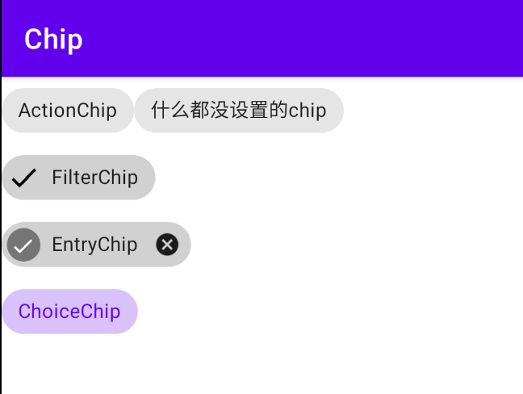

### Chip

#### 四种Chip

**1、Action chip**

- 使用 `style="@style/Widget.MaterialComponents.Chip.Action"`
- 不设置style时，默认使用上述style
- 默认前后图标都不展示，点击后没有选中状态

```xml
<com.google.android.material.chip.Chip
    style="@style/Widget.MaterialComponents.Chip.Action"
    android:layout_width="wrap_content"
    android:layout_height="wrap_content"
    android:text="ActionChip" />

<!--展示效果同上面的一致-->
<com.google.android.material.chip.Chip
    android:layout_width="wrap_content"
    android:layout_height="wrap_content"
    android:text="没有设置的chip" />
```

**2、Filter Chip**

* 使用 `style="@style/Widget.MaterialComponents.Chip.Filter"`
* 初始状态下， 不展示前后图标
* 点击之后会展示前面的选中图标，并且具有选中状态
* 通常应用在 ChipGroup 中ChipGroups

```xml
<com.google.android.material.chip.Chip
        style="@style/Widget.MaterialComponents.Chip.Filter"
        android:layout_width="wrap_content"
        android:layout_height="wrap_content"
        android:text="FilterChip01" />
```

**3、Entry Chip**

* 使用`style="@style/Widget.MaterialComponents.Chip.Entry"`
* 默认在末尾展示删除按钮；点击后前面展示选中图标，有选中状态
* 通常可以作为 chipDrawable 使用，比如在填选邮件收件人时可以使用

```xml
    <com.google.android.material.chip.Chip
        style="@style/Widget.MaterialComponents.Chip.Entry"
        android:layout_width="match_parent"
        android:layout_height="wrap_content"
        android:text="EntryChip " />
```

**4、Choice Chip**

- 默认不展示前后的图标，但点击后有选中状态
- 通常用在 ChipGroup 中 , 通过 ChipGroup  的 `singleSelection=true/false` 属性可以实现单选或多选

```xml
    <com.google.android.material.chip.Chip
        style="@style/Widget.MaterialComponents.Chip.Choice"
        android:layout_width="wrap_content"
        android:layout_height="wrap_content"
        android:text="ChoiceChip" />
```

**各种样式的Chip所展示出点击后的效果：**



#### 属性

| 类别       | 属性名称                | 具体作用           |
| ---------- | ----------------------- | ------------------ |
| Shape      | app:chipCornerRadius    | 圆角半径           |
| Size       | app:chipMinHeight       | 最小高度           |
| Background | app:chipBackgroundColor | 背景颜色           |
| Border     | app:chipStrokeColor     | 边线颜色           |
| Ripple     | app:rippleColor         | 水波纹效果的颜色   |
| Label      | android:text            | 文本内容           |
| Label      | android:textColor       | 修改文本颜色       |
| Chip Icon  | app:chipIconVisible     | 前面的图标是否展示 |

更多属性查看博客：https://www.jianshu.com/p/d64a75ec7c74

#### 事件监听

```kotlin
//点击事件
chip.setOnClickListener {
    Toast.makeText(this, "Chip被点击了", Toast.LENGTH_SHORT).show()
}

//选中事件
chip2.setOnCheckedChangeListener { buttonView, isChecked ->
    var str=""
    str = if (isChecked) "被选中了" else "取消选中了"
    Toast.makeText(this, str, Toast.LENGTH_SHORT).show()
}

//entry关闭按钮的点击事件
chip3.setOnCloseIconClickListener {
    Toast.makeText(this, "CloseIcon被点击了", Toast.LENGTH_SHORT).show()
}
```

>  ⚠️注意（选中状态的监听）：
>
> * 只有 checkable 属性为true 时该监听才会生效
> * 未设置 checkable 属性时，如果应用了 filter/entry/choice 的style , 该监听可生效，因为这三种style 中 checkable 的值为true。而 ation 的 style 中 checkable 是默认关闭的

------


### **ChipGroup**

#### 介绍

与 RadioGroup 类似，ChipGroup 是用来管理多个Chip的 ，可以控制多个 chip 的布局方式以及事件。

使用 ChipGroup 可以方便的实现 流式布局效果。其特点如下：

- 默认情况下， ChipGroup 中的 chip 会横向排列，当超过一行时会执行换行操作。
- 如果我们不想让 Chip 换行，那么为 ChipGroup 设置 `app:singleLine=true`，如果 Chip 会超过一行，则在外层包裹 HorizontalScrollView
- 只有当其中包裹的 Chip 是 checkable=true 时，才具有选中效果

#### 属性

| 属性名称                  | 作用             | 示例                                 |
| ------------------------- | ---------------- | ------------------------------------ |
| app:checkedChip           | 初始选中的chip   | app:checkedChip="@id/chipInGroup2_1" |
| app:chipSpacing           | Chip间的间距     | app:chipSpacing="25dp"               |
| app:chipSpacingHorizontal | Chip间的水平间距 | app:chipSpacingHorizontal="35dp"     |
| app:chipSpacingVertical   | Chip间的垂直间距 | app:chipSpacingVertical="10dp"       |
| app:singleLine            | 是否开启单行模式 | app:singleLine="true"                |
| app:singleSelection       | 是否开启单选模式 | app:singleSelection="true"           |

>  ⚠️注意：
>
> * 如果 singLine=false, app:chipSpacing 会同时控制Chips间的水平和垂直的间距
> * 如果 singLine=true, app:chipSpacing 控制的是Chips之间的水平间距
> * 如果设置了 chipSpacing ，也设置了 chipSpacingHorizontal / chipSpacingVertical 则 chipSpacing 的值会被覆盖

#### 使用

```xml
<TextView
    android:layout_width="wrap_content"
    android:layout_height="wrap_content"
    android:layout_marginTop="10dp"
    android:text="3、ChipGroup的使用——多行，多选" />

<!--ChipGroup 默认状态，会换行，可多选-->
<com.google.android.material.chip.ChipGroup
    android:layout_width="match_parent"
    android:layout_height="wrap_content"
    android:layout_marginTop="10dp"
    app:chipSpacing="25dp"
    app:chipSpacingHorizontal="35dp"
    app:chipSpacingVertical="10dp">

    <com.google.android.material.chip.Chip
        android:id="@+id/chipInGroup1"
        style="@style/Widget.MaterialComponents.Chip.Filter"
        android:layout_width="wrap_content"
        android:layout_height="wrap_content"
        android:text="chipInGroup1"
        android:textAppearance="?android:textAppearanceMedium" />

    <com.google.android.material.chip.Chip
        android:id="@+id/chipInGroup2"
        style="@style/Widget.MaterialComponents.Chip.Filter"
        android:layout_width="wrap_content"
        android:layout_height="wrap_content"
        android:text="chipInGroup2"
        android:textAppearance="?android:textAppearanceMedium" />

    <com.google.android.material.chip.Chip
        android:id="@+id/chipInGroup3"
        style="@style/Widget.MaterialComponents.Chip.Filter"
        android:layout_width="wrap_content"
        android:layout_height="wrap_content"
        android:text="chipInGroup3"
        android:textAppearance="?android:textAppearanceMedium" />

</com.google.android.material.chip.ChipGroup>

<TextView
    android:layout_width="wrap_content"
    android:layout_height="wrap_content"
    android:layout_marginTop="10dp"
    android:text="4、ChipGroup的使用——单行、单选" />


<!--ChipGroup 不换行，单选-->
<HorizontalScrollView
    android:layout_width="match_parent"
    android:layout_height="wrap_content"
    android:scrollbars="none">

    <com.google.android.material.chip.ChipGroup
				android:id="@+id/chipGroup2"
        android:layout_width="match_parent"
        android:layout_height="wrap_content"
        android:layout_marginTop="10dp"
        app:checkedChip="@id/chipInGroup2_1"
        app:chipSpacing="25dp"
        app:singleLine="true"
        app:singleSelection="true">

    <com.google.android.material.chip.Chip
        android:id="@+id/chipInGroup2_1"
        style="@style/Widget.MaterialComponents.Chip.Filter"
        android:layout_width="wrap_content"
        android:layout_height="wrap_content"
        android:text="chipInGroup2——1"
        android:textAppearance="?android:textAppearanceMedium" />

    <com.google.android.material.chip.Chip
        android:id="@+id/chipInGroup2_2"
        style="@style/Widget.MaterialComponents.Chip.Filter"
        android:layout_width="wrap_content"
        android:layout_height="wrap_content"
        android:text="chipInGroup2——2"
        android:textAppearance="?android:textAppearanceMedium" />

    <com.google.android.material.chip.Chip
        android:id="@+id/chipInGroup2_3"
        style="@style/Widget.MaterialComponents.Chip.Filter"
        android:layout_width="wrap_content"
        android:layout_height="wrap_content"
        android:text="chipInGroup2——3"
        android:textAppearance="?android:textAppearanceMedium" />

    </com.google.android.material.chip.ChipGroup>
</HorizontalScrollView>
```


#### 监听事件

>  ⚠️注意：只有 singleSelction=true 时，该监听才有效

```kotlin
//chipGroup里面的chip选中监听事件
chipGroup2.setOnCheckedChangeListener { group, checkedId ->
    var str=""
    when(checkedId){
        R.id.chipInGroup2_1 -> str="被选中的是 chipInGroup2_1 "
        R.id.chipInGroup2_2 -> str="被选中的是 chipInGroup2_2 "
        R.id.chipInGroup2_3 -> str="被选中的是 chipInGroup2_3 "
    }
    Toast.makeText(this, str, Toast.LENGTH_SHORT).show()
}
```

------

