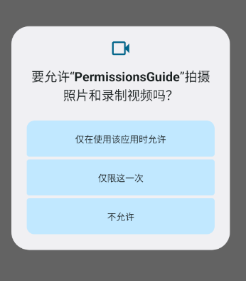
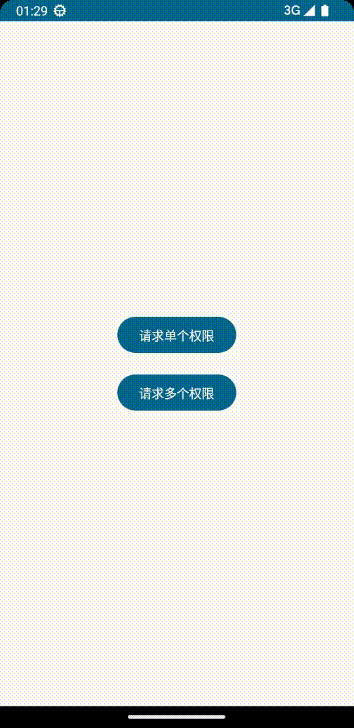

# Jetpack Compose之动态申请权限

## 前言

目前 `Jetpack Compose`  要想实现应用运行时动态的向用户申请权限，有两种方法：

1. 通过 `rememberLancherForActivityResult` 这种启动器来申请权限
2. 另一种则是使用 `Accompanist` 库里面的 `Permissions`

两种方法的效果都是一样的，只不过方式不同，根据自己的需求选择。下面讲介绍动态的向用户申请权限，以及被拒绝后如何引导用户重新开启权限...


## 第一种用法

### 1、创建启动器

* **constart：**一般这里填写你需要的操作意图（Android官方提供了一系列标准活动的集合）
* **onResult：**这里返回用户的意愿，即是否同意授予权限（返回一个Boolean值）

```kotlin
/** 单权限启动器 */
val singlePermissionResultLauncher = rememberLauncherForActivityResult(
      contract = ActivityResultContracts.RequestPermission(),
      onResult = { isGranted ->
            //...
)
                  
/** 多权限启动器 */
//......只需要把 《RequestPermission》 替换成 《RequestMultiplePermissions》
```

### 2、在合适的地方启动

这里我通过一个 Button 运行启动器，你们可以根据需求自行调整

```kotlin
Button(onClick = {
	singlePermissionResultLauncher.launch(Manifest.permission.CAMERA)
}) {
	Text(text = "请求单个权限")
}
```

到这里只要我们点击按钮就会弹出一个系统的权限申请框，当用户点击随意按钮后会取消弹窗，但是仅仅这样是不够的，我们还没有处理启动器返回的结果，接着往下走...



### 3、创建ViewModel。

添加处理权限的逻辑方法...

**分析需求：**当用户第一次不允许授予权限时，我们应该向用户说明权限的作用以及影响，并且再次向用户请求该权限（用户可能误触），所以我们可以把说明方式以Dialog弹窗的方式告知用户。

* **permissionDialogQueue：**模拟队列，将需要说明的权限加入到此（请求多权限时用）
* **dismissDialog：**从队列中移除，即可把Dialog取消掉（用户可能不理会或者不需要）
* **onPermissionResult：**处理启动器返回的结果，当用户不同意并且此权限不在队列中，我们就要把它加入到权限队列，当所有请求完后，Dialog会根据队列的权限进行弹窗说明。

```kotlin
class MainViewModel : ViewModel() {

      //权限队列
      val permissionDialogQueue = mutableStateListOf<String>()

      //取消Dialog
      fun dismissDialog() {
            permissionDialogQueue.removeFirst()
      }

      //根据用户选择的结果进行处理
      fun onPermissionResult(
            permission: String,
            isGranted: Boolean
      ) {
            if (!isGranted && !permissionDialogQueue.contains(permission)) {
                  //用户不同意则需要加入队列重新向用户申请
                  permissionDialogQueue.add(permission)
            }
      }
}
```

### 4、实现自定义Dialog

定义一个Dialog，用于向用户进行权限说明

```kotlin
@Composable
fun PermissionDialog(
      permissionTextProvider: PermissionTextProvider,
      isPermanentlyDeclined: Boolean,
      onDismiss: () -> Unit,
      onOKClick: () -> Unit,
      onGoToAppSettingsClick: () -> Unit,
      modifier: Modifier = Modifier
) {
      AlertDialog(
            onDismissRequest = {
                  onDismiss()
            },
            buttons = {
                  Column(modifier = Modifier.fillMaxWidth()) {
                        Divider()
                        Text(
                              text = if (isPermanentlyDeclined) "授予权限" else "OK",
                              fontWeight = FontWeight.Bold,
                              textAlign = TextAlign.Center,
                              modifier = Modifier
                                    .fillMaxWidth()
                                    .clickable {
                                          if (isPermanentlyDeclined){
                                                onGoToAppSettingsClick()
                                          }else{
                                                onOKClick()
                                          }
                                    }
                                    .padding(16.dp)
                        )
                  }
            },
            title = {
                  Text(text = "温馨提示")
            },
            text = {
                  Text(text = permissionTextProvider.getDescription(isPermanentlyDeclined = isPermanentlyDeclined))
            },
            modifier = modifier
      )
}

interface PermissionTextProvider {
      fun getDescription(isPermanentlyDeclined: Boolean): String
}


//这里通过类的方式提供文本
class CameraPermissionTextProvider : PermissionTextProvider {
      override fun getDescription(isPermanentlyDeclined: Boolean): String {
            return if (isPermanentlyDeclined) {
                  "您好像永久的拒绝了相机权限，您可以转到应用程序设置授予相机权限"
            } else {
                  "我们需要访问你的相机，以便你可以在App使用相机功能"
            }
      }
}

class RecordAudioPermissionTextProvider : PermissionTextProvider {
      override fun getDescription(isPermanentlyDeclined: Boolean): String {
            return if (isPermanentlyDeclined) {
                  "您好像永久拒绝了麦克风权限，您可以转到应用程序设置授予相机权限"
            } else {
                  "我们需要访问你的麦克风，以便你可以在App使用录音功能"
            }
      }
}

class PhoneCallPermissionTextProvider : PermissionTextProvider {
      override fun getDescription(isPermanentlyDeclined: Boolean): String {
            return if (isPermanentlyDeclined) {
                  "您好像永久拒绝了拨号权限，您可以转到应用程序设置授予拨号权限"
            } else {
                  "我们需要访问你的拨号权限，以便你可以在App使用拨号功能"
            }
      }
}
```

### 5、实现说明Dialog弹窗

弹窗的生成其实是根据权限队列的数据有关，当有数据被添加到里面，则会显示Dialog

* **isPermanentlyDeclined：**该权限是否永久被拒绝
* **onDismiss：**隐藏Dialog
* **onOKClick：**用户点击OK按钮

```kotlin
class MainActivity : ComponentActivity() {
      override fun onCreate(savedInstanceState: Bundle?) {
            super.onCreate(savedInstanceState)
            setContent {
                  PermissionsGuideTheme {
                      	/** 获取ViewModel */
                      	val viewModel = viewModel<MainViewModel>()
                        /** 权限框队列 */
                        val dialogQueue = viewModel.permissionDialogQueue
                      
                      	//....启动器
                      
                      	//....UI
                      
                      
                      	dialogQueue
                              .reversed()//反转
                              .forEach { permission ->
                                    PermissionDialog(
                                          permissionTextProvider = when (permission) {
                                                Manifest.permission.CAMERA -> {
                                                      CameraPermissionTextProvider()
                                                }

                                                Manifest.permission.RECORD_AUDIO -> {
                                                      RecordAudioPermissionTextProvider()
                                                }

                                                Manifest.permission.CALL_PHONE -> {
                                                      PhoneCallPermissionTextProvider()
                                                }

                                                else -> return@forEach
                                          },
                                          //请看底部shouldShowRequestPermissionRationale的详解
                                          isPermanentlyDeclined = !shouldShowRequestPermissionRationale(permission),
                                          onDismiss = viewModel::dismissDialog,
                                          onOKClick = {
                                                //取消当前Dialog，再次向用户申请
                                                viewModel.dismissDialog()
                                                //singlePermissionResultLauncher.launch(Manifest.permission.CAMERA)
                                                multiplePermissionResultLauncher.launch(
                                                      arrayOf(permission)
                                                )
                                          },
                                          onGoToAppSettingsClick = ::openAppSettings
                                    )
                              }
                  }
            }
      }
}
```

在这里有必要解释一下 `shouldShowRequestPermissionRationale` 的含义以及用法。顾名思义就是：判断是否需要向用户显示权限说明弹窗，返回一个 `Boolean` 值

**模拟用户操作分出一下几种场景：**

1. 第一次点击请求按钮，弹出权限申请框，由于从未请求过这个权限，所以这时候返回 `false`。
2. 弹出权限申请框后，用户选择拒绝授予权限，这时候就需要向用户显示说明弹窗，这时返回 `true`。
3. 第二次点击请求按钮，再次弹出申请框，无论用户选择同意或者拒绝授权，都是返回 `false`。
4. 前面两次的请求都被拒绝了，系统会禁止我们申请这个权限了，所以不会再弹出申请框。
        我们这时可以设置弹出我们自己的`Dialog`引导用户前往设置手动开启权限

综上所述：`shouldShowRequestPermissionRationale` 只有第一次用户拒绝后才会返回 `true`

那又有疑问了，为什么 `shouldShowRequestPermissionRationale` 要进行取反赋值呢？

```kotlin
isPermanentlyDeclined = !shouldShowRequestPermissionRationale(permission)
```

听完完整的权限请求流程，你就会得到答案了...

由于我们是两次请求和两次弹窗说明，所以首先点击按钮，弹出权限请求框用户拒绝授权，`shouldShowRequestPermissionRationale` 返回 `true` 取反为 `false` ，说明弹窗接收到返回的结果不是 `true` （不是永久拒绝），则向用户显示权限说明。然后用户点击 `OK` 按钮，则会触发第二次请求权限，弹出权限请求框，用户再一次拒绝授权，这时返回 `false` 取反等于 `true` （两次拒绝即永久的拒绝申请权限），则会向用户显示权限永久拒绝的提示文本，这时候点击按钮会引导用户前往设置页手动开启。

所以完整的效果如下：（按图顺序执行）



