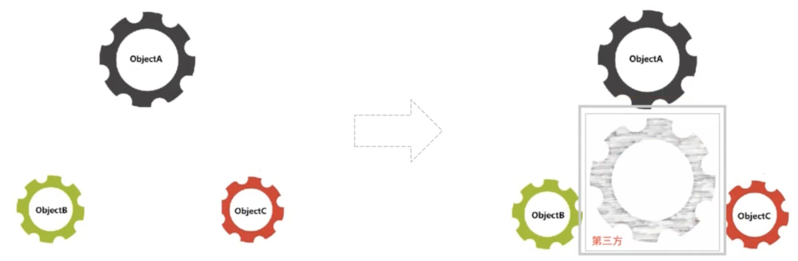
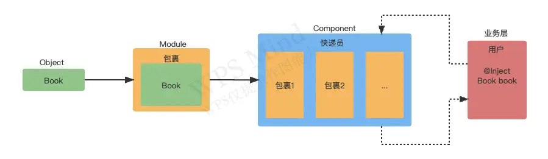

## 简介

**Dagger2** 是一个[依赖注入](https://so.csdn.net/so/search?q=依赖注入&spm=1001.2101.3001.7020)（DI）框架。Dagger2 提供给Java和Android使用，主要用于模块间解耦、提高代码的健壮性和可维护性。

使用了 IOC （控制反转）的思想，在编译阶段使用 APT 利用 Java 注解生成 Java 代码，然后结合部分手写代码来完整依赖注入工作。

运行前需要先编译一次项目，目的是用 APT 生成中间代码。Dagger2 不使用反射，在编译阶段生成代码，所以不会程序性能有影响。

[Dagger2 官网](https://dagger.dev/)

[Dagger2 Github](https://github.com/google/dagger)


## IOC（Inversion of Control）

**解释：**IOC 概念大体是借助于“第三方”实现具有依赖关系的对象之间的解耦

**IOC（控制反转）和依赖注入的区别：**

Martin Fowler探讨既然 ==IOC 是控制反转==，到底“哪些方面的控制被反转了”。其实是==获得依赖对象的过程被反转了==，控制反转后，==获得依赖对象的过程从自身管理变成了 IOC 容器主动注入==，后来给控制反转取了更适合的名字“依赖注入”。实际上给出了==实现 IOC 的方法：依赖注入==




## Dagger2原理解析



可以理解为：用户在网上买东西，然后通过快递配送来理解 Dagger2 的使用原理。用户购买一本书（`@Inject`注解），然后卖家（`Module`）进行打包，接着快递员（`Component`）配送，然后用户就收到了这本书。这样就达到了解耦的目的，只需要使用`@Inject`注解，就能获取到该对象。


## Dagger2的注解

Dagger2 通过注解使用 APT 生成代码，所以首先要知道 Dagger2 中常用注解的使用。

### @Inject

`@Inject `  这个注解本身并没有作用，它需要依赖于注入框架才具有意义，可以用来标记 ==构造函数、属性和方法==。

#### *1.1* 标记构造函数

- 被标记的构造函数可以有 0 个或多个 ==依赖== 作为参数
- 同一个类中最多只可以==标记一个构造函数==

```kotlin
class People @Inject constructor(val name:String = "Tom")
```

注意在 Kotlin 中这种写法是不被允许的，因为这等价于 Java 中的多个构造方法 People(String name), People()，正确的写法应该是这样：

```kotlin
data class People constructor(val name: String) {
    @Inject
    constructor() : this("Tom")
}
```

#### *1.2* 标记属性

- 被标记的属性不能是 `final` 的，Kotlin中不能是 `val`
- 被注入进的属性不能用 `private` 修饰（是 Dagger2 不支持，而非 @Inject 不支持）

```kotlin
@Inject
lateinit var people:People
```

#### *1.3* 标记方法

- 被标记的方法可以有 0 个或多个==依赖==作为参数。
- 方法不能是抽象的。

```kotlin
class HomeActivity : AppCompatActivity() {
    private lateinit var people:People

    @Inject
    fun setPeople(people:People){
        this.people = people
    }
}
```

这种方法注入和属性注入并没有什么本质上的不同，实现效果也基本一样。还有一种做法是 `@Inject` 标记被注入类的某个方法，该方法会在类的构造方法之后接着被调用：

```kotlin
data class People constructor(val name: String) {
    @Inject
    constructor() : this("Tom")

    init {
        println("init：$name")
    }

    @Inject
    fun hello(){
        println("hello：$name")
    }
}

class HomeActivity : AppCompatActivity() {
    @Inject
    lateinit var people:People

    override fun onCreate(savedInstanceState: Bundle?) {
        super.onCreate(savedInstanceState)
        setContentView(R.layout.activity_home)

        //执行相关注入操作
        ...
        println(people.toString())
    }
}
```

运行结果是这样的：

01-02 11:57:30.995 16601-16601/? I/System.out:  init：Tom
01-02 11:57:30.995 16601-16601/? I/System.out:  hello：Tom
01-02 11:57:30.995 16601-16601/? I/System.out:  People(name=Tom)


### @Component

可以理解为一个注射器，可以算是 `Dagger2` 中最核心的一个注解，用来==标记一个接口或者抽象类==。使用 `@Component` 标记的接口，会在编译时自动生成一个 ==Dagger+类名==的实现类实现依赖注入。在 `Component` 中一般可以定义两种方法：


### @Module

用来==标记类==，为 `Component` 提供依赖，相当于告诉 `Component`，如果需要依赖可以来找我，当然前提是在 `Component` 中配置了该`Module`。同时 Module 可以通过 `includes` 依赖其他的 Module。


### @Provides

用来标记 ==Module中的方法==，该方法的返回类型是你需要提供的依赖类型。
 举个自己项目中的例子，我需要在presenter中创建一个pl2303对象，pl2303对象的创建又需要context和pl2303Interface，所以我们需要提供三个依赖，因为context在其他地方也要用，我们单独提出来：


### @Singleton

默认情况下，`@Inject` 获取到的依赖对象是非单例的，要想实现单例，需要用 `@Singleton` 对Module中的provide方法和Conponent接口进行标注。


## Dagger&Hilt的使用

**模拟场景：假设 App 需要使用 Retrofit 进行网络访问**

### *1.1* 添加依赖

在 `build.gradle(:app)` 里添加以下依赖库

```kotlin
plugins {
    ...
    id 'kotlin-kapt'
    id 'dagger.hilt.android.plugin'
}

dependencies {
		...
  
    // ViewModel
    implementation "androidx.lifecycle:lifecycle-viewmodel-compose:2.5.1"

    //Dagger - Hilt
    implementation "com.google.dagger:hilt-android:2.38.1"
    implementation "androidx.hilt:hilt-lifecycle-viewmodel:1.0.0-alpha03"
    implementation "androidx.hilt:hilt-navigation-compose:1.0.0"
    kapt "com.google.dagger:hilt-android-compiler:2.37"
    kapt "androidx.hilt:hilt-compiler:1.0.0"

    // Retrofit
    implementation 'com.squareup.retrofit2:retrofit:2.9.0'
    implementation 'com.squareup.retrofit2:converter-gson:2.9.0'
    implementation 'com.squareup.okhttp3:okhttp:5.0.0-alpha.3'
}
```

在 `build.gradle(Dagger&Hilt)` 里添加以下代码

```kotlin
buildscript {
    ....
  
    dependencies {
        classpath "com.google.dagger:hilt-android-gradle-plugin:2.38.1"
    }
}
```

### *1.2* 添加一个应用程序类

```kotlin
/**
 *  这是一个应用程序类，用于传递上下文
 *  需要在注册清单中声明这个文件
 */
@HiltAndroidApp
class MyApp :Application()
```

```kotlin
<?xml version="1.0" encoding="utf-8"?>
<manifest xmlns:android="http://schemas.android.com/apk/res/android"
    xmlns:tools="http://schemas.android.com/tools">

    <application
        android:name=".MyApp"
        ...
				>
        ...
    </application>

</manifest>
```

### *1.3* 给 MainActivity 添加入口注解

```kotlin
@AndroidEntryPoint// 入口点注释
class MainActivity : ComponentActivity() {
    override fun onCreate(savedInstanceState: Bundle?) {
        super.onCreate(savedInstanceState)
        setContent {
            DaggerHiltTheme {
                val viewModel = hiltViewModel<MyViewModel>()
            }
        }
    }
}
```

### *1.4* 创建网络访问接口

```kotlin
interface MyApi {
		
  	//模拟网络请求
    @GET("test")
    suspend fun doNetworkCall()

}
```

### *1.5* 创建存储库接口

```kotlin
interface MyRepository {
  
    suspend fun doNetworkCall()
  
}
```

### *1.6* 创建存储库实现类

```kotlin
/**
 *  问题：
 *  1、如何把 MyApi 放入我们的存储库中，因为存储库中需要 MyApi 这个依赖
 *  2、如何让 Dagger-Hilt 知道我们想在这里使用 MyApi
 *
 *  解决方案：
 *  1、直接在构造器里添加我们的 MyApi
 *  2、通过创建依赖注入的容器（Module）来帮助，使用@Inject注解通过构造器注入
 */

class MyRepositoryImpl @Inject constructor(
    private val api: MyApi,
    private val appContext: Application
) : MyRepository {

    init {
        val appName = appContext.getString(R.string.app_name)
        println("Hello from the MyRepositoryImpl. The app name's $appName")
    }

    override suspend fun doNetworkCall() {
				//模拟网络请求
    }
}
```

### *1.7* 创建全局单例模块

```kotlin
@Module
@InstallIn(SingletonComponent::class)// 安装到单例组件
object AppModule {

    /**
     *  每当我们提出请求时，例如在存储库中尝试注入 MyApi 实例，
     *  然后 DaggerHilt 会在其 Module 中查找是否能找到对应的实例，
     *  如果找到，它将获取实例并传递给存储库。
     */
    @Provides//告知这里提供了一个依赖
    @Singleton//单例范围注释
    fun provideMyApi(): MyApi {
        return Retrofit.Builder()
            .baseUrl("https://test.com")
            .build()
            .create(MyApi::class.java)
    }


    @Provides
    @Singleton
    fun provideMyRepository(
        api: MyApi,
        app: Application,
        @Named("hello1") hello: String
    ): MyRepository {
        return MyRepositoryImpl(api, app)
    }


    /**
     * 常见问题：
     * 如果我们所需要的依赖项的类型一样，
     * DaggerHilt 如何知道传递哪个参数给我们？
     *
     * 解决方案：
     * 使用 @Named("") 注解标记，在传参时也对应加上这个注解即可
     */
    @Provides
    @Singleton
    @Named("hello1")
    fun provideString1() = "Hello 1"

    @Provides
    @Singleton
    @Named("hello2")
    fun provideString2() = "Hello 2"
}
```

### *1.8* 单独创建接口和抽象类的模块

最佳实践：如果想注入==接口==或者==抽象类==，有更简单的方法实现，在 `di` 包新建一个模块

```kotlin
@Module
@InstallIn(SingletonComponent::class)
abstract class RepositoryModule {

    // 因为这里时提供依赖项的不同方式，所以这里不称为提供，叫<绑定>
    @Binds
    @Singleton
    abstract fun bindMyRepository(
        myRepository: MyRepositoryImpl
    ): MyRepository
}
```

### *1.9* 常见问题

#### *2.1* 相同类型的依赖项无法识别

当我们需要注入依赖时，在生产实例的模块中查找到多个类型相同的实例时，又或者我们的依赖项的类型一样时 DaggerHilt 如何知道传递哪个参数给我们。解决方案：使用 `@Named("")` 注解，代码如下：

```kotlin
//使用 @Named("") 注解标记，在传参时也对应加上这个注解即可
@Provides
@Singleton
fun provideMyRepository(
    api: MyApi,
    app: Application,
    @Named("hello1") hello: String
): MyRepository {
    return MyRepositoryImpl(api, app,hello)
}


@Provides
@Singleton
@Named("hello1")
fun provideString1() = "Hello 1"

@Provides
@Singleton
@Named("hello2")
fun provideString2() = "Hello 2"
```

#### *2.2* 如何注入依赖项到 Service

 想把依赖项注入到后台运行的 Service 中，如果给 Service ==创建构造器注入是不起作用==的，因为不能给 Service 构造器，所以用（字段注入）注意字段注入不能是 Private，解决方案：使用字段注入代码如下：

```kotlin
@AndroidEntryPoint
class MyService :Service(){

    @Inject
    lateinit var repository: MyRepository

    override fun onCreate() {
        super.onCreate()
        // 在 onCreate 执行完后，可以直接调用 repository 进行网络访问不需要自己进行初始化
        //repository.doNetworkCall()
    }

    override fun onBind(p0: Intent?): IBinder? {
        return null
    }
}
```

