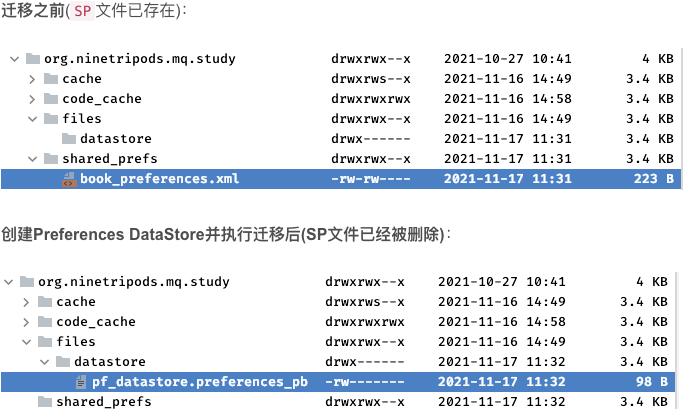
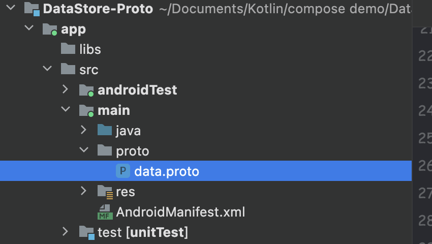
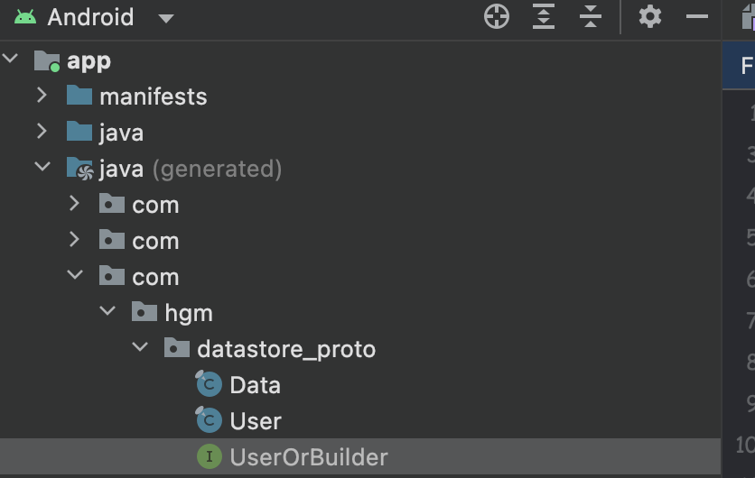
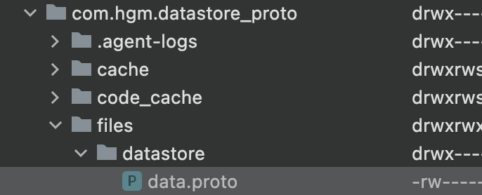
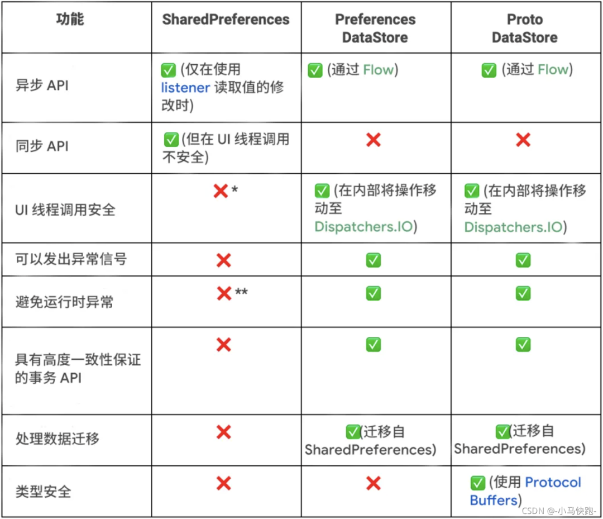

# DataStore

## 简介

### 概括

`Jetpack DataStore` 是一种数据存储解决方案，允许您使用[协议缓冲区](https://developers.google.cn/protocol-buffers?hl=zh-cn)存储键值对或类型化对象。`DataStore` 使用 `Kotlin` 协程和 `Flow` 以异步、一致的事务方式存储数据。

### 两种实现方式

- ***Preferences DataStore：***使用==键==存储和访问数据。此实现不需要预定义的架构，也不确保类型安全。
- ***Proto DataStore：*** 将数据作为==自定义数据类型==的实例进行存储。此实现要求您使用[协议缓冲区](https://developers.google.cn/protocol-buffers?hl=zh-cn)来定义架构，但可以确保类型安全。

### 正确使用 DataStore

* ==请勿在同一进程中为给定文件创建多个 DataStore 实例==，否则会破坏所有 DataStore 功能。如果给定文件在同一进程中有多个有效的 DataStore，DataStore 在读取或更新数据时将抛出 `IllegalStateException`。
* ==DataStore 的通用类型必须不可变==。更改 DataStore 中使用的类型会导致 DataStore 提供的所有保证失效，并且可能会造成严重的、难以发现的 bug。强烈建议您使用可保证不可变性、具有简单的 API 且能够高效进行序列化的协议缓冲区。
* ==切勿在同一个文件中混用 SingleProcessDataStore 和 MultiProcessDataStore==。如果您打算从多个进程访问 `DataStore`，请始终使用 [`MultiProcessDataStore`](https://developer.android.google.cn/topic/libraries/architecture/datastore?hl=zh-cn#multiprocess)。

### SharedPreferences缺点

如果存储的数据少，使用起来没有任何问题，当需要存储数据比较多时，`SP` 可能会导致以下问题：

* `SP` 第一次加载数据时需要全量加载，当数据量大时可能会阻塞UI线程造成卡顿

* `SP` 读写文件不是类型安全的，且没有发出错误信号的机制，缺少事务性 `API`

* `commit() / apply()` 操作可能会造成 `ANR` 问题：

  1. `commit()` 是同步提交，会在 `UI` 主线程中直接执行 `IO` 操作，当写入操作耗时比较长时就会导致 `UI` 线程被阻塞，进而产生 `ANR`

  2. `apply()` 虽然是异步提交，但异步写入磁盘时，如果执行了 `Activity / Service中的onStop()` 方法，那么一样会同步等待SP写入完毕，等待时间过长时也会引起 `ANR` 问题。

### DataStore优势

- DataStore 基于==事务==方式处理数据更新。
- DataStore 基于 `Kotlin Flow` 存取数据，默认在 `Dispatchers.IO` 里==异步==操作，避免阻塞UI线程，且在读取数据时能对发生的 `Exception` 进行处理。
- 不提供 `apply()`、`commit()` 存留数据的方法。
- 支持 `SP` ==一次性自动==迁移至 `DataStore` 中。

> **官方建议：**如果当前使用 `SharedPreferences` 建议更换为 `DataStore`
>
> **注意**：如果您需要支持大型或复杂数据集、部分更新或参照完整性，请考虑使用 [Room](https://developer.android.google.cn/training/data-storage/room?hl=zh-cn)，而不是 `DataStore`。`DataStore` 非常适合简单的小型数据集，但不支持部分更新或引用完整性。


## Preferences DataStore

### *1.1* 添加依赖项

```kotlin
// Preferences DataStore
implementation "androidx.datastore:datastore-preferences:1.0.0"

// Coroutines
implementation 'org.jetbrains.kotlinx:kotlinx-coroutines-core:1.3.9'
implementation 'org.jetbrains.kotlinx:kotlinx-coroutines-android:1.3.9'

//  Lifecycle Scopes
implementation 'androidx.lifecycle:lifecycle-viewmodel-ktx:2.5.1'
implementation 'androidx.lifecycle:lifecycle-runtime-ktx:2.5.1'
implementation "androidx.lifecycle:lifecycle-livedata-ktx:2.5.1"
```

### *1.2* 创建 Preferences DataStore

新建一个 `DataStoreManager` 类

```kotlin
class DataStoreManager(context: Context) {
    //构建Preferences DataStore
    private val Context.dataStore: DataStore<Preferences> by 
  			preferencesDataStore(name = "Names")//文件名称
    //创建 DataStore 对象
  	private val dataStore = context.dataStore

}
```

通过上面的代码，我们就创建了 `Preferences DataStore`，其中 `preferencesDataStore()` 是一个==顶层函数==，包含以下几个参数：

- **name：**创建 `Preferences DataStore` 的文件名称。
- **corruptionHandler：**如果 `DataStore` 在试图读取数据时，数据无法反序列化，会抛出androidx.datastore.core.CorruptionException，此时会执行 corruptionHandler。
- **produceMigrations：**`SP` 产生迁移到 `Preferences DataStore`。`ApplicationContext` 作为参数传递给这些回调，迁移在对数据进行任何访问之前运行。
- **scope：**协程作用域，默认IO操作在Dispatchers.IO线程中执行。

上述代码执行后，会在==/data/data/项目包名/files/==下创建名为==Names.preferences_pb==的文件如下：


> **注意：**不能将上面的初始化代码写到 `Activity` 里面去，否则重复进入 `Actvity` 并使用 `Preferences DataStore` 时，会尝试去创建一个同名的 `.preferences_pb` 文件，因为之前已经创建过一次，当检测到尝试创建同名文件时，会直接抛异常：
>
> *java.lang.IllegalStateException: There are multiple DataStores active for the same file：xxx.You should  either maintain your DataStore as a singleton or confirm that there is no two DataStore's active on the same file (by confirming that the scope is cancelled).*

### *1.3* 存储数据

首先创建需要存储的 `key` 变量：

```kotlin
companion object {
    //创建一个 key 变量，或者在外部传入 key 进来也行
    val pref_name = stringPreferencesKey("NAME")
}
```

在 `DataStoreManager.kt` 中执行存储操作：

通过 dataStore.edit(transform: suspend (MutablePreferences) -> Unit) 挂起函数进行存储，该函数接受 transform块，能够以事务方式更新 DataStore 中的状态。

```kotlin
/**
 * 写入数据
 * @param name String
 */
suspend fun setName(name: String) {
    dataStore.edit { pref ->
        // pref[key] = name
        pref[pref_name] = name
    }
}
```

在 `MainViewModel.kt` 中获取 `dataStore` 调用存储数据的方法：

```kotlin
class MainViewModel(application: Application) : AndroidViewModel(application) {

    private val dataStore = DataStoreManager(application)

    //写入
    fun setName(name: String) {
        viewModelScope.launch {
            dataStore.setName(name = name)
        }
    }
}
```

在 `Activity` 中：

```kotlin
//把用户输入的值通过 ViewModel 传入 datastore 的存储方法
binding.apply {
    btnSave.setOnClickListener {
        viewModel.setName(etValue.text.toString())
    }
}
```

### *1.4* 读取数据

在 `DataStoreManager.kt` 中执行读取操作：

取数据时可以对Flow数据进行一系列处理

```kotlin
fun getName(): Flow<String> {
    return dataStore.data.catch { exception 
				//如果抛出IO异常，返回一个空的首选项
        if (exception is IOException) {
            emit(emptyPreferences())
        } else {
            throw exception
        }
    }.map { pref ->
				//根据 key 读取数据存入变量
        name = pref[pref_name] ?: "no data"
        name
    }
}
```

在 `MainViewModel.kt` 中获取 `dataStore` 调用读取数据的方法：

```kotlin
class MainViewModel(application: Application) : AndroidViewModel(application) {

    private val dataStore = DataStoreManager(application)

    //读取
    val getName = dataStore.getName().asLiveData(Dispatchers.IO)
}
```

在 `Activity` 中：

```kotlin
//观察数据的变化，实时更新文本
viewModel.getName.observe(this) {
    binding.tvValue.text = it
}
```

通过 `dataStore.data` 返回的是 `Flow<T>`，那么后续就可以通过 `Flow` 对数据进行一系列处理。从文件读取数据时，如果出现错误，系统会抛出 `IOExceptions`。可以在 `map()` 之前使用 `catch()` 运算符，并且在抛出的异常是 `IOException` 时发出 `emptyPreferences()`。如果出现其他类型的异常，重新抛出该异常。

> **注意：**`Preferences DataStore`存取数据时的 `Key` 是 `Preferences.Key<T>` 类型，且其中的 `T` 只能存 ==Int、Long、Float、Double、Boolean、String、Set< String>== 类型，此限制在androidx/datastore/preferences/core/PreferencesSerializer 类参与序列化的 `getValueProto()` 方法中：

```kotlin
private fun getValueProto(value: Any): Value {
     return when (value) {
         is Boolean -> Value.newBuilder().setBoolean(value).build()
         is Float -> Value.newBuilder().setFloat(value).build()
         is Double -> Value.newBuilder().setDouble(value).build()
         is Int -> Value.newBuilder().setInteger(value).build()
         is Long -> Value.newBuilder().setLong(value).build()
         is String -> Value.newBuilder().setString(value).build()
         is Set<*> ->
             @Suppress("UNCHECKED_CAST")
             Value.newBuilder().setStringSet(
                 StringSet.newBuilder().addAllStrings(value as Set<String>)
             ).build()
          //如果不是上面的类型，会直接抛异常
         else -> throw IllegalStateException(
             "PreferencesSerializer does not support type: ${value.javaClass.name}"
         )
     }
 }
```

可以看到最后一个else逻辑中，如果不是上面的类型，会直接抛异常。因为 Key 是 Preferences.Key<T> 类型，系统默认帮我们包了一层，位于 androidx.datastore.preferences.core.PreferencesKeys.kt：

```kotlin
public fun intPreferencesKey(name: String): Preferences.Key<Int> = Preferences.Key(name)

public fun doublePreferencesKey(name: String): Preferences.Key<Double> = Preferences.Key(name)

public fun stringPreferencesKey(name: String): Preferences.Key<String> = Preferences.Key(name)

public fun booleanPreferencesKey(name: String): Preferences.Key<Boolean> = Preferences.Key(name)

public fun floatPreferencesKey(name: String): Preferences.Key<Float> = Preferences.Key(name)

public fun longPreferencesKey(name: String): Preferences.Key<Long> = Preferences.Key(name)

public fun stringSetPreferencesKey(name: String): Preferences.Key<Set<String>> =
    Preferences.Key(name)
```

因为上述的声明都在顶层函数中，所以可以直接使用。比如我们想声明一个 String 类型的 Preferences.Key<T>，可以直接如下进行声明：

```kotlin
val P_KEY_NAME: Preferences.Key<String> = stringPreferencesKey("key")
```

### *1.5* SP迁移至Preferences DataStore

如果想对 `SP` 进行迁移，只需在 `Preferences DataStore` 构建环节添加 `produceMigrations` 参数（该参数含义创建环节已介绍）如下：

```kotlin
//SharedPreference文件名
const val SHARED_PREFERENCES_NAME = "sp_Names"

val Context.dataStore: DataStore<Preferences> by preferencesDataStore(
    name = "Names",  //DataStore文件名称
    //将SP迁移到Preference DataStore中
    produceMigrations = { context ->
        listOf(SharedPreferencesMigration(context, SHARED_PREFERENCES_NAME))
    }
)
```

这样构建完成时，SP 中的内容也会迁移到 `Preferences DataStore` 中了，注意==迁移是一次性==的，即执行迁移后，==SP文件会被删除==，如下：



完整项目代码查看：DataStore-Preferences


## Proto DataStore

`SP` 和 `Preferences DataStore` 的一个缺点是==无法定义架构==，保证不了存取键时使用了正确的数据类型。`Proto DataStore` 可利用 `Protocol Buffers` 协议缓冲区（https://developers.google.com/protocol-buffers/） 定义架构来解决此问题。

`Protobuf` 协议缓冲区是一种对结构化数据进行序列化的机制。通过使用协议，`Proto DataStore` 可以知道存储的类型，无需使用键便能提供类型。

### *1.1* 添加依赖

为了使用 `Proto DataStore`，让协议缓冲区为架构生成代码，需要在 `build.gradle` 中引入 `protobuf `插件：

```kotlin
plugins {
    id 'dagger.hilt.android.plugin'
    id "com.google.protobuf" version "0.8.12"
}

dependencies {
  	//DataStore-proto
    implementation  "androidx.datastore:datastore-core:1.0.0-rc01"
    implementation "androidx.datastore:datastore:1.0.0"
    implementation  "com.google.protobuf:protobuf-javalite:3.14.0"
    // ViewModel
    implementation "androidx.lifecycle:lifecycle-viewmodel-compose:2.5.1"
    //Dagger - Hilt
    implementation "com.google.dagger:hilt-android:2.38.1"
    implementation "androidx.hilt:hilt-lifecycle-viewmodel:1.0.0-alpha03"
    implementation "androidx.hilt:hilt-navigation-compose:1.0.0"
    kapt "com.google.dagger:hilt-android-compiler:2.37"
    kapt "androidx.hilt:hilt-compiler:1.0.0"
}

protobuf {
    protoc {
        artifact = "com.google.protobuf:protoc:3.14.0"
    }

    // Generates the java Protobuf-lite code for the Protobufs in this project. See
    // https://github.com/google/protobuf-gradle-plugin#customizing-protobuf-compilation
    // for more information.
    generateProtoTasks {
        all().each { task ->
            task.builtins {
                java {
                    option 'lite'
                }
            }
        }
    }
}
```

```kotlin
buildscript {
    ext {
        compose_ui_version = '1.1.1'
    }
    dependencies {
        classpath "com.google.dagger:hilt-android-gradle-plugin:2.38.1"
    }
}
```

### *1.2* 定义和使用 protobuf 对象

只需对数据结构化的方式进行==一次定义==，编译器便会==生成源代码==，轻松写入和读取结构化数据。我们是配置依赖项的 `sourceSets{}` 中声明了 `proto` 源码地址路径在 `src/main/proto`，在  `src/main/` 下新建一个 `probo` 包，在其包下新建我们的 `probo` 文件：



data.proto的内容如下：如果需要高亮显示 proto 代码，下载 proto 插件

```kotlin
/**
    完成 Gradle 设置后，让我们开始创建包含必填字段的原型文件。
    在目录app/src/main/下创建一个 proto目录。
    新建一个名称为 data 扩展名为.proto的文件

    语法=“proto3”；
    选项 java_package = "com.sample.android_sample_preference_datastore";
    选项 java_multiple_files = true;

    消息 UserStore {
        bool is_logged_in = 1;
        字符串用户名 = 2;
    }
 */

syntax = "proto3";
option java_package = "com.hgm.datastore_proto";
option java_multiple_files = true;

//User就是在DataStore中数据持久化的对象
message User{
  string name = 1;
  string email = 2;
}

```

上述代码编写完后，执行 `Build -> ReBuild Project`，就会在 `generatedFilesBaseDir` 配置的路径下生成对应`Java` 代码，如下：



### *1.3* 创建序列化器

序列化器定义了如何存取我们在 `proto` 文件中定义的数据类型。如果磁盘上没有数据，序列化器还会定义默认返回值。如下我们创建一个名为 `UserSerializer` 的序列化器：

```kotlin
/**
 * 序列化器
 */
object UserSerializer : Serializer<User> {

    override val defaultValue: User
        get() = User.getDefaultInstance()//可以指定返回的默认值

    override suspend fun readFrom(input: InputStream): User {
        return try {
            User.parseFrom(input)
        } catch (e: Exception) {
            User.getDefaultInstance()
        }
    }

    override suspend fun writeTo(t: User, output: OutputStream) {
        t.writeTo(output)
    }

}
```

### *1.4* 创建 Proto DataStore

新建一个 `DataStoreManager` 类

```kotlin
class DataStoreManager(val context: Context) {
    // 创建 DataStore proto 对象
    private val Context.dataStore: DataStore<User> by dataStore(
        fileName = "data.proto",
        serializer = UserSerializer
    )
}
```

**dataStore为顶层函数，可以传入的参数如下：**

- ***fileName:*** 创建 `Proto DataStore` 的文件名称。
- ***serializer:*** `Serializer` 序列化器定义了如何存取格式化数据。
- ***corruptionHandler：***如果 `DataStore` 在试图读取数据时，数据无法反序列化，抛出androidx.datastore.core.CorruptionException，则调用 corruptionHandler。
- ***produceMigrations：***`SP` 迁移到 `Proto DataStore` 时执行。ApplicationContext作为参数传递给这些回调，迁移在对数据进行任何访问之前运行
- ***scope：***协程作用域，默认 `IO` 操作在 `Dispatchers.IO` 线程中执行。



### *1.5* 存储数据

`Proto DataStore` 提供了一个挂起函数 `DataStore.updateData()` 来存数据，当存储完成时，协程也执行完毕。

```kotlin
// 保存数据
suspend fun saveData(name: String, email: String) {
    context.dataStore.updateData { pref ->
        pref.toBuilder()
            .setName(name)
            .setEmail(email)
            .build()
    }
}
```

### *1.6* 读取数据

`Proto DataStore` 取数据方式跟 `Preferences DataStore` 一样

```kotlin
// 读取数据
val user: Flow<User> = context.dataStore.data
    .catch { exception ->
        if (exception is IOException) {
            emit(User.getDefaultInstance())
        } else {
            throw exception
        }
    }
```

### *1.7* SP迁移至Proto DataStore

```kotlin
//构建Proto DataStore
val Context.dataStore: DataStore<User> by dataStore(
    fileName = "data.pb",
    serializer = UserSerializer,
    //将SP迁移到Proto DataStore中
    produceMigrations = { context ->
        listOf(
            androidx.datastore.migrations.SharedPreferencesMigration(
                context,
                SHARED_PREFERENCES_NAME
            ) { sharedPrefs: SharedPreferencesView, currentData: User ->

                //从SP中取出数据
                val name: String = sharedPrefs.getString(KEY_BOOK_NAME, "") ?: ""
                val email: String = sharedPrefs.getString(KEY_BOOK_EMAIL, "")?: ""

                //将SP中的数据存入Proto DataStore中
                currentData.toBuilder()
                    .setName(name)
                    .setEmail(email)
                    .build()
            }
        )
    }
)
```

`Proto DataStore` 定义了 `SharedPreferencesMigration` 类。`migrate`里指定了下面两个参数：

- ***sharedPrefs：***可以用于从 `SharedPreferences` 中检索数据
- ***currentData：***当前数据

同样地在创建时如果传入了 `produceMigrations`，那么SP文件会迁移至 `Proto DataStore`，迁移完后 `SP` 文件被删除。

> 注意：`Preferences DataStore` 、`Proto DataStore` 在执行迁移时都会用到 `SharedPreferencesMigration` 类，但是这两个地方用到该类对应的包名是不一样的，如 Proto DataStore 的包名路径是 androidx.datastore.migrations.SharedPreferencesMigration，当把他们写在一个文件里时，注意其中一个要使用完整路径。

完整项目代码查看：DataStore-Proto


## 总结

### Android三种本地存储的对比



**参考博客：**

https://blog.csdn.net/Mr_Tony/article/details/121813098

https://proandroiddev.com/android-jetpack-proto-datastore-a11ff8edcda8

https://blog.csdn.net/zhaoyanjun6/article/details/127358235

https://mp.weixin.qq.com/s?__biz=MzA5MzI3NjE2MA==&mid=2650260456&idx=1&sn=a78d51360dda67d203e3535f0b24f359&chksm=88633287bf14bb91111268b4ad60e5a55f249fbf962e0ae1d87a459a63b19bcfabf4f6ce8a3a&scene=27