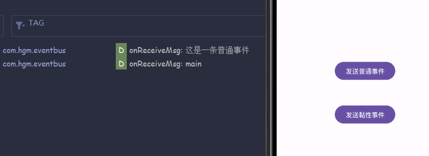

## EventBus

### 简介

`EventBus` 是用于Android开发的==事件发布—订阅总线==，用来进行==模块间通信、解藕==。它可以使用很少的代码，来实现多组件之间的通信。

**Android系统内置的事件存在的缺点：** 通过 handler (消息机制) 和 BroadCastReceiver (广播机制)，可以实现组件之间的事件通讯。缺点在于，代码量多、组件之易产生藕合引用。

**产生EventBus的背景：** 比如：子线程中执行数据请求，数据请求成功后，通过 Handler 或者 BroadCast 来通知UI更新。 两个Fragment之间可以通过Listener进行通信，但是问题来了，当程序越来越大时，就会要写很多的代码， 而且导致代码严重的耦合问题。为此 ，EventBus 应运而生。


### 工作流程

`Publisher`（发布者） 使用 post 发出一个 Event 事件，`Subscriber`（订阅者） 在 `onEvent()` 函数中接收事件。


### 优缺点

**优点：**

* 简化组件之间的通讯方式
* 对通信双方就行解耦
* 使用 `ThreadMode` 灵活切换工作线程
* 速度快、性能好。
* 库比较小，不占内存。

**缺点：**

* 使用的时候要定义很多 `event` 类
* `event` 在注册的时候会调用反射去遍历注册对象的方法在其中找出带有@subscriber标签的方法，性能不高。
* 需要自己注册和反注册，否则就会导致内存泄漏。


### 使用教程

1. **导入依赖**

   ```kotlin
   implementation 'org.greenrobot:eventbus:3.2.0'
   ```

2. **使用三部曲：Subscriber、Event、Publisher**

   Subscriber：EventBus的register方法，会接收到一个Object对象。<br>Event：EventBus的post()方法中传入的事件类型 (可以是任意类型)。<br>Publisher：EventBus的post()方法。

3. **创建一个事件类**

   ```kotlin
   /**
    * @auth：  HGM
    * @date：  2023-07-08 21:16
    * @desc：  事件类
    */
   data class EventMsg(
         val type: Int,
         val message: String,
   )
   ```

4. **在需要订阅事件的模块中，注册EventBus、订阅事件、发送事件**   

   ```kotlin
   class MainActivity : AppCompatActivity() {
         override fun onCreate(savedInstanceState: Bundle?) {
               super.onCreate(savedInstanceState)
               setContentView(R.layout.activity_main)
   
               //init
               val btnCommon = findViewById<Button>(R.id.btn_common)
               val btnSticky = findViewById<Button>(R.id.btn_sticky)
   
               //发送普通事件
               btnCommon.setOnClickListener {
                     val msg = EventMsg(1, "这是一条普通事件")
                     EventBus.getDefault().post(msg)
               }
   
               //发送黏性事件
               btnSticky.setOnClickListener {
                     val msg = EventMsg(1, "这是一条黏性事件")
                     EventBus.getDefault().postSticky(msg)
               }
         }
   
   
         override fun onStart() {
               super.onStart()
               //注册EventBus
               EventBus.getDefault().register(this)
         }
   
   
         override fun onDestroy() {
               super.onDestroy()
               //反注册EventBus
               EventBus.getDefault().unregister(this)
         }
   
         //接收事件
         @Subscribe(threadMode = ThreadMode.POSTING, sticky = true, priority = 1)
         fun onReceiveMsg(eventMsg: EventMsg) {
               Log.d("TAG", "onReceiveMsg: ${eventMsg.message}")
               Log.d("TAG", "onReceiveMsg: ${Thread.currentThread().name}")
         }
   
   }
   ```

   


### **Subscribe注解**

`Subscribe` 是 `EventBus` 自定义的注解，共有三个参数（可选）：threadMode、sticky、priority。代码如下：

```kotlin
@Subscribe(threadMode = ThreadMode.POSTING, sticky = true, priority = 1)
fun onReceiveMsg(eventMsg: EventMsg) {
      Log.d("TAG", "onReceiveMsg: ${eventMsg.message}")
      Log.d("TAG", "onReceiveMsg: ${Thread.currentThread().name}")
}
```

* **ThreadMode 模式：**用来设置订阅者方法的在哪种线程环境下调用，一共五种模式。
  * POSTING: 表示发送事件 post 发生在哪个线程，接收事件就发生在哪个线程环境中。
  * MAIN/MAIN_ODERED：无论事件在什么线程环境发布 post，事件的接收总是在主线程环境执行。
  * BACKGROUND：不管 post 事件发生在那个线程环境， 事件接收始终在一个子线程中执行。
  * ASYNC：不管 post 事件处于哪种线程环境，事件接收处理总是在子线程。
* **sticky 黏性：**订阅者可以先不进行注册，如果 post 事件已经发出，再注册订阅者，同样可以接收到事件。（EventBus 做了保存处理）。
* **priority 优先级：**默认值为0。值越大，优先级越高，越优先接收到事件。（只有在 post 事件和事件接收处理，处于同一个线程环境的时候，才有意义。）

> 相关博客：
>
> https://blog.csdn.net/m0_49508485/article/details/127780285
>
> https://zhuanlan.zhihu.com/p/149176367
>
> https://www.jianshu.com/p/d9516884dbd4