# Firebase Cloud Message

## 简介

Firebase Cloud Messaging（FCM）是由Google提供的一项云端消息传递服务，旨在帮助开发者向移动设备、网站和服务器应用程序发送推送通知和实时消息。它为开发者提供了一种简单而强大的方式来与用户进行交互，无论用户是在应用内还是在应用外。

[Firebase控制台官网](https://firebase.google.com/?hl=zh-cn)

------


## 发送消息

### 1. 创建项目

这里我使用Google新UI框架Jetpack Compose演示项目


### 2. 导入Firebase SDK

这里有两种方式导入SDK，第一种从Firebase官方文档按步骤导入，第二种Android Studio已经帮我们整理好一份文档按步骤即可，个人感觉第二种会方便很多所以选择后者。找到顶部 Tools—>Firebase，点击它会弹出Firebase所有的工具。


接下来选择 Cloud Messaging 和 Analytics ，这里为什么会需要Analytics呢？后面会有解释........因为我之前已经接入到项目里了，所以它显示Java版本，一般默认显示的是Kotlin，你们只需要选择Kotlin即可。

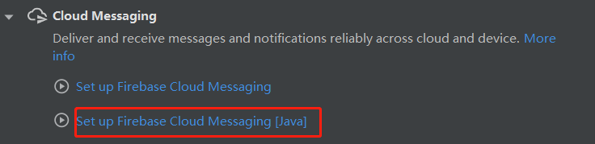

最重要的地方到了，这里一定要确保你的项目和网页控制台连接成功，否则后面使用无效！！！


点击 connect to Firebase跳转到网页，给App起一个名字，后面的一直点继续，后面就等待控制台和Android Studio连接成功就好了。


连接成功后点击 Add FCM to your app，编译器会自动把依赖添加到 build.gradle文件里面去以及会下载一个名为google-services.json文件到项目的Module模块里。**检查下面的依赖是否有缺失！！！**

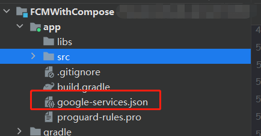

应用级别的build.gradle

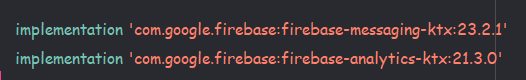

项目级别的build.gradle

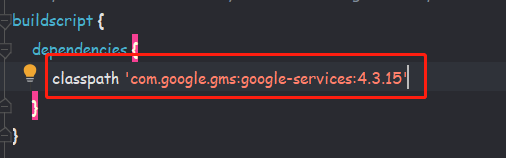

### 3. 创建MyApp

我们需要在全局应用程序类里初始化我们的Firebase SDK以及创建通知渠道，在Android8.0之后，发送通知需要有通知渠道。我这里因为是示例，所以渠道命名不规范你们替换成你自己的名字即可。

```kotlin
class MyApp :Application(){

      override fun onCreate() {
            super.onCreate()
            //初始化
            FirebaseApp.initializeApp(this)
            FirebaseAnalytics.getInstance(this)

            //创建通知通道
            createNotificationChannel()
      }

      private fun createNotificationChannel() {
            //创建通知管理
            val notificationManager =
                  getSystemService(Context.NOTIFICATION_SERVICE) as NotificationManager

            //Android 8.0之后需要添加渠道
            if (Build.VERSION.SDK_INT >= Build.VERSION_CODES.O) {
                  val channel = NotificationChannel(
                        "channel_id",//替换成你自己的渠道id
                        "channel_name",//替换你自己的渠道名
                        NotificationManager.IMPORTANCE_HIGH
                  )
                  notificationManager.createNotificationChannel(channel)
            }
      }
}
```

### 4. 创建MyFirebaseMessagingService

创建MyFirebaseMessagingService继承自FirebaseMessagingService，它主要用于接收和处理Firebase发送来的消息。

```kotlin
class MyFirebaseMessageService :FirebaseMessagingService(){

      override fun onNewToken(token: String) {
            super.onNewToken(token)
            //获取token
            Log.d("FIREBASE", "Refreshed token: $token")
      }

      override fun onMessageReceived(message: RemoteMessage) {
            super.onMessageReceived(message)

            Log.d("FIREBASE", "通知来源: ${message.from}")
            Log.d("FIREBASE", "通知标题: ${message.notification?.title}")
            Log.d("FIREBASE", "通知内容: ${message.notification?.body}")
            Log.d("FIREBASE", "通知携带的参数: ${message.data["user"]}")

            message.notification?.let {
                  generateNotification(
                        message.notification?.title,
                        message.notification?.body,
                        message.data["user"]
                  )
            }
      }

      private fun generateNotification(title: String?, body: String?, params: String?) {
            //创建通知管理
            val notificationManager =
                  getSystemService(Context.NOTIFICATION_SERVICE) as NotificationManager

            //创建通知
            val notification = NotificationCompat.Builder(this, "channel_id")
                  .setContentTitle(title)
                  .setContentText(body)
                  .setPriority(NotificationCompat.PRIORITY_HIGH)
                  .setSmallIcon(R.drawable.icon) // 替换为您的通知图标
                  .setAutoCancel(true)
                  .build()

            //发送通知
            notificationManager.notify(Random.nextInt(), notification)
      }
}
```

### 5. 配置AndroidManifest

由于清单文件的代码过长我使用...进行简化，只列出重要的代码。添加全局应用程序类以及声明MyFirebaseMessageService服务。

```xml
<manifest xmlns:android="http://schemas.android.com/apk/res/android"
    xmlns:tools="http://schemas.android.com/tools">
    
	<!--Android 13引入通知权限-->
    <uses-permission android:name="android.permission.POST_NOTIFICATIONS" />

    <application
        android:name=".MyApp"
        android:localeConfig="@xml/locale_config"
		.......>
        <activity
           ......
        </activity>

        <service android:name=".MyFirebaseMessageService"
            android:exported="false">
            <intent-filter>
                <action android:name="com.google.firebase.MESSAGING_EVENT"/>
            </intent-filter>
        </service>
        
    </application>
</manifest>
```

### 6. 编写UI

Android13引入了通知权限，所以必须运行时申请否则会收不到通知，13以下的设备通知是默认开启的，界面上主要有两个文本：权限文本和当前语言。

```kotlin
class MainActivity : ComponentActivity() {
      override fun onCreate(savedInstanceState: Bundle?) {
            super.onCreate(savedInstanceState)
            setContent {
                  FCMWithComposeTheme {
                        var permission by remember {
                              mutableStateOf(false)
                        }
                        val notificationPermissionLauncher = rememberLauncherForActivityResult(
                              contract = ActivityResultContracts.RequestPermission()
                        ) { isGrated ->
                              if (isGrated) {
                                    permission = true
                              }
                        }
                      
						//申请权限
                        LaunchedEffect(key1 = true) {
                              if (Build.VERSION.SDK_INT >= Build.VERSION_CODES.TIRAMISU) {
                                    notificationPermissionLauncher.launch(Manifest.permission.POST_NOTIFICATIONS)
                              }
                        }

                        Column(
                              modifier = Modifier.fillMaxSize(),
                              horizontalAlignment = Alignment.CenterHorizontally,
                              verticalArrangement = Arrangement.Center
                        ) {
                              Text(text = stringResource(id = R.string.permission_text) + permission)
                              Text(text = stringResource(id = R.string.language_text))
                        }
                  }
            }
      }
}
```

### 7. 审核发布

打开Firebase的网页控制台，在项目左侧找到Messaging，单击然后选择制作首个宣传活动，选择第一个发布通知消息。

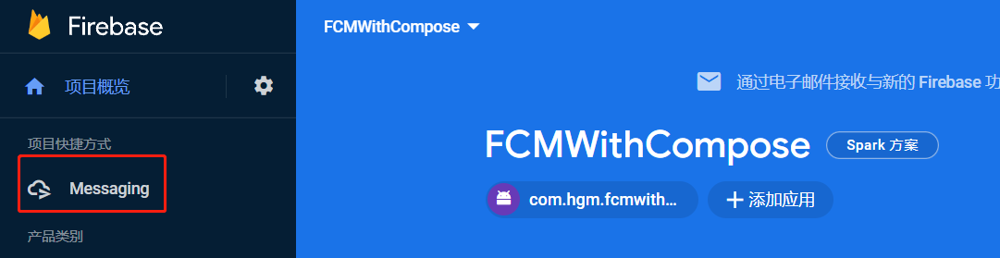

进入制作页面后填写通知的标题、内容以及图片地址，**请注意看我的内容！！！**


点击下一步，需要定位发送的App，选择我们刚刚创建包名的项目。

定位选项主要用于区分用户，比如海外App拥有多个国家的用户，存在地区时差，语言差异，所以运营人员需要使用定位选项把用户区分开来，这里我先演示全局用户接收。

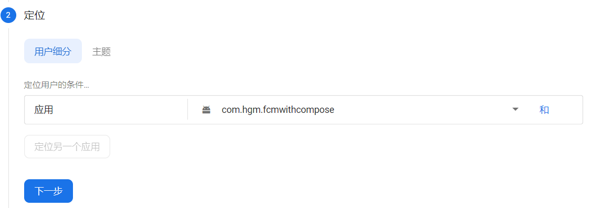

发送安排一般由运营人员设置，可以预约通知推送，这里不过多讲解一般都是立即发送的，然后选择下一步。

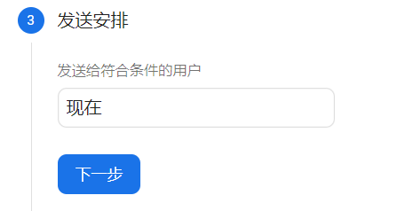

其他选项会有一个关于Android通知渠道的东西，这里就填写刚刚我们在代码中声明的渠道id和自定义参数就可以了，然后点击发送通知。

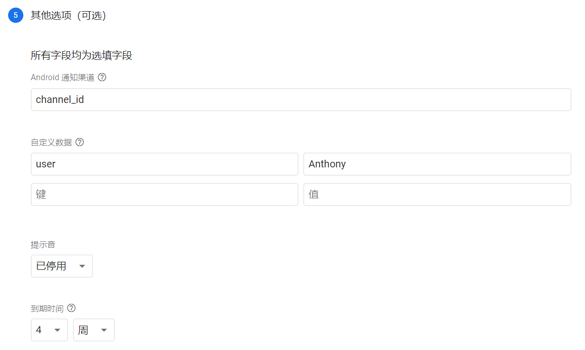

最后一步先运行App在虚拟机上，然后点击发布通知，Firebase需要对通知进行审核，审核成功后等待个几分钟，手机就会收到消息推送。上面说到的定位功能，我并没有给用户区分，所以只要安装了这个app的手机都会收到消息推送。


上面我们说到的定位功能到底是什么呢？比如海外app用户一般都是多国家多语言的，他们之间存在时间语言差异，所以运营人员推送通知不可能按照统一标准发送这样会给用户造成困扰，所以需要对用户进行分类区分开来。

下面我将演示以用户设备语言来定位推送通知，当用户的手机语言是中文时才会收到通知，比如英文的用户就会收不到，这样就很好的解决了刚刚说到的问题了，更多玩法可以自行添加。

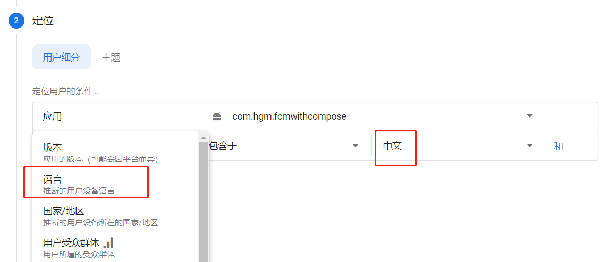


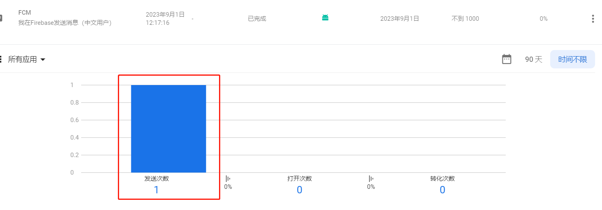

根据上图所示，我使用了两台手机模拟国内和海外用户，当我设置了定位中文用户通知时，只有中文设备收到了消息推送，而英文手机没有收到，到这里就完整的实现了FCM的推送功能啦！


> **注意：**
>
> 如果之前没开启分析功能，列表的选项时灰色的无法选择，所以控制台需要设置开启分析以及demo里也要添加Analytics SDK。
>
> 因为我发现没有集成Analytics，就算设置了定位区分消息，但是两台设备都会收不到通知，控制台也会显示没有发送次数，因为Firebase是通过这个Analytics分析用户设备的信息。

------


## 发送测试消息 	

### 1. 获取设备Token

启动应用时，FCM SDK 会为客户端应用实例生成一个注册令牌。如果需要给特定设备发送测试消息，首先要获取颁发给设备的token，在 `onNewToken` 方法打印回调的token。

注意：以下情况token令牌可能会更改

* 应用在新设备上恢复
* 用户卸载/重新安装应用
* 用户清除应用数据。

```kotlin
override fun onNewToken(token: String) {
      super.onNewToken(token)
      Log.d("FIREBASE", "Refreshed token: $token")
}
```

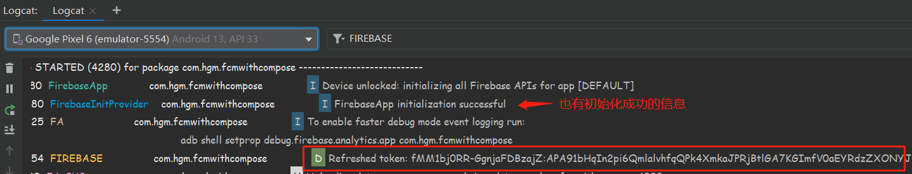

### 2. 控制台发布

新建一个宣传活动，点击发送测试消息，把那串设备token添加到控制台里面去，然后测试即可

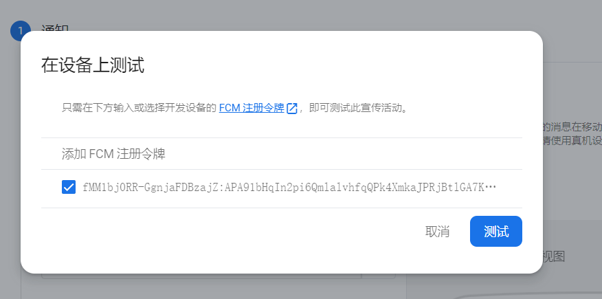

运行效果如下：


------


## 总结

**FCM 推送收不到问题？**

1. 检查App是否开启了通知权限（13系统动态申请权限）
2. 查看真机或者虚拟机是否有GMS服务（国产手机需要安装）
3. 设置定位条件后收不到信息，检查是否接入Analytics分析功能

**相关文档**

* [Android接入指南](https://firebase.google.com/docs/cloud-messaging/android/client?hl=zh-cn)
* [Firebase控制台官网](https://firebase.google.com/?hl=zh-cn)