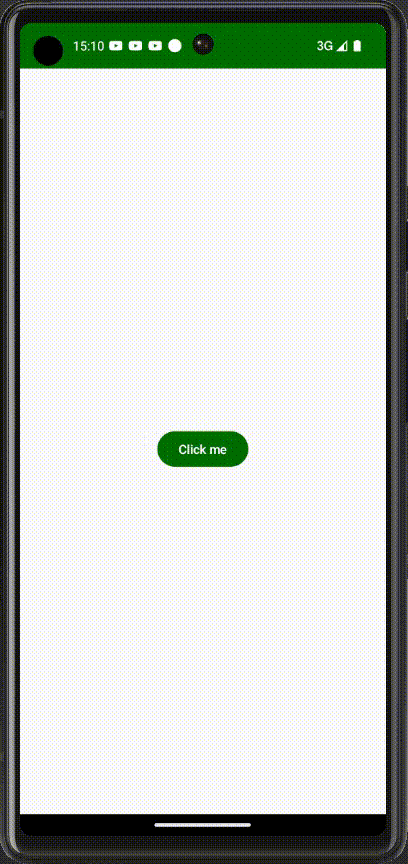
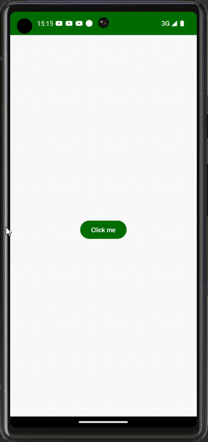
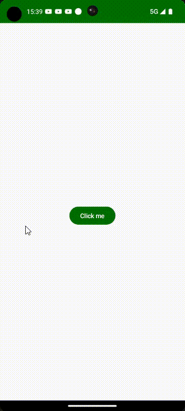
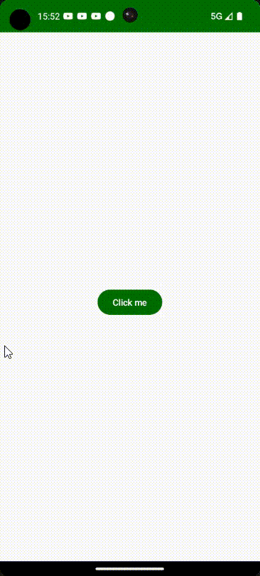

# Intent

## 介绍

`Intent` 是一个消息传递对象，可以用来从其他[应用组件](https://developer.android.google.cn/guide/components/fundamentals?hl=zh-cn#Components)请求操作。尽管 Intent 可以通过多种方式促进组件之间的通信，常用的三种场景：

* 启动活动（Activity）
* 启动服务（Service）
* 传递广播（Boardcast）

一般 Intent 分为两种类型：

* **显式Intent**：顾名思义就是明显的表明，比如通过提供具体的Activity或者Service的类名，来启动系统的其他组件，又或者你需要启动外部App微信，则提供具体的微信包名即可完成显式Intent。
* **隐式Intent**：与上文相反，不会提供具体的系统组件，只需要定义你执行的操作，比如App有一个分享的功能，但是我们可以分享内容到很多个App，所以只需要Intent定义了一个Send操作，即可完成隐式Intent

> 官方简介：https://developer.android.google.cn/guide/components/intents-filters?hl=zh_cn


## 使用

下面将举几个例子分别介绍显式和隐式Intent的使用...

1. 启动一个Activity（显式）

   ```kotlin
   Button(
         onClick = {
               //启动另一个Activity
               Intent(this@MainActivity,SecondActivity::class.java).also {
                     startActivity(it)
               }
         }
   ) {
         Text(text = "Click me")
   }
   ```

2. 通过Intent启动外部App（显式）

   ```kotlin
   Button(
         onClick = {
               //启动外部App（YouTube）
               Intent(Intent.ACTION_MAIN).also {
                     it.`package` = "com.google.android.youtube"
                     try {
                           startActivity(it)
                     }catch (e:ActivityNotFoundException){
                           e.printStackTrace()
                     }
               }
         }
   ) {
         Text(text = "Click me")
   }
   ```

   

3. 通过隐式意图发送邮件，比如App不想集成整个邮箱的功能，可以使用Intent附加内容启动邮箱。当我们点击按钮，Intent会查询手机的邮箱App，并把携带的参数传递过去。

```kotlin
Button(
      onClick = {
           val intent = Intent(Intent.ACTION_SEND).apply {
                 type = "text/plain"
                 putExtra(Intent.EXTRA_EMAIL, "test@test.com")//邮箱
                 putExtra(Intent.EXTRA_SUBJECT, "This is my subject")//主题
                 putExtra(Intent.EXTRA_TEXT, "This is my content of my email")//文本
           }
           //先检查是否存在Email应用程序，否则Intent将无法传递到指定类型的应用
           if (intent.resolveActivity(packageManager) != null) {
                 startActivity(intent)
           }
      }
) {
      Text(text = "Click me")
}
```

在使用 `resolveActivity` 时会弹出一个警告，Android建议我们在清单文件添加一个查询声明

```xml
<manifest xmlns:android="http://schemas.android.com/apk/res/android"
    xmlns:tools="http://schemas.android.com/tools">

    <application
        ...>
       	.....
    </application>

    <!--  指定一个查询块  -->
    <queries>
        <intent>
            <action android:name="android.intent.action.SEND" />
            <data android:mimeType="text/plain" />
        </intent>
    </queries>
```




# Intent Filters

## 介绍

Intent Filters是一个意图过滤器，准确指定我们的应用程序可以接收特定的意图操作


## 使用

下面将举一个接收外部传递图像过来的意图，通过意图过滤器

1. 首先在清单文件添加一个过滤意图

   ````xml
   <!-- 添加一个过滤意图，类型为Image -->
   <intent-filter>
       <action android:name="android.intent.action.SEND" />
       <category android:name="android.intent.category.DEFAULT" />
       <data android:mimeType="image/*" />
   </intent-filter>
   ````

2. 在 MainActivity 重写 onNewIntent 方法，在这个回调里面接收Intent过滤后的结果

   ```kotlin
   override fun onNewIntent(intent: Intent?) {
         super.onNewIntent(intent)
         //获取浏览器传递Intent的图片参数
         val uri = if (Build.VERSION.SDK_INT >= Build.VERSION_CODES.TIRAMISU) {
               intent?.getParcelableExtra(Intent.EXTRA_STREAM, Uri::class.java)
         } else {
               intent?.getParcelableExtra(Intent.EXTRA_STREAM)
         }
   
         //更新
         viewModel.updateUri(uri)
   }
   ```

3. ViewModel 负责存储接收的值

   ```kotlin
   class ImageViewModel : ViewModel() {
   
         var uri: Uri? by mutableStateOf(null)
               private set
   
   
         fun updateUri(uri: Uri?) {
               this.uri = uri
         }
   }
   ```

4. 创建ViewModel，并使用其uri值，如果接收到图像则会显示到ui界面上

   ```kotlin
   private val viewModel by viewModels<ImageViewModel>()
   
   Column(
         modifier = Modifier.fillMaxSize(),
         horizontalAlignment = Alignment.CenterHorizontally,
         verticalArrangement = Arrangement.Center
   ) {
         viewModel.uri?.let {
               AsyncImage(model =it, contentDescription = null)
         }
   }
   ```

   