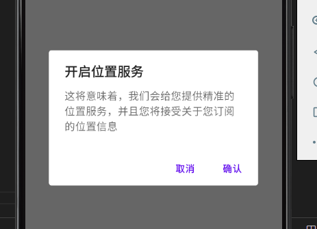
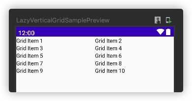
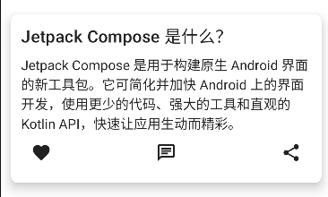
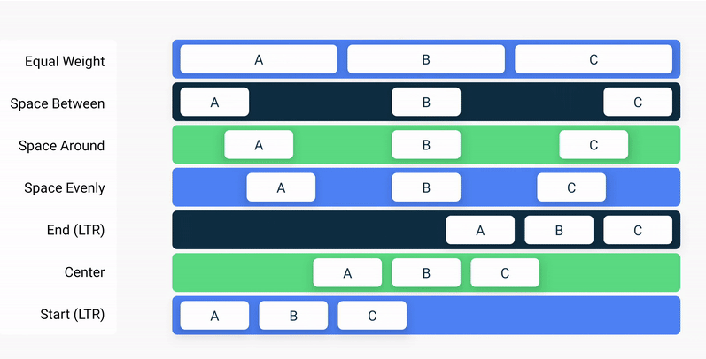
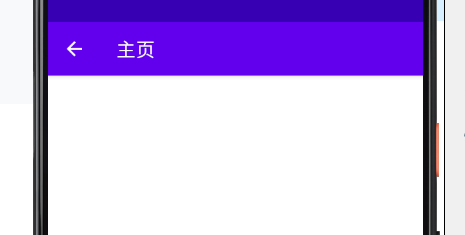
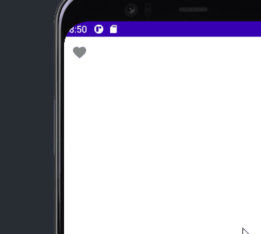
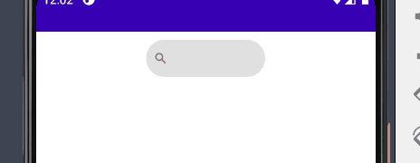
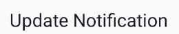
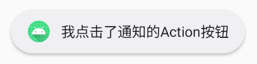

## 初识

### 初识组件

`Compose` 内部的组件非常少，但是合理的搭配可以做到比安卓原生更好的开发体验。大体如下:

| 分类   | Compose          | 原生                  |
| ------ | ---------------- | :-------------------- |
| 布局   | Box              | FrameLayout           |
| 布局   | Column           | LinearLayout          |
| 布局   | Row              | LinearLayout          |
| 布局   | Scaffold         | 无                    |
| 布局   | Constraintlayout | Constraintlayout      |
| 文本   | Text             | TextView              |
| 文本   | TextField        | Edittext              |
| 图片   | Icon             | ImageView             |
| 图片   | Image            | ImageView             |
| Button | Button           | Button                |
| Button | IconButton       | Button                |
| Button | IconToggleButton | CheckBox,Switch       |
| Button | Switch           | Switch                |
| Button | RadioButton      | RadioButton           |
| Button | Checkbox         | CheckBox              |
| 列表   | LazyColumn       | RecyclerView,ListView |
| 列表   | LazyRow          | RecyclerView,ListView |
| 间距类 | Spacer           | Space                 |

------


### 什么是Compose

`Jetpack Compose` 是围绕着 `Composable` 函数建立的。这些函数让你通过描述它的形状和数据依赖性，以编程方式定义你的 `UI`，而不是专注于 `UI` 的构建过程。要创建一个 `Composable` 函数，只需在函数名称中添加 `@Composable` 注解。

**1、定义Composable函数：**

```kotlin
class MainActivity : ComponentActivity() {
    override fun onCreate(savedInstanceState: Bundle?) {
        super.onCreate(savedInstanceState)
        setContent {
            MessageCard("Android")
        }
    }
}

// Composable 函数一般用大写开头，为了和普通的函数作为区分
@Composable
fun MessageCard(name: String) {
    Text(text = "Hello $name")
}
```

<img src="data:image/png;base64,iVBORw0KGgoAAAANSUhEUgAAAOkAAABvCAIAAACGvHBxAAAUNUlEQVR4Ae2dCXBUVRaG050E2dcQEAiuaFyhBEtLRC0XRhAQEJdBHRVLq0Yt9yqUcsF1cC91ClRkF8pSkdEZEBFxoEYRLRwhKgFkiyGAhCBbCCTpnv+cc+/t11sCBebK9HmQ1+cu/d7p/359+tz7egkVnt4r6yC3vLz25eVbD/JOcd3btMitrKzs1LnLpX3/tHbt2h+XF61aVXztddcWdC2o2V/9/vszV65cGQpl4z7RSG1tdRWMM6rejzuELfQe1u5vM84Zdf2S/7y/zdbR7X3jCs+6oN2DA5ZuWUd3d9uot88sPLv1X7ovkpop/+2z6vudz9yyTIpn9Gvx+Nie099Y/dHLZZHqqLtXSuOymzs8OensmurIA9d+/c2sCvQ5s3ebF/91dovWjYL9335i5YTRq4M1ah8WBcKH5SgHe5BolLAIYcMOgLr7R7mS6swmTS3DPWxF/be5R4Vvffr4i4d0fumunxLAxZ33VtY0bZ6TnUunyGkUatIsp2pvDWyc8+Q+LcZMOfeL2WUfHwC4uMuSuRW/le/DXZs0o6cZtkaNs8PZMedRU70vUrS0nBt1d5gV8MMuQctblLkFytGorSGs8Z+KgjiMgv23SP8D2Q+48+jLh3d98rbvly3cnty/tGRX6/a5J53dHE3dejZvlZdbumEn7A7dmox89cxFn5ZOHb22tr6IK4fdubn6rTEramsjQ2897ujCxq2Ozr18RCc8GdxJI5Ho/H/88t1nv7kaNQ6jAjGhD+NB6z2UgZKjr+yysiKIwXJHrmETFRx4c6Odaus9KHfocWXLe5/pvqKo/Irb8vEfdbt31Iy9a+35wzr89fHCYcd8MXfGpuvuOnHkm2d8MXvjRf067dpR/c/JZej25PTu+Z0al5RmPTCxm5xq3gebv5qagn5plf2ccWVnntO279CCKYsvhLPNW+e61mgkWrRk2/O3/FRTJS8erkWNw6OAH3Zd3EVoxeOgsAvDwWsfGrHMPNemJ3fDD5XjH125oahS7lS5OTLxqVX2AHRbVVkbqc4qKd7z8eSSrNysXWU19wxafMngzgWFLRfO2jp/5sbKLXT0+dO2NGluXvrl7rtLImLUsd9XGXn93uKS1ZVXDC/o2KWp9IzURn/btn/hJ2XTn15XtTe963UcV5sOQAE/7MY5xnSihvCN36ScHWoSXx1XKi3eO614jatatWT3qiU/u6Izir/csfKrHXKG0uVVU4vWhMIhhEZ3zvdeW+c6H5RRUbZ/8qM/v/fy+gv/nHfGua3D4dD6lbvmTfx1+6bqSE3iIzqoI2vnuhXwyS6DQ+QKQAjGMtQWZgnEoc6Rq+t+DAfY6jCVM0ZrDxtY0UjWnm01c/6+Gf8P0BntdugK+JmrSbhD1KN8lnb4I2LxB4vrbSmU1bXF0EN/nHqE/z8F/LBrdQSotIFfoZn2ZArK0hqq2LZbuuleFQgq4I1dZAiYmwmeDKvhmKdxUd4bP0NZcVOooPdqZ7ICPvPdmO6GW6qAGYnIBN/kveGs7EB77E5qZbgC3uIuxVp3hYKShNiGJf1YISuUkxN3iTXQpGZGK+CNXahOcZUp5ZxBEl0q18Yv51ZXV2f0EOmDT6OAT3Zt3KUJWizWRmEH1/ODMTjNg9DqjFTAK7tOccofTIFQNSkEmcFJm+uuhioABbzN1QClWWegZTGsOMTiq43BFmcdKFUglQLe4i7P1eARMcv0UoilSvqHDeBipSyVy1qnCrAC3uIuzk6Bl50AskKtlOw+GIu5TneqQEABb3EXPsSuTfCimAm44hyFXMl3A86qqQoEFPDGLuW7AJTzAywt2PkZuUbBmNNfTRkCI6VmogJ+2KWIS1kCbQi39OYb5tRUkY2/kP0sBffTnSoQr4AfdiUfcLE2UmvotZMzlwjHO6slVSCggC922QVKGehfrVyMsCkCz9skKAc8VVMViFfAD7sAE8muW1vAlTTyCrVMLGcTnDfY+Bvvs5ZUAVLAD7uiPfJcoRWwMq8chFHl3osTt/SgA6YKxCngh13MyZhWIlao5bkZxVoucvhlP20eEee0FlQBKOCHXTsnoyEAnYKwGw8iV5l1cqiRRgFv19Xs4i4ti/HSmARddlO+aIQXf5XhNAOn1Z7iLoSXVIGTA6JX+CXDftaSm3SEVIG0CvjJGeAOrTPI3Iy5tRATvHytgjCmdCKt59qQ6Qr4YRdBF5usgAm1KMYNRewNvXHVWlAFnAJ+2MXpOe4aNwRfW6C1B3qng6a6bpTUSKWAN3ZjgZYjLsVhSh4C0ZdNBTjVqGkdKeCN3Zj8nDqE8PVgbuVMCFZsYxqplUIBT2tkElNBLQFq/kzQlambjb+aOaQYNK1iBTyxG6Z8F9RaRGNvXODEQaqxp06LowN0sFSBZAU85QxxzKJgy+SgDcVMdrAh2XutyWQFPMVdlpy+u4lBNRmvQZhRpnpq5NtMHiB97GkV8BR3nT8cV2mH+RkSBJ6lHeJUDXnz3r175UvN9uzZU1NDP4Xyu277eDuUU8Bn/PBRwhcCHcoBM+G+Ptk1b9slmekDa/aysAm2QjDawN/SpUuDg4Ex/u6771AfrHT29u3bhw4dum7dOuDbrVu3zz//3DXVa+D7o5YtW2a/zK/e7qbDpEmTHn744QMkD7/JtWLFioRDw+cePXrgl7lQj4eG50JCBy0mK+CVXcJT/tOtK8iCAy9BUOWGDRtGjBgRdH3//v1XXXVVaWlpsNLZuDtQEJK2bNlyUBx88sknF1xwwc8/p/jWf3f8ZAMhc+dO+rGgejc8Kz766KMpU6Yk9ITPW7dulZeIO++889dff03ooMVkBXzmu0hmgSY2yRScc/J+Bsl0GzLfRdB9/vnnL7nkkmnTpj311FPOn8NohMPhO+64Q56c6Q7buHHj2FJ3uk5a7/E7nSC+HcLkkRKkaXxiVprRQoh66623Fi9e3LJly2HDhg0aNChlR8TFGTNmfPbZZwC0d+/eN998c4cOHRJ6IltApvHCCy9ceumlCH4dO3ZEB6QcSAkGDBjw7rvvIoSDPNjwePXq1a+88sqPP/4I1l3QffbZZ9u2bbto0aLzzjsPR1i+fPnUqVN/+OGHgoICpDGXXXZZbm7uhAkTdu3aNXLkSLwyfPDBB+jQtGnTiy++2Dlz1FFHJSviWtVwCvjMGeCECauyqMvf0kAf+JF0gX2UDngx/SmwuXwRc7JHHnkEEIwbN+6xxx4DZMDFPbagMXnyZCTNzz333Ouvv45EecyYMfaZY3rhFO+88859993Xs2fPPn36zJ07VxrQGYkEeBo7duxNN90EIjdv3lxVVXXPPfecdNJJ06dP79u375dffimdgf7ChQvRB6QCaLh00UUXwavbb7/91VdflW7AHZkM+i9ZsuS1114bNWrUSy+9hHhs/MjK0rjrpKjb8JkzUKoQ4jGjC2yglEClW3kTmYRchnfbtm3ByATsEKvQuaysDPMbxD+Mffv27c8666xvv/322GOPTXjM6P/hhx+C2hNPPBFN999//8CBAxH8EKpdT6CGuPvggw82atQIPL344ovXXHONnKVVq1b9+vUDUkiF8WypqKgAvsjChw8fnp+f36VLl6uvvhrPLDkUbMR12HPmzGnTpg3umJOT06lTJyTo8+bNA8rujMhPEOARofHY8Yrx0EMPSZPGXSdR3YYndiXDpY8Hg9BYXmBw5bUyG3wJXry+I0q5RwKAgCmKYGjjxo1PPPGENCHsARfXzRngErO3du3aSQ0ozMvL++WXX0477TTXB+ACMlRiQyDHRBDGySef7DrAkJdyPBPwXALiQnawg+sDA3eHMy6gAvH58+e7zkhdvvnmmxtuuCE5PcCRkyvdHdVwCvhhl4BlfJlbDq0SdW29BdfW8iupc9rcNysL6SNWwZBluiawAkxdUQzAmp2dDVykiMk+VgaaNIn7ycFZs2Zt2rRp9OjR0gdRGWlrArvShD3ui4PIUoarTDBatGjhzogmPN9Q4/rAH0R9nMXVOAORO9jT1auRoEAszUpo+L2LFFoALXMLGyQTzPRHVRKAYYQN2KndQXoAChHAgCyiZnFxMSJxcle8Cvfq1QthD8CBe/RHTdeuXV3PkpKS2bNnz5w581O7IbvFSla6JeQTTjgBp8MkDEfYvXv3119/7Q7lDLwyrF+/XlJbOIk53/nnn+9a4fDdd9+N9TK8JsAlvGK4JmQmeLK5ohrpFPATd+ENBgxbwC3YVJSIK0gzy3XBi5d+ZKhDhgzB3B8xGLnvxIkTwWXgsMYEKNdffz0AatasGSAeP3484HPdMN8//vjjjzvuOFeDKwXADtmzqwkaWILArO7GG2/E0gGwQ6odbBUbLwjI0ZH7XnnllXi24Pgwgt2w1rFgwYLBgwejKbgI3b9/fzyKwsLCYGe1kxUIFZ7eK7m27pq8vPbl5Vvr7lN3a8umYVxfaNO2bb/+A9esWfPvBZ9v2lQ24tZb8tvn10Yib4x9Y8/efRyDEYRDpRvXY0Gqe/fu7piy7IDgBxBRidwUk3cY6AOqcGQcE/ll8+bNkcV27txZ2CovLy8qKkLrqaeeikUrdzQEY1yMAPHHHHOMq8TzCs8EpJ44Be4IkvAqj+UFeIJueLmHD1juwEWyU045BUXAh0COVpzL5dxIKtAH0ReV8E2iKfJghGHJRnbs2CFPDyxuIPbjyYNDwWecLuUz0LmnBhTwym6btpdfMWAt2P1iQdnGjSNuHdEhP58XvN6srKyS4UE6UVGhF5mU1RQKxF43UzT+zlV8GZhSAs58eW8WeuXEdWULv7NrevgjQAFvczVow8gixwWj9OFK/GeaUZL3RqKLqTgChFQXG1wBn+wStLQRvrTOICXZU4H/NPgGZVE7oIAfds3aO10/C7AZWHag1Qa+uhZoDnitpiqA9VMvIpjVMf5qHBDL67uEKiKt/Lc5sCw2ePFRT/pHV8APu1AF+MpSLivE3yNN8NJkjRsph4AV6PNHl1L9a2AFvK0zSNpgUwJQyiGXHz0lEqbBtjewKnq6I0EBP3HX5bvMrImugdlaDNlADnwkyKk+NqACftg1D5AQZkwNwlwtdZQ7yFQu2NaAwuip/vAK+GSX3hmDnNYGWRuMGVaq5Lmba/7DS6kONrACfvJdyQTwJkKajrkJWVJ+YMNyA2uipzsyFPDDLqBESkA/CGg2hFkqSAWarGHb9VYVSFLAW87AGYJktCH+cAFnCZI/xJbP8FV6ju8k37UisxXwxi5kl+8WkQkbIjHVmIgrxOo3SGc2m/U9eq/sctgFu7zaIPQagOtzW9tVAU/XhEV4ZLwOWM4YzHgYmKkkOYSp1xtVIKiAn7hr5mLWEXzlOVEazGz5B4apPVhp++utKgAF/LBLkZWxlPUEfF9/4mBwewLiiX20nNkK+GEXmhOXiKkIuPTfsIsKVNNPT9CooDqJ6cweLX30QQW8sQsuXVgVRik7oDiM5Qf6IXdGWtkNDpbacQp4Y5fAJTLxFwcowBUHiWL8i2uMc10LGa6AN3Yp7kbsr/jQm9BpA9CoxwYbO4rCCi8Jo1sKBfxcE4YjnDAATsIzjCtrhCpnuGxwNfVijFP4rVWqgDd2KbhKgOVB4BArw8G/kW1TBYnHOk6qQLIC3nIGuMLXhClDCK6R4YIFmgRdCro2rUh2XWsyXAGf7JL0vEYmrCJ/oBUGyiNsFKbsN8MHSB9+WgW8sQs+eSmM+MWGIiglKxR26Kb1WhtUAV/X1UR5xyiCq6zpAl4zi+MeVNK4q5imUcBP3BVqEWPhFXZiwMaqGa3vmuUHxTbNoGk1K+CHXSs+ryJYcgG0TNSiIVoaY7BlDc1211tVIKCAX3YpQWBnJADLByisd9QEhG1Rb1WBeAX8sGtDLUdXSy8vmcE7mrdJHbkas+Id11LGK+CHXf6AGoPJsdWE19iVYUIWLUGGM36kVIBEBfyw27Qpfde+ian0fhvOGcyigrkOjCobnhOd1rIqAAX8sNuxQz6pbyZkbPLUjCzmWHZc1J0qkFoBP+zurqyUmIrE1i4puAyBMlwEXbqhvJdudVMFkhXwwy54DWdnwxsmWMKvCcKMK6Zr5CrvdKEhedS0hhTww25NbSSXft5MwmtsSkYrDLg+AWiZWMojNOwqqGkU8MNuTnZ2Tm4uXJKkwMJLnLr5GbilORxDnMZ5rc5oBfywC3T5F58JTwBLmMZzKgGXPrammyqQRgE/7CLuZvNPonJwpQ8GA2GAyjkDLArE0pTGba1WBTzluzk5uSY34Lgr4BK8uKgWTHH5IxQ6SqpASgX8xF28SRfvFzOLDASrfDqC34IDNznqcr6g8KYcNa0kBfywGw5LhkCYIjfAZy0l3AJazhds7KWpnG6qQGoF/LALX+hLz3kjPGkxjDjmBTLKdIVZJZcV0l1qBfywS59Ko5hKf7TCwKsMxkGetDHL3Jzaba1VBTzlDPJ2R8YXY2A+rMYcmwBsRkaXdxXR9Ar4ibsItFglk08FS4glDzm75bBrcgaqjDVTSTdVwCngh13OFdgHTmmZT9oRuByNDbHc6nxVQxUIKuCHXcRds5Ar2GLdQbbgN4lQDqEpb3Cw1I5TwEITV9kABZ6pcZzFTA2h1gRaibqSKAjWDeCLnuLIVMAPu/YzP7TAIAtigewApvvG/iNTVPW6QRTwwy4emiwhMLIm5sbwtZYNxg2ihJ7kSFPAE7uYkgHMGJsuZ4jTjxiO9Ylr0oIq4IldEImM18VXvibsKEX6Sy38VjK2dJhUgRQK+GHXYBqgVTJf56C0WLZdtRqqQEwBP+yaVVyXE8j7GWJeuYgcMwKNaqoCpIAndg285k04ZiiEYABtPq6mI6QK1KWAH3ZNhoDMgNMCQEspLgPNXx7N1ba1Lve1LYMV8MOuxFvASaEW/81GINPbIGWCxljbJr1VBRIV+B9fL0Ca6HPr+AAAAABJRU5ErkJggg=="/>

**2、在Android中预览你的函数：**

`Android Studio` 可以让你在 `IDE` 中预览你的 `Composable` 函数，而不需要将应用下载到 `Android` 设备或模拟器上。但是有个限制, 需要预览的 `Composable` 函数==必须不能有任何参数==。因为这个限制，你不能直接预览 `MessageCard()` 函数。但是，你可以尝试写第一个叫 `PreviewMessageCard()` 的函数，它调用带有参数的 `MessageCard()`。在 `@Composable` 之前添加 `@Preview` 注解。

```kotlin
@Composable
fun MessageCard(name: String) {
    Text (text = "Hello $name!")
}

@Preview
@Composable
fun PreviewMessageCard() {
    MessageCard("Android")
}
```

**3、Material Design：**

`Material Design` 是围绕三个元素建立的。颜色（`Color`）、排版（`Typography`）、形状（`Shape`）。让我们一个一个地添加它们。

------


### 可组合函数

**解释**：使用 `Compose`，您可以通过定义一组接受数据而发出界面元素的可组合函数来构建界面。一个简单的示例是 `Greeting` widget，它接受 `String` 并发出一个显示问候消息的 `Text` widget。


### 重组

在数据发生变化时重新运行可组合项以更新组合。

**解释**：在命令式界面模型中，如需更改某个 widget，您可以在该 widget 上调用 setter 以更改其内部状态。在 Compose  中，您可以使用新数据再次调用可组合函数。这样做会导致函数进行重组 -- 系统会根据需要使用新数据==重新绘制==函数发出的 widget。Compose 框架可以智能地仅重组已更改的组件。

**示例**：

```kotlin
@Composable
fun ClickCounter(clicks: Int, onClick: () -> Unit) {
    Button(onClick = onClick) {
        Text("I've been clicked $clicks times")
    }
}
```

每次点击该按钮时，调用方都会更新 `clicks` 的值。Compose 会再次调用 lambda 与 `Text` 函数以显示新值；此过程称为==“重组”==。不依赖于该值的其他函数不会进行重组。

介绍可组合函数每种情况下支持重组的几种最佳实践：

- 可组合函数可以按任何顺序执行
- 可组合函数可以并行执行
- 重组会跳过尽可能多的可组合函数和 lambda
- 重组是乐观的操作，可能会被取消
- 可组合函数可能会像动画的每一帧一样非常频繁地运行

**1.1可组合函数可能会像动画的每一帧一样非常频繁地运行**

`@Composable` 函数有点像是 `Android` 原生的 `View.draw` 方法，因为 View 的 draw 函数可能会被频繁的执行，所以我们会避免在自定义 draw 函数里面做==耗时操作==。

在上面的代码中， 我们不断的在 `OutlinedTextField` （就是 EditText） 中输入文字时，因为 `onValueChange` 会更改 `name` 的值，而 `name` 是一个可观察 `State`，被 `Text` 引用， 所以会触发 `HelloContent` 的重组。

假设你输入的非常快，那么 HelloContent 的调用会非常的频繁：


**1.2 可组合函数可以按任何顺序执行**

可组合函数中如果调用了其它的可组合函数，它可能会以任意顺序执行它们。例如下面代码：

```kotlin
@Composable
fun myApp() {
    StartApp()
    HelloContent()
}
```

`StartApp` 和 `HelloContent` 的可以任意顺序执行的， 所以它们不能互相依赖。

举个例子， `HelloContent` 中我们需要执行网络请求，但是网络请求是建立在网络库 `SDK` 已经初始化好的情况下进行的。而网络库 `SDK` 的初始化（例如设置请求头、设置 host、设置 HttpDns等必要信息）则是在 `StartApp` 里面做的。

这个时候就可能会出现， 先执行 `HelloContent`，而此时网络 `SDK` 没有初始化好，导致网络请求异常的情况， 这将是我们预料之外的。

**1.3 可组合函数可以并行运行**

```kotlin
@Composable
fun myApp() {
    StartApp()
    HelloContent()
}
```

`StartApp()` 可以和 `HelloContent()` 并行的运行，假设两个可组合项同时修改一个全局共享变量，如果没有做好同步处理，会出现修改冲突的异常。

**1.4 重组会跳过尽可能多的内容**

在 `HelloContent` 中插入一个可组合项：

```kotlin
@Composable
fun HelloContent() {
    Column(modifier = Modifier.padding(16.dp)) {
        var name by remember { mutableStateOf("") }
        Text(
            text = "Hello, $name!",
            modifier = Modifier.padding(bottom = 8.dp),
        )
        
        Greeting(name = "aa")   // 在这里插入可组合项
        
        OutlinedTextField(
            value = name,
            onValueChange = { name = it },
            label = { Text("Name") }
        )
    }
}

@Composable
fun Greeting(name: String) {
    Log.d("HelloContent", "调用 Greeting")
    Text(text = "Hello $name!")
}
```

无论在 `OUtlinedTextField` 输入什么， `Text` 是会重组的，而 `Greeting` 不会，所以如果此时我们希望 `Greeting` 里设置一些副作用，它是不会发生的。

**1.5 重组是乐观的操作**

重组是乐观的， 在可组合项重组过程中， 如果依赖状态发生了变化，可组合项会取消本次正在进行的重组，并重新再次重组。

重组无非就是再调用一次函数。

如果我们的副作用没有依赖可组合项的生命周期，很有可能会在取消重组后继续运行。


副作用1如果没有随第一次重组的取消而取消，那么可能会产生影响，例如和副作用2产生并发冲突、状态共享等问题。

------


## 状态管理

应用中的状态是指可以随时间变化的任何值，这是一个非常宽泛的定义。

### 状态和组合

**解释**：由于 `Compose` 是声明式工具集，因此更新它的唯一方法是通过新参数调用同一可组合项。这些参数是界面状态的表现形式。每当状态更新时，都会发生重组。因此，`TextField` 不会像在基于 XML 的命令式视图中那样自动更新。==可组合项必须明确获知新状态==，才能相应地进行更新。

**示例**：

```kotlin
@Composable
fun HelloContent() {
   Column(modifier = Modifier.padding(16.dp)) {
       Text(
           text = "Hello!",
           modifier = Modifier.padding(bottom = 8.dp),
           style = MaterialTheme.typography.h5
       )
       OutlinedTextField(
           value = "",
           onValueChange = { },
           label = { Text("Name") }
       )
   }
}
```

如果运行此代码，您将不会看到任何反应。这是因为，`TextField` 不会自行更新，但会在其 `value` 参数更改时更新。这是因 `Compose` 中组合和重组的工作原理造成的。

> **关键术语**
>
> **组合**：Jetpack Compose 在执行可组合项时构建的界面描述。
>
> **初始组合**：通过首次运行可组合项创建组合。
>
> **重组**：在数据发生变化时重新运行可组合项以更新组合。


### 可组合项中的状态

**解释：**可组合函数可以使用 [`remember`](https://developer.android.google.cn/reference/kotlin/androidx/compose/runtime/package-summary?hl=zh-cn#remember(kotlin.Function0)) API 将对象存储在内存中。系统会在初始组合期间将由 `remember` 计算的值存储在组合中，并在重组期间返回存储的值。`remember` 既可用于==存储可变对象==，又可用于==存储不可变对象==。

> **注意**：`remember` 会将对象存储在组合中，当调用 `remember` 的可组合项从组合中移除后，它会忘记该对象。

[`mutableStateOf`](https://developer.android.google.cn/reference/kotlin/androidx/compose/runtime/package-summary?hl=zh-cn#mutableStateOf(kotlin.Any,androidx.compose.runtime.SnapshotMutationPolicy)) 会创建可观察的 [`MutableState`](https://developer.android.google.cn/reference/kotlin/androidx/compose/runtime/MutableState?hl=zh-cn)，后者是与 Compose 运行时集成的可观察类型。

```kotlin
interface MutableState<T> : State<T> {
    override var value: T
}
```

如果 `value` 有任何更改，系统会安排重组读取 `value` 的所有可组合函数。对于 `ExpandingCard`，每当 `expanded` 发生变化时，都会导致重组 `ExpandingCard`。

**在可组合项中声明 `MutableState` 对象的三种方法：**

- `val mutableState = remember { mutableStateOf(default) }`
- `var value by remember { mutableStateOf(default) }`
- `val (value, setValue) = remember { mutableStateOf(default) }`

这些声明是等效的，以语法糖的形式针对状态的不同用法提供。您选择的声明应该能够在您编写的可组合项中生成可读性最高的代码。

`by` 委托语法需要以下导入：

```kotlin
import androidx.compose.runtime.getValue
import androidx.compose.runtime.setValue
```

您可以将记住的值用作其他可组合项的参数，甚至用作语句中的逻辑来更改要显示的可组合项。例如，如果您不想在姓名为空时显示问候语，请使用 `if` 语句中的状态：

```kotlin
@Composable
fun HelloContent() {
   Column(modifier = Modifier.padding(16.dp)) {
       var name by remember { mutableStateOf("") }
       
       if (name.isNotEmpty()) {
           Text(
               text = "Hello, $name!",
               modifier = Modifier.padding(bottom = 8.dp),
               style = MaterialTheme.typography.h5
           )
       }
       
       OutlinedTextField(
           value = name,
           onValueChange = { name = it },
           label = { Text("Name") }
       )
   }
}
```

虽然 `remember` 可帮助您在重组后保持状态，但不会帮助您在配置更改后保持状态。为此，您必须使用 `rememberSaveable`。`rememberSaveable` 会自动保存可保存在 `Bundle` 中的任何值。对于其他值，您可以将其传入自定义 Saver 对象。

> **注意**：在 Compose 中将可变对象（如 `ArrayList<T>` 或 `mutableListOf()`）用作状态会导致用户在您的应用中看到不正确或过时的数据。 不可观察的可变对象（如 ArrayList 或可变数据类）不能由 Compose 观察，因而 Compose 不能在它们发生变化时触发重组。建议您使用可观察的数据存储器（如 `State<List<T>>`）和不可变的 `listOf()`，而不是使用不可观察的可变对象。

------


### 有状态与无状态

**解释：**使用 `remember` 存储对象的可组合项会创建内部状态，使该可组合项有状态。`HelloContent` 就是一个有状态可组合项的示例，因为它会在内部保持和修改自己的 `name` 状态。在调用方不需要控制状态，并且不必自行管理状态便可使用状态的情况下，“有状态”会非常有用。但是，具有内部状态的可组合项往往不易重复使用，也更难测试。

无状态可组合项是指不保持任何状态的可组合项。实现无状态的一种简单方法是使用[状态提升](https://developer.android.google.cn/jetpack/compose/state?hl=zh-cn#state-hoisting)。

在开发可重复使用的可组合项时，您通常想要同时提供同一可组合项的有状态和无状态版本。有状态版本对于不关心状态的调用方来说很方便，而无状态版本对于需要控制或提升状态的调用方来说是必要的。


### 状态提升

**解释：**Compose 中的状态提升是一种==将状态移至可组合项的调用方以使可组合项无状态的模式==。Jetpack Compose 中的常规状态提升模式是将状态变量替换为两个参数：

- **`value: T`**：要显示的当前值
- **`onValueChange: (T) -> Unit`**：请求更改值的事件，其中 `T` 是建议的新值

不过，并不局限于 `onValueChange`。如果更具体的事件适合可组合项，您应使用 lambda 定义这些事件，就像使用 `onExpand` 和 `onCollapse` 定义适合 `ExpandingCard` 的事件一样。

以这种方式提升的状态具有一些重要的属性：

- **单一可信来源**：通过移动状态，而不是复制状态，我们可确保只有一个可信来源。这有助于避免 bug。
- **封装**：只有有状态可组合项能够修改其状态。这完全是内部的。
- **可共享**：可与多个可组合项共享提升的状态。如果您想在另一个可组合项中读取 `name`，可以通过变量提升来做到这一点。
- **可拦截**：无状态可组合项的调用方可以在更改状态之前决定忽略或修改事件。
- **解耦**：无状态 `ExpandingCard` 的状态可以存储在任何位置。例如，现在可以将 `name` 移入 `ViewModel`。

在本示例中，您从 `HelloContent` 中提取 `name` 和 `onValueChange`，并按照可组合项的树结构将它们移至可调用 `HelloContent` 的 `HelloScreen` 可组合项中

```kotlin
@Composable
fun HelloScreen() {
    var name by rememberSaveable { mutableStateOf("") }

    HelloContent(name = name, onNameChange = { name = it })
}

@Composable
fun HelloContent(name: String, onNameChange: (String) -> Unit) {
    Column(modifier = Modifier.padding(16.dp)) {
        Text(
            text = "Hello, $name",
            modifier = Modifier.padding(bottom = 8.dp),
            style = MaterialTheme.typography.h5
        )
        OutlinedTextField(
            value = name,
            onValueChange = onNameChange,
            label = { Text("Name") }
        )
    }
}
```

通过从 `HelloContent` 中提升出状态，更容易推断该可组合项、在不同的情况下重复使用它，以及进行测试。`HelloContent` 与状态的存储方式解耦。解耦意味着，如果您修改或替换 `HelloScreen`，不必更改 `HelloContent` 的实现方式。


状态下降、事件上升的这种模式称为“单向数据流”。在这种情况下，状态会从 `HelloScreen` 下降为 `HelloContent`，事件会从 `HelloContent` 上升为 `HelloScreen`。通过遵循单向数据流，您可以将在界面中显示状态的可组合项与应用中存储和更改状态的部分解耦。

> **要点**：提升状态时，有三条规则可帮助您弄清楚状态应去向何处：
>
> 1. 状态应至少提升到使用该状态（读取）的所有可组合项的**最低共同父项**。
> 2. 状态应至少提升到**它可以发生变化（写入）的最高级别**。
> 3. 如果**两种状态发生变化以响应相同的事件**，它们应**一起提升**。
>
> 您可以将状态提升到高于这些规则要求的级别，但欠提升状态会使遵循单向数据流变得困难或不可能。


### 在 Compose 中恢复状态

在重新创建 activity 或进程后，您可以使用 [`rememberSaveable`](https://developer.android.google.cn/reference/kotlin/androidx/compose/runtime/saveable/package-summary?hl=zh-cn#rememberSaveable(kotlin.Array,androidx.compose.runtime.saveable.Saver,kotlin.String,kotlin.Function0)) 恢复界面状态。`rememberSaveable` 可以在重组后保持状态。此外，`rememberSaveable` 也可以在重新创建 activity 和进程后保持状态。

**存储状态的方式：**

添加到 `Bundle` 的所有数据类型都会自动保存。如果要保存无法添加到 `Bundle` 的内容，您有以下几种选择。

* **Parcelize**

最简单的解决方案是向对象添加 [`@Parcelize`](https://github.com/Kotlin/KEEP/blob/master/proposals/extensions/android-parcelable.md) 注解。对象将变为可打包状态并且可以捆绑。例如，以下代码会创建可打包的 `City` 数据类型并将其保存到状态。

```kotlin
@Parcelize
data class City(val name: String, val country: String) : Parcelable

@Composable
fun CityScreen() {
    var selectedCity = rememberSaveable {
        mutableStateOf(City("Madrid", "Spain"))
    }
}
```

* **MapSaver**

如果某种原因导致 `@Parcelize` 不合适，您可以使用 `mapSaver` 定义自己的规则，规定如何将对象转换为系统可保存到 `Bundle` 的一组值

```kotlin
data class City(val name: String, val country: String)

val CitySaver = run {
    val nameKey = "Name"
    val countryKey = "Country"
    mapSaver(
        save = { mapOf(nameKey to it.name, countryKey to it.country) },
        restore = { City(it[nameKey] as String, it[countryKey] as String) }
    )
}

@Composable
fun CityScreen() {
    var selectedCity = rememberSaveable(stateSaver = CitySaver) {
        mutableStateOf(City("Madrid", "Spain"))
    }
}
```

* **ListSaver**

为了避免需要为映射定义键，您也可以使用 `listSaver` 并将其索引用作键：

```kotlin
data class City(val name: String, val country: String)

val CitySaver = listSaver<City, Any>(
    save = { listOf(it.name, it.country) },
    restore = { City(it[0] as String, it[1] as String) }
)

@Composable
fun CityScreen() {
    var selectedCity = rememberSaveable(stateSaver = CitySaver) {
        mutableStateOf(City("Madrid", "Spain"))
    }
}
```

------


## 副作用

### 概述

#### 附带效应

==附带效应==：是指发生在==可组合函数作用域之外的应用状态的变化==。由于可组合项的生命周期和属性（例如不可预测的重组、以不同顺序执行可组合项的重组或可以舍弃的重组），可组合项[在理想情况下应该是无附带效应的](https://developer.android.google.cn/jetpack/compose/mental-model?hl=zh-cn)。

不过，有时附带效应是必要的，例如，触发一次性事件（例如显示信息提示控件），或在满足特定状态条件时进入另一个屏幕。这些操作应从能感知可组合项生命周期的受控环境中调用。

> **关键术语**：效应是一种可组合函数，该函数不会发出界面，并且在组合完成后不会产生附带效应

#### 背景

Jetpack Compose 的可组合项原理应该是一个==纯函数==，不会影响到外部，就是说一个理想的可组合项应该是下面这样的：

```kotlin
@Composable
fun HelloContent() {
    Column(modifier = Modifier.padding(16.dp)) {
        var name by rememberSaveable { mutableStateOf("rikka") } // 1.状态
        
        Text(
            text = "Hello, $name!",
            modifier = Modifier.padding(bottom = 8.dp)
        )

        OutlinedTextField(
            value = name,
            onValueChange = { name = it },  // 2.行为
            label = { Text("Name") }
        )
    }
}
```

注释1、2处的状态和行为只和 `HelloContent` 这个可组合项有关，它们不会改变外界的任何东西，只影响内部的 Text， 整个 `HelloContent` 是一个==闭环==， 这样一个可组合项近乎完美，因为它可以被复用，可以和任意别的可组合项组合，它就是一个“纯函数”。

**但是日常开发中有时候需要副作用**

例如 `name` 是会随着 `OutlinedTextField` 的输入而改变的， 然后我们有这么一个需求：除了初始绘制，还要在每次输入新值而导致可组合项重组时，做[埋点](https://so.csdn.net/so/search?q=埋点&spm=1001.2101.3001.7020)上报，那我们可能就会这样写代码：

```kotlin
@Composable
fun HelloContent() {
    Column(modifier = Modifier.padding(16.dp)) {
        var name by rememberSaveable { mutableStateOf("rikka") }
        
        Log.d("HelloContent", "new Value -> $name")   // 1
        CoroutineScope(Dispatchers.IO).launch { // 2
            logInput(name)
        }
        //...
    }
}
```

在原有代码中，新增了如下代码：

- 注释1： 打印 Log
- 注释2：启动一个协程，调用 `logInput` 函数， 这个函数可能是做网络请求，也可能是更新数据库

因为新增的代码和绘制功能无关，所以它们都是==副作用==。 在我们日常开发中，时常会有类似的述求，让我们除了绘制UI之外，做类似这种事情。

#### Effect 的出现

综上所述，我们不能随意在代码中使用副作用的最大最大最大因数就是**重组**！！！

Compose 则提供了 `Effect` api， 让我们在可组合项中使用副作用， 它根据场景，弄出了很多个api，虽然五花八门，都是大方向都是为了解决 Compose 中使用副作用的问题。

------


### Effect API

#### LaunchedEffect

**作用**：是指在某个可组合项的作用域内运行挂起函数

**解释**：可组合项做了限制，不能直接在 `@Composable` 创建协程，而让我们使用 `LaunchedEffect` 来取代：


**特点**：

* `LaunchedEffect` 是一个可组合项，可以创建一个协程

- 进入别的可组合项时，会启动一个协程
- 退出别的可组合项 / 别的可组合项关闭时， 会取消协程
- 会传入一个 `key`，这个 `key` 如果改变了，`LaunchedEffect` 才会重组，即关闭上个协程，重新开启协程

**示例**：

```kotlin
@Composable
fun MyScreen(
    state: UiState<List<Movie>>,
    scaffoldState: ScaffoldState = rememberScaffoldState()
) {

    //如果 UIState 有错误状态，则展示 snackBar
    if (state.hasError) {
		//如果（key）scaffoldState.snackbarHostState改变了, LaunchedEffect会取消并重新启动
        LaunchedEffect(scaffoldState.snackbarHostState) {
            //使用一个协程来展示 snackbar，当协程被取消时，snackBar 会自动消失
            //该协程会在任何 state.hasError等于 false 的时候取消，只有在等于 true 的时候才启动
            //或者在 state.hasError 且 scaffoldState.snackbarHostState 改变的时候启动
            scaffoldState.snackbarHostState.showSnackbar(
                message = "Error message",
                actionLabel = "Retry message"
            )
        }
    }
    
    Scaffold(scaffoldState = scaffoldState) {
        /* ... */
    }
}

```

上面 `showSnackbar`是 `Scaffold` 提供的一个能力， 因为它会改变 `ScaffoldState` 的状态，所以它是一个副作用，并且由于是一个 `suspend` 挂起函数，所以我们可以使用 `LaunchedEffect` 来包装它。

假设 `state` 发生了变化， `MyScreen` 会发生重组，但是只要 `state.hasError` 和 `scaffoldState.snackbarHostState` 保持不变， `LaunchedEffect` 所创造的协程就还将继续。

思考一下，如果这里的 `key` 是一个永远不会改变的值（抛开if语句）， 那么 `LaunchedEffect` 的生命周期就和 `MyScreen` 一样长了。

#### rememberCoroutineScope

**作用**：获取组合感知作用域，以便在可组合项外启动协程

**解释**：LaunchedEffect 有一个限制点，就是它本身是一个可组合项，被 @Composable 所修饰，所以它只能在可组合项中被使用。 如果是在像 Button(onClick = { ... }) 的 lambda 表达式里面使用，是会报错的。

当然我们可以在这个地方自己创建协程，但是它难以管理，例如组合退出，这个协程不会被取消。

所以 Effect 提供了 `rememberCoroutineScope` 函数，创建一个==绑定了当前可组合项生命周期的协程作用域==，在可组合项退出时 / 重组时，能够取消、重启协程，我们==不用管理其生命周期==。

**示例**：

```kotlin
@Composable
fun MoviesScreen(scaffoldState: ScaffoldState = rememberScaffoldState()) {

  //创建一个协程作用域，它会绑定 MoviesScreen 的生命周期
  val scope = rememberCoroutineScope()

	Scaffold(scaffoldState = scaffoldState) {
        Column {
            Button(
                onClick = {
                    // 启动一个协程协程来展示 Snackbar
                    scope.launch {
                        scaffoldState.snackbarHostState.showSnackbar("hgm")
                    }
                }
            ) {
                Text("Press me")
            }
        }
    }
}
```

`rememberCoroutineScope` 是一个可组合函数，会返回一个 `CoroutineScope`，该 CoroutineScope 绑定到调用它的组合点。调用退出组合后，作用域将取消。

#### rememberUpdatedState

**作用**：在效应中引用某个值，该效应在值改变时不应重启

**解释**：上面说到， `LaunchedEffect` 在 key 不更新时不会重组， 这是一件好事，因为你可能在副作用中做耗时操作，频繁重组对性能会是致命打击。

但是有这么一种情况，就是副作用中使用到了可能会更新的外界的值，请看下面代码：

```kotlin
@Composable
fun LandingScreen() {
    var name by remember { mutableStateOf("") }
    LandingScreen(name = name, onValueChange = {
        name = it
    })
}

@Composable
fun LandingScreen(name: String, onValueChange: (String) -> Unit) {

    LaunchedEffect(true) {  //1.这里设置 key 为 true
        delay(2000)
        Log.d("HelloContent", "2000 ms Logged： -> $name")  //2.这里的name是什么？
    }

    OutlinedTextField(
        value = name,
        onValueChange = onValueChange,
    )
}
```

在注释1处启动一个协程，里面使用 delay，用于模拟耗时操作，最后在注释2处打印 name。

这个 name 是函数 `LandingScreen` 的入参，可以随着 `OutlinedTextField` 的输入而改变，所以在 delay 的2s内，你可以输入任意字符，2s 时此时打印的 name 是你在输入框上输入的字符么？ 

不是的， 它是初始值，也就是第一次被调用时的副本，是一个空串。 原因是 `LandingScreen` 虽然一直在重组，但是 `LaunchedEffect` 并没有重组==（因为LaunchedEffect的key没有改变）==。

而我们的业务场景一般是希望里面的 name 是最新的，即我们的输入， 然后我们可能会写成这样：

```kotlin
//随 name 的变化而变化
LaunchedEffect(name) {
    delay(2000)
    Log.d("HelloContent", "2000 ms -> $name")
}
```

这样就出现了更大的问题， 虽然 name 每次都能打印最新的值，但是每次都发生了重组，协程不断被创建，然后等待2s才打印。 从表现和性能上来说都显然是有问题的。

这个时候就能使用 `rememberUpdatedState` 了，它是一个引用而非副本，总是指向最新的那个值。

```kotlin
@Composable
fun LandingScreen(name: String, onValueChange: (String) -> Unit) {
    val nameUpdated by rememberUpdatedState(name)

    LaunchedEffect(true) {
        delay(2000)
        Log.d("HelloContent", "2000 ms -> $nameUpdated")
    }
    // ...
```

这里使用 `nameUpdated` 记住了 name， 在副作用的 2s 内无论我们输入什么， `nameUpdated` 总是指向最新的那个 name。

由于它只是引用而非拷贝，所以它性能很好，也被广泛使用。

#### DisposableEffect

**作用**：需要清理的效应

**解释**：对于需要在键发生变化或可组合项退出组合后进行清理的附带效应，请使用 [`DisposableEffect`](https://developer.android.google.cn/reference/kotlin/androidx/compose/runtime/package-summary?hl=zh-cn#DisposableEffect(kotlin.Any,kotlin.Function1))。如果 `DisposableEffect` 键发生变化，可组合项需要处理（执行清理操作）其当前效应，并通过再次调用效应进行重置。

因为 `LaunchedEffect` 的生命周期可以和别的可组合项一样长，可以做到无论依附的可组合项怎么重组，都只执行一次。基于这个特性，我们会做一些一次性操作， 例如注册监听器：

```kotlin
LaunchedEffect(Unit) {
    registerListener()
}
```

有注册就有取消注册，但是 LaunchedEffect 好像没有提供一个时机让我们去取消注册， 就是纯纯一次性的。

所以，Effect api提供了一个 `DisposableEffect` 来解决这个问题， 可以在内部执行 `onDispose` 函数来处理当副作用退出时的操作。下面代码中，以 LifeCycle 的注册/取消注册为例子。

**示例**：

```kotlin
@Composable
fun HomeScreen(
    lifecycleOwner: LifecycleOwner = LocalLifecycleOwner.current,
    onStart: () -> Unit,
    onStop: () -> Unit
) {
    //保证回调函数是最新的
    val currentOnStart by rememberUpdatedState(onStart)
    val currentOnStop by rememberUpdatedState(onStop)

    //如果 lifecycleOwner 改变, 副作用将会取消并重启
    DisposableEffect(lifecycleOwner) {
        //创建一个观察者，监听生命周期，变化时触发事件
        val observer = LifecycleEventObserver { _, event ->
            if (event == Lifecycle.Event.ON_START) {
                currentOnStart()
            } else if (event == Lifecycle.Event.ON_STOP) {
                currentOnStop()
            }
        }

        //注册观察者
        lifecycleOwner.lifecycle.addObserver(observer)

        //当副作用退出/重组时，移除观察者
        onDispose {
            lifecycleOwner.lifecycle.removeObserver(observer)
        }
    }

    /* Home screen content */
}
```

> 注意， `onDispose` 表达式必须作为 `Disposable` 的最终语句。否则，IDE 将显示构建时错误。

#### SideEffect

**作用**：将 `Compose` 状态发布为非 `Compose` 代码

**解释**：`SideEffect` 的特点是没有 `key` 值，在调用它的可组合项上 ==每次重组完成== 时，都会调用 `SideEffect`。==即使重组操作失败了==，也会让 `SideEffect` 的状态和调用它的可组合项的状态==一致==。

**示例**：

```kotlin
@Composable
fun rememberAnalytics(user: User): FirebaseAnalytics {
    val analytics: FirebaseAnalytics = remember {
        /* ... */
    }

    //在每次重组成功时，才会去用最新的 user 更新 FirebaseAnalytics 的 userType
    SideEffect {
        analytics.setUserProperty("userType", user.userType)
    }
    return analytics
}
```

#### produceState

**作用**：将非 `Compose` 状态转换为 `Compose` 状态

**解释**：[`produceState`](https://developer.android.google.cn/reference/kotlin/androidx/compose/runtime/package-summary?hl=zh-cn#produceState(kotlin.Any,kotlin.coroutines.SuspendFunction1)) 会启动一个协程，该协程将作用域限定为可将值推送到返回的 [`State`](https://developer.android.google.cn/reference/kotlin/androidx/compose/runtime/State?hl=zh-cn) 的组合。使用此协程将非 `Compose` 状态转换为 `Compose` 状态，例如将外部订阅驱动的状态（如 `Flow`、`LiveData` 或 `RxJava`）引入组合。`produceState` 被设计用来在可组合项中使用协程来获取一个数据。数据是一个非 Composable 的，而用通过 `produceState`，它变成了 `Composable` 的，所以可以运用到可组合项中去。

该制作工具在 `produceState` 进入组合时启动，在其退出组合时取消。返回的 `State` 冲突；设置相同的值不会触发重组。

即使 `produceState` 创建了一个协程，它也可用于观察非挂起的数据源。如需移除对该数据源的订阅，请使用 [`awaitDispose`](https://developer.android.google.cn/reference/kotlin/androidx/compose/runtime/ProduceStateScope?hl=zh-cn#awaitDispose(kotlin.Function0)) 函数。

以下示例展示了如何使用 `produceState` 从网络加载图像。`loadNetworkImage` 可组合函数会返回可以在其他可组合项中使用的 `State`。

**示例**：

```kotlin
@Composable
fun loadNetworkImage(
    url: String,
    imageRepository: ImageRepository
): State<Result<Image>> {

    //创建一个 State<Result<Image>> 类型，带有初始值，表示图片加载的结果
    //如果 url 或者 imageRepository 改变了，协程将会取消并重启
    return produceState<Result<Image>>(initialValue = Result.Loading, url, imageRepository) {

        //在协程中，可以使用挂起函数
        val image = imageRepository.load(url)

        //更新状态，这会触发使用这个 State 的可组合项的重组
        value = if (image == null) {
            Result.Error
        } else {
            Result.Success(image)
        }
    }
}
```

> **注意**：您应采用常规 Kotlin 函数命名方式命名含返回值类型的可组合项，以小写字母开头。

> **要点**：`produceState` 在后台充分利用其他效应！它使用 `remember { mutableStateOf(initialValue) }` 保留 `result` 变量，并在 `LaunchedEffect` 中触发 `producer` 块。每当 `producer` 块中的 `value` 更新时，`result` 状态都会更新为新值。
>
> 您可以基于现有 API 轻松创建自己的效应。

#### derivedStateOf

**作用**：将一个或多个状态对象转换为其他状态

**解释**：如果某个状态是从其他状态对象计算或派生得出的，请使用 [`derivedStateOf`](https://developer.android.google.cn/reference/kotlin/androidx/compose/runtime/package-summary?hl=zh-cn#derivedStateOf(kotlin.Function0))。使用此函数可确保仅当计算中使用的状态之一发生变化时才会进行计算。

**示例**：以下示例展示了基本的“待办事项”列表，其中具有用户定义的高优先级关键字的任务将首先显示：

```kotlin
@Composable
fun TodoList(highPriorityKeywords: List<String> = listOf("Review", "Unblock", "Compose")) {

    val todoTasks = remember { mutableStateListOf<String>() }

    //只有当 todoTasks 或 highPriorityKeywords 改变时，才会去计算并更新 highPriorityTask，而不是每次重组的时候
    val highPriorityTasks by remember(highPriorityKeywords) {
        derivedStateOf { todoTasks.filter { it.containsWord(highPriorityKeywords) } }
    }

    Box(Modifier.fillMaxSize()) {
        LazyColumn {
            items(highPriorityTasks) { /* ... */ }
            items(todoTasks) { /* ... */ }
        }
        /* Rest of the UI where users can add elements to the list */
    }
}
```

在以上代码中，`derivedStateOf` 保证每当 `todoTasks` 发生变化时，系统都会执行 `highPriorityTasks` 计算，并相应地更新界面。

如果 `highPriorityKeywords` 发生变化，系统将执行 `remember` 代码块，并且会创建新的派生状态对象并记住该对象，以代替旧的对象。由于执行过滤以计算 `highPriorityTasks` 的成本很高，因此应仅在任何列表发生更改时才执行，而不是在每次重组时都执行。

此外，更新 `derivedStateOf` 生成的状态不会导致可组合项在声明它的位置重组，Compose 仅会对返回状态为已读的可组合项（在本例中，指 `LazyColumn` 中的可组合项）进行重组。

该代码还假设 `highPriorityKeywords` 的变化频率显著低于 `todoTasks`。否则，该代码会使用 `remember(todoTasks, highPriorityKeywords)` 而不是 `derivedStateOf`。

#### snapshotFlow

**作用**：将 Compose 的 State 转换为 Flow

**解释**：使用 [`snapshotFlow`](https://developer.android.google.cn/reference/kotlin/androidx/compose/runtime/package-summary?hl=zh-cn#snapshotFlow(kotlin.Function0)) 将 [`State`](https://developer.android.google.cn/reference/kotlin/androidx/compose/runtime/State?hl=zh-cn) 对象转换为冷 Flow。`snapshotFlow` 会在收集到块时运行该块，并发出从块中读取的 `State` 对象的结果。当在 `snapshotFlow` 块中读取的 `State` 对象之一发生变化时，如果新值与之前发出的值不[相等](https://kotlinlang.org/api/latest/jvm/stdlib/kotlin/-any/equals.html)，Flow 会向其收集器发出新值（此行为类似于 [`Flow.distinctUntilChanged`](https://kotlin.github.io/kotlinx.coroutines/kotlinx-coroutines-core/kotlinx.coroutines.flow/distinct-until-changed.html) 的行为）。

下列示例显示了一项附带效应，是系统在用户滚动经过要分析的列表的首个项目时记录下来的：

**示例**：

```kotlin
val listState = rememberLazyListState()

LazyColumn(state = listState) {
    // ...
}

LaunchedEffect(listState) {
    snapshotFlow { listState.firstVisibleItemIndex }
        .map { index -> index > 0 }
        .distinctUntilChanged()
        .filter { it == true }
        .collect {
            MyAnalyticsService.sendScrolledPastFirstItemEvent()
        }
}
```

#### 总结

> **LaunchedEffect：第一次调用 Compose 函数的时候调用**
>
> **DisposableEffect：内部有一个 onDispose() 函数，当页面退出时调用**
>
> **SideEffect：compsoe 函数每次执行都会调用该方法**

------


## 性能

#### Compose 三个阶段对性能的影响

如 [Jetpack Compose 阶段 ](https://developer.android.google.cn/jetpack/compose/phases?hl=zh-cn)中所述，当 Compose 更新帧时，它会经历三个阶段：

- **组合**：Compose 确定要==显示的内容== - 运行可组合函数并构建界面树。
- **布局**：Compose 确定界面树中每个元素的==尺寸和位置==。
- **绘图**：Compose 实际==渲染==各个界面元素。

> **总结**：1、尽可能从可组合函数中移除计算，2、尽可能延后读取状态

#### 工具

* [布局检查器](https://developer.android.google.cn/jetpack/compose/performance/layoutinspector?hl=zh-cn)：使用布局检查器可检查布局并查看重组次数。
* [跟踪](https://developer.android.google.cn/jetpack/compose/performance/tracing?hl=zh-cn)：使用组合跟踪可在系统跟踪记录中跟踪可组合函数

#### 最佳实践

**方法1：**使用 `remember` 尽可能减少开销高昂的计算

可组合函数[可能会非常频繁地运行](https://developer.android.google.cn/jetpack/compose/mental-model?hl=zh-cn#frequent)，可能针对动画中的每一帧都运行一次。因此，您应当在可组合函数的主体部分中尽可能减少计算。

一种重要的技巧是使用 [`remember`](https://developer.android.google.cn/reference/kotlin/androidx/compose/runtime/package-summary?hl=zh-cn#remember(kotlin.Function0)) 来 [存储计算结果](https://developer.android.google.cn/jetpack/compose/state?hl=zh-cn#state-in-composables)。 这样一来，计算就只会运行一次，而且您可以在需要时提取结果。

**示例：**以下这段代码显示了一个经过排序的名称列表，但其排序算法的性能开销非常高：

```kotlin
@Composable
fun ContactList(
    contacts: List<Contact>,
    comparator: Comparator<Contact>,
    modifier: Modifier = Modifier
) {
    LazyColumn(modifier) {
        // DON’T DO THIS
        items(contacts.sortedWith(comparator)) { contact ->
            // ...
        }
    }
}
```

每次重组 `ContactsList` 时都会重新对整个联系人列表进行排序，即使该列表并没有发生变化。如果用户滚动列表，则每当出现新行时，可组合函数都会执行重组。

如需解决此问题，请在 `LazyColumn` 外部对列表进行排序，并使用 `remember` 存储已排序列表：

```kotlin
@Composable
fun ContactList(
    contacts: List<Contact>,
    comparator: Comparator<Contact>,
    modifier: Modifier = Modifier
) {
    val sortedContacts = remember(contacts, sortComparator) {
        contacts.sortedWith(sortComparator)
    }

    LazyColumn(modifier) {
        items(sortedContacts) {
          // ...
        }
    }
}
```

现在，列表只会在 `ContactList` 首次组合时执行一次排序。如果联系人或比较器发生变化，则系统会重新生成经过排序的列表。否则，可组合函数会继续使用缓存中的已排序列表。

> **注意**：请尽可能将计算代码移到可组合函数的外部。在这种情况下，您可能需要在其他位置（如在 `ViewModel` 中）对列表进行排序，并将已排序列表作为输入提供给可组合函数。

**方法2：**使用延迟布局键

[延迟布局](https://developer.android.google.cn/jetpack/compose/lists?hl=zh-cn#lazy)会尽可能智能化地重用各个项，即仅在必要时才会重新生成或重组这些项。但是，您可以帮助其做出最佳决策。

假设某项用户操作会导致项在列表中移动。例如，假设您显示一个按修改时间排序的备注列表，最近修改的备注位于最顶部。

```kotlin
@Composable
fun NotesList(notes: List<Note>) {
    LazyColumn {
        items(
            items = notes
        ) { note ->
            NoteRow(note)
        }
    }
}
```

```kotlin
@Composable
fun NotesList(notes: List<Note>) {
    LazyColumn {
        items(
            items = notes,
             key = { note ->
                //为注释返回一个稳定、唯一的密钥
                note.id
            }
        ) { note ->
            NoteRow(note)
        }
    }
}
```

------


## 基础组件

### AlertDialog

**属性：**

```kotlin
@Composable
fun AlertDialog(
    onDismissRequest: () -> Unit,
    confirmButton: () -> Unit,
    modifier: Modifier = Modifier,
    dismissButton: () -> Unit = null,
    title: () -> Unit = null,
    text: () -> Unit = null,
    shape: Shape = MaterialTheme.shapes.medium,
    backgroundColor: Color = MaterialTheme.colors.surface,
    contentColor: Color = contentColorFor(backgroundColor),
    properties: DialogProperties = DialogProperties()
): @Composable Unit
```

**使用：**

```kotlin
val openDialog = remember { mutableStateOf(true) }

if (openDialog.value) {
    AlertDialog(
        onDismissRequest = {
            // 当用户点击对话框以外的地方或者按下系统返回键将会执行的代码
            openDialog.value = false
        },
        title = {
            Text(
                text = "开启位置服务",
                fontWeight = FontWeight.W700,
                style = MaterialTheme.typography.h6
            )
        },
        text = {
            Text(
                text = "这将意味着，我们会给您提供精准的位置服务，并且您将接受关于您订阅的位置信息",
                fontSize = 16.sp
            )
        },
        confirmButton = {
            TextButton(
                onClick = {
                    openDialog.value = false
                },
            ) {
                Text(
                    "确认",
                    fontWeight = FontWeight.W700,
                    style = MaterialTheme.typography.button
                )
            }
        },
        dismissButton = {
            TextButton(
                onClick = {
                    openDialog.value = false
                }
            ) {
                Text(
                    "取消",
                    fontWeight = FontWeight.W700,
                    style = MaterialTheme.typography.button
                )
            }
        }
    )
}
```



可以自定义按钮的布局，比如让按钮填满底部

```kotlin
buttons = {
    Row(
        modifier = Modifier.padding(all = 8.dp),
        horizontalArrangement = Arrangement.Center
    ) {
        Button(
            modifier = Modifier.fillMaxWidth(),//最大宽度
            onClick = { openDialog.value = false }
        ) {
            Text("必须接受！")
        }
    }
}
```


### Dialog

`AlertDialog` 在一些情况下有可能还是无法满足我们的业务要求，这时候我们就可以使用更底层的一个 @Composable 函数 —— Dialog

```kotlin
var flag by remember{ mutableStateOf(false) }
Box(
    modifier = Modifier.fillMaxSize(),
    contentAlignment = Alignment.Center
) {
    Button(
        onClick = { flag = true }
    ) {
        Text("弹窗")
    }
}
if(flag) {
    Dialog(
        onDismissRequest = { flag = false }
    ) {
        Box(
            modifier = Modifier
                .size(300.dp)
                .background(Color.White),
            contentAlignment = Alignment.Center
        ) {
            Column {
                LinearProgressIndicator()
                Text("加载中 ing...")
            }
        }
    }
}
```


### Button

**属性：**

```kotlin
@OptIn(ExperimentalMaterialApi::class)
@Composable
fun Button(
    onClick: () -> Unit,
    modifier: Modifier = Modifier,
    enabled: Boolean = true,
    interactionSource: MutableInteractionSource = remember { MutableInteractionSource() },
    elevation: ButtonElevation? = ButtonDefaults.elevation(),
    shape: Shape = MaterialTheme.shapes.small,
    border: BorderStroke? = null,
    colors: ButtonColors = ButtonDefaults.buttonColors(),
    contentPadding: PaddingValues = ButtonDefaults.ContentPadding,
    content: @Composable RowScope.() -> Unit
)
```

**使用：**

```kotlin
//简单使用
@Composable
fun ButtonDemo() {
    Button(
        onClick = { /*TODO*/ }
    ) {
        Text("确认")
    }
}

//也可以在文本前面添加icon
@Composable
fun ButtonDemo2() {
    Button(onClick = { /*TODO*/ }) {
        Icon(
            // Material 库中的图标，有 Filled, Outlined, Rounded, Sharp, Two Tone 等
            Icons.Filled.Favorite,
            contentDescription = null,
            modifier = Modifier.size(ButtonDefaults.IconSize)
        )
        // 添加间隔
        Spacer(Modifier.size(ButtonDefaults.IconSpacing))
        Text("喜欢")
    }
}
```

![img](data:image/png;base64,iVBORw0KGgoAAAANSUhEUgAAAbcAAACqCAIAAAChypZNAAAgAElEQVR4Ae2dC5gcVZXHu6q759EzmUyeJJlk8oCQBAxiFgnxhaAElEUl8lZEXiKuCsi6ft+6KLrAh5GH7rKirKsosLxkiWyAGEIib8SAiYG8CIQ42WTymFfm0dOv6j3n3FvV1ZMJk7mVj+qe+Vcm3bdu1bm3+3cm/5xz760qq7GxMYJt8AQaGhp6enomNTScdPIpW7dufXPT5vUbXj//gvMaJzdmMuklS37/2l/WWrRFIvl8JJJL9enhw869+9KVfSqxCwIgUIIEYiX4mcriI+VZ/EgCIySEIoakhrxxFStjniVSRFIqir7TKGt+qUkkqfn4aVWTZ9aMa6yqqLR3bU/ufDu5fVOPk5GvWfTxsQMCw4sAVDKYv0ldWCbpNa9kUjXnOKSSfITUko8Wb1PT38lFcsV1Ye5VjrDP+oepn7pw8qRpNdUJ/pXIpJ09O5PP/u+uexdvaWlKh/nh0DcIhE0AKmnoAYkTSQTZnISQCv6gy3Ecrhd9lACz0MsU5/Jcrkgiq2rt2rp4Z3sm1cNWarPsSO2oWCxmt+16N5EaM7Ey7+Rb5RzqrnZ0nJqqTNidrZm2PWkn6/9QbtPF7xXV9ld/NOucK2bsa0unkrnKyqhlW73JXFUievZXp0+eVX39uWu727LFRtgDgWFEACoZ1NmFWFGybFeWJBVnoWQ5dSupL6s+vdDrcuKsqg9/avwHTxk7+9j6H31zzYuPtKpDx3xi5PEnj1/w6bGdnamrP/aad36fwswFNT/+3fx33uy4+uOv0qHJ70t895fvr62LptO5+lFVd35v44rf7swXhLePtd495aIJn7lw6pqX9/7sOxtyufwF/3j4lBk1P732je6u7KcvnrLo4ulX/njmrZdt8H2F/ttBLQgMVQJQyYCeJTXkFvJ5x7JsNSxJgkIFSsElyuTjnsRMi3zT39/Xbzh6/sKx69e0jBpXZduFzHzxQ/Pb9qZa9vRU1xY5SFJ43UC82rrxnuNGjana2dSlqi6/cYZlOV+c8xLtXvfQ0Rd+e8ary1tad7xbKFo9Jvq1Hx5NA5H337Hljef3keGjdzZNnl21ZmU7le/Z/dapn5/82S9NX/Xozlcf5xpsIDAMCdjD8Dsfkq+s8mjJu7W6uUEjD1BqmeSUW9TS7fIzC65zi/x+7+2bF81++sF/3+qvpPK3z375S8c+u/mNNn/9h84cd+vKv4vFuTs7Zp3/T9Oicfv5ZTu9c+YcNXbFA7vU7n99/+2x4xOJmiKR9c70CiecNmb0OJ5qT/dqJc925+aeUJ8YFY1V2h/42OiaEbFY3J47b4xnggIIDDcCA/wrGm44Bv19dSgpwkgho5dccx7OGknao16p5THW/FWrVvm72PBip3/XK69byWFdn627PdPRmsrJUOPI+vgZF0397qWrz7hgyugJcXVmbV1Fuxs57tiQpA8QjQ7wv2Dj4TV9eqFByY+cOumIFaM629NzTxhdURWlEyZMTURjluq6z/nYBYEhTwAqGczFWglJJXky25uokdFADvrcv9zLYemLgnS2dlU7/VAL1SOj1z0499Vn92xa2XnGBYUmrShPInkbdc2f7t23/s6Ixaw58+r9dhIy+ytQBoFhRGCAWGMYkRjkVy0IBwkNiRHrEwklBY8klSrCpBpWKm9UMpobN8hO+j/9jMsnHzF71P23b+07M6P71Vb8aQbadmzrHugUPr67KYlA8mBA4ZwhSQCxpKFbVdhIWull1rohUkjZvHZVeFdnH+vVBCmMm1p5+pcnU+/X/fL91M74hkRFZfTWp+bd9vUNPd3ZqlpOkGmrrovSJ3NyvthSHSh+/dOy1va9qdqRFdU12pBSbDtapK+ZlLPu1b3FdtgDgWFEACpp6GyWR9nUQkkOIN3gjUrugCQHluq0KemLDXsqNutsyd7xrY20qlFVn/mNxsOmVD14y9/am9PvvNU+//TRS3/ZRIcWXdPQuS/VmypamFncEu/ta87cdfOGq26Yu+jS6ZtXd/Z05E67ZFK1b86HlsevWNL02lOY4N4fHmqGCwGopKGntfyJCKqXSMSR3JsbdLVRcm7RyXh+0gCKNdAHWXjppCu/P/usqav+vLzFO3fBmWMTdfYrf+BY7+7Fby++7/h/fWwurSL6+3NmLPnNtpadfa8f9wy9whN37jhm/uiFi6b85qUTSfhr6/VcEJ1A69XX/all8cXrs+4MuGeFAggMHwLRkSNHDp9vewi/aV1dXSaTodcZMw5va2vf1dzc0rJ37jFzR9bV0YU369dvaGlp4cybu8znc9lxmXMO1DsNL9KqxrXPtu7bW3SJC63xbtqQ3PIXPQ8eT9g9Xdm1L7TlfXJLV9dsW9+1ZS0vmWxpSr35eseocYl4LPrEr7c/+vNtvfsGWlNON+LI5Ne90NaTzk6dWTtqbKVatkmpetve9B8eabrjmk1tu99txeWBvhTqQWDIEEAseShcqZPvQn7tNary7ahV7dXsX9i+MXnPxrf2r1/9JK2XLCyZ3PhCx6YXOwpRqhi8/HhhxDCbyr/02N6Xl+6VEcn92ztgDWn03ddteei2d048fywtliShfGdT5/Jf7W7bmTmYaxwP2C4OgMCQIACVDORGybtZI5V4UeyoZNGVTZrhpqLV4JwdqBvXuI9EutVF7xSZ6qHQouoBdsiquyX7xB3N9DPAqTgMAsOMAFYCGTpcjUs6rFsyf8MF1kb6SyWpd/esSOOIRYbdwAwEQCBsAlDJgB7QcZteJslBpSoq0VRHrdYWfal1wM5gDgIg8N4TgEqaM5fJGZ1iS2ipFVPmbPguvF7TVkQv3PFqUAABECgXAhiXPESe0grJrVFR3V9S5eBUY0eivuOHqEc0AwIg8J4QQCxpjpnjRzdgVMOUXlu0GNsrk1bGYhW+XRRBAATKiQBUMpC3OKkWPVQqSa+q0Odu5LSyMlA3MAYBEAiPAFQyGHsdS/KUTSF+pFvyOr6V30pHg/UDaxAAgbAIQCUPEXnOvnVTHFzSLm/86p/GkUq8gAAIlBMBzN6Ye6swx82Lf+QJYW5jblzpCqdbj3cQAIGyI4BY0txlPAQpA5MUMYpOctjIlfyHNjrGz5vFBgIgUNYEEEsGch+JoJJBnrURfZTmvHS76ObhgXqCMQiAQEgEEEsGAk8iqRVRlv7oIFI1yWEkH0Q4GQgxjEEgbAJQSXMP8LgkSaDIJE1ruzM23CAHmBRaqgJXYAMBEChXAlBJQ89xFMk5Nm8UQvLtLST31lVcpr+We/9yOQ8vIAACZUgAKmnsNB1DKnsnp3XSza+9AUvj9mEIAiBQEgSgksHcwAk3/8mpZeQSTlKLMpOjAs1g7cMaBEAgbAJQSUMPkATSoKQ3r01X23BDVKtDTD5OFRRauspp2BHMQAAEwiUAlQzEn8YjlS7yGKUMSappbqmXltV+oE5gDAIgECYBqKQhfZJE0UXWRqWPMlvDgaPsSkgpbSOWNEQMMxAoDQJQSUM/uLM0bE46qMTSa4s1Euro4UABBMqZAK69Mfeeu1iSM23JtlUgKQ3mZQmQLKaEWpojhiUIlAABxJLmTlCJtqTWrJNKKbngPh1MDpm3D0sQAIFSIACVNPcCz3GzOGqFFE3kF65QD1GUleZSb94LLEEABMIlAJU05E+BJG1qnY/SR9otaktfjFNUhx0QAIGyIwCVNHeZxJLaXAmlu8Pz3nyFN4YkzenCEgRKhQBU0twTheBRokiOLXlw0hdRShFSaY4YliBQAgSgkofCCZJ4W5bNs95qU1rp7h2KPtAGCIBAOASwEsiUu4oTSR9ZCvVfHUhyROnOeNNMDrTSlDHsQKAUCEAlTb1g83XcpI9ugl24YFvSblVNr3zSky0nrl2ZXvHTSPMrtpM27bF87CrqInPOy5/2lfi091VVVMbL54Pjk4JAPwSQcfcD5aCqitSRdtx9NtahpdJQOrDqnt4HLrN3PD8sJJK+f3pfZO1d1i/OzW5+pfegYOIkEChhAlDJQM5x6FZAIol6ZFKLpYgmB5r6nkCPXx1LdwTqqByN29+KPP3rTDl+cnxmEPATgEr6aRiVJYjkFxqMpPRa5m36TN7IKUaNl7nRxkf5/xBsIFDWBKCSgdynbyvJbfCDbwpTNiIOSisDdVDmxun2Mv8C+PggEIlAJQP9FsiktuTX1AyJpGTc/CoCKdPfRQOWgTqDMQiAQBgEoJLBqMtdf6gJlWd7benruGUfOaeHBQUQKEcCUMlAXnOvtCksJ3ebKwxFFkruMbyDAAiUEQGoZFBn6VBRLZKUp3Lz4xxUsi1tI5YMihj2IBAqAahkIPycaFvCkBf9kB6yJPK7uiEQj1AGah/GIAACoRPAtTemLlAjkfzoxCItVKpIQknH3YDSMJq0opExR9n1k6zmtU5Xs5bbikRk4nHRbCbf/Fcn12364WEHAiBw0ASgkgeNqvhElkYRSokWtQ6qN/8ENxsZiWTlYdaVD9fMmR+3o5F0T/6Z3/U+cknvh78d//x3ahL19ITbyPbN2ds/29W5Ratn8ac74N4Hzoqfem3VzQs6D3iG70C8OvKFXyX++9IkfQBfNYogMLwIQCXN/c0pNimgiCCVSblYNvkvV+k3Wmw1eJWsm2x99aGaWQv0FdBVI6xTL64+5sSKsQ12vFI3N/Wo2I1/rrvl9K6/vZh7l+8w8Rj79MVVUdfP9WPsSVOjV6xIeCa9Xfkl1/Z2vJUfNc2aMDeqNT0f2fOW09WUnzCTrlf3zkUBBIYjAfdfz3D87kG/M8WMKmx0G2KNpLJKtEVb6IVUc9Ayc+QpsZnH971JxMQZUbcj/V5Tb594WeV9f+5xDnwd4J5NzsOXJkXO2erYM+MLr44+eFHh8mr6Cp17+GMfcULs9Ouq1IevrLWe/W16/arMpMOjVy2t4XEF+SbLftK7fmmWd7CBwLAhAJU0d7Va/uMJEIeQoocslqyN7tWKNOU9yG3WJ2KUaB/MNmmuXVlnJVsO2EU2FZl1WvxjX6z0Wmttci67t0bt0vjmTxZ2qfIbT2X/tq571xusiJc/kWhd75x4ZcWml7O7dueS+/Lp9vxHz6t0erxmUACB4UIAc9zBPM3X27Aqkj5yYKnESr3rHZ2SD6qbVNcBVa9POySC+XdLuPn01fekd2/L2bFInx+aHVp+ayGonPrB6BUP1oyey0pPWXm8IfKBkyr++ItUw8TYzr84z92RcTJW+x6JKvt8COyCwJAmgFgykHtFIllWVBjJrzw66cqlii0H38OGx3OnXBKJ9c25+2lo+2tOqnMASaU7Wk6cbT99e+/qB4sy8689k6geUfhvctMz2eYtzlnfS/zxvt5EnT1itLV9fW7DE9kLb4tW10Wqx0devC+1ezNUsh8voGpoE4BKBvKviCOJFAklPw6Mk2wOLWlP7qjGRapgGR3U1vQaJb/ZGfMG8E42lX/54dSAsSR1TWHjx79SdfQnC7pLH7XxiNif8oVBRicZuf+qnm8sqT3vxsS2Ndll16deaOA7BlfXWTUJu21dfvm61KC+BU4GgaFBoBBKDI3v815/Cy2ALJSUYYtAuh9BSSTLp1tz0O/7/i//+x8ncwUF68fSyUXuv7ln23MD5Nux6khFjfVvp3V3tDo9Uef+q5P0s/zO3tkLY79fnFy3LENHKRNXW+e2/BM39dKMzXMPp5xUpOPt/Ng5Nq0Hmjgzarnn9PNRUAUCQ5oAfvcN3aumbkgXVa6tW/HGIkk1Ka6kgHLwEqmaev2B7D2ju8+9mZLifpogiXz6rt5nfjjw0yFO/UnFtCPZy9TOuKrY5Uv5/8VYhdXVnZ/3uTj95HKRVbemNz2pJXnMdDuTisw7tWL9w9lcMjJjXrRjjzNpbrRugtWxveh/Af2V8QYCQ50AYklDD+uhR1omqSe0KZaUORzOsVVQqfXTp5yD6+v5n6eX3pzs12bN8vQjVydJhQfcll+T/s8zkslMvrU117wjRwX66ex2djRlqfD6S5lffS755gotkWOPtxd+o+p/bus5dmGcJnNilZEPfqHijw/1dnc50z95cJPuA34gnAAC5UYAsaS5x0gWfaGiqCTP3rBskk6yaNIfGaw064NE8A83pdKZ/Gf/OVFbryPKTCr/7G9TD3wleRAKyd1meO1O/riPVq66u7dla5HR1HmxI98Xf6ZLT+k0fiR66V01ryxJP3dLeuRom/L9j15bmaizVl6f3v2Z/Jk/SDSv7mp+vagFs+8FKxAoLwKIJc395a6XVC1INuqmpBxGkqyxsvWTLx98l9TeylvS913TnU7qpp/8j+TvrukdrFaRmifGW3XTi36qRhV9kFmfjP31+fTSf+nNdkeW3ZA6ZlH8c9dWL7mhN5OMvP5YhuZz6HKgaSchoiyChp3hQACxpKGXvXFJrV4SVXL0qLeCOBpn3LqlfOSVuzPpbNdZP0g8/0Bq2XdNJpqb387RwxXyxWvCe/ZGun2riJ66vtDyiHHWEcfFfnZF56bHeHaIAtLffLnn/DsSs06OvbNqgPkilwDeQWCIEIBKBnMki6UIoieP1J6q48w7b9lygXewTsh6zb3ZptWdHdv83Qyi0Z+e3kV3FcoWD3JWjLBiheu5i1predP5+bndyV2F7mgm5/6v9cj/BUVnYgcEhjwBqGQgF9OTZjl+dANHN8AUcaFKGpXkons4UFeRlo0FzRpsS+1b+7FNd+bTB7g3EF0Y7pdI1V2uEGsOtn+cDwJlTAAqaeg8lUc7tI5GSaJSwv2yazfUNOwFZiAAAqETgEoauoDkjxJqpyCLHDqSYKoKnuEW9SwcN+wHZiAAAiETwBy3uQMkv1bLyi3bJpIcT+qRu8IiIZ11m3cDSxAAgVAJQCUD4c/LnRfVFI7SRzeKVCOSvKDS4ArFQJ8JxiAAAoeUAFQyEE5KqHnZuJJJN47ktBuZtnDF1d+Bfr1gXBoEoJKB/EAjkzrF1vm2bk3LJu8dmgnuQJ8yPOPRR/Uztx7ex0HPIGBCACppQo1s+kSLtCyS9dCvCd71MfnI5JNyw1AtoxWRj1wyrP+TMPzdglmJEYBKGjqEo0VRRZVb0+rxvg3JcSWmZ9/kNJ48vC5ZoW//oavyC84p3NGyLx/sg0CZEMBKIHNHsQJS8MgDkzw2qRqiCh6s5NiSDlI1rxg6cl79tx7NbN9gdSVtHskc6psdyU9scMY1xmgb6t8V32/oE8AvsbmPSQG9vFupJCfcHFvS1Dc/EkxN7NA5FbLNOd68L1iCAAiERQAZtzl5lkiOC+lvUXhIEqkaZb3kgNK8C1iCAAiETgAqae4CjiUddzUk346XN5JOqqeNypJt8zsfwAYCIFCeBJBxm/tN0m01Nhmx6eobFkUZiZQClWXz36nXvC9YggAIhEUAKmlOngNGFTRKGzwgqTd+zIMXQRaq3cN4BwEQKCMCyLgDOUuuUOT82r8SiJaaU6MqzSYhxSWKgRDDGATCJgCVDOwBWQmkVJFCSJ7d5izcjSx5lDJwF2gABEAgPAJQSXP2pISy4Ida4GiSdkkPuWTZnkiatw5LEACB0iAAlQzkB08NKWBUayRJJmWiWzfLe4glAzGGMQiETAAqaegApY8UN5I9vagClWltEK+X1FPfEEhDvDADgdIhAJUM6AuZwXY1kqRTTd3kLV4AJBLK093YQAAEypcAVDKw7/Q8jQoq1U3L3Tb5EImlu4t3EACBMiQAlTR0mhs+SsSookVaVK6vTeSZnEIEWSgZ9gUzEACBEAlAJQ3hy4NuyFYSaooWVchYuE5RH/GrpWFPMAMBEAiVAFTSEH8iUcOWKk7kC20k49YT2vqqRBZPGZs07ANmIAACJUAAKmnohAmHjWdLSbhVEz5BlJFIeTFsHWYgAAIlQwAqaeiKrp4eJYs0AOlOZ3tX3HCESSLJbzw+qQJOw45gBgIgEC4BqKQhf1JGOxolY9FKFVLqwFKEkSZwuGV5QVRpCBlmIFAKBKCShl7I5pw4P65AhYyFSRqe3aaV5SSPoo08LIlQ0pAxzECgJAhAJQ3dEItGY3F+9JVKqV2ZZEX0BihJIXlWR+TSsBuYgQAIhE0AKmnoARJJepgNh4p8711WQh6d9Cki1VA9P/4GGwiAQDkTgEoaeo9iyag8IFB0kh+aSKJIkigZN5U4uFSHDDuAGQiAQGkQgEoa+iEWi+vMWmJJJZEskxF+AE4hgpTblhv2ATMQAIESIACVNHQC3USS7v2jJ7hZFtVjwuQmF9SkRJKilZBJQ8IwA4ESIQCVNHSEbXPAKFM3rI/0dDAVQlKNZNtuPMlnYAMBEChjAlBJc+c5uZwyZiHkeRxWTVkGxCOSSh2hkQoRXkGgfAlAJQ19x0+3UZGkmt2WGW7dlkzjiGpKsGnYA8xAAARKggBU0tAN6iZpIpTUgn7oDUWOekrHS7T9i4MMu4IZCIBAmASgkob0SQ1pLZB6YqIKG7khEUcJJf3T3IZdwAwEQKAUCEAlDb3AeqiTam5BivzCEikRppZODEwaAoYZCJQKAaikoScoltQLI5VA0py32tSKIF1m+fSSb8OeYAYCIBAqAfffdqgfojw7Z/WTyJEHIyl81MGjiiQLwaWOOMvzO+JTgwAIRKCShr8E7hMd1GwN59W+3JqKjmG7MAMBECgxAlBJc4eo6WsRx/0GIV3JdANM815gCQIgEC4BqKQpf0q2SQILKuhl3EUNsloWzik6hB0QAIGyIACVNHUTaR+NTHoxo1yh6OkhDVPyEbktEGZvTBHDDgRKggBU0tANWhB9uqhGKL3m1BFXRb1qFEAABMqMAFTS0GF6VaSXUavruH2NefroFXwHUQQBECgbAlBJQ1dxti25dJE86nte6FzbsGmYgQAIlBIBqKShN3R+TXm1xIokjyyaIp18IwxV7R417ANmIAACJUAAKmnqBAkbSQb5nX70xpLJN0+TMNOb23GP4h0EQKD8CNCzUrGZEOALFN2YURZOkloWxFK3uF+FSU+wAQEQCJUAYklT/DpalBxblUUTKYx0+MGJkodL25BKU8SwA4GSIACVNHSDjEvSU24ogtxfBpVqilTyWCU2EACBMiYAlTR0nmif1kdSwj5KybcLcrc+h9xqvIMACJQHAYxLGvrJpgdw+8JEpYr0yrVuKKkGKvuJNQ37hBkIgEAIBBBLGkKnJ80qS5JFmbfR0SO9qVkdOupJp2EfMAMBECgBAlDJQ+UEnVjT3A1tulGRSX/2fag6QzsgAALvGQGopCFqWQlEYSMHjFSmtFpFjlKvijKvg9kbQ8AwA4FSIQCVNPQErRynlNri0UnZeE/mcNQwpAxNeuOThn3ADARAoAQIQCVNncDTNPqH40UWRy2NPHvjiqdp67ADARAoFQJQSUNP2PxwMJmnEbmUsUjOurnKjSExu20IF2YgUEoEoJKG3lBxJAeTVKKNlZF/PImUSjmEuFIw4AUEypQAVNLQcZJh87yNshep5NlsNXsju6KaVKN2DPuBGQiAQMgEoJKGDpD1kp7+cYHDSJ7S4bDSU0ZJxw27gBkIgEApEIBKBvYC31mSG6FXuWcav6pGVZyJhDswYjQAAmESgEoa0qfrbZQ4qnFJSrQ9tSy0KALpBZyFepRAAATKhwBU0tBXsjaS1kvaeskkp9k8SCkv0ibtiEC6Q5eGHcEMBEAgXAJQSUP+euSR02z+Q3roTW/raW6u5w2xpCFimIFAaRCASpr6QYeIetRRx5GchhdUUR8rVJj2BTsQAIHwCEAlg7FXQig6KPk2taaf9OC1i4zbQ4ECCJQjAaikoddEHt14kq7D8e4D5GbYOpA0bB5mIAACpUIAd+E19YQopDws0ZdRS1En3SKTXOE7btoZ7EAABEIjgFjSGD3PcquIkpsg0cxHHCdHRT0y6c3eIKo0ZgxDECgBAoglAziBZdJd+UMBIy+YVHGjRJB0FPcGCkAXpiBQIgQQSxo6ovjp26SOoo98oyC9eSWEki4SvINAWRKAShq6jWRRCyXrohdSevk2h5bu5I5hFzADARAoBQJQSXMvSF6ts2ydeOuMW8JHFVW61y2adwNLEACBUAlAJU3xU6DIYqgzbHWHC5V48xE6RD9yUJ9h2g/sQAAEwiUAlTTkzxpJWbdPAjnrpjuYU3tUSem475BhHzADARAoAQJQSVMneMOObgMikLyjlgh5Ism6iQ0EQKBsCUAlDV0nKTYn1a44yo3URBr1LdVEHSGRhnxhBgIlQwDrJU1d4egpbEq6fVLIKyZVFKkqvYjStBvYgQAIhEwAsaSpA9wY0tVBzrN5RZDbHpdkx6txj+AdBECgnAhAJQ29JXJoS+jIUzg8mSNyKGLJbdIJopMQSUPCMAOBEiEAlTR1BN+bXMeOrIa0I1GlLnOrcth3NY5pT7ADARAIkwBU0pS+xIgqjCR5lEVBbvLtNqlO0UGmW4l3EACB8iIAlQzoL3eyhpthVWTddDdVlNzcrcI7CIBAuRGASpp7TE/VSMRIEqluCCSaqKt008V75v3BEgRAIAwCWAlkSJ0HHfV8DQ9K5h0OHEkP6a0oeCzaMewLZiAAAiESgEoGgE+iqKXSt2aSQkp/1i1X4gToA6YgAAIhE0DGbegAHo/k0NEbhvQKxQ36xy2Lj2APBECgLAhAJQ3dRCk2Z9ySUJNUqoxbcm59LzVuVyQSw5KGiGEGAqVBACpp7AdWSU6uVTjJWkjhZN+IUlQUOmkMGYYgED4BqKShD1giRROVLnJc6dv0DtdSsa90+k5EEQRAoNQJQCVNPcQ3IZekmxrwKSTP3fhUsXjPtC/YgQAIhEcAKmnIXlJtkkMWSvpR0ijyyJKpdVJFm4Y9wAwEQKAkCEAljd1A+sjhpC9wVE0p6ZSy5Nu+QNO4LxiCAAiERgAqaY7ejip6nk56eug+ZVZN7cgMjnk3sAQBEAiVAFTSEL9t2+7qH2pBrSr3EmwOMz3J9J1m2BfMQAAEQiQAlTSEb9l2Npd1jQthL/gAAAAXSURBVHloUsoSVxZe3ON4BwEQKFsC/w/n9HwcgPWnjwAAAABJRU5ErkJggg==)

**不同状态下的按钮状态：**

```kotlin
@Composable
fun ButtonDemo3() {
    //记录按钮的状态
    val state = remember { MutableInteractionSource() }

    val (text, textColor, buttonColor) = when {
        //按压状态下：
        state.collectIsPressedAsState().value -> ButtonState(
            "Just Pressed",
            androidx.compose.ui.graphics.Color.Red,
            androidx.compose.ui.graphics.Color.Black
        )
        //默认状态下：
        else -> ButtonState(
            "Just Button",
            androidx.compose.ui.graphics.Color.White,
            androidx.compose.ui.graphics.Color.Red
        )
    }

    Button(
        onClick = { /*TODO*/ },
        interactionSource = state,
        elevation = null,
        shape = RoundedCornerShape(50),
        colors = ButtonDefaults.buttonColors(
            backgroundColor = buttonColor
        ),
    ) {
        Text(
            text = text,
            color = textColor
        )
    }
}

//创建数据类，记录不同状态
data class ButtonState(
    var text: String,
    var textColor: androidx.compose.ui.graphics.Color,
    var buttonColor: androidx.compose.ui.graphics.Color
)
```


### Card

`Card` 是 Compose 中一个布局组件，我们用它可以来创造出一些类似于卡片界面

**属性：**

```kotlin
@Composable
fun Card(
    modifier: Modifier = Modifier,
    shape: Shape = MaterialTheme.shapes.medium,
    backgroundColor: Color = MaterialTheme.colors.surface,
    contentColor: Color = contentColorFor(backgroundColor),
    border: BorderStroke? = null,
    elevation: Dp = 1.dp,
    content: @Composable () -> Unit
)
```

**使用：**

```kotlin
@Composable
fun CardDemo(){
    Card(
        modifier = Modifier
            .fillMaxWidth()
            .padding(15.dp)
            .clickable {},
        elevation = 10.dp
        // 设置点击波纹效果，注意如果 CardDemo() 函数不在 MaterialTheme 下调用
        // 将无法显示波纹效果
    ) {
        Column(
            modifier = Modifier
                .background(Color(0xFF4552B8))
                .padding(15.dp)//设置卡片边距
        ) {
            Text(
              //显示不同的文字样式，必须用到AnnotatedString，通过buildAnnotatedString()可以实现富文本的显示。
                buildAnnotatedString {
                    append("欢迎来到 ")
                  	//withStyle 为指定的文字提供特定的样式
                    withStyle(style = SpanStyle(fontWeight = FontWeight.W900, color = Color(
                        0xFFFFFFFF
                    )
                    )){
                        append("Jetpack Compose 博物馆")
                    }
                }
            )

            Text(
                buildAnnotatedString {
                    append("你现在观看的章节是：")
                    withStyle(style = SpanStyle(fontWeight = FontWeight.W900)){
                        append("Card")
                    }
                }
            )
        }
    }
}
```


### FloatingActionButton

**属性：**

```kotlin
@OptIn(markerClass = [ExperimentalMaterialApi])
@Composable
fun FloatingActionButton(
    onClick: () -> Unit,
    modifier: Modifier = Modifier,
    interactionSource: MutableInteractionSource = remember { MutableInteractionSource() },
    shape: Shape = MaterialTheme.shapes.small.copy(CornerSize(percent = 50)),
    backgroundColor: Color = MaterialTheme.colors.secondary,
    contentColor: Color = contentColorFor(backgroundColor),
    elevation: FloatingActionButtonElevation = FloatingActionButtonDefaults.elevation(),
    content: () -> Unit
): @OptIn(markerClass = [ExperimentalMaterialApi]) @Composable Unit
```

**使用：**

一般来说 `FAB` 和 `Icon` 一起使用

```kotlin
@Composable
fun FloatingActionButtonDemo() {
    Row {
        //普通
        FloatingActionButton(
            onClick = { /*TODO*/ }
        ) {
            Icon(Icons.Filled.Favorite, contentDescription = null)
        }

        //扩展(带图标)
        ExtendedFloatingActionButton(
            modifier = androidx.compose.ui.Modifier.padding(horizontal = 5.dp),
            icon = { Icon(Icons.Filled.Favorite, contentDescription = null) },
            text = { Text(text = "添加到我的喜欢") },
            onClick = { /*TODO*/ }
        )
    }
}
```


### Icon

`Icon` 组件用于帮助开发者显示一系列的小图标。Icon 组件支持三种不同类型的图片设置：

- ImageVector：矢量图对象，可以显示 ==SVG== 格式的图标
- ImageBitmap：位图对象，可以显示 ==JPG，PNG== 等格式的图标 
- Painter：代表一个自定义画笔，可以使用画笔在 Canvas 上直接绘制图标 我们除了直接传入具体类型的实例，也可以通过 ==res==/ 下的图片资源来设置图标：

```kotlin
@Composable
fun Icon(
    imageVector: ImageVector, //矢量图
    contentDescription: String?,
    modifier: Modifier = Modifier,
    tint: Color
) 

@Composable
fun Icon(
    bitmap: ImageBitmap, //位图
    contentDescription: String?,
    modifier: Modifier = Modifier,
    tint: Color
) 

@Composable
fun Icon(
    painter: Painter, // 画笔
    contentDescription: String?,
    modifier: Modifier = Modifier,
    tint: Color
) 
```

**使用：**

```kotlin
Icon(imageVector = ImageVector.vectorResource(
    id = R.drawable.ic_svg, contentDescription = "矢量图资源")
  
Icon(bitmap = ImageBitmap.imageResource(
    id = R.drawable.ic_png), contentDescription = "图片资源")
    
Icon(painter = painterResource(
    id = R.drawable.ic_both), contentDescription = "任意类型资源")
```

**图标：**

Material 包每个图标都提供了五种风格可供使用，除了 Filled，还包括 Outlined，Rounded，Sharp，Two tone 等，都可以通过 Icons.xxx.xxx 的方式调用。这五种风格在一些设计上的侧重点不同，如下图所示：


>  ⚠️提示：
>
> Icon 组件不仅仅可以加载 Material 包里自带的图标，也能加载网络下载第三方图标。谷歌也提供了专门的图标库。[在这里](https://fonts.google.com/icons)我们可以从上面下载更多图标使用。
>
> Material 自带的包仅有一些常用的图标，如需使用其他所有的 Material 图标，可以添加依赖项
>
> ```xml
> implementation "androidx.compose.material:material-icons-extended:$compose_version"
> ```

### IconButton

**属性：**

```kotlin
@Composable
fun IconButton(
    onClick: () -> Unit,
    modifier: Modifier = Modifier,
    enabled: Boolean = true,
    interactionSource: MutableInteractionSource = remember { MutableInteractionSource() },
    content: @Composable () -> Unit
)
```

**使用：**

```kotlin
@Composable
fun IconButtonDemo(){
    Row{
        IconButton(onClick = { /*TODO*/ }) {
            Icon(Icons.Filled.Search, null)
        }
        IconButton(onClick = { /*TODO*/ }) {
            Icon(Icons.Filled.ArrowBack, null)
        }
        IconButton(onClick = { /*TODO*/ }) {
            Icon(Icons.Filled.Done, null)
        }
    }
}
```


**取消波纹：**

`IconButton` 默认点击是有水波纹效果，如果想取消，可以复制源代码，将 `Box` 里的 `modifier.clickable` 参数 `Indication` 设置成null。

```kotlin
@Composable
fun MyIconButtonDemo(
    onClick: () -> Unit,
    modifier: Modifier = Modifier,
    enabled: Boolean = true,
    interactionSource: MutableInteractionSource = remember { MutableInteractionSource() },
    content: @Composable () -> Unit
) {
    // 这也是源码的一部分
    val IconButtonSizeModifier = Modifier.size(48.dp)
    Box(
        modifier = modifier
            .clickable(
                onClick = onClick,
                enabled = enabled,
                role = Role.Button,
                interactionSource = interactionSource,
                indication = null//在这里设置为null
            )
            .then(IconButtonSizeModifier),
        contentAlignment = Alignment.Center
    ) { content() }
}
```


### Icon

**属性：**

```kotlin
@Composable
fun Image(
    painter: Painter,
    contentDescription: String?,
    modifier: Modifier = Modifier,
    alignment: Alignment = Alignment.Center,
    contentScale: ContentScale = ContentScale.Fit,
    alpha: Float = DefaultAlpha,
    colorFilter: ColorFilter? = null
)
```

**使用：**

```kotlin
@Composable
fun ImageDemo() {
		Image(
		    painter = painterResource(id = R.drawable.head),
		    contentDescription = null,
		    modifier = Modifier.size(300.dp)//设置图片大小
		)
}
```


**圆形图片：**

我们可以使用 `Surface` 来帮助我们设置形状，或者在 Image 组件中使用 modifier.clip() 来裁剪圆角。但是效果只是两边进行了裁剪，原因是 `Image` 中源码的 `contentScale` 参数默认是 `ContentScale.Fit`，也就是保持图片的宽高比，缩小到可以完整显示整张图片。解决方法： `contentScale` 设置成 `ContentScale.Crop`。

```kotlin
@Composable
fun ImageDemo() {
		Surface(
  	  shape = CircleShape,
  	  border = BorderStroke(3.dp, Color.Blue)
		) {
  	  Image(
  	      painter = painterResource(id = R.drawable.head),
  	      contentDescription = null,
  	      modifier = Modifier.size(100.dp),
  	      contentScale = ContentScale.Crop//
  	  )
		}
}
```


**使用Coil加载网络图片：**

开启网络权限：

```xml
<uses-permission android:name="android.permission.INTERNET" />
```

添加依赖：

```kotlin
implementation("io.coil-kt:coil:1.4.0")
implementation("io.coil-kt:coil-compose:1.4.0")
```

```kotlin
Image(
    painter = rememberImagePainter(data = "https://picsum.photos/300/300"),
    contentDescription =null
)
```

### Slider

`Slider` 允许用户从一定范围的数值中进行选择。<br>`Slider` 反映了一个沿条的数值范围，用户可以从中选择一个单一的数值。它们是调整音量、亮度或应用图像过滤器等设置的理想选择。

**属性：**

```kotlin
@Composable
fun Slider(
    value: Float,
    onValueChange: (Float) -> Unit,
    modifier: Modifier = Modifier,
    enabled: Boolean = true,
    valueRange: ClosedFloatingPointRange<Float> = 0f..1f,
    /*@IntRange(from = 0)*/
    steps: Int = 0,
    onValueChangeFinished: (() -> Unit)? = null,
    interactionSource: MutableInteractionSource = remember { MutableInteractionSource() },
    colors: SliderColors = SliderDefaults.colors()
)
```

**使用：**

源码中，我们可以知道，设置滑条经过区域的颜色是 `activeTrackColor`, 而滑条中未经过的地方是 `inactiveTrackColor`，它将 `activeTrackColor` 复制，并且设置了 `0.24f` 的透明度

所以一般来说，我们只需要设置 `activeTrackColor` 的值就可以==改变滑条的总体颜色（经过和未经过的区域）==

```kotlin
@Composable
fun SliderDemo() {
    //定义一个进度
    var progress by remember { mutableStateOf(0f) }

    Slider(
        value = progress,
        colors = SliderDefaults.colors(
            thumbColor = Color.Gray, //圆圈的颜色
            activeTrackColor = Color(0xFF028AF0),//滑条经过区域的颜色
            inactiveTrackColor = Color(0xFFC2AFE6)//滑条未经过区域的颜色
        ), onValueChange = {
            progress = it
        }
    )
}
```

### Text

**属性：**

```kotlin
@Composable
fun Text(
    text: String,
    modifier: Modifier = Modifier,
    color: Color = Color.Unspecified,
    fontSize: TextUnit = TextUnit.Unspecified,
    fontStyle: FontStyle? = null,
    fontWeight: FontWeight? = null,
    fontFamily: FontFamily? = null,
    letterSpacing: TextUnit = TextUnit.Unspecified,
    textDecoration: TextDecoration? = null,
    textAlign: TextAlign? = null,
    lineHeight: TextUnit = TextUnit.Unspecified,
    overflow: TextOverflow = TextOverflow.Clip,
    softWrap: Boolean = true,
    maxLines: Int = Int.MAX_VALUE,
    onTextLayout: (TextLayoutResult) -> Unit = {},
    style: TextStyle = LocalTextStyle.current
)
```

**使用：**

```kotlin
Text(
    text = "Hello World",
    //设置样式
  	style = TextStyle(
  	      fontWeight = FontWeight.W900,
  	      fontSize = 40.sp,
  	      letterSpacing = 3.sp
  	  )
)
```

**可点击的文本：**

有的时候也许您需要将文本当作按钮，那么只需要添加 `Modifier.clickable` 即可

```kotlin
@Composable
fun TextDemo() {
    Text(
        text = "确认编辑",
        modifier = Modifier.clickable(
            onClick = {
                  // TODO
            },
        )
    )
}
```

取消波纹效果

```kotlin
// 获取 context
val context = LocalContext.current
Text(
    stringResource(id = R.string.content),
    style = MaterialTheme.typography.body1,
    modifier = Modifier.clickable(
        onClick = {
            Toast.makeText(context, "123", Toast.LENGTH_SHORT).show()
        },
        indication = null,//置空
        interactionSource = MutableInteractionSource()
    )
)
```

**富文本：**

`AnnotatedString` 是一个数据类，其中包含了：

- 一个 `Text` 的值
- 一个 `SpanStyleRange` 的 `List`，等同于位置范围在文字值内的内嵌样式
- 一个 `ParagraphStyleRange` 的 `List`，用于指定文字对齐、文字方向、行高和文字缩进样式

```kotlin
Text(
    buildAnnotatedString {
        append("这是普通的文字")
        withStyle(style = SpanStyle(Color(0xFF028AF0), fontWeight = FontWeight.W900)) {
            append(" 特殊文字")
        }
    }
)
```

**超链接：**

但是 `Modifier.Clickable()` 无法检测 `Text` 中的部分点击，那如果我们需要检测一个 `Text` 中的部分点击事件该怎么办呢？就像我们经常在 App 底下看到的用户协议等，使用 `ClickableText`即可

```kotlin
val text = buildAnnotatedString {
    append("勾选即代表同意")
    pushStringAnnotation(
        tag = "tag",
        annotation = "用户协议"
    )
    withStyle(SpanStyle(Color(0xFF028AF0), fontWeight = FontWeight.Bold)) {
        append("用户协议")
    }
    pop()
}

ClickableText(text = text, onClick = {
    text.getStringAnnotations(
        tag = "tag",
        start = it,
        end = it
    ).firstOrNull()?.let {
        Log.e("hgm", "你按到了${it.item} 啦")
    }
})
```

`pushStringAnnotation()` 方法，它会将给定的注释附加到任何附加的文本上，直到相应的 `pop` 被调用

`getStringAnnotations()` 方法是查询附加在这个 `AnnotatedString` 上的字符串注释。注释是附加在 `AnnotatedString` 上的元数据，例如，在我们的代码中 `"tag"` 是附加在某个范围上的字符串元数据。注释也与样式一起存储在 `Range` 中


**复制文本：**

默认情况下 `Text` 并不能进行复制等操作，我们需要设置 `SelectionContainer` 来包装 `Text`

```kotlin
SelectionContainer {
    Text(
        text = "每天摸鱼3123124123123214",
        modifier = Modifier.fillMaxWidth(),
        textAlign = TextAlign.Left
    )
}
```


**强调文本：**

**Material Design** 建议采用不同的不透明度来传达这些不同的重要程度，你可以通过 `LocalContentAlpha` 实现此功能。  

您可以通过为此 `CompositionLocal` 提供一个值来为层次结构指定内容 **Alpha** 值。（`CompositionLocal` 是一个用于隐式的传递参数的组件，后续会讲到）

```kotlin
// 将内部 Text 组件的 alpha 强调程度设置为高
// 注意: MaterialTheme 已经默认将强调程度设置为 high
CompositionLocalProvider(LocalContentAlpha provides ContentAlpha.high) {
    Text("这里是high强调效果")
}
// 将内部 Text 组件的 alpha 强调程度设置为中
CompositionLocalProvider(LsocalContentAlpha provides ContentAlpha.medium) {
    Text("这里是medium强调效果")
}
// 将内部 Text 组件的 alpha 强调程度设置为禁用
CompositionLocalProvider(LocalContentAlpha provides ContentAlpha.disabled) {
    Text("这里是禁用后的效果")
}
```

![img](data:image/png;base64,iVBORw0KGgoAAAANSUhEUgAAANAAAABGCAIAAAAy+Y19AAAZs0lEQVR4Xu2d93tVxbfG+VeiXrte5dofy1exP5Zr99EHKx5AvUgTRGwgSlFQEBUUDwQUUKSFkhCKNFGJSBcSo5RIDIYAEkDAwL4fZrlX1pm9c3ISQwh43h/yzF57ZvaUd1aZPfuk1Z49e3bu3Pn7778fPHgwyCKLY4xWu3btqqyshHD+nSyyOAZohXrbvn07es6/Y7Bw4UJflEVTYMuWLb4oCFatWsWM+NKTBa2qqqp+++236urqmpqafv36+feDYP/+/WecccaMGTP8GyEg6//UhyuvvNIrNXLkyP+rD16RY4358+ePMvjiiy8Qfh6HlStXaqm//vrrlFNOKSoqksvhw4f7nQ/Rpk0bLSVgWD744IOosH///p5QsHHjxtH1obS01C/WktAKe1peXg5pjhw5cv31119wwQUkvEw9evRo3bq1J1T88ccfOTk5UHZvCC4LCgr0ErKee+65Xqmnn3765Zdf1jweFi1aRCU2/0UXXUTbrKRxOP/88wcMGOBLHZ555pkcg2uuuQYhibvvvrutwaWXXurVIK399ttvSb/11lvt2rXz+7N37/Lly+GcLRU4Ded1E9DNNWvWeELB+PHjIff/hrjjjjsorpeAy6lTp/rFWhKOEm7btm1iUqHaVVdddcstt8ChoQYDBw5E+O6771qhViGEszTlkjnQy8LCwljCPf/881vqABz1ZuKss8467bTTrESBhibzl19+6d+IAxPWt29fXxrBRx99pITbsGGDvdW9e/coZVEtZ5555uHDhyFchw4dRIiOfOSRRyS9du1aJdx9990nnPaAPy2DeeDAgYMhDh06JKUCRzisjV4yazmpo5TT8glHuPDrr7/ST7mmqytWrCgrK/PGIgqtotGE82uMwOZPQzicgW7dumUYZR8jwgGck8BpOAhHmjXTu3fvm2++mcR3331nCUeD/4pD4My6Nwg33nijPgLCIfkvg+jlCUY4BYsVQ+AJ6c8333zjCYVw/zHgErujl5dcckks4dJMPDOUkzHhGoQ0hMNbHRbi0UcfVcJFEUs4gRCOUR0yZAi2lUpIsOQs4QBje+qpp+7bt4/0Y489hrIX+QMPPDBixAhJjxkzBg5pkcARDslXIWbPnk1j9BLktHzCERDFEg5nltbPmjVLJSy+s88+O+rhNaeGEyLmuGWN6ym3UCdICO40s8wEoAhTy9/JkyfLLSHcp59+KhlYGNry4uJiJKeGuPbaa7VCcMMNN+Tm5loJyM/Pl3pASUlJEBJO7tZlUgH+a/v27SWN0cQcf//994EbOjwEkXfp0qVPnz5aJDg5TKoS7pVXXtGxk3sYVlz1O++8k4WIqT3vvPNYc6nFj6JxhGsoIBzVQgLmmDGF+nBCbnmESyaTXBIBsEJYNmJoLOFozMMPPzxv3jxod/rppzPZcotAx4uNmNG3Q0AX2KOXkuHnn38e7gCnLeF4Lny67bbbKEUCiSXcpk2baBUem1z+9NNPdOqyyy7DWNNUrfycc84hLJW0QIKGa0OgPmVMFDknEOFg1e7du9etW6eEE6DkkTz55JN1BYlCuPSwhGNer2kIpBSEU4aBHTt2UK3sV1nC4QlAIGZac4resoS7//779S6+GnfFeejfv/9NN92ktwBKlOe+5ED3cfZJYP5yIqElikcIRyWdO3f27gZGw+HAMRoff/zxhx9+KLeojThJejFt2jStnER6xzSq4Vo+fB9u8+bN0T60bdsW4RtvvOHJ6wKZJ02a5EtDlJaWfhzBoEGDUBK+1EFKeT7cXrf5ItsHlnD0JSfV0USReISzPtyCBQu4W1FRQTqRSMDFD0JMmDABwqHjJaeaVKlQaxAo4V599dVYH9FqOFYLIcJ111330EMPLV26FNPBOkH+ySefQEeULhmmT59OhpQqIjgJCYehhApMEg4pCgbzGvXhokhPOAVunIZgPNd6J1HEEm716tVBKuGIKHPcpqDmTE84cbTFbbrrrrv+OwQmj+Y1gnA9e/bE8Vi/fj15znag2bTK8+EEcItsnqN26623durU6fzzz7cOjPQ3c+ACmSpbENIRDgfi6quvxpPAyQjcvGJWrrzySqI5LQ8YrxdTQQ0PPvigJ/z6669tKUDl6q/wXAg9MhV5eXmaOUPCMeuk0RCaM3PCWdx7771Dhw6FcDz0OgfIAWNISBju5VfC4ef9+OOPEE5dQ7zJughXVFREVQTFVojeopHIRe0pagxQkE888QRTQ7bLL7+c8MLeBbZgi0I84XDmWOV0+/HHH7e56Se+LXNvFxC+6iWpoAYWqCfEQpmagsrKSrKhReSS5/I4rwhTpfkzJJyk7bMaRzj0mY3QRSIajsGJqnkhHM+i49zNhHDwiUdjgvn7yy+/qJziSNq1a2fypoColsaw+MWkUg9aAIndIm6x8Ak3ceJE+oAOGzx4cHQaAjdM9ZrLnAxMKhEZSxOtJuqzqUxq4BTnhRdeqO42LkEjCIcpJAK1EiUcGm7s2LH2VuCMI3FVjgOXYlIVUcLBKvxF1iqJAQMG2L7fc889V111FSND21SoWL58OZy+++67WfPqwzEpBMIMEdGuX6CFoZZw4sYyqegwukF4z1Jm0ehqJoGuZiKhY+wqV+TURziJHPkrWxjErcxuUxEONSNbIbKTcumll+Y0kHB//vmnTKQFhCOSwMjOnTs3JwxsBTQeCSyZM2eOhMB0zTuv4L1pwGTDabmELldccQUDyxQQCCNHMm7cOOrctGmT5GG0eTQxO+3X8NYLGlDJ8B47SyzlmeOWg1rCtW/fnnBJxpF+4kHnpIWU96VpIesP8wEVdG+dcEzuigXHyHYKIWdGhNlkmzJlyt+tdsYdDu3cuTNwr+M0LWAmPvroo379+hUWFgod1T5SidBUANUoq17pwIEDUWM8OsftLD7wwAO33347eqh169biV+W4d01t2rR59NFHtZKnnnqKZ0EjiG43IAXTpk0jwEf/XXzxxSK55ZZb0MHekTB4fO6551KzuisYGR4nJ0fwC0k/++yztlQ0SqUjr732GktX3rO1QNQSjvGKHsNk0Ldt21bqsGXLFjLASKvb9jQE4mQwJdGdKtowatSojh073nHHHeKkK7yc9QJVYb3mZcuWMStbt241WeoEthItAqUkP3Ei7JS3nBaoQGLJqG+OWfAkgTsSAsO6du2KWRBJtMLAnddiBDzh4sWLUf+eUEEwrkH0iQLfhzsJAGXxDuEZnUKxsdzx6vxMWRwnnISEA9gv3AMUG6Fi27ZtW6xD8y/EyUk4Qfr3QlkcF5zMhMuiBSJLuCyaFVnCZdGsyBIui2ZFCuHkxLOHnTt3JhKJNKcPiAFloy4N7LtCQXV19a764BU5oXEkFf7tOsDgr127Vi/9YTXYk7qN/N13373yyiveg7js0KGDl7OZUUu4/fv3t2/fPvrJQuDOeA0aNMiXhqBgoj5EPzIdMWKEnykCr8iJi5qaGq9rDHtlZeXTcbCHcSoqKsisby+8SizkhLpFx44df/jhByupqqpK1D2qzz//vF9pBLFb1g1CioYrLi6m0uXLlwdObyk2btxIa1ByVqhVCOHsYuJy3bp1erlq1apYwn3++eeeUFFSUpKoe2iaFvROnwUzRo0adawdjO7duwvhSHi3aIl3+gvthVCoY8fEvugbOHCgEI55WRuCDF999ZWkS93X0eSBhVrKA1NsX/rl5ua+8847elleXt70hAvcMYdevXrt2LEj5HSd0CoaTbjnnnuudx3o0aOHfcQxhSWc9GXp0qWpWZoYDSJc4N7OMUdyV4VMk6aVcH/++aeZolrIae3333+/U6dOfQ3sF5DHh3DpQRPlBxAsGm1SW6CGax4o4dA3b6UiEUc4hbRz6NChdmwDQzjBb7/9JocVUHijR49Wc0Tm4cOHywF6Hj1kyBB7BAvC0TBd81DzmWee0csXXnghcUwJhzYeNmyY1VsHDx7kkfb0tkAIh1KsCsElvqBeLlmyJJZw77333oo6MHPmTBlKBYMoJyDQwQsXLtQzvRh66kcHRF+lA5YsDpA9AKzArabUoUOHLOHoLw/SCIm0PYRCZiQy6PRaDjURaS1evNh6S6iN+fPnb0n9oRpmupYjzoejwdscxJORNFB+7DMQiR2TWA0nePnll9XtGzBggBzjKysre/bZZ3VCqcobsebWcJs3b14eInBDD+FYBxpgDh48OPYD4MaZ1Hnz5vlfy0Rg8yecXaA9DHTnzp25ZJkWFBQQdr300kvIkXgBHRJyEqwRDL322mvaQtrGLdxzCnJr7NixOpFiksTjIT9pPXwGYAMSNFPgDkKSHjlyJJoABUCaqhhGntizZ09xwAm2tCxD533Br9i9e7c2wKJr166JECKRhCxjvA5JUNwSDuNAk5RMzA6DQ5tFRVlt58WwtDk/P78kBLPPgOslGiTRtIQbP368173AHcPi8tNPP920aROJ2LeTQjjoOCQElxhfvezTp0+UcA2FNExO+DBSkydP5hIvUI48Mb48Qj1imgQRoayMKRoiYWI9bsFamRJR29rlhhIOB0Meoc6T/g4NCzXhFL9cwg9v1wmWSBEPkNhmo8KEIRyM8fJjiJVwdEdOtEv+PXv2wLPPPvusqKiInIyP7ImQgUUSPuFvHIcoFXCZSF1tNBHTjhAzYeUKOhn+VNTfIPOgQYOsBMpqfmyZ1430kFIkWLhaibDcqrTZs2drZpsWYL5FgtUgYY//W5PaUMLpLfD6669biTADa6vp2qwOsGTBggVBqobLy8tLTzh7S6GEwxnAFOJjvPjiizyUXst+Fq1Fe7FKx40bxyUsnDhxoleJB8+kNhXqJxxzgPJIOBsU6wxFQeboN1pRbN26VdyywD336fCDmlgkUgknzJDYTcB60JZjRknbX3TDosldCJRItSZNRTjRWHopxefOnRs4HpDuYCD5G0e4ZDLZ0yCI+HA8GmvOIOC02S13nM6Ec92w/tY3nT59uq1QwKSjLH1pz55e8xqKegiH+5VwoQ3pCRMmkEY/6V1BTQRkY5F5Qs9jAP369Xv33Xcl3bSEE5fOCwDfcsdx33zzTdvBoFkIZyHkC1x+hhTrBleQbHCATPUSjiiVNsOkn376SauKbvyKXfKEOCFvv/22HcnA2ZzcVMDUhAMjOWbMGHtrzpw5tmxDUSfhKioqaFwidVNKhsbTxpKtXhAl2FIofBimwyTP7ZgKpWPQQML1799f0x7wuhLGdw6anXCE+ZKtcT5c4AgncTQelUhiCYca4y7xvhVKZ616iwJLim6D+vjfBFuEVn6Of4B4wtEfHknPmYDU/Ef7j15N7zwmMjCpuF9kYxXK3DethpOFYb/FIr+0WewXMZDesg6fJVzg1pL9LF7a/A8JVxV5v6QmFR8j+mOrQrhly5YRXItTBeEIz+kvlUvBqEnFeuC9Saj+u/lUBQIh8b4RVuAZy4+nMA65zoejKuwb5tXb5Wk0Ugi3efNmZp0G4fFgBP28IaLG0UMiA8LhxzDTnTt3Fq+2aQlHC6Eyj5CPXslG5TqXMujr168n24wZMxIOcssjHCOOnlixYgWrAvdfdMY/JFx0n9n6cNgyuxkWuA1RaSGevvy6N4Sjs4tDBBHCvf/++4nQT8UgdgyDd5Fv376dv/qjxIopU6bQQSqXgkI4uSV7IoxbGlZkiFrCFRYWUilPRecPGzaMNN3Aes6aNYv1RIyDcp46dSqLY9SoUfgBopkK4pBwdsGXFhTIb8YccTt8UA2VwwT36NGDUSZ6ghMMvagiwSEHaWiiIYQLnMkeMWKEUCTh3ABdJ9TJUIqcpUUYrgU9wlHJ4MGDJWfv3r2bRMPxaBpGaE/jS0pKVq5ciVdEzl69emlr1eIzwfSaNoghlo84SXtrHseUVRG4HQPWFUV0f/6A+/VWLokhunbtKrZYGv9V+KH1pEmTuOzSpUtxcfHfNUaiVEZJ3F9lZONQSzhUvbX3dJXB6tatmwyBhdUW/r20kO14UTB2S4+JFM0aC83WCBxx8KUOaW55yDxnerR3oEdlZWWMufSO0Zg8eTL6pry8nJXAsKOb7W/Gy9YPyz5qbQM3mFKnOD+0s2/fvl5rsdTyICuXcFB2DfFNvZ8ZCCKEE+zbt4/MnrBB8H24ZsDhuB9z/TcAMkV94iigY5Pw2yJ2Pyv2+KMCD9gakKbCcSBcFv9mZAmXRbMiS7gsmhVZwmXRrMgSLotmRZZwWTQr6iccIbrs17cQEOFHj+XV1NTowZNjjcOHDx908G+411be141ktm+WoqDlsbsPmzZt+ufb+i0QtYSDWPPjTrzR7bFjx3r/ocLi0KFD4+pD9PTV999/P6s+eEUEyWQyOkO03x65s5DXFekR+2oYSsEenrVhw4Zly5bNmzcvLy+PoUg65Ofn2xMAgpkzZ3qHKX7++efoVyAW+/fvHz16tLc/R5N4RF27cUVFRV/Xh2jbWghSNNyMGTMY0OjC+vbbb+uaziAcHSvxOLFly5Zx7tyfxYIFC6InnRQVFRVenbNnz5aZVjCRO3fu9IQCW9C/Fwfvcx4ajDA3N5dejx8/Xt7vsULoVHRwLMaMGeP98iEdt/9cNRZLlizx3oBVVlYmU3thQXtg9vwQjAON1MuCggLKpm/ncYRvUqdMmUIHWHALDaRXVrLQ/I/oRhNu0aJFcio/ipKSEq9O+c/Va9asQY6+Ic2soJlIwE6YgXzFihXbHWxB5FXG2paVlXn0Ki8vjyWclaQHqkjeo1OKTuk7dWYdCTpvkYEwUgYtiunTp3OXjkybNu3oKcIQVttBOHt2Y+nSpQXmVzJ3796dPIEIhypmevbu3ftlHNB/UEfSWoWM3R8GXBYXF+slJimWcLAktfpawIBkZMoZdOpBzl9mUa0GCph5GuMQda2SzUI48ltnQIqvWrUKc2n7hda0x+IpqNbcthyNFTLwb+DS6V0I592N4oQhnIKxiJ28qAsshJtmwOWkSZP0Eu0YS7gGmdTAaV+WftKpT9wU8QupBLqwrKEvxGJJeN91JhtLuHkZYPPmzUFIOFuDXNIYz93EC7QRGOSTAxNSg34iZBnDKvJeetLxdevW7QhBM/CF9JImnZCEQ0WxOu3XfqWlpbGeXKNNarI+aGbmAB0mDEuGlR84cID5++yzzwITNPzyyy9ksCdavTpjEUu4qRmgxP33mVjCsSSiw0URdfLQ0GTTcwx0KukChW+++UY6JUDoRQAniUmlnzoBcg9PjpnAEBx0/0IAc6AHxSwaR7iGQn9lx1aOuyaToYQL3DEHSQjIj7d3OATzTaf0Emzbts0jHKFlbuRfo6ZBLOFQtPCex1n9xGDKocDAHSUsLCzUW9XV1TSD0ASVRvFD7iAgiyr6L0MhHJ2dEIKmkkcvIeuJQTg58Ij18caO+AAJQWJd/+ujLv/XwhIOd2RiQ2AedXQTLj2iPyuWTFV4mZhUtLsnSQ8h3BSDZDiGWHx7npvuiN1kDUAUuChGGU2J4wH78RlgTH5+vihC3FNLylh4Gq6Fwzepe/bs0cFS4KEnXfzlyesCmdPsFTPKZREwxyxTX+pgy86pD9H/x0Bj7C+ilWVAuKKiItkFJJFyZDkVooSCkHC2zXYMWaga1OPV6ZYbdoNhx2+RvTo5I17jzsypTSC/MDINTirCMZT0BypgCOg8LsjhDHYU0xNOgbc7Nfz3xTSgQVYsczgNWw88wuGDiwVnIun1zDhQSrVprEnVtAzprl27otkC9zGHtOGI2fhgkCFiNFhG4UnmTIBRsmVbCNIRjlvE5yw1cWxZ0OIi6MoWoPNnp4IaJk+e7AltYC9gmvUfZMlaX5YKG7LoFn8msG8OuETtlYdYs2YNndJLwFM8wlHkxx9/DBzhZGMsimTGhAvchzDyqsqTC1BvyL09gfnz5yOMfupyxIB5YZWiQXENGT36Yu8eqeNFxfFFPOHoPDyjD1+nfnxFH9BJdNL6pHPnzs1PRdI5NJ7QIxyGlWy6wy6E84rIz+p4sI+mBg0RYl9PyYsjO/SZmFSq3eHOZDcV4QSMalSOxWQ8seATzWc+gfsQIWli2CiIdciwceNGMam4hvKPgVsmzxQ+4dauXZt0IRI9ie7DCby9pSiSGZhU7KmsS5naDE3qH25XWf9plRIO0jDc/E3J7SKemalfAtdLOCLf0eFvqjUt4WSNWQnLm2dBHWqg+/rNOR1EjumgU1EfhsxznFctfVcfjtVFfhReml+YO+5oxfhqlIpux3LJRvmSJUtwO+CcrhgSNe7fVzJwu9P++8p6CSf7ujyUbCRYlwSS9RJOpse+mtRBD5wDwHBbK1zjjh14X/DWSzgIqv/rkolk/mw0oIgSLjcVWqFi9erV9kU+K41S2h3aLw6GDI584TbJQZU6T6SSpDMgGnzYoIGWyAYnZNVl2aJQSziUAf6Z9I3OyBpKAynvS9NCAq6qqiqYoa8ZaIBmYKYx2eadxVFINnmLCjXlUoBEt7UC909Uk8bvkZebeldQFhIOLw3tBb2wZfpZntSgO2cF7kV4XUij4Symh0i6N34ilAfpb3sJqCffOST60R6SL90bRekmHo5oRFsqGqVWV1fDSPmlnJaGWsLRt9iP2NDPqBb6wBgxxJ6rpB8tZwKxDjwx6pwxx6WlpcgXLVqU+vZonmRgxHU7jRrkHAez6EUwtFZfvpEt+nudVCLfDNMd1ABOJAS1lchdARNsjylY5OXl2VKW9x7QSXMdvG3z6JZh4A7FRD0Z/WI5FjT4WP8ocRPC9+GyyOKYIku4LJoVrSorK/EJju9/J8ni34OjhCNMO8n+z1AWLRb/DwTJFzMSFzAOAAAAAElFTkSuQmCC)


### TextField

**属性：**

```kotlin
@Composable
fun TextField(
    value: String,
    onValueChange: (String) -> Unit,
    modifier: Modifier = Modifier,
    enabled: Boolean = true,
    readOnly: Boolean = false,
    textStyle: TextStyle = LocalTextStyle.current,
    label: @Composable (() -> Unit)? = null,
    placeholder: @Composable (() -> Unit)? = null,
    leadingIcon: @Composable (() -> Unit)? = null,
    trailingIcon: @Composable (() -> Unit)? = null,
    isError: Boolean = false,
    visualTransformation: VisualTransformation = VisualTransformation.None,
    keyboardOptions: KeyboardOptions = KeyboardOptions.Default,
    keyboardActions: KeyboardActions = KeyboardActions(),
    singleLine: Boolean = false,
    maxLines: Int = Int.MAX_VALUE,
    interactionSource: MutableInteractionSource = remember { MutableInteractionSource() },
    shape: Shape =
        MaterialTheme.shapes.small.copy(bottomEnd = ZeroCornerSize, bottomStart = ZeroCornerSize),
    colors: TextFieldColors = TextFieldDefaults.textFieldColors()
)
```

**使用：**

```kotlin
@Composable
fun TextFieldDemo() {
	var text by remember { mutableStateOf("") }
    
	TextField(
      value = text,
      onValueChange = { text = it }
	)
}
```

> ⚠️注意：
>
> `Filled TextField` 和 `Outlined TextField` 都是按照 `Material Design` 来设计的，所以里面的一些间距是固定的，当你使用 `Modifier.size()` 等之类的方法尝试去修改它很可能会有以下的效果

**各种类型的TextField：**

```kotlin
@Composable
fun TextFieldDemo() {
	var text by remember { mutableStateOf("") }


	Column(
	      modifier = Modifier
	            .fillMaxWidth(),
	      horizontalAlignment = Alignment.CenterHorizontally
	) {
	      TextField(
	            value = text,
	            onValueChange = { text = it }
	      )


	      TextField(
	            value = text,
	            onValueChange = { text = it },
	            label = { Text(text = "邮箱") }
	      )


	      TextField(
	            value = text,
	            onValueChange = { text = it },
	            label = { Text(text = "搜索") },
	            leadingIcon = { 
                    Icon(Icons.Filled.Search, contentDescription = null) 							}
            )

			TextField(
			      value = text,
			      onValueChange = { text = it },
			      label = { Text(text = "邮箱") },
			      leadingIcon = { 
                      Icon(Icons.Filled.Search, contentDescription = null) 
                  },
                  trailingIcon = { Text(text = "@qq.com") }
            )

			var pwdHidden by remember { mutableStateOf(false) }
			TextField(
				value = text,
				onValueChange = { text = it },
				label = { Text(text = "密码") },
				trailingIcon = {
					IconButton(
						onClick = {
						      pwdHidden = !pwdHidden
						}
					) {
						Icon(
						painterResource(id = 				R.drawable.ic_baseline_remove_red_eye_24),
						contentDescription = null
                              )
                        }
                  },
                  visualTransformation = if (pwdHidden) 	PasswordVisualTransformation() else VisualTransformation.None
		)
	}
}
```

如果想要自定义效果的话可以用 `BaseTextField`

### LazyVerticalGrid

**属性：**

```kotlin
@ExperimentalFoundationApi
@Composable
fun LazyVerticalGrid(
    cells: GridCells?,
    modifier: Modifier? = Modifier,
    state: LazyGridState? = rememberLazyGridState(),
    contentPadding: PaddingValues? = PaddingValues(0.dp),
    verticalArrangement: Arrangement.Vertical? = Arrangement.Top,
    horizontalArrangement: Arrangement.Horizontal? = Arrangement.Start,
    flingBehavior: FlingBehavior? = ScrollableDefaults.flingBehavior(),
    userScrollEnabled: Boolean? = true,
    content: (@ExtensionFunctionType LazyGridScope.() -> Unit)?
): Unit
```

**参数：**

Cells 描述单元格展现形式

* GridCells.Adaptive：设置单元格的最小尺寸，让内容自适应
* GridCells.Fixed：设置单元格的固定尺寸

```kotlin
@OptIn(ExperimentalFoundationApi::class)
@Composable
fun LazyVerticalGridSample() {
    val datas = listOf(1, 2, 3, 4, 5, 6, 7, 8, 9, 10)
    LazyVerticalGrid(cells = GridCells.Fixed(2)) {
        items(datas) {
            Text("Grid Item $it")
        }
    }
}
```



------


## 布局组件

### Box

Box 是一个能够将里面的子项依次按照顺序堆叠的布局组件。

```kotlin
Box {
    Box(
        modifier = Modifier.size(150.dp).background(Color.Green)
    )
    Box(
        modifier = Modifier.size(80.dp).background(Color.Red)
    )
    Text(
        text = "世界"
    )
}
```

![img](data:image/png;base64,iVBORw0KGgoAAAANSUhEUgAAAK4AAACmCAIAAADMPSPUAAAFwElEQVR4Ae2dvascZRyFzyZR1CKQLmJA8AOTLgZEEVMkgqYSsbYSbCxMl8JGbG3ERgQrRfEvUG5ho4QUaSJiIQRCKhVbQcWA6+tM3mEHsuvOvXM5Z3aeLbLzsTu/M+d5Mjt7byCL5XIpHjQgHaEEGmgbQAVMuNsAKqACKuBAvwGuCv0+ZryGCjOG3z91VOj3MeM1VJgx/P6po0K/jxmvocKM4fdPHRX6fcx4DRVmDL9/6sf6q+vX9vbW79uFPXuXduEsLmn/p7HY9jeTi8UuVLX+HBY78QvapfZ/GnxArLdjZnsOpMKdmZW126e79b1CreEJ6QfpoWb1KelW3f6Y9GPd3m77XHqv7r3n8817bmWjqYHBKvyzddDyymekj+vrz0rXpfub1d+kl+p2nkMaGKzCoNzl6MdX3lCWWxX+WNnIYkgDA1T4pUb+VXqwLncby4Z2+wnpgbr3qlQ+OLrH6W6JhbwGBnyZXIW64UQ+lc43uz+TvpHKn+2jvP2nelUo0jy/cp9RX+J85svkgKtCe4dYiHa3h2V5w21jAVtuDK+s8H2n/rPaP1c2shjSwAAVhia+KD3SvOd96S/pE6kY8Lb0kXSf9OrQw/H6Q27gEFU4JT0svdF48G09jd+lt6SvpDN1C88hDRxUhS/XnEf5JvmF9K70ivTCymtelK5Jr0mPSx9IT67sYtHbwIFUeFn6rsYvy0frcnl+Vjop3ZDKry6elt6su35uLgnlDqN4UD4jvpYerbt49jYw4BtEG7TcKna3jdtEv91cGMoPKNvH980lobvZrJv9z3yD2M9V4W9pw9vaHyJ1bF+XyocCj/wGNjBdG/7c2j3/7ej+xpcfKV6Q7jSfBRvfwc6IBgar0JH+3/iXpeekD/uvK7cOg0f2j8DaITUw+F7hkHLYD8u9whE7AwKENIAKISD8MVDBzyAkASqEgPDHQAU/g5AEqBACwh8DFfwMQhKgQggIfwxU8DMISYAKISD8MVDBzyAkASqEgPDHQAU/g5AEqBACwh8DFfwMQhKgQggIfwxU8DMISYAKISD8MVDBzyAkASqEgPDHQAU/g5AEqBACwh8DFfwMQhKgQggIfwxU8DMISYAKISD8MVDBzyAkASqEgPDHQAU/g5AEqBACwh8DFfwMQhKgQggIfwxU8DMISYAKISD8MVDBzyAkASqEgPDHQAU/g5AEqBACwh8DFfwMQhKgQggIfwxU8DMISYAKISD8MVDBzyAkASqEgPDHQAU/g5AEqBACwh8DFfwMQhKgQggIfwxU8DMISYAKISD8MVDBzyAkASqEgPDHQAU/g5AEqBACwh8DFfwMQhKgQggIfwxU8DMISbDt/wq8G/85a0jpmTG4KmRyMaRCBUPpmSNRIZOLIRUqGErPHIkKmVwMqVDBUHrmSFTI5GJIhQqG0jNHokImF0MqVDCUnjkSFTK5GFKhgqH0zJGokMnFkAoVDKVnjkSFTC6GVKhgKD1zJCpkcjGkQgVD6ZkjUSGTiyEVKhhKzxyJCplcDKlQwVB65khUyORiSIUKhtIzR6JCJhdDKlQwlJ45EhUyuRhSoYKh9MyRqJDJxZAKFQylZ45EhUwuhlSoYCg9cyQqZHIxpEIFQ+mZI1Ehk4shFSoYSs8ciQqZXAypUMFQeuZIVMjkYkiFCobSM0eiQiYXQypUMJSeORIVMrkYUqGCofTMkaiQycWQChUMpWeORIVMLoZUqGAoPXMkKmRyMaRCBUPpmSNRIZOLIRUqGErPHIkKmVwMqVDBUHrmSFTI5GJIhQqG0jNHokImF0MqVDCUnjkSFTK5GFKhgqH0zJGokMnFkAoVDKVnjkSFTC6GVKhgKD1zJCpkcjGkOrblzKWWW76Sl020Aa4KEwU3fmxUGL/TiR4RFSYKbvzYqDB+pxM9IipMFNz4sVFh/E4nekRUmCi48WOjwvidTvSIqDBRcOPHRoXxO53oEf8FjvtigarP60sAAAAASUVORK5CYII=)

### BottomNavigation

**属性：**

```kotlin
@Composable
fun BottomNavigation(
    modifier: Modifier = Modifier,
    backgroundColor: Color = MaterialTheme.colors.primarySurface,
    contentColor: Color = contentColorFor(backgroundColor),
    elevation: Dp = BottomNavigationDefaults.Elevation,
    content: RowScope.() -> Unit
): @Composable Unit
```

**使用：**

```kotlin
@Composable
fun BottomNavigationDemo() {
	var selectItem by remember { mutableStateOf(0) }
	val items = listOf("首页", "购物", "个人")

	//搭配 Scaffold 使用
	Scaffold(
		topBar = {
			TopAppBar(
				title = {
				      Text("主页")
				},
				navigationIcon = {
				      IconButton(
				            onClick = {}
				      ) {
				            Icon(Icons.Filled.ArrowBack, null)
				      }
				}
			)
		},
		bottomBar = {
			BottomNavigation {
				items.forEachIndexed { index, item ->
					BottomNavigationItem(
						icon = {
							when(index){
							      0-> Icon(
							            Icons.Filled.Home,
							            contentDescription = null
							      )
							      1-> Icon(
							            Icons.Filled.ShoppingCart,
							            contentDescription = null
							      )
							      2-> Icon(
							            Icons.Filled.Person,
							            contentDescription = null
							      )
							}
						},
						label = { Text(item) },
						selected = selectItem == index,
						onClick = { selectItem == index }
					)
				}
			}
		}
	) {

	}
}
```


### Column

Column 是一个布局组件，它能够将里面的子项按照从上到下的顺序垂直排列。`verticalArrangment` 和 `horizontalAlignment` 参数分别可以帮助我们安排子项的垂直/水平位置，在默认的情况下，子项会以垂直方向上靠上（Arrangment.Top），水平方向上靠左（Alignment.Start）来排布。


**属性：**

```kotlin
@Composable
inline fun Column(
    modifier: Modifier? = Modifier,
    verticalArrangement: Arrangement.Vertical? = Arrangement.Top,
    horizontalAlignment: Alignment.Horizontal? = Alignment.Start,
    content: (@Composable @ExtensionFunctionType ColumnScope.() -> Unit)?
): Unit
```

**使用：**

```kotlin
Column {
    Text(
        text = "Hello, World!",
        style = MaterialTheme.typography.h6
    )
    Text("Jetpack Compose")
}
```

![img](data:image/png;base64,iVBORw0KGgoAAAANSUhEUgAAATgAAACKCAIAAACxaMH3AAAQ4UlEQVR4Ae2dd5BURRfFJakIioFSwYBgFsuMGDAhmFDRslTEUCqY0RIUFDFiAkEKjFBlLgETaKkYwJxRDJgFRAUjwYT6mfl+euXSvt2dnd2efWy7Z/54c/v27TCn+7zu1/36Tr2FCxcupY8QEAK1G4H6tbt6qp0QEAJ/ISCiqh8IgQQQEFETaCRVUQiIqOoDQiABBETUBBpJVRQCIqr6gBBIAAERNYFGUhWFgIiqPiAEEkBARE2gkVRFISCiqg8IgQQQEFETaCRVUQiIqOoDQiABBETUBBpJVRQCIqr6gBBIAAERNYFGUhWFgIiqPiAEEkBARE2gkVRFISCiqg8IgQQQEFETaCRVUQiIqOoDQiABBETUBBpJVRQCIqr6gBBIAAERNYFGUhWFgIiqPiAEEkBARE2gkVRFISCiqg8IgQQQEFETaCRVUQiIqOoDQiABBETUBBpJVRQCIqr6gBBIAAERNYFGUhWFgIiqPiAEEkBARE2gkVRFISCiqg8IgQQQEFETaCRVUQiIqOoDQiABBETUBBpJVRQCIqr6gBBIAAERNYFGUhWFgIiqPiAEEkBARE2gkVRFISCiqg8IgQQQEFETaCRVUQiIqOoDQiABBETUBBpJVRQCIqr6gBBIAAERNYFGUhWFgIiqPiAEEkBARE2gkVRFISCiqg8IgQQQEFETaCRVUQiIqOoDQiABBETUBBpJVRQCDQVByRG45557yHPHHXds0aIFggW7dOnSuHHjkpdV8gynTp06ffr05s2b77rrruVmXqlBuamkjEVgoT6LENhnn31at2598MEHL1L88/3RRx+h55PRVxQ046efftoMLDhnzpyK7IvUb7zxxmQ1YcKE0N4yDzVjx45F2aZNm1BZvHzppZeS/JBDDqkoyWWXXYbBYYcdZgZbbbUVwSOPPLIie+lLgoCmvrF3utzS77TTTpR10003eYmzZs0y+csvv3Tlueeei3zCCSe4pkaFFVdckfxXWWWVGi1FmYuoyfSBiy66iLq+9tprXmMGT5OHDRvmSu7fyN27d3dNjQrLL788+Rtda7SgOp65iFr9DvD777+PGzfuoYce+uOPP6qay59//knC0aNHz58/v8i0q6++ulmS1gRyMOGll14ygZoYUVdbbTXT2PWFF1647bbb3n333VCJ/L+/PwhE3XXXXZnYMHj33XdPnDgx1JhsRF1hhRXKRklTQgS0mFRNMDt37vzhhx964k022eTBBx/0YGHhgAMOePPNN83mvPPOa9So0auvvtq0adPCqYhlOQpmffLJJzwWEpw9ezZD2Y8//vjpp59a2p9//tkE8jSBwfaaa64xmWv9+vW5O7Rv3940bdu2RVh33XXtt/Bo6pYu9OnT57777vPgpptu6jJCkyZNuBpdQ73k0iKgEbU6eB544IH0bEjy2GOPTZo0iW7KiHTJJZcUkxeLMbC0YcOGDzzwAAtOW2655W+//bbFFlvYSFg4h5VXXhmD559/nuvHH3/Mdffddz/xxBMR5s6dy/Xee+/lygIPVz6TJ082ll577bXPPvvsaaedxmjMOhBzATOwK79lvfXW23777UOlyWRrLD3rrLOeeuqps88+++233w7NlltuOYLF3GXCVJKrioCImkVsypQpLJmGn44dO2aM2KJA8+KLL2LGcPToo48SZG6ZMSsbhI033HADekphNFtrrbWYPNPX4Q+8LWuf0Zx//vloGBK53nLLLVyPP/74/fffH+GKK67gevnll3O19SSEk08+mSu3hr333nuNNdY4/fTT99xzTzR77bUXV//AfKa1lq0rTSAhwg477MDq1Nprr01xmVFXRM0gVkNBTX2zwDJqZcYW5pYMJm73yCOPIDdo0MAGMddnhinXh8L7779PcJlllgkf6o455hhGPOaoRrnQPiMz30bzwQcfcGUw57r++uubzXPPPYfAxJjrRhttZMpvvvkGgQ0nC3Lt168ftxVfLja97fe6TSh8/fXXBKmeK5s1a+Yygm0Oa0QNMakJWUTNosogefXVV4daJpkhUW3ux7LNzjvvHJoVI3/11VeYZTYzGK9gQoY8FeXGQybDL7Plzz//vFWrVma20korkfOvv/5qwWWXXTZMzj3Fg7Y8W8w9xZMgZDIMo2xEtWuol1xaBETUKuNpD4pcwy3NInOxgfSnn34K7W0piGE2VFYkM1tmMenhhx/G4KCDDjIz5rQXXHDBzJkzCYa0LJuJrTbVq1evbFQBTYFl7Q033JBxftVVVy2QXFHxCOgZtcoYdu3alTTMCVn/3GzRx+RK8+LtImy+/fbb0HLw4MEEi3xFwabHZ5xxBkn8cdGmxCwmo7z44os9c5askN944w3X2Lw9M3312LKC0X7MmDEelSEtr3ONGjVqnXXWcQMJNYGAiFplVJm42p7EoYce+ssvv5CeaSevDdkLCYWz44mOqTU2LOdYj2fh154De/Togf6zzz4bPnx4gYWlnj17YmZpfRyzLVab+jp7MTv66KO5Hn744XZr4F1Io3Ex614k5GMUZTmKYZwgOdgi1t+Rf11YMe7Vq5c9DLtSQskR0NS3OpDyggFbIGx+2ghpWdiUuNLseFmXtNOmTfN1IJKMGDHCtiLh/FVXXcXa7H777VduVr5j2a5du9AA0vI6MRoeYl1/zjnn8HQ9Y8YM37AhirftM3uhbl9WoBTuAryiuNtuu1ksq8fcTdySqvLMzKBtq1mul1BaBETUxXjCHN4TYLtlsepvaemll2aGGyoZUVl6hV33338/6zq8BsSmi88nzdgZZUGbhZIJz6LvvPMOq0dszLCoA73vuOMOX6354YcfsCl8zmaXXXZhBDvuuOPCKg0aNIihmKqGSmT2XZ544gm2bXg6ZW2WteXw5pL5XdizAowyBIG3mtiM5QwQ0+ABAwbwrkXv3r1tXoA9O7e8EcFPyJSrYGkRqFfMPntpi1RuBRDgnQTecOJtvm222aaAmaLqGgIiau1qcUYqxj1/wbB2VU61WXIIiKhLDvvySuZ5Eq6Gz5nlWUlX5xAQUetck+sHp4jA4hXCFGuvOguBOoKAiFpHGlo/M20ERNS020+1ryMIiKh1pKH1M9NGQERNu/1U+zqCgIha6xqaNxOvu+66WlctVWiJIiCilg//vHnz/C258i1qTMuLxEOHDq00e16K2Hzzzakkn2233faLL76oNIkM0kVARK1+23HwBZJUP31ESjy5cKjt1FNP5Qwq51dwmIJj/swBtIjslbTWISCiFtskvC6PEwY710YaDn+bjKMW3stHg8CVd98xc2+AnvuCBQvQf//9964xgaMnHEbJeHUJbcg2c9Cc2KOOOorzq3bkjVPgnLDjjXmUYULGWHMo4Uqy4igcb3fjHcJL5GAA3gzDc2porERssPTkLmBMEofC9RX9RvDBPnMK11NJKAoBmk2fsgjQRzkm4nr8WTN4cuYLJfNS9BxhwUUoQc6a4KcPDTLnV/B4gAb55ptv9uR77LEHR3Nw0kkmnER1PedOsdx6663xcoRA1yeKoyrIZsORN/wDur0J9HsMuHGEejwh4UHGNHhmwgDPhhxnQ4Bspkc+5ZRTqAOn3pCpKmfTOCiDJ0SC+Isws/Hjx3MkgCoxtaZ0omCgRTFoAwK/BQP0HKMzPVdGeDTEkj9n31x/6623oseegnA643oJVUJgqSpZ1x3jkKgcSYOT9tsZAOl2xBLkqCeyY4Lct29fC+KgkKD17yuvvJI+anrjGKc3CcI0bDg1blH77rsvjhqQnai33347CUliBn7FNWlYrutdIPaVV16x4JAhQ9wYgZuC6Rk2CW6wwQYWZKgniDdwghAV2SuGt0SCZoY/Bzy/mcyoi54bBEG8ybgNQbgKOAh2y2AktyTYcFzOZF2rhICmvpXPOxhCGSrNjnkmHh7MfW7ZlOazE/12223H0dbHH38cmeOavGpvxubZhHVdgvAfG/ySWdSNN94YHu/GZwq+uV9//XU/yGpmXG2O7cGMYJ6c/JTcmWeeiQG0MTM/gEpN+FAH09vpWXPjYBqvmB3lsYnue++9525ZODSLBwnzZsz9i1SQ39Ly2MyMA/nCCy/E2aq7PsODDM4izEbXKiGgg+NFwWUOcs2U6Z/59S2ckn7Mko85WMIrEifLfbGHWylpOWwdHhDHRQOHvz1PSsRjoJ8+dz1CuUo3GDlypB9DNyVn05nilvs3ipm7gPHNszLBPKHx1G3u10L3SDigMc8suFzDJQXjMxkyL2ASbgeAIDkJ3ZcFPzxTt0xZClaEgEbUipD5lx4vB5DTPrgLZTb7r+jyAnR683bLgxyjJalYoeXjtjCz7HqMxzL/ZPUl48bBYuEDQuZPa9h6PeKII9C3bNkys5TFHNvHNM+/qoKfvGMq7mkZ212PvwsmDsz5+eE82TKoYgYtWeJahNxUeMuc3JNLKB4BEfUfrJjc8mTlwPFnvi4jDBw4kL7un2Jce9KJeewk7csvv8zfh5ZNwjzQ54qY4dslHPRYCqLTM3kO/77NqsQQh9uXzF4rQftjKHOWb4M29tCGlV7+g8PSVuNq/r7NnxvJn3nmGc+E0dv+vQYP+iwmQVqeC66//vo111zT/KfxCMAc3nFDCCcRno+EShEQUf+BCFd6SHgDgjwsgRx77LEdOnSwOJ5I8Uhm//jAkIjPobfeeosoczCP4y/fPuEhk2EQktiyEEtQmLGmysonT3csQRl1bZOGv41hMnzSSSdhz1YKXLJ5shXKFeKxFBR6FfQo1pnvvPNOdmWo7XfffdetWzced22cp3qMY6wzM/QxlrL2Y0vKnrZIgU1aLNlWYQGJfVobOXlshpOMkERRHMtaBgsO+MHEvA3zS1lntv/O4PbBFhHTeH4jdy48pFm2RdZBZosRAEF9DAE6JWMaK5N82BcJYWGdlr0Ki+J5z6NgCEpmtmgQ4JvtW0AP39Igqn///pYWznfq1KlLly6WA/9AAT8tCj9JpvRVXwvy7EfRJodXyEA+lha2M931WEZR7jsWBZkJWhQa/j7DzZigPvnkkx4klodqgrbqy43AcuDvodwGgf96ZF+HKJaLWOz1KGAxe67h36Lzjhc/waJ8A8lTSSgSgXrYLWatpAgEmDmHj6AROS3hpNxNmJb/N37LEoaydMVr6ls6LJWTEKgxBETUkkFbeNekZMXUfEY87v5nfkvNo5VTCZr65gS0ihECMQhoRI1BT2mFQE4IiKg5Aa1ihEAMAiJqDHpKKwRyQkBEzQloFSMEYhAQUWPQU1ohkBMCImpOQKsYIRCDgIgag57SCoGcEBBRcwJaxQiBGARE1Bj0lFYI5ISAiJoT0CpGCMQgIKLGoKe0QiAnBETUnIBWMUIgBgERNQY9pRUCOSEgouYEtIoRAjEIiKgx6CmtEMgJARE1J6BVjBCIQUBEjUFPaYVATgiIqDkBrWKEQAwCImoMekorBHJCQETNCWgVIwRiEBBRY9BTWiGQEwIiak5AqxghEIOAiBqDntIKgZwQEFFzAlrFCIEYBETUGPSUVgjkhICImhPQKkYIxCAgosagp7RCICcERNScgFYxQiAGARE1Bj2lFQI5ISCi5gS0ihECMQiIqDHoKa0QyAkBETUnoFWMEIhBQESNQU9phUBOCIioOQGtYoRADAIiagx6SisEckJARM0JaBUjBGIQEFFj0FNaIZATAiJqTkCrGCEQg4CIGoOe0gqBnBAQUXMCWsUIgRgERNQY9JRWCOSEgIiaE9AqRgjEICCixqCntEIgJwRE1JyAVjFCIAaB/wPAL4ZqxigGPAAAAABJRU5ErkJggg==)

可以发现，Column 组件将我们的两个 Text 组件包裹起来了，没错，在不给 Column 指定高度、宽度、大小的情况下，Column 组件默认会尽可能小地包裹里面的子项。在这个时候，我们无法使用 Column 参数中的 verticalArrangement 或  horizontalAlignment 来定位子项在 Colunn 中的整体位置。 只要我们给 Column 指定了

1. 高度，那么就能使用 verticalArrangement 参数来定位子项在 Column 中的垂直位置。
2. 宽度，那么就能使用 horizontalAlignment 参数来定位子项在 Column 中的水平位置。
3. 大小，那么就可以同时使用以上的两个参数来定位子项的水平/垂直位置

```kotlin
Column(
    modifier = Modifier
        .border(1.dp, Color.Black)
        .size(150.dp),
    verticalArrangement = Arrangement.Center
) {
    Text(
        text = "Hello, World!",
        style = MaterialTheme.typography.h6
    )
    Text("Jetpack Compose")
}
```

![img](data:image/png;base64,iVBORw0KGgoAAAANSUhEUgAAATAAAAD7CAIAAABiwV9nAAAUl0lEQVR4Ae2dZbDlxNaGOTC4uw3uFxncXQt3Laxw98KdgoLCpbDC3eXiLoX7YIXr4HbRi5/vmemhv9y9z+xzZoZ9WEme/EittCSr37ffdKeT7nR0dnaO4CYCIhADgRFjuKEXIiACAxFQkNYDEQiEgIIMRIauiICCtA6IQCAEFGQgMnRFBBSkdUAEAiGgIAORoSsioCCtAyIQCAEFGYgMXREBBWkdEIFACCjIQGToiggoSOuACARCQEEGIkNXREBBWgdEIBACCjIQGboiAgrSOiACgRBQkIHI0BURUJDWAREIhICCDESGroiAgrQOiEAgBBRkIDJ0RQQUpHVABAIhoCADkaErIqAgrQMiEAgBBRmIDF0RAQVpHRCBQAgoyEBk6IoIKEjrgAgEQkBBBiJDV0RAQVoHRCAQAgoyEBm6IgIK0jogAoEQUJCByNAVEVCQ1gERCISAggxEhq6IgIK0DohAIAQUZCAydEUEFKR1QAQCIaAgA5GhKyKgIK0DIhAIAQUZiAxdEQEFaR0QgUAIKMhAZOiKCChI64AIBEJAQQYiQ1dEQEFaB0QgEAIKMhAZuiICCtI6IAKBEFCQgcjQFRFQkNYBEQiEgIIMRIauiICCtA6IQCAE+gTypZ2u9O/fv52n99x/DwL9+vX7e05U2rN0dHZ2ltb5oXC8o6Ojb9++Q5HBpL2OwIABA2pSG1tAWyNBSnaLehAhipumHPkMGaEq6oMIDEZAQVoVRCAQAgoyEBm6IgIK0jogAoEQUJCByNAVEVCQ1gERCISAggxEhq6IgIK0DohAIAQUZCAydEUEFKR1QAQCIaAgA5GhKyKgIK0DIhAIAQUZiAxdEQEFaR0QgUAIKMhAZOiKCChI64AIBEJAQQYiQ1dEQEFaB0QgEAIKMhAZuiICCtI6IAKBEFCQgcjQFRFQkNYBEQiEgIIMRIauiICCtA6IQCAEFGQgMnRFBBSkdUAEAiGgIAORoSsioCCtAyIQCAEFGYgMXREBBWkdEIFACCjIQGToiggoSOuACARCQEEGIkNXREBBWgdEIBACCjIQGboiAgrSOiACgRBQkIHI0BURUJDWAREIhICCDESGroiAgrQOiEAgBBRkIDJ0RQQUpHVABAIhoCADkaErIqAgrQMiEAgBBRmIDF0RAQVpHRCBQAgoyEBk6IoIKEjrgAgEQkBBBiJDV0RAQVoHRCAQAgoyEBm6IgJ9hGBoEbj77ru/++67fw3ayHvdddexX3HFFccZZ5yhPVXvp//www+ffPLJkUYaae211+7y6gMGDHjiiSdGH330VVddtcsEBrYXgc56bIB49NFHTzfddEsvvXRziQln++OPP5qjmkNWWmklEp922mkpalDW6d5+++3mlEMVstpqq3GqI488spgrnbwY8sADDxA4/fTTFwN7bt9+++1kn2WWWYaU5c477yTBYostlhIsvPDCHHYJ2pDOMMzhcDTMeSuT0S5re+93PT/7CiusQOIHH3wwZ6EdTvY777yTA8877zxsGuQc0lZjkkkm4fwTTjhhW6/iyTMCCjJD8Q8bm222GR68++672Y/nn38+2dtuu20OfP/997FpTnNIW40JJpiA84877rhtvYonzwgoyAxFo/Hnn3/+e9D222+/Ncb14Pjee++97LLLeGbrQdqBScYff/yUMl/uxBNPTCHvvfdeMth/9NFH7JdYYokcgvHss89edNFF7IuB2P8dtGHgxhVXXNEQWzykoLfddlsxJNlJkKV4PG52vowhDup0zdqGG2749NNPp7g99thj4oknZiyk66RNoZtvvvkjjzySg/v06XPPPfdMM800OWRIxpRTToneHn30UZ7ZSPPyyy+PMsooHR0dv/zyy++//855csaskJtvvnnPPffM4Rgnn3zymmuumUJmn312jCWXXPLhhx/G2GSTTVJ4cX/GGWecdNJJKWTXXXdddNFFi7GpbRx77LGLgdrtQ8AWsgts9913X9TISCMjHPfffz9PUF988cXGG2/cRdKmoKuuuiqpEQMZMFaJlpZddlna26a0jQELLLAAQbfccgv7b775hv3kk0+OYDDSYyTOYM8wwwzs2QhMajzmmGO46LHHHksgIZ988smg+ME73EDqyLIYmOxff/01qZEOM8NFxx133GOPPVZMlpSvIIuYtNX+/5tuWy8T5+Q8gzFE2dqf9CaDJnGsscYiJRWapoZDhvJor1rnPfDAA0lA5U5N4umnn/7666+/9dZbjPEecsghrfPStN50002PP/44yWgn2aOQueaaC2OfffahV3nmmWdib7TRRuzZttlmG/abbrppCtlggw241oUXXsg48IsvvjgoycAdGeeYY458WDS4Ioe8wTniiCMw8Jnbx0EHHZTTJEEmHHKgRvsQqJ0gxxxzzNQhLGJafHx67rnniBpxxBH/M2grJqM9GXXUUYshDXYeF5166qlz1E477bTXXnuhim4FOffcc5Pr008/ZX/22WezX3DBBdN56L5ifPDBB+yXW265FJieLQ899NB0yJ5LIMgffvghh2AMSY1EpYYXtef06aExH6a2EdByiEZbEaidICeaaCJarQZMi4JMlZ4eZnMfjxeVDRkbDnnYSyHFhnTWWWcl8KuvvmpI3OUhD4q0UYzFvPrqq3lsc9JJJ/3ss89+/vnnL7/8klzTTjttMW/x2TKHc+/g+TMfDsngQkTRMR5SAgU5JGTaFF47QXaLY+qe0SZcfvnlDYlHG220hpCGwy61kaTYZVRDdg552uRLIJ4/seeZZ56U4Nxzz2Wc5s033+SQpjsFtt6PPPLIrROkWET7448/NrSoxYx9+/blBWlPRqSKubSHGQEF2QjdQgstRBDVlOdGPjFrjG55nAc/f/rppzHGGCOlPf/88zFQWsusgyNXX311BMkDJ8cHH3xwCk19zvXXX5/DLbbYYnDSEUbgBkGzeeutt+bXkk899VSKLTbROX2zQX+B0SOemeebb74U29AL4NLnnHNOc0ZD2oRAj263bbp2zNPSSUtdOB7VkCVO8izJlzFbb711tw4j4PQcyKdnqfvKE2n6+CY96X377bennHLKBRdcMKRTJd2mIdk8+IS6aPHohZJrrbXWynkZXMXee++96dBi5KHgNDCbk7UwktiuvvrqNAj08ccf846nmB6HeQbu+dvUYl7tYUDAFrIL0O67777555+fh8k555wzR7cYGslpMK6//vp+/fpRj2ebbbYcvvvuu08xxRQcfv/993wEO9VUU2211VY5tmjwriUd0lcshiNORlAJmXnmmXM44uR1/zPPPLPIIovkwJlmmmmVVVbJh60NHkcZN6JdzTqfbLLJ0qhSykjLyd2B1z/Fz/dan9PY4UGgRoJEErxC6HIAI71ayDjSFWRUk+FKHiNpl8Ybbzy+IE1fdZIGSZAgH6a8efSV1ozWBp3QU+WbGwZmMHLi1Mq1fp7kcZEP6Bq6uGeddVZqu/KFkrfXXHMNX9jtv//+dJIR81FHHZW63Cm2oVwE4g+BxSdMnldpIRnUxfMddtiBfgF9Abqy6Qyona4yV0+H7tuNQAfv1tp9jQjnp7ZFKOnFF1/MG79TTz2VZ8UIsITyIQhH/ywmIappL0AQhGx6ngxsvvbaa71Q5NJdIghH/yxuCrJX8WfchQ/xevjqolc9C3AxBQkJCjJATdSFQQgoSGDwtYdqEIFACCjIQGToiggoSOuACARCQEEGIkNXREBBWgdEIBACCrK3yWA6f5pn3NsX9nplQKCmguRDs/zpdi/TxErEJ5xwQrcXZfIxH8HhJBvLqLLmQLdZTFABBGoqyJ4wx/xDxNCTlH97GtTIt6x8Xscn3Wx8xcp0k7TKzt9+LU8YCgEFOZgO5s4zvSPNtyKIJjTNpickTaRKUXwdzlyknCxzSXqyN2uGqRLMaUrTo3LiosGpms/G9+Us9JjnQ+644458FJ4nZKTszMmg91v8QJfzMD2SWKLyFZnfSJuclhpIGcmSrvj111+zyF2a6lV0iSkplCUVvxjeooxg0sMlEYon1O4CAeipw0bJi8WkRrJCfg5hpTYOWfSNJnGXXXYhHEkw34pA5kYcf/zxhGAz+YPJTcyuwmb1mpx9yy23ZCU4Vt1nz7TmHM4KbqRk4j+BGFR0opjrhJ3SsMAcNjLOWTBYwoNAJFQM5H8bdHRTCGohAVPD8A2DaVkpHHu99dajCPPOOy97XH3ppZfSIVGLL754SoZc8ZO8bMxcIYpGOEUhzuWXX55YoCCctbNSOPvddtuNEMJnnHFGlookZYp66KGHCGe2GuFsPfwdQz5t0WjgqBhVH/t/qmmFi91AdlGQzNCnSiEDik89w2b+FPYbb7yBnTHBprqnQxa84ZBJUhzeddddVPoUnrKzWGM6JA1CSjaaZ+YhdhYkM5tIQMOSEuQ9rRbh+bDZIJZZIymc5QI4TPLAyDax2GgyJaO545B2jEMEiU2zmaLWXXddDpNN35jbTbLTfYE5aBwiM9KkGwqHCI/FIzH4NJdwJnBjs7F6HYs7J3sY9g0cDcMZKpBFQXZSa5mymLlkNWHEw2GzIJl2nJOhLiYf5sNkJEGyEiSHTInMFZ1D8u63334YSZA8JRJLxzJlLO7ReTFjMQo7/QynGEji5D8GkshRNIm5USWQWFa+w0iCzMlS1Oeff54MFqHMUUy2TPeaJM5mbw844ACWAsvpWSushec52ZAMBQkyPkOOwO2ftTCQZdpo09L/M6gfLTb6dXnkE+3R96PuEkgWYGXP0gHFecAst5MWMk7nXGaZZZjzkScuFy/UMAW5GIVNk9iwnBzrD9x4440NyTjkW+2GNYG4XzQnSyF5bWU63jkNy1sl8XAeFvIgimLSj0WfKc0dd9xBS/sXcjPRrc15NYYNAQU5EDcqdP+/Np67mtebawaX1QDSInTXXnst6+WQe+B4aOE3Vfx9IP+lozk7y+ogj+aVJknJIhrsG24KyDsN6jB7Ky07kM9Jp7e1hnPKFkYWeXEsJwkPYZORtVv55R6rRSM/ZJnWUGeFPha5/Au5/nT10/qxLS5kVGsEaiRIWrCMBQOM2aYdo5PJInF5S0rLCbo0XnjhBVayIopWgqGOvBZOTsx/MrKNQRNUXKAZm8EYmpfikrApPQJgnRHWVi5mR/NJM2kxHlr1FEsLxuAnXcdi4qGy8YH0qW3HKK4xR9c9Td087LDDeO+CY/wRiI46I8B0kknM7xW4cWTckjFUVzdxAwI1EiQl5w8WvMNgbGPllVdODRGB9FFfeeUV/lGDjWwYoqTRw07rFNPo5fXIeW5MXTvWYkQS6W8fdD55LORfIDwlppD0AoDHObqp/LSHlIyjslIjDQunzRs3ghtuuAHdNr8sYfSVlXJ23nlnGkOarO233579JZdcQl7WRGdlKprW9JKDQVHWv8mLOOaTd2uwUg5NNK7y3wHGSFPvmqWDWIMr/Znnyiuv5HcGjDxxKha2o3+eHGCMF8TSzYX/5HE7WGeddVLPlqFphoi6vbQJWiGQoKz8HggYElxjjTUYdWBr+FExnTEWbktR/F0jo4FaCGTskRAM3igutdRSGIiWsdCcjPciKS/tBrUTO0UhJ96IpChWkUqBeZQ1HfJ/DoSKNvLZkoFKkXfKyzgTaxnnBCTmFWWKohFD8CmKkOKgDu0Yd5mci9hUtDSoww+5aBUJ3G677fIZSMyrGk5COGVkWCtnpzvKixbC2S699NIcjiBxL4UffvjhzQXJKbs14KjbNJVP0EEJW+m1KnF0t4azpPR46abmpZDLCwyDpdx9io+7Qcoy/BwFKcjwuFGvLuvwIGVeEegFBBRkT0FmRXNu4T1NHTgdpUi/0AnsY31dG96OXFmQszsUnyk5giNbyPgVVQ9rhICCrBHZFjU+AgoyPkd6WCMEFGSNyLao8RFQkPE50sMaIaAga0S2RY2PgIKMz5Ee1ggBBVkjsi1qfAQUZHyO9LBGCCjIGpFtUeMjoCDjc6SHNUJAQdaIbIsaHwEFGZ8jPawRAgqyRmRb1PgIKMj4HOlhjRBQkDUi26LGR0BBxudID2uEgIKsEdkWNT4CCjI+R3pYIwQUZI3ItqjxEVCQ8TnSwxohoCBrRLZFjY+AgozPkR7WCAEFWSOyLWp8BBRkfI70sEYIKMgakW1R4yOgIONzpIc1QkBB1ohsixofAQUZnyM9rBECCrJGZFvU+AgoyPgc6WGNEFCQNSLbosZHQEHG50gPa4SAgqwR2RY1PgIKMj5HelgjBBRkjci2qPERUJDxOdLDGiGgIGtEtkWNj4CCjM+RHtYIAQVZI7ItanwEFGR8jvSwRggoyBqRbVHjI6Ag43OkhzVCQEHWiGyLGh8BBRmfIz2sEQIKskZkW9T4CCjI+BzpYY0Q6FOfsnZ0dNSnsJa0pAh0dHZ2ltR13RaB6iFgl7V6nFqiEiOgIEtMnq5XDwEFWT1OLVGJEVCQJSZP16uHgIKsHqeWqMQIKMgSk6fr1UNAQVaPU0tUYgQUZInJ0/XqIaAgq8epJSoxAgqyxOTpevUQUJDV49QSlRgBBVli8nS9eggoyOpxaolKjICCLDF5ul49BBRk9Ti1RCVGQEGWmDxdrx4CCrJ6nFqiEiOgIEtMnq5XDwEFWT1OLVGJEVCQJSZP16uHgIKsHqeWqMQIKMgSk6fr1UNAQVaPU0tUYgQUZInJ0/XqIaAgq8epJSoxAgqyxOTpevUQUJDV49QSlRgBBVli8nS9eggoyOpxaolKjICCLDF5ul49BBRk9Ti1RCVGQEGWmDxdrx4CCrJ6nFqiEiOgIEtMnq5XDwEFWT1OLVGJEVCQJSZP16uHgIKsHqeWqMQIKMgSk6fr1UNAQVaPU0tUYgQUZInJ0/XqIaAgq8epJSoxAgqyxOTpevUQUJDV49QSlRgBBVli8nS9eggoyOpxaolKjICCLDF5ul49BBRk9Ti1RCVGQEGWmDxdrx4CCrJ6nFqiEiOgIEtMnq5XDwEFWT1OLVGJEVCQJSZP16uHgIKsHqeWqMQIKMgSk6fr1UNAQVaPU0tUYgT+DzhnQmILXrALAAAAAElFTkSuQmCC)

通过 `verticalArrangement` 参数，我们将两个 Text 排布在了 Column 组件的中央，但水平方向上仍然是 Column 默认定义的 Alignment.Start（水平靠左）方向。

在给 Column 定义了大小之后，我们能够使用 Modifier.align 来单独设置子项的水平方向。

```kotlin
Column(
    modifier = Modifier
        .border(1.dp, Color.Black)
        .size(150.dp),
    verticalArrangement = Arrangement.Center
) {
    Text(
        text = "Hello, World!",
        style = MaterialTheme.typography.h6,
        modifier = Modifier.align(Alignment.CenterHorizontally)
    )
    Text("Jetpack Compose")
}
```

![img](data:image/png;base64,iVBORw0KGgoAAAANSUhEUgAAANkAAAC6CAIAAACsvH/VAAARHElEQVR4Ae2dZYwlRReGmWVxC+7yAYvDBnf34O5uQYOGQLAAARJcQiC4u7u7E2DQ4La4u7PfAydUarvv1lxm7m1K3vujc+rUqeojb5f01OnpGT58+Cj6yQMReGBQBDpIBXngLw8Ii8JBLB4QFmOJhPQQFoWBWDwgLMYSCekhLAoDsXhAWIwlEtJDWBQGYvGAsBhLJKSHsCgMxOIBYTGWSEgPYVEYiMUDwmIskZAewqIwEIsHhMVYIiE9hEVhIBYPCIuxREJ6CIvCQCweGNxxRXp7ezvepzrsuAeGDh3a8T4H2GFPx/Ndenp6pplmmgGqpeZd9cCwYcM6HveBK9wVLEZo58A9lVMPjBcRxkjrxZwwlrYtwmLa8ctJe2Exp2imbYuwmHb8ctJeWMwpmmnbIiymHb+ctBcWc4pm2rYIi2nHLyfthcWcopm2LcJi2vHLSXthMadopm2LsJh2/HLSXljMKZpp2yIsph2/nLQXFnOKZtq2CItpxy8n7YXFnKKZti3CYtrxy0l7YTGnaKZti7CYdvxy0l5YzCmaadsiLKYdv5y0FxZzimbatgiLaccvJ+2FxZyimbYtwmLa8ctJe2Exp2imbYuwmHb8ctJeWMwpmmnbIiymHb+ctBcWc4pm2rYIi2nHLyfthcWcopm2LcJi2vHLSXthMadopm2LsJh2/HLSXljMKZpp2yIsph2/nLQXFnOKZtq2CItpxy8n7YXFnKKZti3CYtrxy0l7YTGnaKZti7CYdvxy0l5YzCmaadsiLKYdv5y0FxZzimbatgiLaccvJ+2FxZyimbYtwmLa8ctJe2Exp2imbcvgtNUfUfsff/zx1ltvhbf++utzfeutt5555pkxxhhjjTXWGFEw0tLVV1+NZmuvvfbgwa3jYgLrrbdeT09PpDYMRK3hnf6hTD+6/N/fv3rDRRZZhJqzzz67XlXnfPTRR34/V1xxBcUFFligLvmvOM8//7zfrbU99dRTYZ5++ul+Vyb2wQcf+Mz2aWv+ww8/jKyJCfz5558mYMWRCQf4/YtRoMOOVGmO7vtBnnvuuetCJ510Esxjjz3WVf30009GTzXVVI4pon0PCIvt+2qUp556yqQZBhicKi0feughOBNPPHGFr2KbHkgVi729vRdccMFLL73Upp2+2Ntvv33hhRfed999PjNMr7XWWgicccYZJuaGQIrvv/++MW2puuiii1rRrky4l1122Q033PDHH3/4/F9++YVOfv/9dzDNKnDYsGF+rU+//PLLF1988eeff+4zs6Rbr5FjNvXZZ59l8e5ryIA09dRT+5yR0R9++OHSSy/tw2K11VZj5Tcyecdn9wOe3nzzTeOceeaZEPfcc8/yyy9/00037bLLLhQfe+wxrptuuqnJ/Prrr/PNNx/bKSvutddek0466RNPPGHF7bbb7tFHH916663PP/98OIceeuhWW21lVe5KD/PMMw9XOIcccsgUU0zhqrIkEhsXP/nkEwPikUce+cgjjxAhorLkkkvWZ8yW0VpqqaUAInABvgyNyNxyyy3nnXdeS2GfaaPde++9Z0yD7/TTT0/x5JNPNuZnn30GsfDCC1vRgMja8f7777/jjjvGHHNMBDbffHOrtStAHHXUUVdYYYXxxhvP5xu97LLLAsQJJpjgtttuu/nmm7/66qu6TE6cuMbFGWecMezcXXfdFQEGMxt+GFfYQ3z77bcPP/wwOAu33W233YDsTDPNBI6RZCgFjltuueXRRx+9zTbbhNuONdZYTsDhftCgQZNMMonNnm7WtrctL774IiPiaKONhmLWkEXFrLPOyliItuOPP74x55prrhtvvNH17BN0yGsBOAylo48+OsQLL7wwyyyz+DKZ0XGNi4Cs8mM48T3O+0KKu+++Owss+6255ppwmEB9sZa07S0MiCawxBJLQLBoaylfYTJdwnnggQe++OILiD333JMr2nLlRebdd98NwQKAK79LL72U65xzzvl36a8LuLRJluHcMU0BV/QJRlOKE044oQERemQvHf1WSdNxjYv1pRuT488//1xx8SqrrFLhvPPOOxVOvWgLr5arLsY2Rrh6E5+z0UYb8aKRF4rzzz8/fBuh99tvP7ZQTKAMWjBXXXVVa/LKK69AMPla0a4A6+OPP25HVeRtPdDnROH3nzodFxbb9Ob1119fkeSPKxVOvci4wu7VbSZ8AVDiF1vSNuaBJN7sMBGzzkNs7LHH5spWZpxxxoFYeeWVre2UU07JpOz2Osa0h6qdeyFv74bCa8QVV1zRes7jmhgWmbKJKLOtDUsWA972tfM3scknn5zJlGHsmGOOsYaMUkYYsMIRtTfYtkExCJo8O5h3333X1ovsM4zJ3/Fuv/12m7hdt7xLgl5sscUcJ0CwIaMWhQMytp0PCKRVFdd6sU/fnXLKKcgcf/zxjDomzMqM7ch3333XZ1tbU1555ZXWlgHStuS8l7G2bIP4ua1JvUO3g/EXnRtuuKFJ+vOp9YlWl19+ObU8Ldtvvz0Eu5bpppuu3nOdw5Njt+NlECqx/d97770rYkccccRpp51WYaZbTAyLrMBWWmkl3L3OOusQe34HHXQQL0QqW5yW8WAa3XbbbV1b9rBsVJkxzzrrLJMH6PwCWNxhhx1M0l59G20gg/ZPYDDQ8t4R5oEHHoiSPC333nsvgzdXa9XO1TZAPEIzzzzzkCFDWJX6rVhv8DbqhBNOaLnq8CVToWOZo22XWvfa7LPPzgjhbyz44weHD3bccUdGHTanvLFzb2Qo+v1MNNFEFN28SecAFzzttNNOX375JcLAaJNNNqncNDDdA0G2t7zK8Zu4m/oARYBN9Ouvv45uzOD0ucwyy/BC23UOQL///nuWlX5Xprzrf+jQoU8//fRmm23GH29YCVx00UVM/U6eJfKCCy6Ic/wFg6tNkehh+uis3ri74312VsOWvf3222+8/0P5yoajpXDqzDhjNMIjnrqLB6L/iSeeSHN7BzmQftS23x6IZY7utwGdasibQv4So+NenfJnP/rp/Hwa5/jfD9dk3CTOGGmOzhhyiZkmLCYWsIzVFRYzDm5ipgmLiQUsY3WFxYyDm5hpOWORP/FxxCuxgBSsbtexyF9L+XvXf+JhDtsed9xxfd6aY2AkBqAkP/708sYbb/TZRALd8EDXsdiO0vzdFhy0I9lxGYC43HLLcayB01n8OK3N2YvwqcGO66AOzQP/ARY56sehZf7ebxowcNrhPzicPYFpVRzDJt3TibmAIU/zOlw4X0OaH8lZTrJC0FW9Nw40cFKQMxMmvPPOO3OWwj+CAJ9jjkz3/h/Z6ccOxlLl7sixLkZiP3mUJnZHjmJwnqN+AojjHdhi5vvaBmzEJ5bk4MtnQuOvzv7wi98hweBTG47DaTyKHDBhICQZCj5o4PgWTE6p8BkGONCXXHIJp6Q4qAJ98MEHu+YkW3H+ig+bcOUgjOOT04TkvPPOCxOCGFP15JNPQpsMJ7igQbBrAkGmC0zQ4zMff/xxZnbjABQE+G4EukG8+uqrxofmkz2YQLIfV1Qlx8CKVJHFYmIgFT1py4+0KaoYeq0KXHL+jVpcAX/jjTc2Ptc99tgDDnyOinHwFkmrItUGPp9kgc8P6Lsm/5aoxOjfNu+S/Ai46cg9Knb6WLzzzjvxJgjgRrgYmgwS6Ndeew3a3R2aSFuRTHWKnIimSGYn8Ta+Nec4oBWRAUNGA/eFFloI2mGRk1cIMJyYgLsyVsF3xTpBLefAjc/xQYqGDAhHUwsNHE2MQY4ioxdFsAjNYGlVHN2laDSLAZ40o+2R4DAiRRCGjD1LFMEcJxQhOE8O/+uvv4bmN8ccc3Cg2Oh+XCsx6kcP3WjSKBYJ2DnnnOPMIK8U3FCsY/Gbb75xYgCLA8yuaIRhkZOqFDlz6mJMkbb7778/hGGRFSG1zKTW0L8Ccb+hXwVNkkCllqLpDwEanDwDoRtKYVJLpimEYdGJWdWnn35qBLn9rorT5vaYGS7r2h5wwAEk3Tp50rorurmqdog4sdjoepGH/qijjgKR9mMk45wpfgn/mMjc3hbYMdkRNpi0wu9cr7nmGg60uk44x+8yWmCS8c7p1Mkmm8wJOCKcscVA6PJBrcm000573XXXueaO4KhBJWOGR8XVVgjLeobJSsNVkUVlGKIfvkJBFWYycQNNkyFdn/H1H88NYR53bbMhGsUiXiOWpJvYjzUW68I+XckpV0shuOqqq/hQBG3/2vF6SUl8GwSZkfVz7rnngoyWmfyWn1p5HkC27V3IxLM0Vtczs3wYvk4yQDh8+1sWwxyYpuG+++7LeV5S9EEeiLS0hHHHHXe22Wb7x3O9rG34HEDgLilWdQWLjFvOF2whHc3oxazKmXj3aydP5bnnnlt88cXphLGBFb1LgHLdkrrvaAgGHg70Ow40ew4GFeY1xzSC2HPKv5LTBNwNLpYcw1huwoxbbG+ZKyudtF9EB4RtRIfws/hYq1hqAXkIvFRCMRJxWJmwx2dVgDC5EDwzzm9GtH/rJCS7gkUs32KLLXhBwxKe9HWXHs+kzJfB7AQ1iGETylCHsKWkMNTxfQ/zGmtEm8v44hFosKwUZluWgKQnsyI0jr3dYOnGvEwuPZLslFdffXWGE9/7PAPXXnstkK2/CWJ/zceiyHBlCGSgIhWGq31qh4S9GWaYgQHV3uCw7SXtxhL1/c77pDfYYAMGZlQle5pdsC0n+LopeV4PPvggzfkQGR+TYIMFvc8++7AgMQXYxeMxe65I0+FJWHfddW0q5+VD5QNXfaqRgIDZ1sErNrPp49MiLK75HX744X7nzD58CsKqSLl3VQAFJrtLOBD2QTAI8Op/5pWXPtaW0YLAQFsPIInXPVZFcpYx3T7aimRagVFgYUV3BaAg29qynSIlylUhzKtHq2LoAutWBcffuzB68YC5VtSaabZ3ueuuuxgLYZIv5npAmPdQdAIfG9m9uebMv7xFgs+PfCvHB4uoZ/zDDjusboiT7JMgRn3KNC/Qwy07+8QwvwywT6Z45mX3AaTOqtdkb2yHefD8pW2Tdw/ca+AxCnTe76puzdH9VkgNi/VAjFgk954HN4OQYEXLDytmYFo3TBjofFrXKc7xv65nyZw4YxTjuFgySkq2XVgsOfpx2S4sxhWPkrURFkuOfly2C4txxaNkbYTFkqMfl+3CYlzxKFkbYbHk6Mdlu7AYVzxK1kZYLDn6cdkuLMYVj5K1ERZLjn5ctguLccWjZG2ExZKjH5ftwmJc8ShZG2Gx5OjHZbuwGFc8StZGWCw5+nHZLizGFY+StREWS45+XLYLi3HFo2RthMWSox+X7cJiXPEoWRthseTox2W7sBhXPErWRlgsOfpx2S4sxhWPkrURFkuOfly2C4txxaNkbYTFkqMfl+3CYlzxKFkbYbHk6Mdlu7AYVzxK1kZYLDn6cdkuLMYVj5K1ERZLjn5ctguLccWjZG2ExZKjH5ftwmJc8ShZG2Gx5OjHZbuwGFc8StZGWCw5+nHZLizGFY+StREWS45+XLYLi3HFo2RthMWSox+X7cJiXPEoWZvB3TA+j/9E3g3PqM+ABzr/v8wDN1OVPBDwgObogHNU1agHhMVG3a2bBTwgLAaco6pGPSAsNupu3SzgAWEx4BxVNeoBYbFRd+tmAQ8IiwHnqKpRDwiLjbpbNwt4QFgMOEdVjXpAWGzU3bpZwAPCYsA5qmrUA8Jio+7WzQIeEBYDzlFVox4QFht1t24W8ICwGHCOqhr1gLDYqLt1s4AHhMWAc1TVqAeExUbdrZsFPCAsBpyjqkY9ICw26m7dLOABYTHgHFU16gFhsVF362YBDwiLAeeoqlEPCIuNuls3C3jg//7OGR1w9bvBAAAAAElFTkSuQmCC)

> ⚠️注意：
>
> 设置了 Modifier.align 属性的子项会优先于 Column 的 `horizontalAlignment` 参数来定位。

### ConstraintLayout

ConstraintLayout 可以让组件相对屏幕或其他同级组件进行布局，可以减少 Row、Column、Box 布局的互相嵌套。想要在项目中使用ConstraintLayout，必须在 app/build.gradle 中增加信赖

```xml
implementation "androidx.constraintlayout:constraintlayout-compose:1.0.0-beta02"
```

**示例使用：**

- 通过 createRefs 或 createRefFor 创建引用，每一个组件需要有一个引用
- 通过 Modifier.constrainAs 关联引用
- 在 constrainAs 的 body 块中使用 linkTo 、centerVerticallyTo等设置约束
- parent 是默认的父组件的引用，可以直接使用

```kotlin
@Composable
fun ConstraintLayoutDemo() {
    var isChecked by remember { mutableStateOf(false) }
    
    ConstraintLayout(
        modifier = Modifier
            .height(100.dp)
            .fillMaxWidth()
            .background(Color.White)
    ) {
        val (icon, content, checkBox) = createRefs()

        Icon(
            imageVector = Icons.Default.Person,
            contentDescription = null,
            modifier = Modifier.constrainAs(icon) {
                centerVerticallyTo(parent)
                start.linkTo(parent.start,20.dp)
            }
        )

        Column(
            modifier = Modifier.constrainAs(content){
                centerVerticallyTo(parent)
                start.linkTo(icon.end,20.dp)
            }
        ) {
            Text(
                text = "Primary Text",
                fontWeight = FontWeight.Bold,
                fontSize = 20.sp
            )

            Text(
                text = "Secondary Text")
        }

        Checkbox(
            checked = isChecked,
            onCheckedChange = { isChecked = it },
            modifier = Modifier.constrainAs(checkBox) {
                centerVerticallyTo(parent)
                end.linkTo(parent.end, 10.dp)
            }
        )
    }
}
```


**解耦：**

在上面的例子中，我们可以看到约束直接写到组件代码之中，这样不容易让这个约束重复利用，因此我们把这些约束代码解耦出来。

所以我们可以使用另一种方案来实现

- 给 ConstraintsLayout 设置 ContraintSet
- 通过设置 layoutId 来关联组件

```kotlin
@Composable
fun ConstraintLayoutDemo2() {
    var isChecked by remember { mutableStateOf(false) }

  	//这种方法显得代码更加的简单、复用起来也很方便
    val constraints = ConstraintSet {
        val icon=createRefFor("icon")
        val content=createRefFor("content")
        val checkBox=createRefFor("checkBox")

        constrain(icon){
            centerVerticallyTo(parent)
            start.linkTo(parent.start, margin = 20.dp)
        }

        constrain(content){
            centerVerticallyTo(parent)
            start.linkTo(icon.end, 20.dp)
        }

        constrain(checkBox){
            centerVerticallyTo(parent)
            end.linkTo(parent.end,20.dp)
        }
    }

  
    ConstraintLayout(
        modifier = Modifier
            .height(100.dp)
            .fillMaxWidth()
            .background(Color.White),
        constraintSet = constraints
    ) {
        Icon(
            imageVector = Icons.Default.Person,
            contentDescription = null,
            modifier = Modifier.layoutId("icon")
        )

        Column(
            modifier = Modifier.layoutId("content")
        ) {
            Text(
                text = "Primary Text",
                fontWeight = FontWeight.Bold,
                fontSize = 20.sp
            )

            Text(
                text = "Secondary Text"
            )
        }

        Checkbox(
            checked = isChecked,
            onCheckedChange = { isChecked = it },
            modifier = Modifier.layoutId("checkBox")
        )
    }
}
```


### ModalBottomSheetLayout

相当于底部弹窗，`ModalBottomSheetLayout` 可以在 App 的底部弹出，并且能够将背景暗化。`ModalSheetLayout` 总共有三种状态：

* Hidden

- HalfExpanded
- Expanded

**属性：**

```kotlin
@Composable
@ExperimentalMaterialApi
fun ModalBottomSheetLayout(
    sheetContent: @Composable ColumnScope.() -> Unit,
    modifier: Modifier = Modifier,
    sheetState: ModalBottomSheetState =
        rememberModalBottomSheetState(ModalBottomSheetValue.Hidden),
    sheetShape: Shape = MaterialTheme.shapes.large,
    sheetElevation: Dp = ModalBottomSheetDefaults.Elevation,
    sheetBackgroundColor: Color = MaterialTheme.colors.surface,
    sheetContentColor: Color = contentColorFor(sheetBackgroundColor),
    scrimColor: Color = ModalBottomSheetDefaults.scrimColor,
    content: @Composable () -> Unit
)
```

**使用：**

```kotlin
@OptIn(ExperimentalMaterialApi::class)
@Composable
fun ModalBottomSheetLayoutDemo() {
	val state = rememberModalBottomSheetState(ModalBottomSheetValue.Hidden)//状态
	val scope = rememberCoroutineScope()//作用域


	ModalBottomSheetLayout(
		sheetState = state,
		sheetContent = {
			Column {
				ListItem(
					text = { Text(text = "选择分享到哪里吧~") }
				)
				ListItem(
					text = { Text(text = "github~") },
					icon = {
						Surface(
							shape = CircleShape,
							color = Color(0xFF181717)
						) {
							Icon(
								painterResource(id = R.drawable.github),
									contentDescription = null,
									modifier = Modifier.size(50.dp).padding(4.dp)
									  )
								}
							},
							modifier = Modifier.clickable { }
                        )
				ListItem(
					text = { Text(text = "微信") },
					icon = {
						Surface(
							shape = CircleShape,
							color = Color(0xFF07C160)
						) {
							Icon(
								painterResource(id = R.drawable.wechat),
									contentDescription = null,
									modifier = Modifier.size(50.dp).padding(4.dp)
									  )
								}
							},
							modifier = Modifier.clickable { }
						)
			}
		}
	) {
		Column(
			modifier = Modifier
			      .fillMaxSize()
			      .padding(16.dp),
			horizontalAlignment = Alignment.CenterHorizontally
		) {
			Button(
				onClick = {
					scope.launch { state.show() }
				}
			) {
				Text(text = "点击展开")
			}
		}
	}
}
```


> 注意：
>
> 目前使用 `ModalBottomSheetLayout` 需要标明 `@ExperimentalMaterialApi`

**收回 ModalBottomSheet：**

一般情况下，`ModalBottomSheet` 无法自动处理按下返回键就收起，所以我们可以用 `BackHandler` 来处理

在 `ModalBottomSheet` 后添加代码：

```kotlin
BackHandler(
    enabled = (state.currentValue == ModalBottomSheetValue.HalfExpanded
            || state.currentValue == ModalBottomSheetValue.Expanded),
    onBack = {
        scope.launch {
            state.hide()
        }
    }
)
```

**设置动画时间：**

`ModalSheetLayout` 默认用 `state.show()` 或者 `state.hidden()` 来弹出和收回

我们可以通过这样的方式来自定义动画时间

```kotlin
state.animateTo(ModalBottomSheetValue.Hidden, tween(1000))
```

### Row

Row 组件能够将里面的子项按照从左到右的方向水平排列。和 Column 组件一起配合，我们可以构建出很丰富的界面。

**属性：**

```kotlin
@Composable
inline fun Row(
    modifier: Modifier? = Modifier,
    horizontalArrangement: Arrangement.Horizontal? = Arrangement.Start,
    verticalAlignment: Alignment.Vertical? = Alignment.Top,
    content: (@Composable @ExtensionFunctionType RowScope.() -> Unit)?
): Unit
```

**使用：**

```kotlin
 Surface(
    shape = RoundedCornerShape(8.dp),
    modifier = Modifier
        .padding(horizontal = 12.dp) // 设置 Surface 的外边距
        .fillMaxWidth(),
    elevation = 10.dp
) {
    Column(
        modifier = Modifier.padding(12.dp) // 里面内容的外边距
    ) {
        Text(
            text = "Jetpack Compose 是什么？",
            style = MaterialTheme.typography.h6
        )
        Spacer(Modifier.padding(vertical = 5.dp))
        Text(
            text = "Jetpack Compose 是用于构建原生 Android 界面的新工具包。它可简化并加快 Android 上的界面开发，使用更少的代码、强大的工具和直观的 Kotlin API，快速让应用生动而精彩。"
        )
        Row(
            modifier = Modifier.fillMaxWidth(),
            horizontalArrangement = Arrangement.SpaceBetween
        ) {
            IconButton(
                onClick = { /*TODO*/ }
            ) {
                Icon(Icons.Filled.Favorite, null)
            }
            IconButton(
                onClick = { /*TODO*/ },
            ) {
                Icon(painterResource(id = R.drawable.chat), null)
            }
            IconButton(
                onClick = { /*TODO*/ },
            ) {
                Icon(Icons.Filled.Share, null)
            }
        }
    }
}
```



Row 组件中的 horizontalArrangement  参数帮助我们合理地分配了按钮的水平位置，可以看到，喜欢按钮和分享按钮被分配在了左右两边，事实上，Arrangment  就是来帮助我们快速安排好子项的位置，除了 Center（居中）, Start（水平靠左）, End（水平靠右）  这些常见的位置，还有一些在特定场景下可能用到的位置分布，例如 Space Between, Space Evenly 等等。



### Scaffold

`Scaffold` 实现了 **Material Design** 的基本视图界面结构，如以下的侧边应用栏、底部导航栏、导航栏都可以在 Scaffold 函数下自动布局完成。


**属性：**

```kotlin
@Composable
fun Scaffold(
    modifier: Modifier = Modifier,
    scaffoldState: ScaffoldState = rememberScaffoldState(),
    topBar: @Composable () -> Unit = {},
    bottomBar: @Composable () -> Unit = {},
    snackbarHost: @Composable (SnackbarHostState) -> Unit = { SnackbarHost(it) },
    floatingActionButton: @Composable () -> Unit = {},
    floatingActionButtonPosition: FabPosition = FabPosition.End,
    isFloatingActionButtonDocked: Boolean = false,
    drawerContent: @Composable (ColumnScope.() -> Unit)? = null,
    drawerGesturesEnabled: Boolean = true,
    drawerShape: Shape = MaterialTheme.shapes.large,
    drawerElevation: Dp = DrawerDefaults.Elevation,
    drawerBackgroundColor: Color = MaterialTheme.colors.surface,
    drawerContentColor: Color = contentColorFor(drawerBackgroundColor),
    drawerScrimColor: Color = DrawerDefaults.scrimColor,
    backgroundColor: Color = MaterialTheme.colors.background,
    contentColor: Color = contentColorFor(backgroundColor),
    content: @Composable (PaddingValues) -> Unit
)
```

**使用：**

```kotlin
```


**常用搭配方法：**

| 方法                                                         | 功能       |
| ------------------------------------------------------------ | ---------- |
| [TopAppBar](https://jetpackcompose.cn/docs/layout/topappbar/) | 顶部导航栏 |
| [BottomNavigation](https://jetpackcompose.cn/docs/layout/bottomnavigation/) | 底部导航栏 |

### Surface

Surface 从字面上来理解，是一个==平面==，在 `Material Design` 设计准则中也同样如此，我们可以将很多的组件摆放在这个平面之上，我们可以设置这个平面的边框，圆角，颜色等等。接下来，我们来用 Surface 组件做出一些不同的效果。

**属性：**

```kotlin
@Composable
fun Surface(
    modifier: Modifier = Modifier,
    shape: Shape = RectangleShape,
    color: Color = MaterialTheme.colors.surface,
    contentColor: Color = contentColorFor(color),
    border: BorderStroke? = null,
    elevation: Dp = 0.dp,
    content: () -> Unit
): @Composable Unit
```

**使用：**

```kotlin
@Composable
fun SurfaceDemo() {

    Surface(
        shape = RoundedCornerShape(8.dp),
        elevation = 10.dp,
        modifier = Modifier
            .padding(15.dp)
            .width(300.dp)
            .height(100.dp)
    ) {
        Row(
            modifier = Modifier
                .clickable {}
        ) {
            Image(
                painter = painterResource(id = R.drawable.head),
                contentDescription = null,
                modifier = Modifier.size(100.dp),
                contentScale = ContentScale.Crop
            )
            Spacer(Modifier.padding(horizontal = 12.dp))
            Column(
                modifier = Modifier.fillMaxHeight(),
                verticalArrangement = Arrangement.Center
            ) {
                Text(
                    text = "Liratie",
                    style = MaterialTheme.typography.h6
                )
                Spacer(Modifier.padding(vertical = 8.dp))
                Text(
                    text = "礼谙"
                )
            }
        }
    }
}
```


可以看到，我们在 Surface 组件里面编写了主要的 UI 代码，而 Surface 主要负责整个组件的形状，阴影，背景等等，Surface 可以帮助我们更好的解耦一些代码，而不必在单个组件上添加很多的 Modifier 修饰符方法。

### Spacer

`Spacer` 能够提供一个空白的布局，可以使用 `Modifier.width`, `Modifier.height` 和 `Modifier.size` 来填充

**属性：**

```kotlin
@Composable
fun Spacer(modifier: Modifier): @Composable Unit
```

**示例：**

```kotlin
import androidx.compose.foundation.layout.Box
import androidx.compose.foundation.background
import androidx.compose.foundation.layout.Row
import androidx.compose.foundation.layout.Spacer
import androidx.compose.foundation.layout.size
import androidx.compose.foundation.layout.width

Row {
    Box(Modifier.size(100.dp).background(Color.Red))
    Spacer(Modifier.width(20.dp))
    Box(Modifier.size(100.dp).background(Color.Magenta))
    Spacer(Modifier.weight(1f))
    Box(Modifier.size(100.dp).background(Color.Black))
}
```

![img](data:image/png;base64,iVBORw0KGgoAAAANSUhEUgAAAbgAAACRCAIAAAA+fDquAAAcB0lEQVR4Ae2dz44syVnFq7r6/plroRlANjAjhi0LxIIVOyMkZoHEwsgSI0v2A1hix2uwZYs9kl9gXsFYXnvD0oixLS+QpZEwd5Bmqopzzvd9mVld3V2RlZEXqe/J7pt/IjMjTp6e+elEZFbW9sMPP9xcmj54/4PXX7z+4w//5Jt/9dc//4+f//QnP/nlL/7zu9/73vt/9P5+/9UPfvDDX//6v1jHFj+bP/38Xy/V5/12wA7Ygesd+Pff+e4RZx83x+PxZrv9vd9/71t//60f//jffvmrX33969948eLF//z2v4Gmjz766NNPPz1v5rPPPvv888/Pyx8puXlk32QXVUFUlBz2B6yCiVv84yRAYpn7VeaZHbADdmAlBxI5RaRAE3CEgsJU35YbQalGtyQ4fvaHPbeTkoT6SuL6XqprswN24Mk4MPKQfBQxj1tGN3GJUGJxknT5VTeBEq1BgoDIFo+HgxZY05JqqA4qJZKFnuyAHbADKzqwJReJnuOGPVzxZ2gueTVsL15pAmW0cjxADQWBmIQmNzRnuabYzg0v7IAdsAOrOBCBDBRCODtyI3DEtpDWmNg46zk1gRJUFBqJx0Ako6OUaLNASZWe7IAdsAPrOjASh2uEUbbHjJmYwp6EVQ8tTaCcwhmKQsjQekodtr1iB+yAHVjTAaFxuxW9uC5C3cT2CNE3DkpcMqVQAbvc6nYT4VrhQlojA69pj+u2A3bADsCB6M4eSCFxSHSc3CNBmGOe6zc1JUppESbZMFE5MBLbMZLaUxRb8WQH7IAdeMQB5DNBSY8q6jgGtkdOWLKrFZRIlKDjAElhUSpBzSIlNBqXS/4YPtcO2IEmBwI0ESG3m93uFvlxHCEkMDsTswmUirHgN9sORN6NtSPUmy7TB9kBO2AHrnfgFIOHvZ7sRnX5rHcMBuqJxuvbODmzCZQUoEeW4tRgZVZDZA436U+q9oYdsAN2YCUHFCD5HCWm7U2Bk4kteuSdm20F5RghNUSqjImBytApTVotvZ1Vujo7YAfswIkDgI9wM9zCIY5UMqHSyRlLNm5fvXo173zpwp35uCXPcwOXZuQ8H320HbAD1zsA3lRQyyWIxMKqEqWYZvOtTr+zbEuUkRaBSNIw/0EE69INcK7qV0V3mvCmHbADdqCvA6AQaEQWcVgwbt0wUXJNBUpyUd6j5dvXr19frOfd994NAcXBIe2Kk0FMkpK6frr5u4sVvr0HpFfzDfinzeaf55/1lpzx55vNz57UpT5//vzLL798UpfU9WLePb6H+pjVmN7UvQ1CKrlxh/5HA45a+NYibUaiRHUCpKLjWDehzn/8cDph6ckO2AE7sK4DERXBHfZoAUWBB3dxuBSRhKSOGtpAqQYPeGlQasCCSqUOM42hEu1BzI7yXJUdsAN24NwBAlI04q4Aj1IkcSQucWfH6XZeXYVGigEXJWkVXfNk+Wg7YAfeKgcylEUXG1jSuCTDWuAoUlzs7eLLjESZr6Fks8eDIm8qELtLXxdVrsQO2AE78LADTGxAjhZcU4LLXnec1TlRzgEl1cQvl8NGqIxBg9T78AV6jx2wA3ZgqQO4ISLicHbERxh3SJQEEbu5VbdCZm0sXc4AJUYCQoPwPcipz3pLSWeML706n28H7MBTdIBDlLguIglsDOxoBXTk9VaQ63btM0BZ+TalTCRMoDkp9aodsAN2YBUHCkLEIqEYCCIjAVD8iJb/H5/1jqtV81IGanKgErPMwCcHrOKNK7UDdsAOyIH6nhxsAIs3Nwx8pFMQSnsTVjp8+WxWooQOHc+bS5AhYZgBlRACpo/Jcrkw12AH7IAdeNABdbRjr0DE57jxooyMmjuh88GT5+9oA2WMSvLLF09wmHk3HhOC2hA8X4TPsAN2wA7McABfwVhBjdTBpC9lxLpGCNnh5RS7esybQEk6RqNsuYSp+SiPAVQW5E7t88wO2AE7sIoD5CRHI4EcMYxDk/iXb4MsDPVDZRMoqSaSrgRgXbKIz0Aj9Woa3gtXBV7aATtgB1ZwQBAUeepxHMU0vgyDmNK/McEtFdAKStCawB4nrHMzlAQ/sRnDleNRXrMDdsAOrOGAoMOKeUf5IDrGGGVyk3muX7utoCxKD+ry4SXyEgAlL6mKN8E92QE7YAfWd4DQYY87W8qvq8UWcCRQDbRarqUVlGyJQwIEI0cHhnwZOXMQ21Ha8otzDXbADjxZB8AaBjRRkdwRnwAorB/RAVdJt4uf8VIMUZLN5/0m8nJCTOrzZAfsgB14Aw4APngIR4kSCyBJZNSCCXNIbr2kzEiU4mMCmxQXJ6kDihOSYmkvaa7HDtgBO3C/A3k3hHjE4+U14qetSWLrx8sZoBxpiGeW7iBREMcVxUeH7r80l9oBO2AHejlABI1MRKJkqAxwcoXNEEudpiZQUgEm6hqVTdNtytPwQCdhrsYO2AE78IgDulWC/Yht/CyM6BQJ7phjlI+cPHdXEyjjhg1orTFJjgOwhF3v/A2RaLtf1J17IT7eDtiBt8YBDQFGPhN8GOACR7Jgm53xfjxqAiVF4MXrY5oUKElKklM7mYMpfjzmrfmb+ULtgB14ww6gbxvsUbvxORf1vYlNECk7wf1Utd71joYLg0CiAC4d7I/njtrfT59rsgN2wA7cdUCxjNGMYGRCywOY1LiO/X1DWxMoE88hjtJSSoobVDJbVpmXdsAO2IGVHIhsBg4ROBkluYYfMoiEUne3G49au968XvKSiAyQcwVTlDEGx72ebsqies/tgB2wA+cOnNwmUUADn/iS3EhxCnPnZ11dMgOU+LpaZkqhEu1VzBQZWagIPOy+WpFPtAN2wA5ccICxcTik0pkKA0hVNByzcKUJlOL15rDfR5ZMWEfppH2Gy1H8ZIdX7YAdsAMdHRiRqA4ubzUDPfgtQPYmUeMYJXvWh5GMFARFUYBdtdLRCVdlB+yAHbjgQIYzRjROWIiUWh+peaGSlt1NiRIVUYT63dCib6jAZuXH8ckhfDCniN7SuI+xA3bADlzjAEkDBhFDmgAo5LV4gZCCW2cQtYISYvLxd2I7EckoST2BR96P90cY48/muR2wAys6wNyGCXAcGyElCSdOURx4Go9YsDYHlLqtrVBLlBfLE5YLNPhUO2AH7MBsB0DDAGLhUTWITPGatdk1PnzCLFDiNcJZE5fDOkpzvYoebs977IAdsAOLHSAkhx5s5MqkkzYyaU4D57Imm0B5J8GS1kBiwDya52fSNU0Lq8xLO2AH7EBnByKVTecZ3vIzOUOq69JuEyh1J4dgTHKff4UY5boP3uUv4krsgB1ocQDQCUzmwbyfo/w25Mg7Ca+l0oeOaQIlTmaTUIEoyd/UF+jc5niARi8fasfldsAO2IFuDuTnqTO6nQITjajgpHRhy62gJK0L1AFKUFIJEzfD+X5h8bOnsoUX5tPtgB14ug4MaS0ukeRhkaiE9clD3308aHrgHE2RkhKTsK7WQclYZbrEj1FZznhpB+zAag7E973qccSCI9B0jDjHks7TnER5qKck8/F30hMUJ8iJc+VLk7LzH8jV2QE7cO4AqSPwxC4hiI9RqrCGBzsCc06iJAnZNB7s5LAk4qMmlqWivN90flkusQN2wA50diCSW/VigccEUd5RibHBPm22gjIAXpIiPIYCvml4yJEdEd7n+lyLHbADT9KBvJ3Da4toqcAWiCpi9rvw1q43WtRHGJUhJ48H8QVwECpBlFu9834KXZMdsAN24K4DoA2HAOMlGApowA87urqbEsGuY26bAUoqzXEBghFA5/1udsfxTxNHLGPNcztgB+zAig6QOYhlUxbmkzks1A9nvaZWUAKG+cVmGpnEpvgNMt4MnOylyfXYATtgBy46MIJQd29AJKVJnDd0bLuRshWUbLyCI2JjPDupsYGhWFtOlBf/vD7ADtiBpQ4QNLx7QzrqtyoEPUVHHjCyqfZevWwCZbQX/WoNDSQO8SwTn6OEMErLwqul+EQ7YAfsQJsDlSan7KmBv4FEbxqUJT1InXIgIu7k4CFP0RNHlfo6wUs7YAfswAoOKLaJiORRdnYJqIht3e+WNCXK8TpTEAVyePJmcjp3KQmPR3vNDtgBO7COA6Iiq9YdnaAPwKQcx319pwnpHq648Mwh07yRhGV+eJEfGhp1jWsPV+c9dsAO2IElDgA5DJJMbCCSwCRGqoBlvUHUBMpKjupZE9oUCWiGGGrSnikweQGe7IAdsANrOAAAkT4iUGCIrQCcRUqs14Bgl/abQPnq1dckQy2K31gTMLHMjy1yU6lXB3lmB+yAHVjPASGRw3+ZJtUSCyO34TYzS/oFyyZQ/uEffIOtTiRNmCiEDxzncZ7sgB2wA2s6wN7rMBqpbjjeQXHDYUCiSDjCOqZeIppA+dvXr4OMoS6CY4mgFAjjgrK6Ket1ha7HDtiBp+ZAQTLeO6l4yUvESj5rnhztdt1NoISqm92OOqgvgmXGS7ERIKcgzQTzbvJckR2wA3bgPgcAnYySuRd0IoLiGcXog9933nVlTaD8an94dov3DEVwrCjJBIkJrzdPvaSoA+V1fwefZQfswBUOKLAFG+NsfTMNH85hqusX25pAebvb3T57Bh3Rty5SEorRJeeKomZHZXHZntsBO2AHzhwAfBTKwEhxCAeAi9giHfETbzjTIWfnXlPQBEpw8vnz59HtRtNkYsipFiNK8qtzPNkBO2AHVnZASfHOTE0qyo07+sloAiUS5Y5dbyESc9BaYVddbyId8iBO+vpJc012wA7YgfscIG/OcVO3UICj+HR1x5HANlDePssuNgnJzBtzsBErY45k8r3vslxmB+yAHejpwMgg1MpxSU4Ka5oHRzvyqAmUeKwTbwkqIeSkaK53YUCm8qQIaVL2/G/BddkBO3CvA+BgYrF2c1s5k51vTgGk89gZe2fPm0CJd1+gWSrQ85z4cjGuqkTdbm1QG8o82QE7YAfejAPkIKCz/2rP4b/k0FHfxthEtnaVrdUd9vuolHIIc2JRzwZxrCAAGfM4zHM7YAfswGoOcNAvucMlt/bxblwVA1HKmN2Y1ARKfjNO5ElBkgqGSCuNseVAudp/Fq7YDtiBqQMjAYVM7uKXaPOpINJIxOKzlNNzlqw3gTLeqCZWoq38QCWUapyAolLBhJ9LNPlcO2AH7MAFB4I65/MKmMHLC5U0724CJYCIB4TiOxdHROegAJUWKYPmzY37QDtgB+zAfAdIIfwDgsSjuOvNJJe3mVnjCKX59Z+f0QRKIjEAqcZDm6RA2bizs7RzsS6xA3bADhCCelBRPesAIjhUQ4J8Gic2Bac+fjWBEgo4EFC4xFdAZOP5pg5taS+p6ckO2AE7sK4D+bpJAEdY5DAgpgh0KBSHesKokHfhqghAto6FvmU88iXKRMYhYmbuvFCZd9sBO2AHFjkQVCQahSDVpTIxKm6fFKUWNZQnN4GyvgpiEEIxNWFVdK9tL+2AHbADKzsw3OuOcMZ+N6GJn8AjItxI0A5amkCJduKGtviYnB5ZWWs9Ad7h0lyFHbADT9UB9W5HFJI9RGUSqj+K2kAJVWh6bH06Njn+JShyPGYs95odsAN2oKMDmc0YIjnhAUrkR947QQFgFQOCtTeOWThvAyWbF8LVGh7rhNABiZlxlXlHxC/U5dPtgB2wAw84EPAhELU2sikJ+sBpC4qbQJlMnKAxRiuHdlP3sO0VO2AH7MBqDkTnNSmkTytifYopxcqe1GwCZYbZUIeLL0mDD4OiYWXY5RU7YAfsQF8HeMuErGGUZC82CZWNgJj8PcPUEg1toCwdJ03HhlQmy5cI8bl2wA7YgXkOEJjgUIz4kZogERdV0m8osAmUQ8SlBAVKjg6InnxfBrWJ4do770p9tB2wA3ZgpgPJxAKi3oXBCDmAUbScWemjhzeBMvraSrMCYtZILvJNa6HOlHzUaO+0A3aglwPZ9VacRJ3Ro8UWWBQc4g3ngZo9WuU34VychGo2i19KJDhD2+TUs4LJPq/aATtgBzo6kL3saY2kJCgFEBFVAczp/kXrbYkyWsU8pKBFYRFh8sCvXhw1mZaL/ho+2Q7YgUYHgjpT/JA+ZJQqiHk3IDWBUmOU8XKO84YL3VIc6hqv1IfZATtgB65yYOzT4tMviZ2EZOwCtACrbkBqAqVaS0RCzB1Yjp+6rMGCq67cJ9kBO2AHGh04Dm+YAH9AJGDxcMRLJ/iONUyiZD9M4sM/LbrwjvUpm4PSmLO0AqXExl2flip9jB2wA3bgege2QhexWIkSSXIYGhSZusVJqGwCJW4hxQVJ1QhNCKEy7ZvOr796n2kH7IAdaHGAxEH/lrNMbCOZOFCJUFlwaqnuwjFNoDyrA4o44VYOpliPmDvthme5F3bADtiBzg6IjkCQUIS7yqweswBQPJWDwkxxHdpuAqXYzEaphFNQ8YTZzMA6oIMoV2EH7IAdeMyBJCIP0c0bMipXASI93v3Y6bP3NYESD5WT3Ryp1MQtoZx05HrNtNczO2AH7MCaDpCJpA4nBUduRICLtIZ3jROdbzhRagwAivjLH6VHSoMQSCl+UrUnO2AH7MDqDiCpJY/IxwkQmS8BqZj6yWhKlHwvppoOYmpcclQTYiJc9hPmmuyAHbAD9zuwxbt6CSMOA2rKrq22Fd2we9h5fx3zSptAKXSjXqZJTuQ3f6cgz11Ol3LIMztgB9ZzgOTJrmwmNlCRSDroczHDYGU/BU2gVFd7pLdoSVkUV7CkSpRoXz95rskO2AE7cL8DomUSBxxixiwARaYrON1/+qzSRlDisAGBXCEfeYeH4bK0Rb98Vus+2A7YATtwhQPs1RKMeWp8wJo40o4Jrq6o+75TmkA5nshxU25JEJ9eAi9jbygu3eMZXrMDdsAOdHYgxiYP4M8EPGITtxNDjHO92m0CJRNttKi5RkmjYKJD4ibbvRS6HjtgB+zAXQfIG3zrYvVn485NERIABYpy6+6ZV203gVLU5rdB5qOUECFdIY7tQlIy9CoVPskO2AE7MMeByGSVzLhkD7fAya+uZce39s+p+d5jm0CZ1Ear+kHjQ6hNKSzn1E3XvWJdaAfsgB0oBwQiMicohNyGD1VzZxQRUt2A1ARKcFraMspmmmR/fNSR+8aCuhov7YAdsANdHRh4xMcpuaECwqc4NEFTl5abvgoiWwoNQiHFcXN8PCiOYfmPftRFmSs5ceDbm81fnBR4Y3TgvXH1aax98skn4+tmnsYldb2K73//H4fhPuTH6NBqHniKocEs79JyEyhFyEqVQ75l+xkgdUDp+c53as3Lfg785WaDX09vhwMff/zx23GhV14lQAnmkD74h15x5Eeso7cbCTNxdWX956c1gTLSLcZKayhS9QiS2fsWKVP3eSMusQN2wA50dUD4IRmjVvIxVrPTzScrd7s2vjUIaxuj1GvfJCNm/NjQ4bBH/aUqs2U+1dTQsA+xA3bADlzrQPSzMdeKcBlBjrGyKr3d7Wp16bKZuGg8U63iLp88D6YrR2JvfvRyqSCfbwfsgB244AC/GufkYXMenyGTy4ATXrZ2oZ7m3U0VVaiNWoPh5GYJO/kUY3PTPtAO2AE7cJUDERrRgRWD4uPUGp1MJkXU3PVLlE2gRKvJSsoYgmVxm2U1VjCk3qsu3yfZATtgB5ocYB9Xv4BSYIcUSqDhszEIdH/2xW9++O2/+Zd/+NumCh89qLXrTUKS0klK1hnpNjSGVqbhR1vzTjtgB+xADwc01Ccg3eDllCLlcaO+tlglEn1w/OL9//3Ny1fvLG+wKVEyLlJJUjBehAElxGNkSezVzjxiuS7XYAfsgB14zAHChoTMAIdnug/qfbMsur2/+3z38tnN8+cdbuk0gZKYpJpRNXUExlFYIwXjbq/ZATtgB1Z0IGFUN3TQUt70nma2r714/uzFi5tnrf3mR/Q2gRKcJKUn07DJ54FyRJW7T4+anOBVO2AH7EA/BwI1ZE9B54BXPlaYQ6rbbbYvX77YvfNqu3u2vNkm1qqvDTm8J69Jb12TJq0JkKPg5apcgx2wA3bgEQf44emTiAY2oSAIhbm+Vef2xYvNy3c2Rz7xvXBqS5SHTJTSNrQYWZebwU/2woedXrEDdsAOrOWAQluRkeQRjRJBWMf3L2w3u9tn22cvpmOGV8tpA2UlyeIgO9xFbzbN/YJlEPNqNT7RDtgBO9DoAINjECe+libGKXVyvI+SOwnQDlMTKKUGzyXV7SVAUfrES4qgYqIyVHeQ5SrsgB2wA484EPgbIMhONzaCiloRkVBBHyw1gVKd/0yQbD40UUIWSg2Kx8/qPHKF3mUH7IAdWOaAwlthUk8qMq7p2RyWRo5krtSBy9ri2U03cyIpEtZBbXK7NJYEhUlETC2r0Es7YAfswCoOBIGmHMJ6fGmt2iOJyKzpEdcLaUuUWf8UjyWjmg45nfBdlXppB+yAHXjYgQBOshAb3MZtnLFAp3ZIb62gZHcbU7aoe/Psd49FEjQckFte2AE7YAe6O8Cea7BISMQ9bkzkJFvCDB+HAdnGZxeXC2gCpUAtDbofn+/qUKgNfqYObuiw5bpcgx2wA3bgAQeibwtIkpPCE5b4oDdfihH3c6rHjZIYr3ygptbiJlCyMmFaGOQDSjmR45lyVYIxyulmHealHbADdqCfAyRQYvKkUgA0+r4Kl8GiPkRqAiX5DWkjEx9oezqGeaLfG3bADtiBbg4ARWRQJLaiUfa81QgDHB/D2eQX2C5uuQ2UB93OVjebEvV4Z8gcE6WkD1lzsTBXYAfsgB246AAzXKRIsShoyTlYFOVYXKzl4gFNoESYRLvUgV9MbBcrRfJqRHo6aKr6vLQDdsAO3OsAiBQE0sOTYhF4hEIhCqwioHhMD0qimiZQkpIlhU2LlFiJKdHIUuqsYi/tgB2wA2/EAVEHSBy+DF33cLaH7Pt20NAESgAQhE4+JhfZNrk9AePpVgdxrsIO2AE7cI8DEwphb3SxMVeeixkTJZ8Y4vKeCuYWNYESNBQRyUr8Bh3VOvWmjMicc9v38XbADtiBuQ4EdEivRylIXG3wivG51Z8f3wRKqEFT9wVGqNRAACqmJP56sgN2wA6s7ID4yASndjQnf/jlYkEiMlJPnNfHdJYJagTl5mYXR4YutDkgsXQwdVLpMj0+2w7YATtwyYHsZYuTcTsHZ6DvDf7kaCBJVf3gS7U17G8CJR55r0eC2LogWSxXohzoODmsoXEfYgfsgB24xoFEDslIIGYV2IiOtlKl4hwPyIOvaafOaQIlPjj51f6rOgUtR8NSN85qv5d2wA7YgTfgAOAjFCWPgpcFTewiRvWq8+VamkDJ71scoF1t3lGFYsglvj3ZATtgB1Z1IB/CEQdJRv674QDlMKFEt0+IpIGdw97ZK9OqHzx5d3uLB5SytQkKYwjgwdO8ww7YATuwhgORyCqaIbSRRSis8Uq9Tmhz2B/YeN1vXiKkCZRqn62BltLGQVNoiwGCaB7lZHgHdi+5HJ9rB+zAW+UAiRM3TIggbmFZ6RI3V/b4CsYOVGoCJV5ftN/vA9nQEfimvpiko4MW1OjJDtgBO3DZAfHmDnRIyCxSZ5eEYlmP6f8AHhudqaAPtMgAAAAASUVORK5CYII=)

### TopAppBar

**属性：**

```kotlin
@Composable
fun TopAppBar(
    title: @Composable () -> Unit,
    modifier: Modifier = Modifier,
    navigationIcon: @Composable (() -> Unit)? = null,
    actions: @Composable RowScope.() -> Unit = {},
    backgroundColor: Color = MaterialTheme.colors.primarySurface,
    contentColor: Color = contentColorFor(backgroundColor),
    elevation: Dp = AppBarDefaults.TopAppBarElevation
)
```

**示例：**

```kotlin
@Composable
fun ScaffoldDemo(){
    Scaffold(
        topBar = {
            TopAppBar(
                title = {
                    Text("主页")
                },
                navigationIcon = {
                    IconButton(
                        onClick = { }
                    ) {
                        Icon(Icons.Filled.ArrowBack, null)
                    }
                }
            )
        },
    ) {

    }
}
```



### Canvas

DrawScope：每个 Compose `Canvas` 提供一个 `DrawScope`（限定了作用域的绘图环境），您可以在其中实际发出绘图命令。

**属性：**

- drawLine 画直线
- color 设置画笔颜色 
- start 开始坐标
- end 结束坐标
- cap 设置线段头尾样式，StrokeCap.Round为圆形
- drawRect 画矩形
- color 画笔颜色 
- size 矩形大小
- topLeft 偏移左上角的距离
- drawImage 画图片
- topLeft 偏移左上角的距离
- colorFilter 设置颜色滤镜
- blendMode 渲染模式
- drawRoundRect 画圆角矩形
- cornerRadius 圆角大小
- drawCircle 画圆形
- style 
- drawOval 画椭圆
- drawArc 画扇形
- startAngle 开始角度
- sweepAngle 展开角度
- useCenter 是否填充
- drawPoints 画点
- pointMode 各种之间的模式，PointMode.Points为加点；Lines为每两点间连线；Polygon所有点连在一起
- drawPath 根据路径绘制

**示例：**

```kotlin
@Composable
fun CanvasSample() {
	Canvas(
		modifier = Modifier.size(200.dp),//Canvas的Modifier必须设置一个大小
	) {
	    //简单画个直线
		drawLine(
		      color = Color.Yellow,
		      start = Offset(10f, 20f),
		      end = Offset(100f, 20f),
		      strokeWidth = 10f,
		      cap = StrokeCap.Round
		)
	}
}
```

### 自定义布局

### 固有特性测量

### SubcomposeLayout

### ParentData

------


## 设计

### 动画（Animation）

**概述：**

许多 Jetpack Compose 动画 API 可以提供可组合函数，就像布局和其他界面元素一样；它们由使用 Kotlin 协程挂起函数构建的较低级别 API 提供支持。


**使用方法：**

1. 如果您要为布局中的内容变化添加动画效果：
   * 如果您要为出现和消失添加动画效果：使用 `AnimationVisibility`。
   * 根据状态交换内容：如果您要为内容添加淡入淡出效果使用 `Crossfade`，否侧使用 `AnimatedContent`。
2. 如果动画效果基于状态：
   * 如果在组合期间呈现动画效果：如果动画效果无限循环使用 `rememberInfiniteTransition`。
   * 如果您要同时为多个值添加动画效果：使用 `updateTransition`。
   * 否则使用 `animate*AsState`。
3. 如果您要对动画播放时间进行精细控制：
   * 使用 `Animation`。
4. 如果动画是唯一可信来源：
   * 使用 `Animatable`，否则请使用 `AnimationState` 或 `animate`。

| API                                                          | 功能                         |
| ------------------------------------------------------------ | ---------------------------- |
| **[AnimationVisibility](https://jetpackcompose.cn/docs/design/animation/animationvisibility)** | **显示/隐藏的过渡动画**      |
| **Modifier.contentSize**                                     | **内容大小的变化过渡动画**   |
| **Crossfade**                                                | **在两个布局之间的过渡动画** |
| **[updateTransition](https://jetpackcompose.cn/docs/design/animation/updateTransition)** | **实现过渡动画的关键 API**   |
| **[animate\*AsState](https://jetpackcompose.cn/docs/design/animation/animateAsState)** | **指定类型的数据变化动画**   |

#### AnimatedVisibiliy (实验性)

**属性：**


> 注意：
>
> 实验性API将来可能会更改，或者可能会完全删除。

**示例（消失显示）：**

```kotlin
@Composable
fun AnimationVisibilityDemo() {
    var state by remember { mutableStateOf(true) }

    Column(
        modifier = Modifier.fillMaxSize(),
        horizontalAlignment = Alignment.CenterHorizontally,
        verticalArrangement = Arrangement.Center
    ) {
        //使用 AnimationVisibility 动画
        AnimatedVisibility(visible = state) {
            Text(
                text = "这是一个有动画的文本",
                fontWeight = FontWeight.W900,
                style = MaterialTheme.typography.h5
            )
        }

        Spacer(modifier = Modifier.padding(vertical = 50.dp))

        Button(onClick = { state=!state }) {
            Text(text = if (state) "隐藏" else "显示")
        }
    }
}
```


**进场动画：**

试试 `AnimatedVisibility` 中的 `Enter` 参数的简单使用

```kotlin
@Composable
fun AnimationVisibilityDemo2() {
    var state by remember { mutableStateOf(true) }
    Column(
        modifier = Modifier.fillMaxSize(),
        horizontalAlignment = Alignment.CenterHorizontally,
        verticalArrangement = Arrangement.Center
    ) {
        //使用 AnimationVisibility 动画
        AnimatedVisibility(
            visible = state,
            enter = slideInVertically(
                initialOffsetY = { -1000 },
                animationSpec = tween(durationMillis = 1200)
            )
        ) {
            Text(
                text = "这是一个进场的文本",
                fontWeight = FontWeight.W900,
                style = MaterialTheme.typography.h5
            )
        }

        Spacer(modifier = Modifier.padding(vertical = 50.dp))

        Button(onClick = { state = !state }) {
            Text(text = if (state) "退场" else "进场")
        }
    }
}
```


```kotlin
enter:EnterTransition = fadeIn() + expandVertically()

sealed class EnterTransition
```

`EnterTransition` 定义了当一个 `AnimatedVisibility` **Composable**  变得可见时，它是如何出现在屏幕上的

现可用的 3 种 `EnterTransition` 的类别分别是：

1. fade： `fadeIn`
2. slide：`slideIn`, `slideInHorizontally`, `slideInVertically`
3. expand：`expandIn`, `expandHorizontally`, `expandVertically`

并且，它们之间能够进行加法运算，例如：

```kotlin
var state by remember{ mutableStateOf(true)}
AnimatedVisibility(
    visible = state,
    enter = slideInVertically(
        initialOffsetY = { - 1000 },
        animationSpec = tween(durationMillis = 1200)
    ) + fadeIn(
        animationSpec = tween(durationMillis = 1200)
    )
) {
    Text(
        text = "这是一个普通的正文",
        fontWeight = FontWeight.W900,
        style = MaterialTheme.typography.h5
    )
}
```


> 注意：
>
> `adeIn` 和 `slideIn` 不影响 `AnimatedVisibility` **Composable**。相比之下，`expandIn` 将扩大剪辑范围以显示整个内容。这将自动地将其他的布局动画化，非常像 `Modifier.animateContentSize`

#### Animate*AsState

`animate*AsState` 函数是 `Compose` 中最简单的动画 `API`，用于为单个值制作动画。你只需提供结束值（或目标值），API 就会从当前值到指定值开始动画。

**示例：**

使用这个 `API` 制作按钮大小动画

```kotlin
@Composable
fun Demo() {
    var change by remember{ mutableStateOf(false) }
    var flag by remember{ mutableStateOf(false) }

    val buttonSize by animateDpAsState(
        targetValue = if(change) 32.dp else 24.dp
    )
    if(buttonSize == 32.dp) {
        change = false
    }
    IconButton(
        onClick = {
            change = true
            flag = !flag
        }
    ) {
        Icon(Icons.Rounded.Favorite,
            contentDescription = null,
            modifier = Modifier.size(buttonSize),
            tint = if(flag) Color.Red else Color.Gray
        )
    }
}
```



```kotlin
var text by remember{ mutableStateOf("") }
var focusState by remember { mutableStateOf(false) }
val size by animateFloatAsState(targetValue = if(focusState) 1f else 0.5f)
Column(
    modifier = Modifier.fillMaxWidth()
) {
    SearchTextField(
        value = text,
        onValueChange = {
            text = it
        },
        closeOnclick = {
            text = ""
        },
        modifier = Modifier
            .align(Alignment.CenterHorizontally)
            .onFocusChanged {
                focusState = it.isFocused
            }
            .fillMaxWidth(size)
    )
}
```



开箱即用，`Compose` 为 `Float`、`Color`、`Dp`、`Size`、`Bounds`、`Offset`、`Rect`、`Int`、`IntOffset` 和 `IntSize` 提供 `animate*AsState` 函数。通过为带有通用类型的 `animateValueAsState` 提供 `TwoWayConverter`，可以轻松添加对其他数据类型的支持。

你可以通过提供一个 `AnimationSpec` 来定制动画规格。请参阅 [AnimationSpec](https://jetpackcompose.cn/docs/design/animation/overview#animationspec) 以了解更多信息

#### Animatable

`Animatable`  是一个能够提供初始值的基础 `API`， `animate*AsState` 系列 API 其内部均使用 `Animatable` 定制完成的。当你希望对自定义的数据类型进行动画计算时，可以选择使用 `Animatable` 来完成

**示例：**

```kotlin
@Preview
@Composable
fun Demo() {
    var change by remember{ mutableStateOf(false) }
    var flag by remember{ mutableStateOf(false) }

    val buttonSizeVariable = remember {
        Animatable(24.dp, Dp.Companion.VectorConverter)
    }

    LaunchedEffect(change) {
        buttonSizeVariable.animateTo(if(change) 32.dp else 24.dp)
    }
    if(buttonSizeVariable.value == 32.dp) {
        change = false
    }
    IconButton(
        onClick = {
            change = true
            flag = !flag
        }
    ) {
        Icon(
            Icons.Rounded.Favorite,
            contentDescription = null,
            modifier = Modifier.size(buttonSizeVariable.value),
            tint = if(flag) Color.Red else Color.Gray
        )
    }
}
```


#### UpdateTranstion

`updateTransiton` 是 Jetpack Compose 中实现==过渡动画==的关键 API 。所谓过渡动画，即当依赖的某个状态发生改变时连锁发生的一系列动画效果。前面我们所提到的 `AnimateState` 与 `Animatable` 都是针对一个属性进行变换的，而 `updateTransition` 允许开发者将多个属性数值绑定到一个状态，当这个状态发生改变时，多个属性同时进行变换。 

**示例使用：**

1.首先，过渡动画是依赖状态的，所以我们首先创建状态类。

```kotlin
sealed class SwitchState {
    object OPEN: SwitchState()
    object CLOSE: SwitchState()
}
```

2.接下来我们需要创建一个 `MutableState` 表示当前开关的状态。

```kotlin
var selectedState: SwitchState by remember { mutableStateOf(SwitchState.CLOSE) }
```

下面我们就需要用到 `updateTransition` 了，通过 API 声明可知，此时需要传入 `targetState` (必须) 和 `label` (可选)。此 API 会返回一个 `Transition` 实例，即该过渡动画的句柄。

```kotlin
@Composable
fun <T> updateTransition(
    targetState: T,
    label: String? = null
): Transition<T> 
```

* targetState：过渡动画所依赖的状态。
* label：过渡动画的标签。

**完整代码：**

```kotlin
sealed class SwitchState {
    object OPEN: SwitchState()
    object CLOSE: SwitchState()
}

@Composable
fun SwitchBlock(){
    var selectedState: SwitchState by remember { mutableStateOf(SwitchState.CLOSE) }
    val transition = updateTransition(selectedState, label = "switch_transition")
    val selectBarPadding by transition.animateDp(transitionSpec = { tween(1000) }, label = "") {
        when (it) {
            SwitchState.CLOSE -> 40.dp
            SwitchState.OPEN -> 0.dp
        }
    }
    val textAlpha by transition.animateFloat(transitionSpec = { tween(1000) }, label = "") {
        when (it) {
            SwitchState.CLOSE -> 1f
            SwitchState.OPEN -> 0f
        }
    }
    Box(
        modifier = Modifier
            .size(150.dp)
            .padding(8.dp)
            .clip(RoundedCornerShape(10.dp))
            .clickable {
                selectedState = if (selectedState == SwitchState.OPEN) SwitchState.CLOSE else SwitchState.OPEN
            }
    ) {
        Image(
            painter = painterResource(id = R.drawable.flower),
            contentDescription = "node_background",
            contentScale = ContentScale.FillBounds
        )
        Text(
            text = "点我",
            fontSize = 30.sp,
            fontWeight = FontWeight.W900,
            color = Color.White,
            modifier = Modifier
                .align(Alignment.Center)
                .alpha(textAlpha)
        )
        Box(modifier = Modifier
            .align(Alignment.BottomCenter)
            .fillMaxWidth()
            .height(40.dp)
            .padding(top = selectBarPadding)
            .background(Color(0xFF5FB878))
        ) {
            Row(modifier = Modifier
                .align(Alignment.Center)
                .alpha(1 - textAlpha)
            ) {
                Icon(painter = painterResource(id = R.drawable.ic_star), contentDescription = "star", tint = Color.White)
                Spacer(modifier = Modifier.width(2.dp))
                Text(
                    text = "已选择",
                    fontSize = 20.sp,
                    fontWeight = FontWeight.W900,
                    color = Color.White
                )
            }
        }
    }
}
```


### 主题（Theming）

#### 初识 MaterialTheme

**介绍：**

**MaterialTheme**  是 Jetpack Compose 所提供的基于 Material Design 风格主题样式模版，通过主题样式模版的配置，允许自定义视图系统中所有组件根据主题切换而相应得到样式改变。

当创建一个新的 Compose 项目时，Android Studio 会默认帮我生成一个 Theme 方法(生成的命名规则：项目名称+Theme)

```kotlin
class MainActivity : ComponentActivity() {
    override fun onCreate(savedInstanceState: Bundle?) {
        super.onCreate(savedInstanceState)
        setContent {
            // 看这里，我创建的项目名称是 ComposeStudy ～
            // 值得注意的是我们声明的自定义视图会以 lambda 参数形式传入其中。
            ComposeStudyTheme {  
               Surface(color = MaterialTheme.colors.background) {
                    Greeting("Android")
                }
            }
        }
    }
}
```

接下来，我们看看这个生成的 Theme 方法为我们做了哪些事。

```kotlin
@Composable
fun ComposeStudyTheme(
    darkTheme: Boolean = isSystemInDarkTheme(),
    content: @Composable() () -> Unit
) {
    val colors = if (darkTheme) {
        DarkColorPalette
    } else {
        LightColorPalette
    }
    MaterialTheme(
        colors = colors, // 颜色
        typography = Typography, // 字体
        shapes = Shapes, // 形状
        content = content // 声明的视图
    )
}
private val DarkColorPalette = darkColors(
    primary = Purple200,
    primaryVariant = Purple700,
    secondary = Teal200
)
private val LightColorPalette = lightColors(
    primary = Purple500,
    primaryVariant = Purple700,
    secondary = Teal200
)
```

可以看到 Android Studio 默认帮助我们生成了两种配色的调色板( Light 与 Dark )，根据传入布尔值的不同而选择其一，并将其传入到MaterialTheme。

**自定义使用 MaterialTheme 完成主题配色：**

在 `Theme.kt` 文件里面，自定义自己的主题

```kotlin
@Composable
fun CustomColorTheme(
    isDark: Boolean,
    content: @Composable() () -> Unit
) {
    var BLUE = Color(0xFF0000FF) 
    var RED = Color(0xFFDC143C)
    val colors = if (isDark) {
        darkColors(primary = BLUE) // 将 primary 设置为蓝色
    } else {
        lightColors(primary = RED) // 将 primary 设置为红色
    }
    MaterialTheme(
        colors = colors,
        typography = Typography,
        shapes = Shapes,
        content = content
    )
}
```

配置完就可以在我们的自定义视图系统中使用了，将我们视图中的 `Text` 颜色配置为 `MaterialTheme.colors.primary` 。

```kotlin
@Composable
fun SampleText() {
    Text(
        text = "Hello World",
        color = MaterialTheme.colors.primary
    )
}

@Preview(showBackground = true)
@Composable
fun DarkPreview() {
    CustomColorTheme(isDark = true) {
        SampleText()
    }
}
@Preview(showBackground = true)
@Composable
fun LightPreview() {
    CustomColorTheme(isDark = false) {
        SampleText()
    }
}
```


#### MaterialTheme 与 CompositionLocal

#### 自定义主题


### 手势（Gesture）

#### 点击

**（1）Clickable 点击：**

Clickable 修饰符用来监听组件的点击操作，并且当点击事件发生时会为被点击的组件施加一个波纹涟漪效果动画的蒙层。

**属性：**

```Kotlin
fun Modifier.clickable(
  enabled: Boolean = true,
  onClickLabel: String? = null,
  role: Role? = null,
  onClick: () -> Unit
)
```

Clickable 修饰符使用起来非常简单，在绝大多数场景下我们只需要传入 onClick 回调即可，用于处理点击事件。当然你也可以为 enable 参数设置为一个可变状态，通过状态来动态控制启用点击监听。

**示例：**

```Kotlin
@Composable
fun ClickDemo() {
  var enableState by remember {
    mutableStateOf<Boolean>(true)
  }
  Box(modifier = Modifier
      .size(200.dp)
      .background(Color.Green)
      .clickable(enabled = enableState) {
        Log.d(TAG, "发生单击操作了～")
      }
  )
}
```

**（2）CombinedClickable 复合点击：**

对于长按点击、双击等复合类点击手势，我们可以使用 CombinedClickable 修饰符来实现手势监听。与 Clickable 修饰符一样，他同样也可以监听单击手势，并且也会为被点击的组件施加一个波纹涟漪效果动画的蒙层。

**属性：**

```Kotlin
fun Modifier.combinedClickable(
  enabled: Boolean = true,
  onClickLabel: String? = null,
  role: Role? = null,
  onLongClickLabel: String? = null,
  onLongClick: (() -> Unit)? = null,
  onDoubleClick: (() -> Unit)? = null,
  onClick: () -> Unit
)
```

使用起来也很简单，我们为需要监听的点击事件设置监听回调就可以了。

**示例：**

```kotlin
@Composable
fun CombinedClickDemo() {
  var enableState by remember {
    mutableStateOf<Boolean>(true)
  }
  Box(modifier = Modifier
    .size(200.dp)
    .background(Color.Green)
    .combinedClickable(
      enabled = enableState,
      onLongClick = {
        Log.d(TAG, "发生长按点击操作了～")
      },
      onDoubleClick = {
        Log.d(TAG, "发生双击操作了～")
      },
      onClick = {
        Log.d(TAG, "发生单击操作了～")
      }
    )
  )
}
```

------


#### 拖动（Draggable）

`raggable` 修饰符允许开发者监听UI组件的拖动手势偏移量，通过偏移量从而可以定制UI动画效果。值得注意的是， `draggable` 修饰符只能监听垂直方向偏移或水平方向偏移。

**属性：**

使用 `draggable` 修饰符至少需要传入两个参数 `draggableState` 、 `orientation` 

draggableState：通过 draggableState 可以获取到拖动手势的偏移量，并允许开发者动态控制偏移量

orientation：监听的拖动手势方向，只能是水平方向(Orientation.Horizontal)或垂直方向(Orientation.Vertical)

```kotlin
fun Modifier.draggable(
    state: DraggableState,
    orientation: Orientation,
    enabled: Boolean = true,
    interactionSource: MutableInteractionSource? = null,
    startDragImmediately: Boolean = false,
    onDragStarted: suspend CoroutineScope.(startedPosition: Offset) -> Unit = {},
    onDragStopped: suspend CoroutineScope.(velocity: Float) -> Unit = {},
    reverseDirection: Boolean = false
)
```

**示例：**

首先我们定义了滑块偏移量以及滑块的边长。

通过 `rememberDraggableState` 方法获取 DraggableState 实例，通过回调lambda监听当前的偏移量并进行累加，并且限制了滑块的偏移区间。

接下来我们将为 `draggable` 修饰符提供给draggableState与orientation了。

> **注意：由于Modifer链式执行，此时offset必需在draggable与background前面。**
>
> ⚠️错误示例1（draggable在offset前面）：第二次拖动时UI控件拖动只能拖动初始位置才生效，不会跟随UI控件而移动监听，原因是每次拖动时draggable都监听的都是初始位置，不是偏移后位置。
>
> ⚠️错误示例2（background在offset前面）：UI控件绘制的黑块不会跟手，原因在于每次绘制时background都在初始位置绘制，不是偏移后位置。

```kotlin
@Composable
fun DraggableDemo() {
    var offsetX by remember { mutableStateOf(0f) }
    val boxSideLengthDp = 50.dp
    val boxSildeLengthPx = with(LocalDensity.current) {
        boxSideLengthDp.toPx()
    }
    val draggableState = rememberDraggableState {
        offsetX = (offsetX + it).coerceIn(0f, 3 * boxSildeLengthPx)
    }

    Box(
        Modifier
            .width(boxSideLengthDp * 4)
            .height(boxSideLengthDp)
            .background(Color.LightGray)
    ) {
        Box(
            Modifier
                .size(boxSideLengthDp)
                .offset {
                    IntOffset(offsetX.roundToInt(), 0)
                }
                .draggable(
                    orientation = Orientation.Horizontal,
                    state = draggableState
                )
                .background(Color.DarkGray)
        )
    }
}
```


#### 滑动（Swipeable）

与 `draggable` 修饰符不同的是， `swipeable` 修饰符允许开发者通过锚点设置从而实现组件呈现吸附效果的动画，常用于开关等动画，也可用于下拉刷新等特殊效果的实现。

但是值得注意的是， `swipeable` 修饰符不会为被修饰的组件提供任何默认动画，只能为组件提供手势偏移量等信息。开发者可根据自身需求根据偏移量结合其他修饰符定制动画展示。

**属性：**

使用 `swipeable` 修饰符至少需要传入三个参数 `swipeableState` 、 `anchors` 、 `orientation` 

* swipeableState：通过 swipeableState 的设置可以获取到当前手势的偏移量信息
* anchors：锚点，可以通过锚点设置在不同状态时所应该对应的偏移量信息
* orientation：手势方向，被修饰组件的手势方向只能是水平或垂直

thresholds (常用非必需)：常用作定制不同锚点间吸附效果的临界阈值，常用有 `FixedThreshold(Dp)` 和`FractionalThreshold(Float)`等

```kotlin
fun <T> Modifier.swipeable(
    state: SwipeableState<T>,
    anchors: Map<Float, T>,
    orientation: Orientation,
    enabled: Boolean = true,
    reverseDirection: Boolean = false,
    interactionSource: MutableInteractionSource? = null,
    thresholds: (from: T, to: T) -> ThresholdConfig = { _, _ -> FixedThreshold(56.dp) },
    resistance: ResistanceConfig? = resistanceConfig(anchors.keys),
    velocityThreshold: Dp = VelocityThreshold
)
```

**使用示例：**

通过 `rememberSwipeableState` 方法获取 SwipeableState 实例，并将初始状态设置为 Status.CLOSE。

```kotlin
enum class Status{
    CLOSE, OPEN
}
var blockSize = 48.dp
var blockSizePx = with(LocalDensity.current) { blockSize.toPx() }
var swipeableState = rememberSwipeableState(initialValue = Status.CLOSE)
```

在我们的示例中每个状态都相对应一个锚点，接下来我们需要声明每个锚点所对应数值，锚点以键值对进行表示。

```kotlin
var anchors = mapOf(
    0f to Status.CLOSE,
    blockSizePx to Status.OPEN
)
```

我们接下来说明锚点间吸附动画的阈值。我们希望从关闭状态到开启状态，滑块仅需移动超过 30% 则会自动吸附到开启状态，从开启状态到关闭状态，滑块需移动超过 50% 才会自动吸附到关闭状态。

```kotlin
Modifier.swipeable(
    state = swipeableState,
    anchors = mapOf(
        0f to Status.CLOSE,
        blockSizePx to Status.OPEN
    ),
    thresholds = { from, to ->
        if (from == Status.CLOSE) {
            FractionalThreshold(0.3f)
        } else {
            FractionalThreshold(0.5f)
        }
    },
    orientation = Orientation.Horizontal
)
```

> 注意：
>
> 由于 Modifer 是链式执行，此时 offset 必需在 swipeable 与 background 前面。

```kotlin
@ExperimentalMaterialApi
@Preview
@Composable
fun SwipeableDemo() {
    var blockSize = 48.dp
    var blockSizePx = with(LocalDensity.current) { blockSize.toPx() }
    var swipeableState = rememberSwipeableState(initialValue = Status.CLOSE)
    var anchors = mapOf(
        0f to Status.CLOSE,
        blockSizePx to Status.OPEN
    )
    Box(
        modifier = Modifier
            .size(height = blockSize, width = blockSize * 2)
            .background(Color.LightGray)
    ) {
        Box(
            modifier = Modifier
                .offset {
                    IntOffset(swipeableState.offset.value.toInt(), 0)
                }
                .swipeable(
                    state = swipeableState,
                    anchors = mapOf(
                        0f to Status.CLOSE,
                        blockSizePx to Status.OPEN
                    ),
                    thresholds = { from, to ->
                        if (from == Status.CLOSE) {
                            FractionalThreshold(0.3f)
                        } else {
                            FractionalThreshold(0.5f)
                        }
                    },
                    orientation = Orientation.Horizontal
                )
                .size(blockSize)
                .background(Color.DarkGray)
        )
    }
}
```


------


#### 多点触控（Transformer）

`transformer` 修饰符允许开发者监听 UI 组件的双指拖动、缩放或旋转手势，通过所提供的信息来实现 UI 动画效果。

**属性：**

使用 `transformer` 修饰符至少需要传入一个参数 `transformableState` 

* transformableState：通过使用 `rememberTransformableState` 可以创建一个 `transformableState`, 通过 `rememberTransformableState` 的尾部 lambda 可以获取当前双指拖动、缩放或旋转手势信息。通过 `transformableState` 还允许开发者根据需求动态对 UI 组件进行双指拖动、缩放或旋转操作，最终都会 `rememberTransformableState` 的尾部 lambda 回调。

* lockRotationOnZoomPan(可选参数)：当主动设置为 true 时，当UI组件已发生双指拖动或缩放时，将获取不到旋转角度偏移量信息。

```kotlin
fun Modifier.transformable(
    state: TransformableState,
    lockRotationOnZoomPan: Boolean = false,
    enabled: Boolean = true
)
```

**使用示例：**

首先我们定义了方块的边长、偏移量、比例、旋转角度等信息。

通过 `rememberTransformableState` 方法获取 TransformableState 实例，通过回调尾部对 lambda 获取到双指拖动、缩放、旋转等手势信息以维护当前 UI 组件的偏移量、比例、旋转角度等状态信息。

```kotlin
var boxSize = 100.dp
var offset by remember { mutableStateOf(Offset.Zero) }
var ratationAngle by remember { mutableStateOf(0f) }
var scale by remember { mutableStateOf(1f) }

var transformableState = rememberTransformableState { zoomChange: Float, panChange: Offset, rotationChange: Float ->
    scale *= zoomChange
    offset += panChange
    ratationAngle += rotationChange
}
```

接下来我们将所创建的 `transformableState` 传入到 `transformer` 修饰符中。

> 注意：由于 Modifer 链式执行，此时需要注意 `offset` 与 `rotate` 调用的先后顺序
>
> **示例( offset 在 rotate 前面)**:   一般情况下我们都需要组件在旋转后，当出现双指拖动时组件会跟随手指发生偏移。若 offset 在 rotate  之前调用，则会出现组件旋转后，当双指拖动时组件会以当前旋转角度为基本坐标轴进行偏移。这是由于当你先进行 offset 说明已经发生了偏移，而  rotate 时会改变当前UI组件整个坐标轴，所以出现与预期不符的情况出现。

```kotlin
@Preview
@Composable
fun TransformerDemo() {
    var boxSize = 100.dp
    var offset by remember { mutableStateOf(Offset.Zero) }
    var ratationAngle by remember { mutableStateOf(0f) }
    var scale by remember { mutableStateOf(1f) }

    var transformableState = rememberTransformableState { zoomChange: Float, panChange: Offset, rotationChange: Float ->
        scale *= zoomChange
        offset += panChange
        ratationAngle += rotationChange
    }
    Box(Modifier.fillMaxSize(), contentAlignment = Alignment.Center) {
        Box(Modifier
            .size(boxSize)
            .rotate(ratationAngle) // 需要注意 offset 与 rotate 的调用先后顺序
            .offset {
                IntOffset(offset.x.roundToInt(), offset.y.roundToInt())
            }
            .scale(scale)
            .background(Color.Green)
            .transformable(
                state = transformableState,
                lockRotationOnZoomPan = false
            )
        )
    }
}
```


------


#### 滚动（Scrollable）

当视图组件的宽度或长度超出屏幕边界时，我们希望能滑动查看更多的内容。对于长列表场景，我们可以使用 LazyColumn 与 LazyRow 组件来实现。而对于一般组件，我们可以使用 Scrollable 系列修饰符来修饰组件，使其具备可滚动能力。

Scrollable 系列修饰符包含了 horizontalScroll、verticalScroll 与 scrollable。接下来我们来分别介绍这三个修饰符的使用方法。

**（1）horizontalScroll 水平滚动**

**属性：**

```kotlin
fun Modifier.horizontalScroll(
  state: ScrollState,
  enabled: Boolean = true,
  flingBehavior: FlingBehavior? = null,
  reverseScrolling: Boolean = false
)
```

**示例：**

```kotlin
fun PlantCardListPreview() { 
  var scrollState = rememberScrollState() 
  Row( 
    modifier = Modifier
      .height(136.dp)
      .horizontalScroll(scrollState)
    ) {
      repeat(plantList.size) {
        // 子组件内容
    }
  }
}
```

**（2） verticalScroll 垂直滚动**

与 horizontalScroll 修饰符功能一样，当组件高度超出屏幕时可以使用 verticalScroll 修饰符使组件在垂直方向上能够滚动。参数列表与 horizontalScroll 完全一致，使用方法也完全相同

------


#### 嵌套滑动（NestedScroll）

`nestedScroll` 修饰符主要用于处理嵌套滑动的场景，为父布局劫持消费子布局滑动手势提供了可能。

* connection: 嵌套滑动手势处理的核心逻辑，内部回调可以在子布局获得滑动事件前预先消费掉部分或全部手势偏移量，也可以获取子布局消费后剩下的手势偏移量。

* dispatcher：调度器，内部包含用于父布局的 `NestedScrollConnection` , 可以调用 `dispatch*` 方法来通知父布局发生滑动

**属性：**

```kotlin
fun Modifier.nestedScroll(
    connection: NestedScrollConnection,
    dispatcher: NestedScrollDispatcher? = null
)
```

**NestedScrollConnection：**

`NestedScrollConnection` 提供了四个回调方法。

```kotlin
interface NestedScrollConnection {
    fun onPreScroll(available: Offset, source: NestedScrollSource): Offset = Offset.Zero

    fun onPostScroll(
        consumed: Offset,
        available: Offset,
        source: NestedScrollSource
    ): Offset = Offset.Zero

    suspend fun onPreFling(available: Velocity): Velocity = Velocity.Zero

    suspend fun onPostFling(consumed: Velocity, available: Velocity): Velocity {
        return Velocity.Zero
    }
}
```

* onPreScroll

  方法描述：预先劫持滑动事件，消费后再交由子布局。

  参数列表：

  * available：当前可用的滑动事件偏移量
  * source：滑动事件的类型

​		返回值：当前组件消费的滑动事件偏移量，如果不想消费可返回`Offset.Zero`

* onPostScroll

  方法描述：获取子布局处理后的滑动事件

  参数列表：

  * consumed：之前消费的所有滑动事件偏移量
  * available：当前剩下还可用的滑动事件偏移量
  * source：滑动事件的类型

​		返回值：当前组件消费的滑动事件偏移量，如果不想消费可返回 `Offset.Zero` ，剩下偏移量会继续交由当前布局的父布局进行处理

* onPreFling

  方法描述：获取 `Fling` 开始时的速度。

  参数列表：

  * available：`Fling` 开始时的速度

​		返回值：当前组件消费的速度，如果不想消费可返回 `Velocity.Zero`

* onPostFling

  方法描述：获取 `Fling` 结束时的速度信息。

  参数列表：

  * consumed：之前消费的所有速度
  * available：当前剩下还可用的速度

返回值：当前组件消费的速度，如果不想消费可返回`Velocity.Zero`，剩下速度会继续交由当前布局的父布局进行处理。

!!! note "注意" Fling含义：当我们手指在滑动列表时，如果是快速滑动并抬起，则列表会根据惯性继续飘一段距离后停下，这个行为就是 `Fling `，`onPreFling` 在你手指刚抬起时便会回调，而 `onPostFling` 会在飘一段距离停下后回调。

**使用示例：**


> 注意：
>
> 即使你松手时速度很慢或静止，`onPreFling` 与 `onPostFling`都会回调，只是速度数值很小。

------


#### 自定义触摸反馈

通过前面 `Draggable` 修饰符、`Swipeable` 修饰符、`Transformable` 修饰符以及 `NestedScroll` 修饰符使用方法的学习，想必大家已经可以处理一些常见手势需求了。然而针对复杂手势需求，我们就需要对 Compose 中的手势处理有更深入的理解。实际上前面所提到的手势处理修饰符都是基于==低级别==的 `PointerInput` 修饰符进行封装实现的，所以弄清楚 `PointerInput` 修饰符的使用方法，有助于我们对==高级别==手势处理修饰符的理解，并且能够帮助我们更好的完成上层开发实现各种复杂的手势需求。

**使用 PointerInput Modifier：**

```kotlin
fun Modifier.pointerInput(
    vararg keys: Any?,
    block: suspend PointerInputScope.() -> Unit
): Modifier = composed(
    ...
) {
    ...
    remember(density) { SuspendingPointerInputFilter(viewConfiguration, density) }.apply {
        LaunchedEffect(this, *keys) {
            block()
        }
    }
}
```

使用 `PointerInput` 修饰符时我们需要传入两个参数，`keys` 与 `block`。

- **keys：**当 Composable 组件发生重组时，如果传入的 keys 发生了变化，则手势事件处理过程会被中断。
- **block：**在这个 `PointerInputScope` 类型作用域代码块中我们便可以声明手势事件处理逻辑了。通过 suspend 关键字可知这是个协程体，这意味着在 Compose  中手势处理最终都发生在协程中。如果你对协程还不了解的话，可能需要额外的拓展学习一下了，伴随着越来越多的主流开发框架拥抱协程，协程将会成为Android 开发者未来必须掌握的技能。

**拖动类型基础 API：**

| API名称                          | 作用                 |
| -------------------------------- | -------------------- |
| detectDragGestures               | 监听拖动手势         |
| detectDragGesturesAfterLongPress | 监听长按后的拖动手势 |
| detectHorizontalDragGestures     | 监听水平拖动手势     |
| detectVerticalDragGestures       | 监听垂直拖动手势     |

这类拖动监听 API 功能上相类似，使用时需要传入参数也比较相近。我们可以根据实际情况来选用不同 API。在使用这些 API 时，我们可以定制在不同时机的处理回调，以 `detectDragGestures` 为例。

```kotlin
suspend fun PointerInputScope.detectDragGestures(
    onDragStart: (Offset) -> Unit = { },
    onDragEnd: () -> Unit = { },
    onDragCancel: () -> Unit = { },
    onDrag: (change: PointerInputChange, dragAmount: Offset) -> Unit
)
```

这里提供了四个回调时机，`onDragStart` 会在拖动开始时回调，`onDragEnd` 会在拖动结束时回调，`onDragCancel` 会在拖动取消时回调，而 `onDrag` 则会在拖动真正发生时回调。

> 注意：onDragCancel  触发时机多发生于滑动冲突的场景，子组件可能最开始是可以获取到拖动事件的，当拖动手势事件达到莫个指定条件时可能会被父组件劫持消费，这种场景下便会执行 onDragCancel 回调。所以 onDragCancel 回调主要依赖于实际业务逻辑。

**使用示例：**

```kotlin
@Composable
fun DragGestureDemo() {
  var boxSize = 100.dp
  var offset by remember { mutableStateOf(Offset.Zero) }
  Box(contentAlignment = Alignment.Center,
    modifier = Modifier.fillMaxSize()
  ) {
    Box(Modifier
      .size(boxSize)
      .offset {
        IntOffset(offset.x.roundToInt(), offset.y.roundToInt())
      }
      .background(Color.Green)
      .pointerInput(Unit) {
        detectDragGestures(
          onDragStart = { offset ->
            Log.d(TAG, "拖动开始了～")
          },
          onDragEnd = {
            Log.d(TAG, "拖动结束了～")
          },
          onDragCancel = {
            Log.d(TAG, "拖动取消了～")
          },
          onDrag = { change: PointerInputChange, dragAmount: Offset ->
            Log.d(TAG, "拖动中～")
            offset += dragAmount
          }
        )
      }
    )
  }
}
```


**点击类型基础 API：**

在 `PointerInputScope` 中，我们可以使用 `detectTapGestures` 设置更细粒度的点击监听回调。作为低级别点击监听 API，在发生点击时不会带有像 `Clickable` 修饰符与 `CombinedClickable` 修饰符那样会为所修饰的组件施加一个涟漪波纹效果动画的蒙层，我们能够根据需要进行更灵活的上层定制。

| API名称           | 作用         |
| ----------------- | ------------ |
| detectTapGestures | 监听点击手势 |

`detectTapGestures` 提供了四个可选事件回调，可以根据需求来设置不同点击事件回调。

```kotlin
suspend fun PointerInputScope.detectTapGestures(
  onDoubleTap: ((Offset) -> Unit)? = null,
  onLongPress: ((Offset) -> Unit)? = null,
  onPress: suspend PressGestureScope.(Offset) -> Unit = NoPressGesture,
  onTap: ((Offset) -> Unit)? = null
)
```

- onDoubleTap (可选)：双击时回调
- onLongPress (可选)：长按时回调
- onPress (可选)：按下时回调
- onTap (可选)：轻触时回调

这几种点击事件回调存在着先后次序的，并不是每次只会执行其中一个。`onPress` 是最普通的 `ACTION_DOWN` 事件，你的手指一旦按下便会回调。如果你连着按了两下，则会在执行两次 `onPress` 后执行 `onDoubleTap`。如果你的手指按下后不抬起，当达到长按的判定阈值 (400ms) 会执行 `onLongPress`。如果你的手指按下后快速抬起，在轻触的判定阈值内(100ms)会执行 `onTap` 回调。

总的来说， `onDoubleTap` 回调前必定会先回调 2 次 Press，而 onLongPress 与 onTap 回调前必定会回调 1 次 Press。

 `detectTapGestures` 使用起来非常简单，我们根据需求来设置不同点击事件回调即可。

```kotlin
@Composable
fun TapGestureDemo() {
    var boxSize = 100.dp
    Box(Modifier.fillMaxSize(), contentAlignment = Alignment.Center) {
        Box(Modifier
            .size(boxSize)
            .background(Color.Green)
            .pointerInput(Unit) {
                detectTapGestures(
                    onDoubleTap = { offset: Offset ->
                        Log.d(TAG, "发生双击操作了～")
                    },
                    onLongPress = { offset: Offset ->
                        Log.d(TAG, "发生长按操作了～")
                    },
                    onPress = {  offset: Offset ->
                        Log.d(TAG, "发生按下操作了～")
                    },
                    onTap = {  offset: Offset ->
                        Log.d(TAG, "发生轻触操作了～")
                    }
               )
           }
       )
   }
}
```

**变换类型基础 API：**

使用 `detectTransformGestures` 可以获取到双指拖动、缩放与旋转手势操作中更具体的手势信息，例如重心。

| API名称                 | 作用                     |
| ----------------------- | ------------------------ |
| detectTransformGestures | 监听拖动、缩放与旋转手势 |

与 `Transfomer` 修饰符不同的是，通过这个 API 可以监听单指的拖动手势，和拖动类型基础 API所提供的功能一样，除此之外还支持监听双指缩放与旋转手势。反观 `Transfomer` 修饰符 只能监听到双指拖动手势，不知设计成这样的行为不一致是否是官方有意为之。

```kotlin
suspend fun PointerInputScope.detectTransformGestures(
    panZoomLock: Boolean = false,
    onGesture: (centroid: Offset, pan: Offset, zoom: Float, rotation: Float) -> Unit
)
```

与 `Tranformable` 修饰符一样，`detectTransformGestures` 方法提供了两个参数。

- **panZoomLock**(可选)： 当拖动或缩放手势发生时是否支持旋转
- **onGesture**(必须)：当拖动、缩放或旋转手势发生时回调

使用起来十分简单，我们仅需根据手势信息来更新状态就可以了。当我们处理旋转、缩放与拖动这类手势时，需要格外的注意 `Modifier` 调用次序，因为这会影响最终呈现效果。

```kotlin
@Preview
@Composable
fun TransformGestureDemo() {
    var boxSize = 100.dp
    var offset by remember { mutableStateOf(Offset.Zero) }
    var ratationAngle by remember { mutableStateOf(0f) }
    var scale by remember { mutableStateOf(1f) }
    Box(Modifier.fillMaxSize(), contentAlignment = Alignment.Center) {
        Box(Modifier
            .size(boxSize)
            .rotate(ratationAngle) // 需要注意offset与rotate的调用先后顺序
            .scale(scale)
            .offset {
                IntOffset(offset.x.roundToInt(), offset.y.roundToInt())
            }
            .background(Color.Green)
            .pointerInput(Unit) {
                detectTransformGestures(
                    panZoomLock = true, // 平移或放大时是否可以旋转
                    onGesture = { centroid: Offset, pan: Offset, zoom: Float, rotation: Float ->
                        offset += pan
                        scale *= zoom
                        ratationAngle += rotation
                    }
                )
            }
        )
    }
}
```


#### 惯性滑动

------


## 导航

### 使用教程

1、引入导航的依赖

```kotlin
implementation "androidx.navigation:navigation-compose:2.4.0-rc01"
```

2、`NavController` 是 Navigaiton 的核心，是有状态的，可以跟踪返回堆栈以及每个界面的状态。可以通过 `rememberNavController` 来创建

```kotlin
val navController = rememberNavController()
```

### NavHost

NavHost 是==导航容器==，NavHost 将 NavController 与导航图相关联，NavController  能够在==所有页面之间进行跳转==。当在进行页面跳转时，NavHost 的内容会自动进行重组。导航图中的==目的地就是一个路由==。==路由名称==通常是一个==字符串==。

创建 NavHost 需要使用到之前通过 `rememberNavController()` 创建的 NavController ，以及导航图的起始目的地路由。`NavHost` 使用 Kotlin DSL 中 lamada 语法来构建导航图。可以在lamada 表达式中使用 `composable()` 方法向导航结构中添加内容。

```kotlin
NavHost(navController = navController, startDestination = "First") {
    composable("First") { FirstScreen(/*...*/) }
    composable("Second") { SecondScreen(/*...*/) }
    composable("Third") { ThirdScreen(/*...*/) }
}
```

### 页面跳转

进行页面跳转，需要使用 navController 的 `navigate()` 方法，默认情况下，`navigate()` 会将新目的地添加到返回堆栈中。可以通过builder参数来增加或修改一些行为

```kotlin
//在跳转到 Second 之前 ，关掉所有页面直到 First
navController.navigate("Second"){
    popUpTo("First")
}

//在跳转到 Second 之前 ，关掉所有页面直到 First，包括 First 页面
navController.navigate("Second"){
    popUpTo("First"){ inclusive = true }
}

//在跳转到 Second  且只允许出现一个页面
navController.navigate("Second"){
    launchSingleTop = true
}
```

### 带参导航

Navigation Compose 支持在==页面之间进行参数传递==，需要在导航路由中添加参数占位符。

* **1、必传参数**

```kotlin
composable(route = Screen.First.route) {
	FirstScreen() {
    //这里填入你所需要传递的参数：Anthony、19
		navController.navigate(route = "${Screen.Second.route}/Anthony/19")
	}
}


//使用占位符接收，默认情况下参数解析为字符串，也可以使用 arguments 设置参数的Type
composable(route = "${Screen.Second.route}/{name}/{age}", arguments = listOf(
	navArgument("age") {
		type = NavType.IntType
	}
)) {
	val name = it.arguments?.getString("name")
	val age = it.arguments?.getInt("age") ?: 18
	//接收之后传入Second页面
	SecondScreen(name, age) {
		navController.navigate(route = "Screen.Third.route)
	}
}
```

* **2、可选参数**

上面传递的参数为必传参数，Navigation Compose 还支持可选参数。可选参数和必传参数有以下两点不同：

- 可选参数必须使用查询参数语法 `?argName={argName}` 来添加
- 可选参数必须具有 `defaultValue` 或 `nullability = true` (将默认值设置为 null)

这意味着，所有可选参数都必须以及列表的形式显式添加到 composable 方法中

```kotlin
composable(route = Screen.Second.route)
{
	SecondScreen() {
		navController.navigate(route = Screen.Third.route)
	}
}
                               
//同样使用占位符接收参数，并用 arguments 设置它的类型和默认值             
composable(route = "${Screen.Third.route}?carName={carName}", arguments = listOf(
	navArgument("carName") {
		defaultValue = "奥迪"
	}
)) {
	val carName=it.arguments?.getString("carName")

	ThirdScreen(carName) {
		navController.popBackStack(Screen.First.route, inclusive = false)
	}
}
```

>  完整示例查看demo：JetpackComposeNavigation

### 嵌套导航结构

您可以将目的地归入一个嵌套图，以便在应用界面中对特定流程进行模块化。例如，您可以对独立的登录流程进行模块化。

嵌套图可以封装其目的地。与根图一样，嵌套图必须具有被其路径标识为起始目的地的目的地。此目的地是当您导航到与嵌套图相关联的路径时所导航到的目的地。

如需向 NavHost 添加嵌套图，您可以使用 navigation 扩展函数：

```kotlin
NavHost(navController, startDestination = "home") {
    ...
    // 当导航到 login 路由时，自动找到 username 目标进行显示
    navigation(startDestination = "username", route = "login") {
        composable("username") { ... }
        composable("password") { ... }
        composable("registration") { ... }
    }
    ...
}
```

### 最佳实现导航

通过使用第三方 `ksp` 插件，简化导航传参时的麻烦

参考视频：https://www.youtube.com/watch?v=Q3iZyW2etm4&list=PLQkwcJG4YTCSpJ2NLhDTHhi6XBNfk9WiC&index=26

------


## 通知

### Notification 详解


发送通知相关的主要有两个关键的类 `NotificationCompat.Builder` 和 `NotificationManagerCompat`

### 使用教程

#### 发送更新通知

首先使用依赖注入的方式，提供这两个主要的关键类，新建 `NotificationMOdule`

```kotlin
@Module
@InstallIn(SingletonComponent::class)
object NotificationModule {

    @Provides
    @Singleton
    fun provideNotificationBuilder(
        @ApplicationContext context: Context
    ): NotificationCompat.Builder {
        //返回 NotificationCompat 生成器
        return NotificationCompat.Builder(context, "MainChannel ID")
            .setContentTitle("Notification")
            .setContentText("当前学习内容：Jetpack Compose-Notification ")
            .setSmallIcon(R.drawable.ic_baseline_notifications_24)
            .setPriority(NotificationCompat.PRIORITY_DEFAULT)
    }


    @Provides
    @Singleton
    fun provideNotificationManager(
        @ApplicationContext context: Context
    ): NotificationManagerCompat {
        //返回 Notification 管理器
        val notificationManager = NotificationManagerCompat.from(context)
        if (Build.VERSION.SDK_INT >= Build.VERSION_CODES.O) {
            val channel = NotificationChannel(
                "MainChannel ID",
                "MainChannel",
                NotificationManager.IMPORTANCE_DEFAULT
            )
            //通过管理器创建 Channel
            notificationManager.createNotificationChannel(channel)
        }
        return notificationManager
    }
}
```

在 `MainViewModel` 中注入这两个对象

```kotlin
@HiltViewModel
class MainViewModel @Inject constructor(
    private val notificationBuilder: NotificationCompat.Builder,
    private val notificationManager: NotificationManagerCompat
) : ViewModel() {
		//显示
    fun showSimpleNotification() {
        notificationManager.notify(1, notificationBuilder.build())
    }
  
  	//更新
  	fun updateNotification() {
        // 注意：更新通知的 id 必须与现有通知 id 一致，否则更新失效会新创建一个通知
        notificationManager.notify(
          1, notificationBuilder.setContentTitle("Update Notification").build()
        )
    }
}
```

在 `MainScreen` 中调用 `MainViewModel` 中的方法

```kotlin
@Composable
fun MainScreen(
    mainViewModel: MainViewModel = hiltViewModel()
) {
    Column(
        modifier = Modifier.fillMaxSize(),
        verticalArrangement = Arrangement.Center,
        horizontalAlignment = Alignment.CenterHorizontally
    ) {
        Button(
          	//发送
            onClick = mainViewModel::showSimpleNotification
        ) {
            Text(text = "Simple Notification")
        }
        Spacer(modifier = Modifier.height(12.dp))
        Button(
	          //更新
            onClick =  mainViewModel::updateNotification
        ) {
            Text(text = "Update Notification")
        }
    }
}
```

图1为点击发送通知按钮后，状态栏就会显示一个新的通知，图2为点击更新按钮后，通知的标题发生了更新。发送通知后通过 `NotificationManagerCompat.notify(id, notification) `对相同的通知 `id` 进行再次调用，就会更新通知中对应的属性。



#### 通知的可见性

通知有三种可见性规则，分别是：

* ***NotificationCompat.VISIBILITY_PUBLIC：*** 默认所有屏幕可见
* ***NotificationCompat.VISIBILITY_SECRET：*** 锁屏下不可见
* ***NotificationCompat.VISIBILITY_PRIVATE：***锁屏可见，但是隐藏敏感或私人信息

首先在系统设置中，找到通知选项关闭敏感通知设置


设置 `VISIBILITY_PRIVATE` 模式下的公开版本，在 `NotificationCompat.Builder` 中设置

```kotlin
@Provides
@Singleton
fun provideNotificationBuilder(
    @ApplicationContext context: Context
): NotificationCompat.Builder {
    //返回 NotificationCompat 生成器
    return NotificationCompat.Builder(context, "MainChannel ID")
        //...
        .setVisibility(VISIBILITY_PRIVATE)// 设置锁定屏幕后显示的类型
        .setPublicVersion(
            //公开版本用于屏幕锁屏时，显示的通知
            //公开版本的 id 必须与上面的一致
            NotificationCompat.Builder(context, "MainChannel ID")
                .setContentTitle("Notification")
                .setContentText("你有一条未读信息")
                .build()
        )
}
```

当我们的屏幕锁屏时，显示的通知是我们制定的==公开版本通知==，它与==正常版本==的不同是：==不会暴露App的敏感信息==


#### 通知的Action

通知中最多可以添加三个 `Action` 按钮，点击时，可以执行对应的 `pendingIntent`，比如在前面的代码中，构建 `NotificationCompat.Builder` 时判断如果 `Action` 按钮的文字不为空，就为 `builder` 设置一个 `Action` 选项：

首先创建一个 `MyReceiver` 接收系统发送的信息

```kotlin
class MyReceiver : BroadcastReceiver() {
    override fun onReceive(context: Context?, intent: Intent?) {
        val message = intent?.getStringExtra("MESSAGE")
        if (message != null) {
            Toast.makeText(context, message, Toast.LENGTH_SHORT).show()
        }
    }
}
```

在 `NotificationCompat.Builder` 中创建 `intent`、`flag`、`pendingIntent` ，这里使用 `PendingIntent.getBroadcast `构建了一个用于触发广播的 `PendingIntent`，`builder.addAction`的第一个参数还可以设置一个图标的资源id。

```kotlin
@Provides
@Singleton
fun provideNotificationBuilder(
    @ApplicationContext context: Context
): NotificationCompat.Builder {
    val intent = Intent(context, MyReceiver::class.java).apply {
        putExtra("MESSAGE", "我点击了通知的Action按钮")
    }
    val flag =
        if (Build.VERSION.SDK_INT >= Build.VERSION_CODES.M)
            PendingIntent.FLAG_IMMUTABLE
        else 0
    val pendingIntent = PendingIntent.getBroadcast(context, 0, intent, flag)
		
  	//返回 NotificationCompat 生成器
    return NotificationCompat.Builder(context, "Main Channel ID")
        //...
        .addAction(0, "ACTION", pendingIntent)
}
```



#### 通知跳转具体页面

在构建 `NotificationCompat.Builder` 时，设置一个 `Activity` 类型的 `PendingIntent` 即可

```kotlin
@Provides
@Singleton
fun provideNotificationBuilder(
    @ApplicationContext context: Context
): NotificationCompat.Builder {
    val intent = Intent(context,MainActivity::class.java)
    val flag =
        if (Build.VERSION.SDK_INT >= Build.VERSION_CODES.M)
            PendingIntent.FLAG_IMMUTABLE
        else 0
		val pendingIntent = PendingIntent.getActivity(context,1,intent,flag)
  	
  //返回 NotificationCompat 生成器
    return NotificationCompat.Builder(context, "Main Channel ID")
        //...
        .setContentIntent(pendingIntent)
}
```

点击通知后就会跳转的具体的Activity页面

#### 触发DeepLink页面

可以配合 `Compose` 导航路由的 `DeepLink`，在点击通知时，==跳转到某个导航图中的某个子路由页面==。

新建一个 导航文件

```kotlin
const val MY_URI = "https://anthony-wong.com"
const val MY_ARG = "message"

@Composable
fun NavGraph(
    navController: NavHostController
) {
    NavHost(
        navController = navController,
        startDestination = Screen.Main.route
    ) {
        composable(route = Screen.Main.route) {
            MainScreen(navController = navController)
        }

        composable(
            route = Screen.Detail.route,
            arguments = listOf(navArgument(MY_ARG) { type = NavType.StringType }),
          	//设置深层链接
            deepLinks = listOf(navDeepLink { uriPattern = "$MY_URI/$MY_ARG={$MY_ARG}" })
        ) {
            val argument = it.arguments
            argument?.getString(MY_ARG)?.let { message ->
                DetailScreen(message = message)
            }
        }
    }
}
```

然后在构建 `NotificationCompat.Builder` 时，通过 `TaskStackBuilder`来构建 `pendingIntent`

```kotlin
val deepLinkIntent = Intent(
    Intent.ACTION_VIEW,
    "$MY_URI/$MY_ARG = Coming from Main Screen".toUri(),//传递Coming from Main Screen
    context,
    MainActivity::class.java
)
val deepLinkPendingIntent = TaskStackBuilder.create(context).run {
    //通过后台堆栈创建 screen，如果点击返回，将返回堆栈中前一个 screen
    addNextIntentWithParentStack(deepLinkIntent)
    getPendingIntent(1, flag)
}

// 返回 NotificationCompat 生成器
return NotificationCompat.Builder(context, "Main Channel ID")
    //...
		.setContentIntent(deepLinkPendingIntent)
```

配置完后点击通知即可跳转到具体页面


#### 通知进度条

首先在构建 `NotificationManagerCompat `时，需要再添加一个 `SecondChannel ID`，并且将其 `importance` 参数设置为 `NotificationManager.IMPORTANCE_LOW`（这是因为我们不想在每次更新进度条时都会发出系统提示音）,由于 `DaggerHilt` 无法识别同类型的依赖，所以加入 `@Named("Second")` 来区分

```kotlin
@Provides
@Singleton
@Named("Second")//区分
fun provideSecondNotificationBuilder(
    @ApplicationContext context: Context
): NotificationCompat.Builder {
    return NotificationCompat.Builder(context,"SecondChannel ID")
        .setSmallIcon(R.drawable.ic_baseline_notifications_24)
        .setPriority(NotificationCompat.PRIORITY_LOW)
        .setOngoing(true)//不允许用户取消
}
```

在 `MainViewModel` 中添加依赖注入并创建显示进度条通知的方法

```kotlin
@HiltViewModel
class MainViewModel @Inject constructor(
    private val notificationBuilder: NotificationCompat.Builder,
    @Named("Second")//需要添加注释，否则 daggerhilt 识别不了
    private val notificationBuilder2: NotificationCompat.Builder,
    private val notificationManager: NotificationManagerCompat
) : ViewModel() {
		//....
  
    fun showProgressNotification() {
        val max = 10
        var progress = 0
        viewModelScope.launch {
            while (progress != max) {
                delay(1000L)
                progress += 1
                notificationManager.notify(
                    2,
                    notificationBuilder2
                        .setContentTitle("下载中")
                        .setContentText("$progress/$max")
                        .setProgress(max, progress, false)
                        .build()
                )
            }
          	//下载完成后显示新通知
            notificationManager.notify(
                2,
                notificationBuilder2
                    .setContentTitle("下载完成")
                    .setContentText("")
                    .setContentIntent(null)
                    .clearActions()
                    .setOngoing(false)
                    .setProgress(0, 0, false)
                    .build()
            )
        }
    }
}
```

这里也可以在完成时再设置一个 `PendingIntent` 点击启动系统的安装页面。


#### DirectReply

`DirectReply` 是指可以直接在通知栏中回复消息

```kotlin
//用于远程输入传递给广播接收器
const val RESULT_KEY = "RESULT_KEY"

@Module
@InstallIn(SingletonComponent::class)
object NotificationModule {

    @Provides
    @Singleton
    fun provideNotificationBuilder(
        @ApplicationContext context: Context
    ): NotificationCompat.Builder {

        //3...通知直接回复
        val remoteInput = RemoteInput.Builder(RESULT_KEY)
            .setLabel("在这里输入你的内容...")
            .build()
      	//这个flg一定要使用FLAG_MUTABLE否则广播中将无法获取到RemoteInput中的值
        val flag2 = if (Build.VERSION.SDK_INT >= Build.VERSION_CODES.S) PendingIntent.FLAG_MUTABLE
        else 0
        val replyIntent = Intent(context, MyReceiver::class.java)
        val replyPendingIntent = 
      			PendingIntent.getBroadcast(context, 1, replyIntent, flag2)
        val replyAction = 
      			NotificationCompat.Action.Builder(0, "回复", replyPendingIntent)
            	.addRemoteInput(remoteInput).build()
        val person = Person.Builder().setName("Anthony").build()
        val message = NotificationCompat
      			.MessagingStyle
      			.Message("Hi there",System.currentTimeMillis(),person)
        val notificationStyle = 			NotificationCompat.MessagingStyle(person).addMessage(message)

        // 返回 NotificationCompat 生成器
        return NotificationCompat.Builder(context, "MainChannel ID")
            .setSmallIcon(R.drawable.ic_baseline_notifications_24)
            .setPriority(NotificationCompat.PRIORITY_DEFAULT)
            .setOnlyAlertOnce(true)
            .setStyle(notificationStyle)
            .addAction(replyAction)
    }


    @Provides
    @Singleton
    fun provideNotificationManager(
        @ApplicationContext context: Context
    ): NotificationManagerCompat {
        // 返回 Notification 管理器
        val notificationManager = NotificationManagerCompat.from(context)
        if (Build.VERSION.SDK_INT >= Build.VERSION_CODES.O) {
            val channel = NotificationChannel(
                "MainChannel ID", "MainChannel", NotificationManager.IMPORTANCE_DEFAULT
            )
            // 通过管理器创建 Channel
            notificationManager.createNotificationChannel(channel)
        }
        return notificationManager
    }
}
```

> 注意上面代码中有一个 `Person` 类，这个是系统自带，不是自定义的实体类，它是`androidx.core.app.Person` 类

在 `MyReceiver` 中接收通知消息后，读取 `RemoteInput ` 输入的文本再发送更新通知即可：

```kotlin
@AndroidEntryPoint
class MyReceiver : BroadcastReceiver() {

    //字段注入
    @Inject
    lateinit var notificationBuilder: NotificationCompat.Builder
    @Inject
    lateinit var notificationManager: NotificationManagerCompat

    override fun onReceive(context: Context?, intent: Intent?) {
        //Reply
        //通过意图获取远程输入
        val remoteInput = RemoteInput.getResultsFromIntent(intent)
        if (remoteInput != null) {
            //获取通知远程输入传递过来的值
            val input = remoteInput.getCharSequence(RESULT_KEY).toString()
            val person = Person.Builder().setName("Me").build()
            val message =
                NotificationCompat.MessagingStyle
          				.Message(input, System.currentTimeMillis(), person)
            val notificationStyle = NotificationCompat
          				.MessagingStyle(person)
          				.addMessage(message)
          	//发送通知
            notificationManager.notify(
                	1, 
              		notificationBuilder
                    .setStyle(notificationStyle)
                    .build()
            )
        }
    }
}
```


> 注意的有两点：
>
> * 创建 `PendingIntent` 的 `flag` 参数在API 31 以上必须使用 `PendingIntent.FLAG_MUTABLE` 在API 31以下可以传0，否则广播中将无法获取到RemoteInput中的值，即 `if(Build.VERSION.SDK_INT >= Build.VERSION_CODES.S) PendingIntent.FLAG_MUTABLE else 0` 这一句代码很重要
> * RemoteInput 创建时使用的 Key 和广播中读取时`RemoteInput.getResultsFromIntent(intent)?.getCharSequence(RESULT_KEY)` 必须==保持一致==

另外在广播中接受到消息后==必须发送一个更新通知，否则在通知栏中回复后会显示bug==（要么一直转圈圈要么会显示对方的名字）

如果是比较注重隐私的app，不想输入文本后在通知栏显示自己回复的内容，则可以在接受广播中进行如下配置：

```kotlin
//Reply
//通过意图获取远程输入
val remoteInput = RemoteInput.getResultsFromIntent(intent)
if (remoteInput != null) {
    //获取通知远程输入传递过来的值
    val input = remoteInput.getCharSequence(RESULT_KEY).toString()
    val person = Person.Builder().setName("Me").build()
    val message =
        NotificationCompat.MessagingStyle
  				.Message(input, System.currentTimeMillis(), person)
    val notificationStyle = NotificationCompat
  				.MessagingStyle(person)
  				.addMessage(message)
  	//发送通知
    notificationManager.notify(
        	1, 
      		notificationBuilder
      			.setContentTitle("已发送")// 这样写通知栏不会显示发送的内容
            .setStyle(null)//这样写通知栏不会显示发送的内容
            .build()
    )
}
```


#### 总结

参考博客：https://blog.csdn.net/lyabc123456/article/details/128542422
