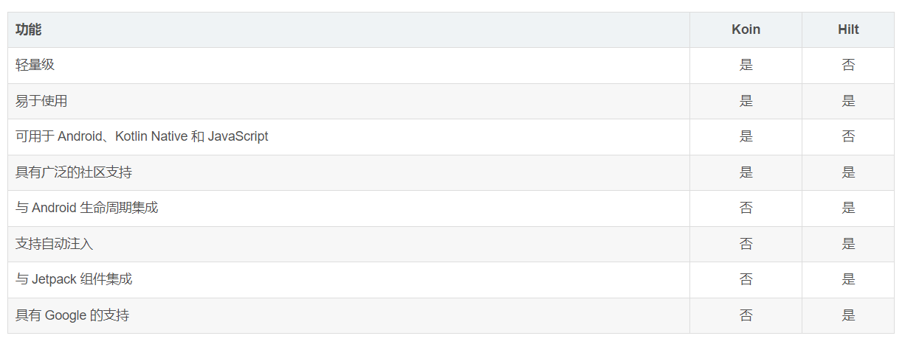
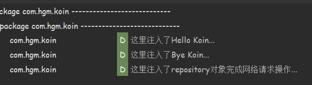

# Koin

## 简介

在介绍Koin之前，回顾以下依赖注入（DI）在开发中的作用

* 降低耦合度
* 提高复用性
* ...

Koin是一个 Kotin 极轻量的依赖注入（DI）框架，据官方资料显示，它具有以下特点：

* 无代理
* 无代码生成
* 无反射

与 Hilt 的对比：




## 使用

### 1、添加依赖库

根据自己的需求添加

```groovy
implementation "io.insert-koin:koin-android:3.2.0-beta-1"
implementation "io.insert-koin:koin-androidx-navigation:3.2.0-beta-1"//Navigation
implementation "io.insert-koin:koin-androidx-compose:3.2.0-beta-1"//Compose
testImplementation "io.insert-koin:koin-test-junit4:3.2.0-beta-1"//测试
```

### 2、定义Module

在使用 Module 之前，先介绍一下它拥有哪几种方法：

| 方法         | 作用                                                 |
| ------------ | ---------------------------------------------------- |
| factory{ }   | 普通注入，以工厂的方式定义（每次都会构造一个新对象） |
| single{ }    | 单例注入（全局只有一个对象）                         |
| viewModel{ } | viewModel注入，这是Koin专门给ViewModel提供的         |
| scope{ }     | 定义作用域                                           |
| scoped{ }    | 在scope{}里使用                                      |
| get()        | 自动获取依赖对象                                     |
| named()      | 定义命名，用于限定符                                 |

在 `Module` 文件里可以编写需要注入的对象，这里以大多数开发场景为例，提供 `MyApi`、`MainRepository`、`MainViewModel` 对象。

AppModule的代码如下：

```kotlin
/**
 * @auth：HGM
 * @date：2023-08-10 15:40
 * @desc：
 */
val appModule = module {
	// 注入MyApi对象
	single {
		Retrofit.Builder()
		      .baseUrl("http://google.com")
		      .addConverterFactory(MoshiConverterFactory.create())
		      .build()
		      .create(MyApi::class.java)
	}
	
	// 注入MainRepository对象
	single<MainRepository> {
		MainRepositoryImpl(get())
	}
	
	// 注入MainViewModel对象
	viewModel {
		MainViewModel(get())
	}
}
```

从上面的三个对象来看，如果需要注入带有参数的对象，可以使用 `get()` 它会自动去寻找合适的依赖，前提是需要注入的参数已经在 Koin 注入，这样 `MainViewModel` 即可自动获取到 `MainRepository` 对象。

ActivityModule的代码如下：

```kotlin
/**
 * @auth：HGM
 * @date：2023-08-10 16:19
 * @desc：
 */
val activityModule = module {

      scope<MainActivity> {
            scoped(qualifier = named("hello")) { "Hello Koin..." }
            scoped(qualifier = named("bye")) { "Bye Koin..." }
      }
}
```

如果我们遇到了在特定的作用域里注入对象，可以使用 `scope` ，它可以指定你需要的作用域进行依赖注入，例如上文我们在 `MainActivity` 中注入了字符串对象，一旦 `MainActivity` 被破坏，这个字符串对象会变成垃圾回收掉。

那如果我们的注入项有两个类型相同的对象，Koin 不知道我们需要哪一个不指定对象的话会发生冲突， DaggerHilt 也有相同的场景一样。这时可以给注入对象添加限定符（标识），qualifier = named("hello")，在使用的地方一样加上限定符即可。

### 3、获取注入实例

在 `MainActivity` 中我们获取了 `MainViewModel` 和两个字符串实例对象，获取实例的方式也有很多中...

```kotlin
class MainActivity : ComponentActivity(), AndroidScopeComponent {

      //xml方式获取
      //private val viewModel by viewModel<MainViewModel>()
      override val scope: Scope by activityScope()

      override fun onCreate(savedInstanceState: Bundle?) {
            super.onCreate(savedInstanceState)
            setContent {
                  KoinTheme {
                      	//val viewModel by viewModel<MainViewModel>()
                        //val vm =getViewModel<MainViewModel>()
                        val viewModel = get<MainViewModel>()
                        val text1 by inject<String>(named("hello"))
                        val text2 by inject<String>(named("bye"))

                        Log.d("LOG_KOIN", "这里注入了$text1")
                        Log.d("LOG_KOIN", "这里注入了$text2")

                        viewModel.doNetworkCall()
                  }
            }
      }
}
```

### 4、初始化Koin

最后就是需要启动Koin，新建 `Myapplication` 类继承自 `Application`，在 `onCreate()` 方法中进行初始化 Koin，需要配置几个功能

* **androidLogger**：添加运行日志，可以添加等级
* **androidContext**：添加上下文
* **modules**：添加你定义的模块

默认添加 androidLogger() 可能会遇到闪退报错，我当时就是这样的，给它添加日志等级即可解决...

```kotlin
/**
 * @auth：HGM
 * @date：2023-08-10 16:10
 * @desc：
 */
class MyApplication: Application() {

      override fun onCreate() {
            super.onCreate()
            //初始化
            startKoin {
                  androidLogger(Level.NONE)
                  androidContext(this@MyApplication)
                  modules(appModule, activityModule)
            }
      }
}
```

### 4、运行

最后查看Log，都是可以正常获取的，到这里 Koin 的简单使用就完成了...




> 相关博客：https://blog.csdn.net/Shaojihan/article/details/104349741