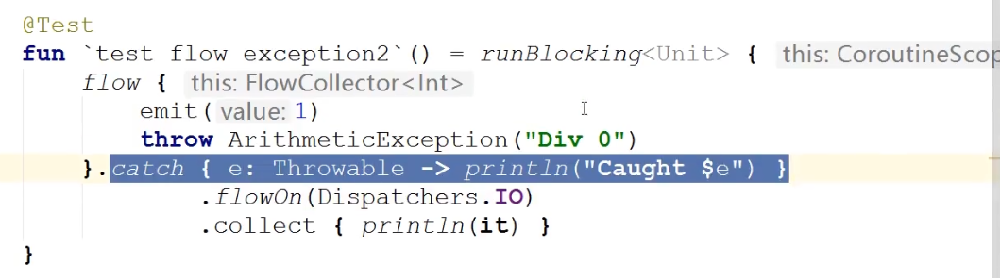
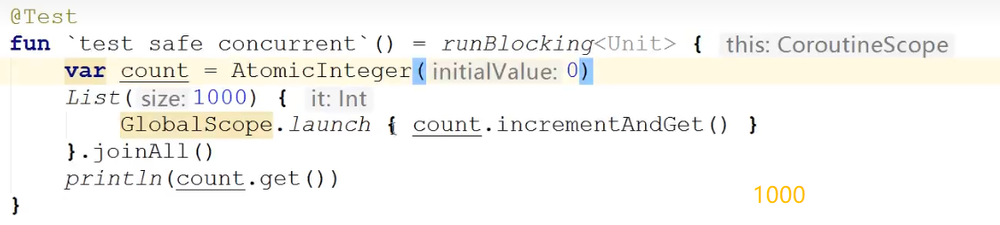
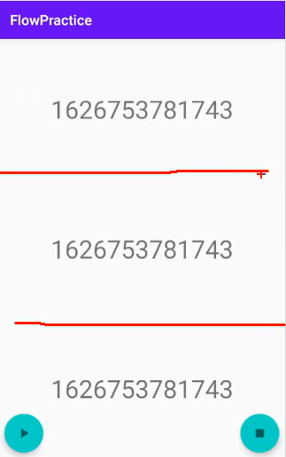

## 简介

* 协程其实就是一套由 `Kotlin` 官方提供的==线程API==
* 协程是基于线程，它是==轻量级==线程框架

```kotlin
//协程官网框架
implementation 'org.jetbrains.kotlinx:kotlinx-coroutines-android:1.5.0-RC-native-mt'
```

### 协程解决什么问题

* **处理耗时任务：**这种任务常常会==阻塞==主线程
* **保证主线程安全：**即确保==安全==地从主线程调用任何 `suspend` 函数

### 协程的好处

* 本质与其他线程 `api` 一样，==方便==
* 最重要的是用看起来==同步的方式写出异步代码==， `kotlin` 最有名的==非阻塞式挂起==
* 把运行在==不同线程的代码，写在同一个代码块里==


* 改变并发任务的操作难度（质变）

  

------


## 基本使用

一个 `launch` 函数，块里写上代码就能切线程

**launch函数的含义：**创建一个新的协程，并在指定线程上运行它


**withContext()函数：**可以==指定线程==来执行代码，执行完成后==自动把线程切回来继续执行==


------


## 协程的挂起

### 挂起函数

* 使用`suspend`关键字修饰的函数叫作挂起函数。
* 挂起函数只能在==协程体内==或其他==挂起函数内==调用。

### 挂起与恢复

* **suspend：**也称为挂起或暂停，用于暂停执行当前协程并保存所有局部变量；

* **resume：**用于让已暂停的协程从其暂停处继续执行。

  


**suspend关键字的作用：**它对协程挂起没有实质的作用，它是==创建者对调用者的提醒==，==提醒调用者它是耗时任务，需要在协程里调用它==。

**为什么挂起函数只能在协程体内或其他挂起函数内调用？：**因为恢复功能是协程的，如果不在协程里调用恢复的功能就没法实现，所以说终归是为了协程在切换线程后能再切换回来。

### 调度器

所有协程必须在调度器（`Dispatchers`）中运行，即使它们在主线程上运行也是如此。


### 挂起函数使用场景

执行耗时的任务，比如：文件读写、网络交互、图片处理、等待任务....

### 协程的两部分

`Kotlin` 的协程实现分为两个层次：

* **基础设施层：**标准库的协程API，主要对协程提供了概念和语义上最基本的支持
* **业务框架层：**协程的上层框架支持

### 任务泄漏

* 当某个协程任务丢失，无法追踪，会导致内存、CPU、磁盘等资源浪费，甚至发送一个无用的网络请求，这种情况称为任务泄漏。
* 为了能够避免协程泄漏，`Kotlin`引入了==结构化并发机制==。

### 结构化并发

使用结构化并发可以做到：

* 取消任务，当某项任务不再需要时取消它。
* 追踪任务，当任务正在执行是，追踪它。
* 发出错误信号，当协程失败时，发出错误信号表明有错误发生。

### CoroutineScope

协程作用域，定义协程必须定义 `CoroutineScope`，它会跟踪所有协程，同样它还可以==取消由它所启动的所有协程==。

***常用的相关API有：***

* **GlobalScope：**生命周期是 `process` 级别的，即使 `Activity` 或 `Fragment` 已经被销毁，协程仍然在执行。
* **MainScope：**在`Activity`中使用,可以在` onDestroy()` 中取消协程。
* **viewModelScope：**只能在 `ViewModel` 中使用，绑定 `ViewModel` 的生命周期。
* **lifecycleScope：**只能在`Activity`、`Fragment` 中使用，会绑定 `Activity` 和 `Fragment` 的生命周期。

------


## 协程的启动与取消


### 启动构建器

**launch与 async构建器都用来启动新协程：**

* **launch：**返回一个`Job`并且==不附带任何结果值==。
* **async：**返回一个`Deferred`，`Deferred `是 `Job` 子类，可以==使用 .await() 在一个延期的值上得到它的最终结果==。

`runBlocking` 把当前函数直接包装成主协程（父协程），里面每一个的是子协程，这样就不需要协程作用域


**等待协程：**

* **join与await：**

（1）使用 `launch` 构建的情况，需要调用 `join` 方法会==依次执行==子协程，等待第一个子协程执行完后再执行下面的


（2）使用 `async` 构建的情况，需要调用 `await` 方法会==依次执行==子协程，等待第一个子协程执行完后再执行下面的


* 组合并发

使用 `async` 组合并发


### 启动模式

* ***DEFAULT：***协程创建后，立即开始调度，<u>在调度前如果协程被取消，其将直接进入取消响应的状态</u>。
* ***ATOMIC：***协程创建后，立即开始调度，<u>协程执行到第一个挂起点之前不响应取消</u>。
* ***LAZY：***<u>只有协程被需要时,包括主动调用协程的start、join或者await等函数时才会开始调度</u>，如果调度前就被取消，那么该协程将直接进入异常结束状态。
* ***UNDISPATCHED：***协程创建后立即在==当前函数调用栈==中执行，直到遇到第一个真正挂起的点。

### 作用域构建器

***coroutineScope与 runBlocking：***

* `runBlocking` 是==常规函数==，而 `coroutineScope` 是==挂起函数==。
* 它们都会等待其协程体以及所有子协程结束，主要区别在于 `runBlocking` 方法会==阻塞当前线程来等待==，而 `coroutineScope` 只是==挂起==，会==释放底层线程==用于其他用途。

***coroutineScope与 supervisorScope：***

* **coroutineScope：**一个协程失败了，所有其他兄弟协程也会被取消。
* **supervisorScope：**一个协程失败了，不会影响其他兄弟协程。


### Job的生命周期

* 对于每一个==创建的协程==（通过launch或者async），==会返回一个Job实例，该实例是协程的唯一标示，并且负责管理协程的生命周期==。
* 一个任务可以包含一系列状态：新创建（==New==）、活跃（==Active==）、完成中（==Completing==）、已完成（==Completed==）、取消中（==Cancelling==）和已取消（==Cancelled==）。虽然我们无法直接访问这些状态，但是我们可以访问Job的属性：isActive、isCancelled和is
  Completed。
* 如果协程处于活跃状态，协程运行出错或者调用job.cancel(）都会将当前任务置为取消中（Cancelling)状态(isActive=false,isCancelled=true)。当所有的子协程都完成后,协程会进入已取消(Cancelled)状态,此时isCompleted=true。


### 协程的取消

* 取消作用域会取消它的子协程。
* 被取消的子协程并不会影响其余兄弟协程。
* 协程通过抛出一个特殊的异常CancellationException 来处理取消操作。
* 所有kotlinx.coroutines中的挂起函数（withContext、delay等）都是可取消的。

```kotlin
//1、------取消作用域会取消它的子协程-----
@Test
fun `test scope cancel`() = runBlocking<Unit> {
	val scope= CoroutineScope(Dispatchers.Default)
	scope.launch {
	      delay(1000)
	      println("job 1")
    }
	scope.launch {
	      delay(1000)
	      println("job 2")
    }
	delay(100)//让主协程挂起100毫秒后取消作用域，结果什么都没有输出
	scope.cancel()
	delay(2000)
}


//2、-----被取消的子协程并不会影响其余兄弟协程-----
@Test
fun `test brother cancel`() = runBlocking<Unit> {
      val scope= CoroutineScope(Dispatchers.Default)
      val job1 = scope.launch {
            delay(1000)
            println("job 1")
      }
      val job2 = scope.launch {
            delay(1000)
            println("job 2")
      }
      delay(100)//让主协程挂起100毫秒后取消job1，结果只输出job2
      job1.cancel()
      delay(2000)
}

//3、-----协程通过抛出一个特殊的异常CancellationException来处理取消操作-----
@Test
fun `test CancellationException`() = runBlocking<Unit> {
      val job1 = GlobalScope.launch {
            try {
                  delay(1000)
                  println("job 1")
            } catch (e: Exception) {
                  e.printStackTrace()
            }
      }
      delay(100)
      //job1.cancel(CancellationException("取消"))
      //job1.join()
      job1.cancelAndJoin()
}
```

### CPU密集型任务取消

* `isActive` 是一个可以被使用在CoroutineScope中的扩展属性，检查Job是否处于活跃状态。

```kotlin
@Test
fun `test cancel cpu task by isActive`() = runBlocking {
      val startTime = System.currentTimeMillis()
      val job = launch(Dispatchers.Default) {
            var nextTime = startTime
            var i = 0
            while (i < 5 && isActive) {
                  if (System.currentTimeMillis() >= nextTime) {
                        println("job sleeping ${i++}...")
                        nextTime += 500
                  }
            }
      }
      delay(1300)
      println("main i am tired or waiting")
      job.cancelAndJoin()
      println("main now i can quit")
}
```

* `ensureActive()`，如果job处于非活跃状态，这个方法会立即抛出异常。

```kotlin
//...
while (i < 5) {
      ensureActive()//直接在这里调用
      if (System.currentTimeMillis() >= nextTime) {
            println("job sleeping ${i++}...")
            nextTime += 500
      }
}
//...
```

* `yield` 函数会检查所在协程的状态，如果已经取消，则抛出CancellationException予以响应。此外，它还会尝试出让线程的执行权，给其他协程提供执行机会。

```kotlin
//...
while (i < 5) {
      yield()//直接在这里调用
      if (System.currentTimeMillis() >= nextTime) {
            println("job sleeping ${i++}...")
            nextTime += 500
      }
}
//...
```

### 协程取消的副作用

* 在 `finally` 中==释放资源==


* user函数：该函数==只能被实现Closeable的对象使用==，程序结束的时候会自动调用close方法，适合文件对象


### 不能取消的任务

* 处于取消中状态的协程不能够挂起（运行不能取消的代码），==当协程被取消后需要调用挂起函数，我们需要将清理任务的代码放置于NonCancellable CoroutineContext中==。
* 这样会挂起运行中的代码，并保持协程的取消中状态直到任务处理完成。


### 超时任务

* 很多情况下取消一个协程的理由是它有可能超时
* withTimeoutOrNull通过返回null来进行超时操作，从而替代抛出一个异常

```kotlin
@Test
fun `test deal with timeout`()= runBlocking {
	withTimeout(1300){
	      repeat(1000){
	            println("job i am sleeping $it")
	            delay(500L)
	      }
	}
}
//job i am sleeping 0
//job i am sleeping 1
//job i am sleeping 2
//kotlinx.coroutines.TimeoutCancellationException: 
-------------------------------------------------------------------------------------
@Test
fun `test deal with timeout return null`()= runBlocking {
	var result=withTimeoutOrNull(1300){
	      repeat(1000){
	            println("job i am sleeping $it")
	            delay(500L)
	            "Yes"
	      }
	}
	println("Result  $result")
}
//job i am sleeping 0
//job i am sleeping 1
//job i am sleeping 2
//Result  null
```

------


## 协程的异常处理


### 协程的上下文

***CoroutineContext是一组用于定义协程行为的元素。它由如下几项构成：***

* ***Job：***控制协程的生命周期
* ***CoroutineDispatcher：***向合适的线程分发任务
* ***CoroutineName：***协程的名称，调试的时候很有用
* ***CoroutineExceptionHandler：***处理未被捕捉的异常

### 组合协程上下文中的元素

有时我们需要在协程上下文中定义多个元素。我们可以使用 + 操作符来实现。比如说，我们可以显式指定一个调度器来启动协程并且同时显式指定一个命名：


### 协程上下文的继承

对于新创建的协程，它的CoroutineContext会包含一个全新的Job实例，它会帮助我们控制协程的生命周期。而==剩下的元素会从CoroutineContext的父类继承==，该父类可能是另外一个协程或者创建该协程的CoroutineScope。


### 协程上下文的继承公式

协程的上下文 = ==默认值 + 继承的CoroutineContext + 参数==

* 一些元素包含默认值：Dispatchers.Default是默认的CoroutineDispatcher,以及“coroutine”
  作为默认的CoroutineName;
* 继承的CoroutineContext是CoroutineScope或者其父协程的CoroutineContext;
* 传入协程构建器的参数的优先级高于继承的上下文参数，因此会覆盖对应的参数值。
* 最终的父级CoroutineContext会内含Dispatchers.IO而不是scope对象里的Dispatchers.Main,因为它被协程的构建器里的参数覆盖了。此外，注意一下父级CoroutineContext里的Job是scope对象的Job（红色），而新的Job实例（绿色）会赋值给新的协程的CoroutineContext。


### 异常的传播

协程构建器有两种形式：==自动传播异常==（launch与actor)，==向用户暴露异常==（async与produce）当这些构建器用于创建一个==根协程==时（该协程不是另一个协程的子协程），<u>前者这类构建器，异常会在它发生的第一时间被抛出</u>，而<u>后者则依赖用户来最终消费异常，例如通过await或receive</u>。


### 非根协程的异常

其他协程所创建的协程中，产生的异常总是会被传播

```kotlin
fun testExceptionPropagation2() = runBlocking {
    val scop = CoroutineScope(Job())
    val job = scop.launch {
        async { // 非根协程，async如果有异常 launch就会立即抛出异常，不需要调用await()
            throw IllegalArgumentException()
        }
    }
    job.join()
}
```

### 异常的传播特性

当一个协程由于一个异常而运行失败时，它会传播这个异常并传递给它的父级。接下来，父级会进行下面几步操作：

* 取消它自己的子级
* 取消它自己
* 将异常传播并传递给它的父级


### SupervisorJob

* 使用SupervisorJob时，一个子协程的运行失败不会影响到其他子协程。SupervisorJob不会传播异常给它的父级，==它会让子协程自己处理异常==。
* 这种需求常见于在作用域内定义作业的UI组件，如果任何一个UI的子作业执行失败了，它并不总是有必要取消整个UI组件，但是如果UI组件被销毁了，由于它的结果不再被需要了，它就有必要使所有的子作业执行失败。

### SupervisorScope

当作业自身执行失败的时候，所有子作业将会被全部取消。


### 协程异常的捕获

* 使用CoroutineExceptionHandler对协程的异常进行捕获。
* 以下的条件被满足时，异常就会被捕获：
  ***时机：***异常是被自动抛出异常的协程所抛出的（使用launch，而不是async时）；
  ***位置：***在CoroutineScope的CoroutineContext中或在一个根协程(CoroutineScope或者supervisorScope的直接子协程）中。

### 全局异常处理

* 全局异常处理器可以获取到所有协程未处理的未捕获异常，不过它并不能对异常进行捕获，虽然==不能阻止程序崩溃==，全局异常处理器在程序调试和异常上报等场景中仍然有非常大的用处。
* 我们需要在classpath下面创建META-INF/services目录,并在其中创建一个名为kotlinx.coroutines.CoroutineExceptionHandler的文件,文件内容就是我们的全局异常处理器的全类名。

### 取消与异常

* 取消与异常紧密相关，协程内部使用CancellationException来进行取消，这个异常会被
  忽略。
* 当子协程被取消时，不会取消它的父协程。
* 如果一个协程遇到了CancellationException以外的异常，它将使用该异常取消它的父协程。当父协程的所有子协程都结束后，异常才会被父协程处理。

### 异常聚合

当协程的多个子协程因为异常而失败时，一般情况下取第一个异常进行处理。在第一个异常之后发生的所有其他异常，都将被==绑定到第一个异常之上==。


------


## 冷数据流-flow


### Flow与其他方式的区别

* 名为flow的Flow类型构建器函数。
* flow{…}构建块中的代码可以挂起。
* 函数simpleFlow不再标有suspend修饰符。
* 流使用emit函数发射值。
* 流使用collect函数收集值。


### Flow应用

在Android中，文件下载是Flow的一个非常典型的应用


### 冷流

`Flow` 是一种类似于序列的==冷流==，==flow构建器中的代码直到流被收集的时候才运行==。


### 冷流与热流的区别

* ***冷流：***相当于明天考试，我今天才复习，临阵磨枪
* ***热流：***明天考试，我一周前已经复习了，有积累

### 流的连续性

* 流的每次单独收集都是按顺序执行的，除非使用特殊操作符。
* 从上游到下游每个过渡操作符都会处理每个发射出的值，然后再交给末端操作符。


### 流的构建器

* `flowOf` 构建器定义了一个发射固定值集的流。

* 使用 `.asFlow()` 扩展函数，可以将各种集合与序列转换为流。


### 流的上下文

* 流的收集总是在调用协程的上下文中发生，流的该属性称为==上下文保存==。
* `flow{.…}` 构建器中的代码必须遵循上下文保存属性，并且不允许从其他上下文中发射（`emit`）。
* `flowOn` 操作符，该函数==用于更改流发射的上下文==。

```kotlin
//启动流
fun simpleFlow3() = flow<Int> {
	println("Flow started ${Thread.currentThread().name}")
	for (i in 1..3) {
	      delay(1000)
	      emit(i)
	}
}

fun simpleFlow4() = flow<Int> {
	withContext(Dispatchers.IO){
	      println("Flow started ${Thread.currentThread().name}")
	      for (i in 1..3) {
	            delay(1000)
	            emit(i)
	      }
	}
}

fun simpleFlow5() = flow<Int> {
	println("Flow started ${Thread.currentThread().name}")
	for (i in 1..3) {
		delay(1000)
		emit(i)
}
}.flowOn(Dispatchers.IO)//只能通过flowOn操作符更改流发射的上下文,上面两种方式是不行的

//接收流
@Test
fun `test flow context`() = runBlocking<Unit> {
	simpleFlow3().collect { value -> println("Collected $value ${Thread.currentThread().name}") }
	simpleFlow4().collect { value -> println("Collected $value ${Thread.currentThread().name}") }
	simpleFlow5().collect { value -> println("Collected $value ${Thread.currentThread().name}") }
}
```

### 启动流

使用 `launchIn `替换 `collect` 我们可以在单独的协程中启动流的收集


### 取消流

流采用与协程同样的协作取消。像往常一样，流的收集可以是当流在一个可取消的挂起函数（例如`delay`）中挂起的时候取消。


### 流的取消检测

* 为方便起见，流构建器对每个发射值执行附加的 `ensureActive` 检测以进行取消，这意味着从 `flow{…}` 发出的繁忙循环是可以取消的。
* 出于性能原因，大多数其他流操作不会自行执行其他取消检测，在协程处于繁忙循环的情况下，必须明确检测是否取消。
* 通过 `cancellable` 操作符来执行此操作。


### 背压

* **.buffer()：**并发运行流中发射元素的代码。
* **.conflate()：**合并发射项，==不对每个值进行处理==。（跳过中间值，发最新值）
* **.collectLatest()：**取消并重新发射==最后一个值==。（只要最后值）
* 当必须更改 `CoroutineDispatcher` 时，`flowOn` 操作符使用了相同的缓冲机制，但是 `buffer` 函数显式地请求缓冲而==不改变执行上下文==。


```kotlin
fun simpleFlow8() = flow<Int> {
	for (i in 1..3) {
	      delay(100)
	      emit(i)
	      println("$i ${Thread.currentThread().name}")
	}
}

@Test
fun `test flow back pressure`() = runBlocking<Unit> {
val time = measureTimeMillis {
	simpleFlow8()
		.buffer(50)//缓冲
    	//.conflate()
    	//.collectLatest()
	    //.collectLatest { value ->  
		.collect { value ->
		      delay(300)//处理元素消耗300ms
		      println("Collected $value ${Thread.currentThread().name}")
		}
	}
	println("$time ms")
}

//（默认）									  （使用buffer()）
// Collected 1 Test worker @coroutine#1	  |	  1 Test worker @coroutine#2
// 1 Test worker @coroutine#1			  |	  2 Test worker @coroutine#2
// Collected 2 Test worker @coroutine#1	  |	  3 Test worker @coroutine#2
// 2 Test worker @coroutine#1			  |	  Collected 1 Test worker @coroutine#1
// Collected 3 Test worker @coroutine#1	  |	  Collected 2 Test worker @coroutine#1
// 3 Test worker @coroutine#1			  |	  Collected 3 Test worker @coroutine#1
// 1258 ms   							  |	  1075 ms

// （使用conflate()）						   （使用collectLatest）		
// 1 Test worker @coroutine#2			  |   1 Test worker @coroutine#2			
// 2 Test worker @coroutine#2			  |   2 Test worker @coroutine#2
// 3 Test worker @coroutine#2			  |   3 Test worker @coroutine#2
// Collected 1 Test worker @coroutine#1	  |   Collected 3 Test worker @coroutine#5
// Collected 3 Test worker @coroutine#1	  |   696 ms
// 757 ms								  |   
```

### 操作符

#### map

`map` 就是用于==将一个值映射成另一个值==，具体映射的规则我们则可以在 `map` 函数中==自行定义==。

```kotlin
fun main() {
    runBlocking {
        val flow = flowOf(1, 2, 3, 4, 5)
        flow.map {
            it * it
        }.collect {
            println(it)
        }
    }
}
//1,4,9,16,25
```

#### filter

`filter` 是一个非常简单的操作符函数。顾名思义，它是用来==过滤掉一些数据==的。`Flow` 当中的操作符函数既可以单独使用，也可以结合其他操作符函数一起使用。这里我们通过结合 `filter` 和 `map` 这两个操作符函数来演示。

```kotlin
fun main() {
    runBlocking {
        val flow = flowOf(1, 2, 3, 4, 5)
        flow.filter { 
            it % 2 == 0
        }.map {
            it * it
        }.collect {
            println(it)
        }
    }
}
//4,16
```

#### onEach

`onEach` 又是一个非常简单的操作符函数，它甚至比 `map` 和 `filter` 还要简单直白，因为它就是用来==遍历==每一条数的。比如说我们想 ` flow` 中的每一条数据打印出来，借助 `onEach` 函数就可以这样写：

```kotlin
fun main() {
    runBlocking {
        val flow = flowOf(1, 2, 3, 4, 5)
        flow.onEach {
            println(it)
        }.collect {
        }
    }
}
//1,2,3,4,5
```

可能有的朋友会说，这不是脱了裤子放屁嘛，我在 `collect` 函数中就可以把数据打印出来了，还需要借助 `onEach` 函数干什么。确实，但是 `collect` 函数中打印出的是最终的结果。如果你想要查看某个==中间状态==时 `flow` 的数据状态，借助 `onEach` 就非常有用了。

```kotlin
fun main() {
    runBlocking {
        val flow = flowOf(1, 2, 3, 4, 5)
        flow.filter {
            it % 2 == 0
        }.onEach {
            println(it)
        }.map {
            it * it
        }.collect {
        }
    }
}
//2,4
```

#### debounce

`debounce` 函数可以用来确保 `flow` 的各项数据之间存在一定的时间间隔，如果是时间点过于临近的数据只会保留最后一条。这个函数在某些特定场景下特别有用。想象一下我们正在 `Edge` 浏览器的地址栏中输入搜索关键字，浏览器的地址栏下方通常都会给出一些搜索建议。


这些搜索建议是根据用户当前输入的内容通过发送网络请求去服务器端实时获取的。但如果用户每输入一个字符就立刻发起一条网络请求，这是非常不合理的设计。

原因很简单，网络请求是不可能做到无延时响应的，而用户的打字速度通常都比较快。如果用户每输入一个字符都立刻发起一条网络请求，那么很有可能用户输完了第3个字符之后，对应第1个字符的网络请求结果才刚刚返回回来，而此时的数据早已是无效数据了。

正确的做法是，我们不应该在用户每输入一个字符时就立刻发起一条网络请求，而是应该在一定时间的停顿之后再发起网络请求。如果用户停顿了一段时间，很有可能说明用户已经结束了快速输入，开始期待一些搜索建议了。这样就能有效地避免发起无效网络请求的情况。

而要实现这种功能，使用 `debounce` 操作符函数就会非常简单，它就是为了这种场景而设计的。示例：

```kotlin
fun main() {
    runBlocking {
        flow {
            emit(1)
            emit(2)
            delay(600)
            emit(3)
            delay(100)
            emit(4)
            delay(100)
            emit(5)
        }
        .debounce(500)
        .collect {
            println(it)
        }
    }
}
//2,5
```

可以看到，我们调用了 `debounce` 函数，并且传入了500作为参数，意义就是说==只有两条数据之间的间隔超过500毫秒才能发送成功==。

这里使用 `emit()` 函数依次发送了1、2、3、4、5这几条数据。其中，1和2是连续发送的，2和3之间存在600毫秒的间隔，因此2可以发送成功。3和4之间、4和5之间间隔只有100毫秒，因此都无法发送成功。5由于是最后一条数据，因此可以发送成功。

#### sample

`sample` 操作符函数和 `debounce `稍微有点类似，它们的用法也比较接近，==同样都是接收一个时间参数==。

`sample` 是采样的意思，也就是说，它可以从 `flow` 的数据流当中==按照一定的时间间隔来采样某一条数据==。

这个函数在==某些源数据量很大==，但我们又==只需展示少量数据==的时候比较有用。比如说视频网站的弹幕功能，理论上来说每个时间点用户发送的弹幕数量可以是无限多的，但是视频网站又不可能把每条弹幕都展示出来，不然的话弹幕和视频都没法看了。因此，这个时候就需要对数据进行采样。

我们来模拟一下这种场景，假设某个视频的播放量很大，每时每刻都有无数人在发送弹幕，但是我们每秒钟最多只允许显示1条弹幕，代码就可以这样写：

```kotlin
fun main() {
    runBlocking {
        flow {
            while (true) {
                emit("发送一条弹幕")
            }
        }
        .sample(1000)
        .flowOn(Dispatchers.IO)
        .collect {
            println(it)
        }
    }
}
```

这里我们在 `flow` 构建函数中写了一个死循环，不断地在发送弹幕，那么这个弹幕的发送量无疑是巨大的。而接下来我们借助 `sample` 函数进行==数据采集==，==每秒钟只取一条弹幕==，这样就轻松满足了前面说的弹幕采样率的要求。

> 注意，由于 `flow` 是通过死循环不断发送的，我们必须调用 `flowOn` 函数，让它在 `IO` 线程里去执行，否则我们的主线程就一直被卡死了。接下来运行一下程序来看看结果吧：


#### reduce

刚才学习的几个操作符函数最终都还是要通过 `collect` 函数来收集结果的。接下来学习两个不需要借助 `collect` 函数，==自己终结==整个 `flow` 流程的操作符函数，这种操作符函数也被称为==终端操作符==函数。

首先来看 `reduce` 函数。我个人认为 `reduce` 函数还是比较好理解的，它的基本公式如下：

```kotlin
flow.reduce { acc, value -> acc + value }
```

其中 `acc` 是==累积值==，`value` 则是==当前值==。也就是说，`reduce` 函数会通过参数给我们一个 `Flow` 的累积值和一个 `Flow` 的当前值，我们可以在函数体中对它们进行一定的运算，运算的结果会作为下一个累积值继续传递到 `reduce` 函数当中。示例：计算1-100相加的结果

```kotlin
fun main() {
    runBlocking {
        val result = flow {
            for (i in (1..100)) {
                emit(i)
            }
        }.reduce { acc, value -> acc + value}
        println(result)
    }
}
//5050
```

#### fold

`fold` 函数和 `reduce` 函数基本上是完全类似的，它也是一个终端操作符函数。

主要的区别在于，`fold` 函数需要传入一个初始值，这个初始值会作为首个累积值被传递到 `fold` 的函数体当中，它的基本公式如下：

```kotlin
flow.fold(initial) { acc, value -> acc + value }
```

但是其实 `reduce` 函数和 `fold` 函数并不是只能用作数值计算，相反它们可以作用于任何类型的数据。因此，这里我就用 `fold` 函数来演示一个字符串拼接的功能吧：

```kotlin
fun main() {
    runBlocking {
        val result = flow {
            for (i in ('A'..'Z')) {
                emit(i.toString())
            }
        }.fold("Alphabet: ") { acc, value -> acc + value}
        println(result)
    }
}
//Alphabet:ABCDEFG....Z
```

#### 过渡流操作符

* 可以使用操作符转换流，就像使用集合与序列一样。
* 过渡操作符应用于上游流，并返回下游流。
* 这些操作符也是冷操作符，就像流一样。这类操作符本身不是挂起函数。
* 它运行的速度很快，返回新的转换流的定义。

#### 转换操作符


#### 限长操作符


#### 末端操作符

末端操作符在流上用于==启动流收集的挂起函数==。`collect ` 是最基础的末端操作符，但是还有另外一些更方便使用的

**其它的末端操作符：**

* 转化为各种集合，例如 `toList` 与 `toSet`。
* 获取第一个（`first`）值与确保流发射单个（`single`）值的操作符。
* 使用 `reduce` 与 `fold` 将流规约到单个值。

#### 组合操作符

就像 `Kotlin` 标准库中的 `Sequence.zip` 扩展函数一样，流拥有一个 `zip` 操作符用于==组合==两个流中的相关值。


#### 展平操作符

流表示异步接收的值序列，所以很容易遇到这样的情况：每个值都会触发对另一个值序列的请求，然而，由于流具有异步的性质，因此需要不同的展平模式，为此，存在一系列的流展平操作符：

* **flatMapConcat：**连接模式
* **flatMapMerge：**合并模式
* **flatMapLatest：**最新展平模式


### StateFlow


状态流==用于保持状态==，他就像没有生命周期意识的实时数据，所以我们的活动无法真正检测到什么时候更确切的说，状态流无法真正检测到活动何时进入后台。==如果有新的变化，他会通知所有观察者更准确来说是收集器，且它会准确的保留一个值==。

在 `ViewModel` 中有我们所有的状态流，这些只包含我们的 `ui` 状态，通常在一个可变版本中声明它们是私有的，只有 `ViewModel` 可以修改它，然后我们将一个公共不可变版本公开，用户界面可以==订阅并且可以收集==。

**示例：**

```kotlin
//在 ViewModel 中声明
private val _stateFlow = MutableStateFlow(0)
val stateFlow = _stateFlow.asStateFlow()

fun add(){
  _stateFlow += 1
}
```

```kotlin
//在 ui 界面收集状态流
val viewModel = viewModel<MainViewModel>()
val counter = viewModel.stateFlow.collectAsState(0)//收集流
Box(
    modifier = Modifier.fillMaxSize()
) {
	Button(onClick = { viewModel.add() }) {
	    Text(
	        text = "Counter：${counter.value}"
	    )
	}
}
```

### SharedFlow

共享流==用于一次性==，例如在旋转屏幕后再次显示提示的事件、不希望有另一个导航事件或者你不想再次隐藏键盘所有这些一次性事件。

**示例：**

```kotlin
private val _sharedFlow = MutableSharedFlow<Int>(replay = 5)//replay相当于缓存5个排放量
val sharedFlow = _sharedFlow.asSharedFlow()

init {
		//squareNumber(3)
		viewModelScope.launch {
		    sharedFlow.collect {
		        delay(2000L)
		        println("First Flow: The received is $it")
		    }
		}
	
		viewModelScope.launch {
		    sharedFlow.collect {
		        delay(3000L)
		        println("Second Flow: The received is $it")
		    }
		}
  	//squareNumber(3)
}

//定义一个平方方法
fun squareNumber(number: Int) {
    viewModelScope.launch {
        _sharedFlow.emit(number * number)
    }
}

//打印结果：(如果squareNumber定义在收集器之前，默认是打印0，但是如果放在后面运行一次再放回原位的话，收集器会打印9，因为共享流设置了缓存5个排放量，会把上次缓存的流打印)
//First Flow: The received is 9
//Second Flow: The received is 9
```

> 在 xml 中简单使用两种共享流，自定义扩展方法，简洁代码

```kot
//用于StateFlow
fun <T> ComponentActivity.collectLatestLifecycleFlow(flow:Flow<T>,collect : suspend (T) ->Unit){
	lifecycleScope.launch{
		repeatOnLifecycle(Lifacycle.State.STARTED){
			flow.collectLatest(collect)
		}
	}
}
```

```kotlin
//用于SharedFlow
fun <T> ComponentActivity.collectLifecycleFlow(flow:Flow<T>,collect : suspend (T) ->Unit){
	lifecycleScope.launch{
		repeatOnLifecycle(Lifacycle.State.STARTED){
			flow.collect(collect)
		}
	}
}
```

### 流的异常处理

当运算符中的发射器或代码抛出异常时，有几种处理异常的方法：

* try/catch块
* catch函数




### 流的完成

当流收集完成时（普通情况或异常情况），它可能需要执行一个动作。

* 命令式 `finally` 块
* `onCompletion` 声明式处理


------


## 热数据流-Channel


### 认识Channel

Channel实际上是一个==并发安全的队列==，它可以用来连接协程，实现不同协程的通信。


```kotlin
@Test
fun `test know channel`() = runBlocking<Unit> {
	val channel = Channel<Int>()
	//生产者
	val producer = GlobalScope.launch {
		var i = 0
		while (true) {
		      delay(1000)
		      channel.send(++i)
		      println("send：$i")
		}
	}
	//消费者
	val consumer = GlobalScope.launch {
		while (true) {
			val element = channel.receive()
			println("element：$element")
		}
	}
	joinAll(producer, consumer)
}
//send：1
//element：1
//send：2
//element：2
```

### Channel的容量

`Channel` 实际上就是一个==队列==，队列中一定存在==缓冲区==，那么一旦这个缓冲区满了，并且也一直没有人调用`receive` 并取走函数，`send` 就需要挂起。故意让接收端的节奏放慢，发现 `send` 总是会挂起，直到 `receive` 之后才会继续往下执行。


### 迭代Channel

`Channel` 本身确实像序列，所以我们在读取的时候可以直接获取一个 `Channel` 的 `iterator`。


### produce与actor

* 构造生产者与消费者的==便捷方法==。
* 我们可以通过 `produce` 方法启动一个生产者协程，并返回一个 `ReceiveChannel`，其他协程就可以用这个`Channel `来接收数据了。 反过来我们可以用  `actor` 启动一个消费者协程。


### Channel的关闭

* `produce` 和 `actor` 返回的 `Channel` 都会随着对应的协程执行完毕而关闭， `Channel ` 被称为==热数据流==。
* 对于一个 `Channel`，如果我们调用了它的 `close` 方法，它会立即==停止接收新元素==，也就是说这时它的`isClosedForSend` 会立即返回 `true`。而由于 Channel 缓冲区的存在,这时候可能还有一些元素没有被处理完，因此要等所有的元素都被读取之后 `isClosedForReceive` 才会返回 `true`。
* `Channel` 的生命周期最好由==主导方==来维护，建议==由主导的一方实现关闭==。


### BroadcastChannel

前面提到，发送端和接收端在 `Channel` 中存在一对多的情形，从数据处理本身来讲，虽然有多个接收端，但是同一个元素只会被一个接收端读到。广播则不然，==多个接收端不存在互斥行为==。


### 多路复用

数据通信系统或计算机网络系统中，传输媒体的带宽或容量往往会大于传输单一信号的需求，为了有效地利用通信线路，希望==一个信道同时传输多路信号==，这就是所谓的多路复用技术（`Multiplexing`）。


* **复用多个 await：**两个 `API` 分别从网络和本地缓存中获取数据期望哪个先返回就先用哪个做展示


* 复用多个 Channel：跟 `await` 类似，会接收到最快的那个 `Channel` 消息


### SelectClause

我们怎么知道哪些事件可以被select呢?其实所有能够被 `select` 的事件都是 `SelectClauseN` 类型，包括：

* **SelectClauseO：**对应事件没有返回值，例如 `join` 没有返回值，那么 `onJoin` 就是 `SelectClauseN` 类型。使用时，`onJoin` 的参数是一个无参函数。
* **SelectClause1：**对应事件有返回值，前面的 `onAwait` 和 `onReceive` 都是此类情况。
* **SelectClause2：**对应事件有返回值，此外还需要一个额外的参数，例如 `Channel.onSend` 有两个参数，第一个是 `Channel` 数据类型的值，表示即将发送的值；第二个是发送成功时的回调参数。

如果我们想要确认挂起函数是否支持 `select`，只需要查看其是否==存在对应的SelectClauseN类型==可回调即可。

### Flow多路复用

多数情况下，我们可以通过构造合适的 `Flow` 来实现多路复用的效果


### 并发安全

我们使用线程在解决并发问题的时候总是会遇到线程安全的问题，==在Java平台上的Kotlin协程实现免不了存在并发调度的情况，因此线程安全同样值得留意==。

<u>多个协程同时操作count时，因为并发count没有及时刷新导致，所以以下输出的结果肯定都是小于1000的，不是原子性的操作是线程不安全的</u>


### 协程并发安全

`Java` 是提供的线程安全类，这样就能保证输出1000



### 协程的并发安全工具

除了我们在线程中常用的解决并发问题的手段之外，协程框架也提供了一些并发安全的工具，包括：

* **Channel：**==并发安全的消息通道==，我们已经非常熟悉。
* **Mutex：**轻量级锁，它的 `lock` 和 `unlock` 从语义上与线程锁比较类似，之所以轻量是因为它在获取不到锁时不会阻塞线程，而是挂起等待锁的释放。

```kotlin
fun testSyncMutex() = runBlocking {
    var count = 0;
    val mutex = Mutex()
    List(1000) {
        GlobalScope.launch {
            mutex.withLock {
                count++
            }
        }
    }.joinAll()

    println(count)
}
```

* **Semaphore：**轻量级信号量，信号量可以有多个，协程在获取到信号量后即可执行并发操作。当 `Semaphore` 的参数为1时,效果等价于 `Mutex`。

```kotlin
fun testSyncSemaphore() = runBlocking {
    var count = 0;
    val semaphore = Semaphore(1)
    List(1000) {
        GlobalScope.launch {
            semaphore.withPermit {
                count++
            }
        }
    }.joinAll()

    println(count)
}
```

我们也可以避免访问外部变量，基于参数作运算，通过返回值提供运算结果

```kotlin
fun testSyncAvoid`() = runBlocking {
    var count = 0;
    count += List(1000) {
        GlobalScope.async {
            1
        }
    }.map {
        it.await()
    }.sum()

    println(count)
}
```

------


## Flow综合应用


### Flow异步流

`Flow` 最主要的作用在于==异步返回多个值==，文件下载就是 `Flow` 最经典的一个应用场景。


### Flow与文件下载


### 冷流和热流

* `Flow` 是冷流，什么是冷流？简单来说，如果 `Flow` 有了订阅者 `Collector` 以后，发射出来的值才会实实在在的存在于内存之中，这跟懒加载的概念很像。

* 与之相对的是热流，`StateFlow` 和 `SharedFlow` 是热流，在垃圾回收之前，都是存在内存之中，并且处于活跃状态的。

### StateFlow

`StateFlow` 是一个状态容器式==可观察数据流==，可以向其收集器发出当前状态更新和新状态更新。还可通过其 `value`属性读取当前状态值。


### SharedFlow

`SharedFlow` 会向从其中收集值的所有使用方法发出数据



------


## Paging实战

### paging3数据加载流程


### 分页逻辑

适用于数据源==以页的方式==进行请求的情况，例如，若请求时携带的参数为 ==page=2&pageSize=5==，则表示数据源以5条数据为一页，当前返回第二页的5条数据。


### PageConfig

* **pagesize：**每页显示的数据的大小
* **prefetchDistance：**预刷新的距离，距离最后一个 `item` 多远时加载数据，默认为 `pageSize`
* **initialLoadSize：**初始化加载数量，默认为 ==pageSize * 3==

### 获取LoadState

加载的状态信息被存放于一个Flow当中


------


## Hilt实战

负责托管对象与对象之间的注入关系


### 注解

* **@HiltAndroidApp：**触发Hilt的代码生成。
* **@AndroidEntryPoint：**创建一个依赖容器，该容器遵循 `Android` 类的生命周期。
* **@Module：**告诉 `Hlit` 如何提供不同类型的实例。
* **@lnstallln：**`Install` 用来告诉 `Hilt` 这个模块会被安装到哪个组件上。
* **@Provides：**告诉 `Hilt` 如何获得具体实例。
* **@Singleton：**单例。
* **@ViewModellnject：**通过构造函数，给 `ViewModel` 注入实例。
