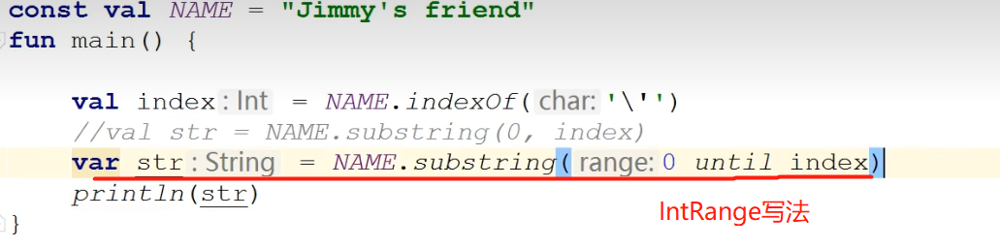
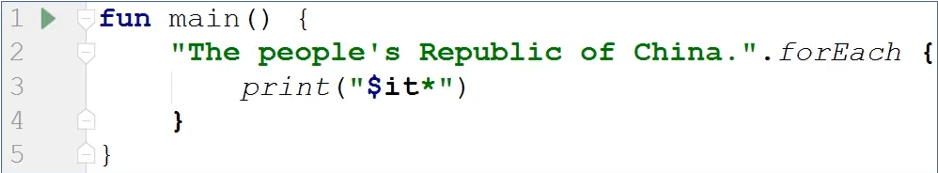
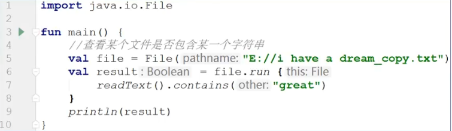
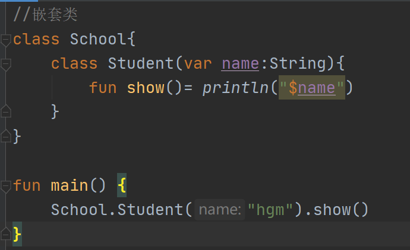
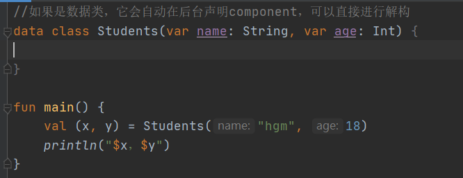
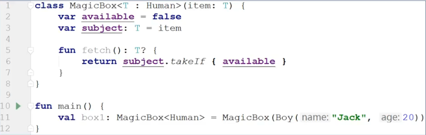
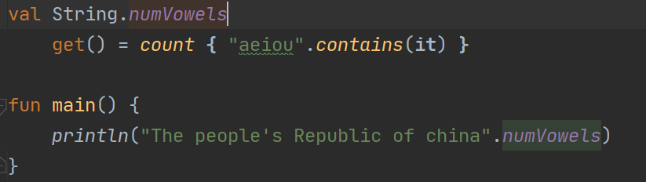
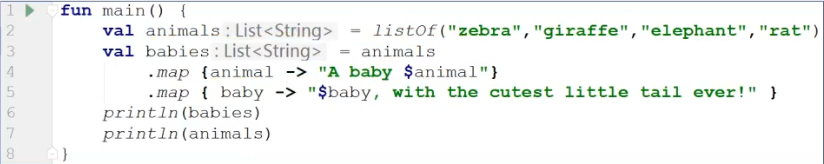

### 简介

Kotlin 是一种在 Java 虚拟机上运行的静态类型编程语言，被称之为 Android 世界的Swift，由 JetBrains 设计开发并开源。Kotlin 可以编译成Java字节码，也可以编译成 JavaScript，方便在没有 JVM 的设备上运行。

为什么选择Kotlin？

- 简洁:  大大减少样板代码的数量。
- 安全:  避免空指针异常等整个类的错误。
- 互操作性:  充分利用 JVM、Android 和浏览器的现有库。
- 工具友好:  可用任何 Java IDE 或者使用命令行构建。

------


### 变量和常量


#### 可变变量和不可变变量

* ***不可变变量val***

`val`变量只能进行一次初始化，它对应的是`Java`的`final`变量。==默认情况下，应该尽可能地使用 `val` 关键字来声明所有的 **Kotlin** 变量==。但是，如果编译器能确保唯一一条初始化语句会被执行，可以根据条件使用不同的值来初始化它。例子如下：

```kotlin
fun mainVal(){
    val res: String
	res =if	(isSuccess()) "success" else "failed"
}
fun isSuccess() = true
```

* ***可变变量 var***

这种变量的值可以改变，但是它的类型却是改变不了的，如果需要在变量中存储不匹配类型的值，必须手动把值转换或强制转换到正确的类型。

```kotlin
var num: Int = 1
```

#### 类型推断

(1)、如果已经声明并赋值的变量，它允许你省略类型定义，例如：

```kotlin
val str:String ="abc"
val str ="abc"//这里编译器会根据赋值自动判断类型
```

(2)、如果已经声明但没有赋值的变量，编译器无法推断出它的类型则需要显示地指定它的类型，例如：

```kotlin
val value: Int
value=10
```

#### 编译时常量

* 只读变量并非绝对只读
* ==编译时常量只能在函数之外定义==，因为编译时常量必须在编译时赋值，而函数都编译时常量要在这些变量是在运行时才调用，函数内的变量也是在运行时赋值，赋值前就已存在。
* 编译时常量只能是常见的基本数据类型：String、Int、Double、Float、Long、Short、 Byte、 Char、 Boolean。

```kotlin
//声明一个常量
const val MAX_NUM=100
```

#### 字符串模板

* $ 表示一个变量名或者变量值
* $varName  表示变量值
* ${varName.fun()} 表示变量的方法返回值:

***1、Kotlin 可以在字符串字面值中==引用局部变量==，只需要在变量名称前面加上字符`$`。***

```kotlin
fun main(){
    val name: String="hgm"
    println("Hello $name")
}
//输出：Hello hgm
```

***2、如果要在==字符串中使用 `$`==，需要对它使用  `\$` 进行转义。***

```kotlin
fun main(){
    val money =100
	println("I have \$$money")
}
//输出：I have $100
```

***3、除了可以引用局部变量之外，还可以==引用更加复杂的表达式==，只需要把表达式用 `${}`扩起来。***

```kotlin
fun main(){
	Func(5,6)
}
fun Func(a: Int,b: Int){
    println("a is ${if(a>b) "big" else "small"} than b")
}
//输出：a is small than b
```

#### NULL检查机制

**Kotlin** 的空安全设计对于声明可为空的参数，在使用时要进行空判断处理，有两种处理方式，字段后加 `!! `像Java一样抛出空异常，另一种字段后加?可不做处理返回值为  `null`  或配合 `?:` 做空判断处理

------


### 类型

#### 内置数据类型

| 类型    | 描述             |
| ------- | ---------------- |
| String  | 字符串           |
| Char    | 单字符           |
| Boolean | true/false       |
| Int     | 整数             |
| Double  | 小数             |
| List    | 元素集合         |
| Set     | 无重复的元素集合 |
| Map     | 键值对集合       |

***注意：***在 Kotlin 中字符不是数字

#### 引用类型和基本数据类型

* Java有两种数据类型：引用类型与基本数据类型。
* Kotlin只提供引用类型这一种数据类型，出于更高性能的需要，Kotlin编译器会在Java字节码中==改用基本数据类型==。

------


### 条件语句

#### if/else if表达式

```kotlin
fun maxOf(a: Int, b: Int): Int {
    if (a > b) {
        return a
    } else {
        return b
    }
}

fun main(args: Array<String>) {
    println("max of 0 and 42 is ${maxOf(0, 42)}")
}
```

####  range表达式

in A..B，`in`、`!in`关键字用来检查某个值是否在指定范围之内

```kotlin
fun main() {
    val age=5
    if (age in 0..10){
        println("age在范围")
    }else{
        println("age不在范围")
    }
}
//输出：age在范围
```

#### when表达式

* 允许你编写条件式，在某个条件满足时，执行对应的代码
* 只要代码包含 `else if` 分支，都建议改用 `when` 表达式
* 类似于 `Switch` 语句，相比之下更简洁强大

```kotlin
fun main(){
	val school="小学"
	val level= when (school){
    	"幼儿园"  ->  "幼儿"
	    "小学"  -> "少年"
	    "中学"  -> "青少年"
	    else -> {
	        println("未知")
	    }
	}
	println(level)  
}
```

------


### 函数

#### 函数的基本构成


在 **Kotlin** 中，函数的基本结构由五个部分构成：

- 可见性修饰符
- 函数名称
- 参数列表
- 返回类型
- 函数体


#### 函数参数

* ***默认值参：***如果不打算传入值参，可以预先给参数指定默认值

  ```kotlin
  fun main(){
      sum(3)
  }
  fun sum(n1:Int , n2:Int = 5){
      return n1+n2
  }
  //输出：8
  ```

* ***具名函数值参：***如果使用命名值参，就可以不用管值参的顺序

```kotlin
fun main(){
    info(age = 18,name = "hgm")
}
fun info(name:String , age:Int){
    println(name+age)
}
```

#### Unit函数

不是所有函数都有返回值，Kotlin中没有==返回值的函数叫 Unit 函数==，也就是说他们的返回类型是Unit。在Kotlin之前，函数不返回任何东西用 ==void== 描述，==意思是“没有返回类型==，不会带来什么，忽略它”，也就是说如果函数不返回任何东西，就忽略类型。但是，void这种解决方案无法解释现代语言的一个重要特征，泛型。

```kotlin
fun printSum(a: Int, b: Int): Unit { 
    print(a + b)
}

// 如果是返回Unit类型，则可以省略(对于public方法也是这样)
public fun printSum(a: Int, b: Int) { 
    print(a + b)
}
```

#### TODO函数

TODO函数的任务就是抛出异常，就是永远别指望它运行成功，返回 `Nothing` 类型

```kotlin
//源码：public inline fun TODO(reason: String): Nothing= throw NoImplementedError

var i=2
if (i>3){
    println(i)
}else{
    TODO("too small")//这里写抛出异常的原因
}
i++
println(i)
```

#### 反引号中的函数名

* Kotlin可以使用空格和特殊字符对函数命名，不过函数名要用一对反引号括起来。
* ==为了支持Kotlin和Java互操作==，而Kotlin和Java各自却有着不同的保留关键字，不能作为函数名，使用反引号括住函数名就能==避免任何冲突==。

```kotlin
fun main(){
    `Color`()
}

fun `Color`(){
    ....
}
```

------


### 匿名函数与函数类型

#### 匿名函数

* 定义时不取名字的函数，我们称之为匿名函数，==匿名函数通常整体传递给其他函数，或者从其他函数返回==。
* 匿名函数对Kotlin来说很重要，有了它，我们能够根据需要制定特殊规则，轻松定制标准库里的内置函数。

```kotlin
fun main() {
    val total = "Mississippi".count()

    val total2 = "Mississippi".count{ letter ->
        letter == 's'
    }

    println(total)//11
    println(total2)//4
}
```

#### 函数类型和隐式返回

* 匿名函数也有类型，匿名函数可以当作变量赋值给函数类型变量，就像其他变量一样，匿名函数就可以在代码里传递了。变量有类型，变量可以等于函数，函数也会有类型。==函数的类型，由传入的参数和返回值类型决定==。
* 和具名函数不一样，除了极少数情况外，匿名函数不需要return关键字来返回数据，匿名函数会隐式或==自动返回函数体最后一行语句的结果==。

```kotlin
//变量的类型是一个匿名函数
val func: () -> String = {
    val str = "abc"
    "hello $str"
}
```

#### 函数参数

和具名函数一样，匿名函数可以不带参数，也可以带一个或多个任何类型的参数，需要带参数时，==参数的类型放在匿名函数的类型定义中，参数名则放在函数定义中==。

```kotlin
fun main(){
    println(AFunc("hgm"))
}

val AFunc: (String)->String = {name ->
    val str="hello"
	"$str $name"
}
//hello hgm
```

#### it关键字

定义==只有一个==参数的匿名函数时，可以使用it关键字来表示参数名。当你需要两个参数时，it关键字就不能用了。


#### 类型推断

* 定义一个变量时，如果把匿名函数作为变量赋值给它，就不需要写匿名函数的类型。


* 类型推断也支持带参数的匿名函数，但为了帮助编译器更准确的推断变量类型，匿名函数的==参数名和参数类型必须有==


#### lambda

我们将==匿名函数称为 lambda==，它的定义称为lambda表达式它返回的数据称为lambda结果。为什么叫lambda?lambda也可以用希腊字符入表示，是lambda演算的简称,lambda演算是一套数理演算逻辑，由数学家Alonzo Church（阿隆佐.丘齐）于20世纪30年代发明，==在定义匿名函数时，使用了lambda演算记法==。

#### 内联函数

* lambda可以让我们更灵活的写代码，但是要付出代价。
* 但是在JVM上，定义的lambda会以==对象示例的形式存在==，这时候JVM会为所有lambda分配内存，导致lambda内存开销会带来严重的性能问题。kotlin有一种优化机制叫==内联==，哪里需要使用lambda，==编译器就会将函数体复制到哪里==。
* 使用lambda的==递归函数无法内联==，因为会导致复制粘贴无限循环，编译会发出警告

#### 函数引用

要把函数作为参数传给其他函数使用，除了lambda表达式，还可以使用函数引用 `::函数名`

```kotlin
fun main() {
    getInfo("hgm", ::getAge)
}

fun getInfo(name: String, age: (String, Int, Int) -> String) {
    println(age(name, 2003, 2022))
}

fun getAge(name: String, born: Int, current: Int): String {
    val age = current - born
    return "${name}今年${age}岁"
}
```

#### 函数类型作为返回类型

函数类型也是有效的返回类型，也就是说可以==定义一个能返回函数的函数==

```kotlin
fun main() {
    val sell = Sell()//这个变量等于一个匿名函数
    println(sell("牙膏"))
}

fun Sell(): (String) -> String {
    //这两行代码可以也可以写在这里，这种叫作用域共享
    //val currentYear = 2027	
		//val hour = (1..20).shuffled().last()
    return { storeName: String ->
        val currentYear = 2027
        val hour = (1..20).shuffled().last()
        "${currentYear}年，双十一${storeName}促销倒计时：${hour}小时"
    }
}
```

#### 闭包

* 在Kotlin中，匿名函数能修改并引用定义在自己的作用域之外的变量，匿名函数引用着定义自身的函数里的变量，==Kotlin中的lambda就是闭包==。
* 能接收函数或者返回函数的函数又叫做高级函数，高级函数广泛应用于函数式编程当中。

参考文档：https://segmentfault.com/a/1190000013333527


#### lambda与匿名内部类

为什么要在代码中使用函数类型？函数类型能让开发者==少写模式化代码，写出更灵活的代码==。Java 8支持面向对象编程和lambda表达式，但不支持将函数作为参数传给另一个函数或变量，不过Java的替代方案是==匿名内部类==。

例子对比：


#### 表达式和语句

表达式和语句的区别在于：

- ***表达式：*** 有值，并且能作为另一个表达式的一部分使用。
- ***语句：*** 总是包含着它的代码块中的顶层元素，并且没有自己的值。

在 **Java** 中所有的控制结构都是==语句==，而在 **Kotlin** 中除了 `for`、`do  `、`do/while` 以外大多数控制结构都是==表达式==

当函数体是由单个表达式构成时，可以用这个表达式作为完整的函数体，并且去掉花括号和`return`语句，上面的例子就是这种情况，因此可以改写为：

```kotlin
fun sum(a: Int,b: Int): Int = a + b				
public fun sum(a: Int, b: Int): Int = a + b   	//public方法必须明确写出返回类型
```

- 如果函数体写在花括号中，我们说这个函数有 **代码块体**
- 如果它直接返回了一个表达式，它就有 **表达式体**

#### 可变长参数函数

函数的变长参数可以用 `vararg` 关键字进行标识：

```kotlin
fun main(){
    vars(1,2,3,4,5)
}

fun vars(vararg v: Int){
    for(vt in v){
        print(vt)
    }
}
```

------


### null安全与异常

#### 可空性

为了避免`NullPointerException`，Kotlin的做法是不让我们给==非空类型变量==赋 `null` 值，但 `null` 在Kotlin中依然存在。

给变量赋null值是会报错，如果一定要赋null，可以在类型后面加上：`？`，使它是个==可空类型==


#### null安全

Kotlin区分可空类型和非可空类型，所以，你要一个可空类型变量运行，而它又可能不存在，对于这种潜在危险，编译器时刻警惕着。为了应对这种风险，Kotlin不允许你在可空类型值上调用函数，==除非你主动接手安全管理==。

#### 安全调用操作符

这次Kotlin不报错了，编译器看到有安全调用操作符，所以它知道如何检查null值。<u>如果遇到null值，它就==跳过函数调用==，而不是返回null。</u>


#### 使用带let的安全调用

安全调用允许在可空类型上调用函数，但是如果还想做点==额外的事==，比如<u>创建新值，或判断不为null就调用其他函数</u>，可以使用带 `let` 函数的安全调用操作符。你可以在任何类型上调用let函数，它的==主要作用是让你在指定的作用域内定义一个或多个变量==。


#### 非空断言操作符

`!!` 又称感叹号操作符，当变量值为null时，会抛出KotlinNullPointerException。


#### 使用if判断null值情况

我们也可以使用 `if` 判断，==但是相比之下安全调用操作符用起来更灵活，代码也更简洁==，我们可以用安全操符进行多个函数的链式调用。

```kotlin
if(str ！=null){
    println("str不为空")
}else{
    println("str为空")
}
```

#### 空合并操作符

**`?:`** 操作符的意思是，如果==左边的求值结果为null，就使用右边的结果值==。（缩写版的三元表达式）

```kotlin
var str="123"
println(str ?: "str为空")
```

空合并操作符也可以和 `let` 函数一起使用来代替 `if/else` 语句。

```kotlin
var str="jack"
str=str?.let{ it.capitalize }?: "butterfly"
```

#### 抛出异常


#### 自定义异常

```kotlin
fun main(){
    var num:Int ?=null
    
    try{
        checkOperation(num)
    }catch(e:Exception){
        println(e)
    }
}

fun checkOpeartion(num: Int?){
    num ?: throw UnskilledException()
}

//自定义异常
class UnskilledException() : IllegalArgumentException("操作不当")
```

#### 先觉条件函数

Kotlin标准库提供了一些便利函数，使用这些内置函数，你可以==抛出带自定义信息的异常==，这些便利函数叫做先决条件函数，你可以用它==定义先决条件，条件必须满足，目标代码才能执行==。


------


### 字符串操作

#### substring

==字符串截取==，substring函数支持IntRange类型（表示一个整数范围的类型）的参数，until创建的范围不包括上限值。



#### split

==split函数返回的是List集合数据==，List集合又支持==解构语法特性==，它允许你在一个表达式里给多个变量赋值，解构常用来简化变量的赋值。


#### replace

字符串替换


#### 字符串比较

 `==` ： 检查两个字符串中的==字符是否匹配==

`===` ：检查两个变量==是否指向内存堆上同一对象==（而在Java中 == 做引用比较，做结构比较时用equals方法）


#### forEach

遍历字符串



------


### 数字类型

#### 安全转换函数

Kotlin提供了 `toDoubleOrNull` 和 `tolntOrNulll` 这样的安全转换函数，如果数值不能正确转换，==与其触发异常不如干脆返回null值==。


#### Double转Int


#### Double类型格式化

格式化字符串是一串特殊字符，它决定改如何格式化数据


------


### 标准库函数


#### apply

apply 类似于一个==配置函数==, 用于配置接收者, 然后再返回配置好的接收者。可以看到，<u>调用一个个函数类配置接收者时，变量名就省掉了，这是因为，在lambda表达式里，apply能让每个配置函数都作用于接收者</u>，这种行为有时又叫==相关作用域==，因为lambda表达式里的所有函数调用都是针对接收者的，它们是针对接收者的==隐式调用==。


#### run

光看作用域行为，run和apply差不多，但与apply不同，run函数不返回接收者，==run返回的是lambda结果，也就是true 或者 false==。



run也能用来执行函数引用


#### with

with函数是run的变体，他们的功能行为是一样的，但with的调用方式不同，调用with时需要==值参作为其第一个参数传入==。


常用于RecyclerView中onBinderViewHolder中，数据model的属性映射到UI上

原始写法：

```kotlin
override fun onBindViewHolder(holder: ViewHolder, position: Int){
    val item = list(position)
    holder.name.text = "名称：${item.name}"
    holder.interest.text = "兴趣:${item.age}"
}
```

with写法：

```kotlin
override fun onBindViewHolder(holder: ViewHolder, position: Int){
   val item = list(position)
    with(item){
        holder.nameView.text = "名称：$name"
        holder.ageView.text = "兴趣:$age"
    }
}
```

#### let

`let` 函数 用 `it` 代表调用对象本身，不能使用 `this` 或省略，常用于可空变量、多个操作处理、不用判断空异常

与 `apply` 的区别：

* `let` 会把接收者传给 `lambda` ，`let` 会返回 `lambda` 的==最后一行==或者 `return` ==指定返回==
*  `apply` 什么都不传，匿名函数执行完，==apply会返回当前接收者，==。


#### also

also函数和let函数功能相似,和let一样，also也是把接收者作为值参传给lambda,但有一点不同：==also返回接收者对象，而let返回lambda结果==。因为这个差异，also尤其适合==针对同一原始对象==，利用副作用做事，既然also返回的是接收者对象，你就可以==基于原始接收者对象执行额外的链式调用==。


#### lazy

 lazy 可以==把非常耗费资源的操作延迟到第一次调用时再进行加载==，第一次请求结果的时候，才能访问到这个延迟加载的引用。

```kotlin
fun main() {
    println("---------")
    val lazyRead = lazy { readFile() }
    val str = lazyRead.value
    println("---------")
    println(str)
}

fun readFile(): String{
    // 耗时操作...
    return "正在执行耗时操作"
}

//---------
//---------
//正在执行耗时操作
```

#### use

use 和 try 语句有点相似。use 被用于一个可 closeable 的实例且有一个可操作这个 closeable 的闭包。==use 会安全地调用这个函数，在函数调用完成后会关闭占用的资源，不管是否出现异常==。比如：

本质上，use 在一些比较简单的 case 上比使用 try/catch/finally 代码块处理资源更加直观

```kotlin
fun testUse() {
    val input = Files.newInputStream(Paths.get("input.txt"))
    val byte = input.use { input.read() }
}
```

#### repeat

repeat ==按指定次数重复执行一个闭包==。repeat 的参数接受一个 Int 类型参数来指定次数。一个闭包用来包含要执行的语句。一个简单函数可以避免用 for 循环来重复执行。

```kotlin
fun main() {
    testRepeat()
}

fun testRepeat() {
    repeat(5) { println("测试 repeat 语句") }
}
```

#### takeIf

和其他标准函数有点不一样，<u>takelf函数需要判断lambda中提供的条件表达式，给出true或false结果，如果判断结果是true,从takelf函数返回接收者对象，如果是false，则返回null</u>。如果==需要判断某个条件是否满足，再决定是否可以赋值变量或执行某项任务==，takelf就非常有用，概念上讲，takelf函数类似于if语句，但它的优势是可以直接在对象实例上调用，避免了临时变量赋值的麻烦。

#### takeUnless

takelf辅助函数takeUnless，只有判断你给定的条件==结果是false时==，<u>takeUnless才会返回原始接收者对象</u>。

------


### 集合


集合可以方便你处理一组数据，也可以作为值参传给函数，和我们学过的其他变量类型一样，List、Set和Map类型的变量也分为两类，==只读和可变==。

#### List

***创建与读取：***

使用listOf函数创建List集合，<u>List集合是不可变的</u>，一旦创建就不能往里面添加或删除元素。

* `getOrElse` 是一个安全索引取值函数，它需要两个参数，==第一个是索引值，第二个是能提供默认值的lambda表达式==，如果索引值不存在的话，可用来代替异常。
* `getOrNull` 是Kotlin提供的另一个安全索引取值函数，==它返回null结果，而不是抛出异常==。


***遍历：***

* for in 遍历
* forEach 遍历
* forEachIndexed 遍历


#### MutableList

在Kotlin中，<u>可以修改集合元素内容的的列表叫可变列表</u>，要创建可变列表，使用 `mutableListOf` 函数，List还支持使用 `toList` 和 `toMutableList` 函数动态实现==只读列表和可变列表的相互转换==。


***mutator函数：***

* 能修改可变列表的函数有个统一的名字：（mutator函数）
* 添加元素运算符与删除元素运算符（还记得C++中的==运算符重载==吗？）
* 基于lambda表达式指定的条件删除元素


***解构：***

通过 `_` 符号过滤不想要的元素，***举个例子：***

当我给第二个变量使用 `_` ，查看java字节码会发现只有0号和2号元素被赋值，1号被过滤掉了。


#### Set

Set 是唯一元素的集合。它反映了集合（set）的数学抽象：一组无重复的对象。

***创建与读取：***

通过 `setOf` 创建set集合，使用 `elementAt` 函数读取集合中的元素，这是==不可变的set集合==。


#### MutableSet

通过 `mutableSetOf` 创建==可变的set集合==，它的运算符也重载了。


***集合转换：***

* ***List转Set：***利用Set集合特性，去除重复元素后又转回List，达到去重的效果


* ***快捷函数：***使用distinct()，比上面转来转去更快捷


***数组类型：***

Kotlin提供各种Array，虽然是引用类型，但可以编译成Java基本数据类型


#### Map

***创建：***

`to` 看上去像关键字，但事实上，它是个省略了点号和参数的特殊函数，to函数将它左边和右边的值转化成一对Pair。使用mapOf创建集合


***读取：***

* `[]` 取值运算符，读取键对应的值，如果键不存在就==返回null==
* getValue，读取键对应的值，如果键不存在就==抛出异常==
* getOrElse，读取键对应的值，或者==使用匿名函数返回默认值==
* getOrDefault,读取键对应的值，或者==返回默认值==


***遍历：***


#### MutableMap

* 通过 `mutableMapOf` 创建可变的Map
* `getOrPut` 键值不存在，就添加并返回结果，否则就返回已有键对应的值


------


### 定义类

#### field

针对定义的每一个属性，Kotlin都会产生一个 `field` 、`getter`  、`setter` ，==field用来存储属性数据,你不能直接定义field==，Kotlin会封装field，保护它里面的数据，==只暴露给getter和setter使用==。所以只有可变属性才会有setter方法，你也可以自定义他们。

#### 计算属性

计算属性是通过一个覆盖的get或set运算符来定义，这时field就不需要了。


#### 防范竟态条件

如果一个类属性既可空又可变，那么引用它之前你必须保证它非空，一个办法是用 `also` 标准函数。


#### 属性

* 在 **Java** 中，字段和其访问器（方法）的组合常常被叫作属性。在 **Kotlin** 中，属性是头等的语言特性，完全**替代了字段和访问器方法**。在类中声明一个属性和声明一个变量一样：使用`val/var`关键字，前者是只读的，而后者是可变的。
* 当声明属性的时候，就声明了对应的访问器（**只读属性有一个`getter`**，而**可变属性则有`getter/setter`**），例如下面的例子：

```kotlin
//创建了一个类
class Person(
    val name: String,
    var age: Int
)

fun main(){
    val person=Person("hgm",18)
    println("${person.name} age=${person.age}")
    
    person.age=20
    println("${person.name} age=${person.age}")
    //只读属性name只能被读取出来，而age可以读取和修改
}
```

#### 自定义访问器

假设声明一个矩形，它能判断自己是否是正方形，那么就不需要一个单独的字段来存储这个信息，此时我们可以写一个自定义的访问器：==用`val`开头作为声明，紧跟着的是属性的名称和类型，接下来是`get()`关键字，最后是一个函数体==。

```kotlin
class Rectangle(var height: Int, var width: Int){
    //自定义访问器
    val isSquare 
    	get()= height==width
}

fun main(){
    val rectangle=Rectangle(10,15)
    println(rectangle.isSquare)
    
    rectangle.width=10
    println(rectangle.isSquare)
}
```

#### 目录和包

* **Kotlin** 中包的概念和 **Java** 类似，每个 **kotlin** 文件都能以一个`package`语句开头，而文件中定义的所有声明（类、函数及属性）都会被放到这个包中。
* 如果其他文件定义的声明也有相同的包，这个文件可以直接使用它们；如果包不同，则需要导入它们，导入语句放在文件的最前面并使用`import`关键字。
* **kotlin**不区分导入的是类还是函数，而且，它允许使用`import`关键字导入任何种类的声明，可以直接导入顶层函数的名称，也可以在包名称后加上 `.*` 来导入特定包中定义的所有声明。
* 在**Java**中，要把类放到和包结构相匹配的文件与目录结构中，而在**kotlin**中，可以把多个`package`声明不相同的类放在同一个文件夹中。

------


### 初始化

#### 主构造函数

（1）在Player类定义头中定义一个主构造函数，使用==临时变量==提供初始值，为便于识别，==临时变量（包括仅引用一次的参数）==，都会==以下划线开头的名字命名==。


（2）Kotlin允许不使用临时变量赋值，而是直接用一个==定义同时指定参数和类属性==，==通常更喜欢这种方式定义类属性，因为减少重复代码==。


#### 次构造函数

* 有主就有次，对应主构造函数的是次构造函数，我们可以定义==多个次构造函数来配置不同的参数组合==。
* 使用次构造函数，==定义初始化代码逻辑==


#### 默认参数

定义构造函数时，可以给构造函数参数指定默认值，如果用户调用时不提供值参，就使用这个默认值。


#### 初始化块

初始化块可以设置变量或值，以及==执行有效性检查==，如检查传给某构造函数的值是否有效，==初始化块代码会在构造类实例时执行==。


#### 初始化顺序

* 主构造函数里声明的属性
* 类级别的属性赋值
* init初始化块里的属性赋值和函数调用
* 次构造函数里的属性赋值和函数调用


#### 延迟初始化

* 使用 `lateinit` 关键字相当于做了一个约定：==在用它之前负责初始化==
* `lateinit` 只能修饰 `var`，不能修饰 `val`
* `lateinit` 不能对可空类型使用
* 不能对 java 基本类型使用，如：Double、Int、Long
* 在调用 `lateinit` 修饰的变量时，如果变量还没有初始化，则会抛出未初始化异常，报错
* 只要无法确认 `lateinit` 变量是否完成初始化，可以执行 `islnitialized` 检查


#### 惰性初始化

延迟初始化并不是推后初始化的唯一方式，你也==可以暂时不初始化某个变量，直到首次使用它，这个叫作惰性初始化==。<br>使用时，在类型后面加 `by lazy{}`即可，`{}`中的最后一行代码，需要返回初始化的结果，上述代码中，`"sss"`即为最后初始化的值。下面是 `lazy` 的一些注意点：

- `lazy` 只能对常量 `val` 使用，不能修饰变量 `var`
- `lazy` 的加载时机为第一次调用常量的时候，且只会加载一次（毕竟是个常量，只能赋值一次）


#### 初始化陷阱

（1）在使用初始化块时，顺序非常重要，你必须保证块中的所有属性已完成初始化。所以赋值必须初始化块之前


（2）这段代码编译没有问题，因为编译器看到name属性已经在init块里初始化了，但代码一运行，就会抛出空指针异常，==因为name属性还没赋值，firstLetter函数就应用它了==。


（3）因为编译器看到所有属性都初始化了，所以代码编译没问题，但运行结果却是null，问题出在哪？在用==initPlayerName函数初始化playerName时，name属性还未完成初始化==。


------


### 继承

#### 继承与重写

类默认都是==封闭的==，要让==某个类或者类里的函数开放继承==，必须使用 `open` 关键字修饰它。


#### 类型检测

Kotlin的 `is` 运算符是个不错的工具，可以用来==检查某个对象的类型==。


#### 类型转换

通过使用 `as` 运算符来进行类型转换，相当于java的向上向下转型


#### 智能类型转换

Kotlin编译器很聪明，只要能确定 `any is` 父类条件检查属实，它就会将 `any` 当做子类类型对待，因此，编译器允许你不经类型转换直接使用。


#### Any超类

无须在代码里显示指定，每一个类都会继承一个==共同的叫作Any的超类==。在Java中，所有类的超类是Object，在Kotlin中就是Any。


------


### 对象

#### object关键字

使用object关键字，你可以定义一个只能产生一个实例的类---==单例==
***使用object关键字有三种方式：***

* 对象声明
* 对象表达式
* 伴生对象

***对象声明：***

对象声明有利于组织代码和管理状态，尤其是管理整个应用运行生命周期内的某些一致性状态。


***对象表达式：***

 有时候不一定非要定义一个新的命名类不可，也许你需要某个现有类的一种变体实例，但==只需用一次就行了==，事实上，对于这种用完就丢的类实例，连命名都可以省了。这个对象表达式是XX的子类，这个匿名类依然遵循object关键字的一个规则，<u>即一旦实例化，该匿名类只能有唯一一个实例存在</u>。


***伴生对象：***

如果你想<u>将某个对象的初始化和一个类实例捆绑在一起</u>，可以考虑使用<u>伴生对象</u>，使用 `companion` 修饰符，你可以在一个类定义里声明一个伴生对象，用伴生对象的成员来代替静态成员，==一个类里只能有一个伴生对象==。


#### 嵌套类

如果一个类只对另一个类有用，那么将其嵌入到该类中并使这两个类保持在一起是合乎逻辑的，可以使用嵌套类。


#### 数据类

* 数据类，是专门设计用来<u>存储数据的类，使用 `data` 关键字</u>
* 数据类提供了 `toString` 的<u>个性化实现</u>
* `==` 符号默认情况下，<u>比较对象就是比较它们的引用值</u>，数据类提供了 `equals` 和 `hashCode` 的<u>个性化实现</u>


***使用数据类的条件：***

* 数据类必须有至少带一个参数的主构造函数
* 数据类主构造函数的参数必须是val或var
* 数据类不能使用abstract、open、sealed和inner修饰符

***copy：***

除了重写Any类的部分函数，提供更好用的默认实现外，数据类还提供了一个函数，它可以==用来方便地复制一个对象==。<u>假设你想创建一个Student实例，除了name属性，它拥有和另一个现有Student实例完全一样的属性值，如果Student是个数据类，那么复制现有Student实例就很简单了，只要调用copy函数，给想修改的属性传入值参就可以了。</u>


==注意：这里有个坑，如果在次构造函数里赋值，它copy的时候new了一个对象之后是没有用到次构造函数的，所以没有score=0==

***解构声明：***

解构声明的后台实现就是声明`component1`、`component2`等若干个组件函数，让每个函数负责管理你想返回的一个属性数据，如果==你定义一个数据类，它会自动为所有定义在主构造函数的属性添加对应的组件函数==。



***运算符重载：***

常见操作符


#### 枚举类

一种用来定义常量集合的一种特殊类

***声明枚举类：***

(1)简单枚举类：

声明枚举类时，==enum== 是一个所谓的==软关键字==，只有当它出现在 `class` 前面时才有特殊的意义，在其他地方可以当做普通名称使用。而 `class` 仍然是一个关键字，下面例子是一个枚举类的声明：


(2)带属性的枚举类：

当声明一个带属性的枚举类时，有两点需要注意：

- 当声明每个枚举常量的时候，必须提供该常量的属性值。
- 如果要在枚举类中定义任何方法，就要使用分号把枚举常量列表和方法分开。

例子如下：


#### 代数数据类型

可以用来表示一组子类型的闭集，枚举类就是一种简单的ADT。


#### 密封类

* 对于更复杂的ADT， 你可以使用Kotlin的密封类（==sealed== class）来实现更复杂的定义，密封类可以用来定义一个类似于枚举类的ADT，但你可以更灵活地控制某个子类型。
* 密封类可以有若干个子类，要继承密封类，这些==子类必须和它定义在同一个文件里==。


------


### 接口

#### 定义接口

Kotlin规定==所有的接口属性和函数实现都要使用override关键字==，<u>接口中定义的函数并不需要open关键字修饰，他们默认就是open的</u>。

使用关键字 ***`interface`*** 来定义接口

```kotlin
interface MyInterFace{
    fun bar()
    fun foo(){
        //可选方法体
    }
}
```

#### 实现接口

一个类或者对象可以实现一个或多个接口。

```kotlin
 class Child : MyInterface {
    override fun bar() {
        // 方法体
    }
}
```

#### 接口中的属性

你可以在接口中定义属性。在==接口中声明的属性要么是抽象的==，==要么提供访问器的实现==。在接口中声明的属性不能有幕后字段（backing field），因此接口中声明的访问器不能引用它们。

```kotlin
interface MyInterface {
    val prop: Int // 抽象的

    val propertyWithImplementation//构造器实现
        get() = "foo"

    fun foo() {
        print(prop)
    }
}

class Child : MyInterface {
    override val prop: Int = 29
}
```

#### 默认实现

只要你愿意，你可以在接口里提供默认属性的getter方法和函数实现。


#### 抽象类

要定义一个抽象类，你需要在定义之前加上 `abstract` 关键字，除了具体的函数实现，抽象类也可以包含抽象函数一只有定义，没有函数实现。


------


### 泛型

#### 定义泛型类

* 泛型类的构造函数可以接受任何类型。
* MagicBox类指定的泛型参数由放在一对<>里的字母T表示，T是个代表item类型的占位符。MagicBox类接受任何类型的item作为主构造函数值（item：T），并将item值赋给同样是T类型的subject私有属性。


#### 泛型函数

* 泛型参数也可以用于函数。
* 定义一个函数用于获取元素，当且仅当MagicBox可用时，才能获取元素。


#### 多泛型参数

泛型函数或泛型类也可以有多个泛型参数。


#### 泛型类型的约束

如果要确保MagicBox里面只能装指定类型的物品，如Human类型，怎么办?



#### vararg关键字与get函数

MagicBox能存放任何类型的Human实例，但一次只能放一个，如果需要放入多个实例呢？


#### [ ]操作符取值

想要通过[ ]操作符取值，可以重载运算符函数get函数。


#### in与out

类似于java中的泛型上界和下界

***in：***

in（逆变），==如果泛型类只将泛型类型作为函数的入参<u>（输入）</u>==，那么使用in，可以称之为==消费者类/接口==，因为它主要是用来消费（consume）指定的泛型对象。


***out：***

out（协变），==如果泛型类只将泛型类型作为函数的返回<u>（输出）</u>==，那么使用out，可以称之为==生产类/接口==，因为它主要是用来生产（produce）指定的泛型对象。


***为什么使用in&out：***

* 父类泛型对象可以赋值给子类泛型对象，用in。
* 子类泛型对象可以赋值给父类泛型对象，用out。


***总结：***泛型返回，最上层的父亲可以接收任何子类

​			泛型入参，最下层的子类可以接收任何父类

#### reified

有时候，你可能想知道某个泛型参数具体是什么类型，reified关键字能帮你检查泛型参数类型。Kotlin不允许对泛型参数T做类型检查，因为泛型参数类型会被类型擦除，也就是说，T的类型信息在运行时是不可知的，Java也有这样的规则。

------


### 扩展

#### 定义扩展函数

扩展可以在==不直接修改类定义的情况下增加类功能==，你还需要指定接收功能扩展的接收者类型。和继承相似，扩展也能共享类行为，==在你无法接触某个类定义，或者某个类没有使用open修饰符，导致你无法继承它时==，扩展就是增加类功能的==最好==选择。

***(1)简单定义扩展函数*** 


***(2)在超类上定义扩展函数***


#### 泛型扩展函数

新的泛型扩展函数不仅可以支持任何类型的接收者，还==保留了接收者的类型信息==，使用泛型类型后，扩展函数能够==支持更多类型的接收者，适用范围更广了==。


源码解析：泛型扩展函数在Kotlin标准库里随处可见，例如let函数，let函数被定义成了泛型扩展函数，所以能支持任何类型，它接收一个lambda表达式，这个lambda表达式接收者T作为值参，返回的R-lambda表达式返回的任何新类型。


#### 扩展属性

除了给类添加功能扩展函数外，你还可以给类定义扩展属性，给String类添加一个扩展，这个扩展属性可以统计字符串里有多少个元音字母。



#### 可空类扩展

你也可以定义扩展函数用于可空类型，在可空类型上定义扩展函数，你就可以直接在扩展函数体内解决可能出现的空值问题。


#### infix关键字

infix关键字适用于有单个参数的扩展和类函数，可以让你以更简洁的语法调用函数，如果一个函数定义使用了infix关键字，那么调用它时，==接收者和函数之间的点操作以及参数的一对括号都可以不要==。

#### 定义扩展文件

扩展函数需要在多个文件里面使用，可以将它定义在单独的文件，然后import。


#### 重命名扩展

有时候你想使用一个扩展或一个类，但它的名字不合你的意，这时候就要使用重命名扩展，类似sql语句中的 `as`


------


### 函数式编程

函数式编程主要依赖高阶函数（以函数为参数或返回函数）返回的数据。==事实上，函数式编程范式支持的设计理念就是不可变数据的副本在链上的函数间传递。==

#### 函数类别

一个函数式应用通常由三大类函数构成：<u>变换transform、过滤filter、合并combine</u>。每类函数都==针对集合数据类型==设计，目标是==产生一个最终结果==。函数式编程用到的函数生来都是可组合的，也就是说，你可以组合多个简单函数来构建复杂的计算行为。

***(1)变换：***

* 变换是函数式编程的第一大类函数，变换函数会==遍历集合内容==，用一个以值参形式==传入的变换器函数==，==变换每一个元素==，然后==返回包含已修改元素的集合==给链上的其他函数。
* 最常用的两个变换函数是`map`和`flatMap`。

>  map：变换函数会遍历接收者集合，让变换器函数作用于集合里的各个元素，返回结果是包含已修改元素的集合，会作为链上下一个函数的输入。这样变量就不需要变来变去



> flatMap：操作一个集合的集合，将其中==多个集合中的元素合并==后返回一个包含所有元素的单一集合


***(2)过滤：***

过滤是函数式编程的第二大类函数，过滤函数接受一个 `predicate` 函数，用它按给定条件检查接收者集合里的元素并给出true或false的判定。==如果predicate函数返回true，受检元素就会添加到过滤函数返回的新集合里==。==如果predicate函数返回false，那么受检元素就被移出新集合==。

> filter：过滤集合中元素含有 " J " 字母的元素


***(3)合并：***

合并是函数式编程的第三大类函数，合并函数能==将不同的集合合并成一个新集合==，这和接收者是包含集合的集合的flatMap函数不同。

> zip：合并函数来合并两个集合，返回一个包含键值对的新集合，name=hgm...


> fold：另一个可以用来合并值的合并类函数是fold，这个合并函数==接收一个初始累加器值，随后会根据匿名函数的结果更新==。


#### 为什么学函数式编程

***优势：***

* 累加变量（employeeShirtSizes）都是隐式定义的
* 函数运算结果会自动赋值给累加变量，降低代码出错的机会
* 执行新任务的函数很容易添加刀函数调用链上，因为他们都兼容Iterable类型

#### 序列

List、Set、Map集合类型，这几个集合类型统称为==及早集合==（eager collection)这些集合的任何一个实例在创建后，它要==包含的元素都会被加入并允许你访问==。对应及早集合，Kotlin还有另外一类集合：==惰性集合==（lazy collection）类似于类的惰性初始化，惰性集合类型的性能表现优异，尤其是用于包含大量元素的集合时，因为==集合元素是按需产生的==。

***generateSequence：***

针对某个序列，你可能会定义一个只要序列有新值产生就被调用一下的函数，这样的函数叫迭代器函数，要定义一个序列和它的迭代器，你可以使用Kotlin的序列构造函数generateSequence，generateSequence函数接受一个初始种子值作为序列的起步值，在用generateSequence定义的序列上调用一个函数时，generateSequence函数会调用你指定的迭代器函数，决定下一个要产生的值。

例子：找1000个素数，假定1-5000之内找，但是第一种方法在这个范围里只能找到670个，所以这时候就可以用到generateSequence来指定找到1000个素数


#### DSL

使用这样的编程范式，就可以写出业界知名的==领域特定语言==”（DSL），一种API编程范式，暴露接收者的函数和特性，以便于使用你定义的lambda表达式来读取和配置它们。

------


### Kotlin与Java互操作

#### Kotlin调用Java

Java世界里所有对象都可能是null，当一个Kotlin函数返回String类型值，你不能想当然地认为它的返回值就能符合Kotlin关于空值的规定。

***Kotlin调用 java方法：***


***getter、setter互操作：***

不需要调用相关setter方法，你可以使用赋值语法来设置一个java字段值了


==请注意，如果 Java 类只有一个 setter，它在 Kotlin 中不会作为属性可见，因为 Kotlin 目前不支持只写（set-only）属性==。

***空安全与平台类型：***

Java 中的任何引用都可能是 `null`，这使得 Kotlin 对来自 Java 的对象要求严格空安全是不现实的。 ==Java 声明的类型在 Kotlin 中会被特别对待并称为<u>平台类型</u>==。对这种类型的空检查会放宽， 因此它们的安全保证与在 Java 中相同（更多请参见[下文](http://shouce.jb51.net/kotlin/txt/java-interop.html#已映射类型)）

如上所述，平台类型不能在程序中显式表述，因此在语言中没有相应语法。 然而，编译器和 IDE 有时需要（在错误信息中、参数信息中等）显示他们，所以我们用一个助记符来表示他们：

- `T!` 表示`T` 或者 `T?`
- `(Mutable)Collection<T>!` 表示“可以可变或不可变、可空或不可空的 `T` 的 Java 集合”，
- `Array<(out) T>!` 表示“可空或者不可空的 `T`（或 `T` 的子类型）的 Java 数组”


***类型映射：***

Kotlin 特殊处理一部分 Java 类型。这样的类型不是“按原样”从 Java 加载，而是 *映射* 到相应的 Kotlin 类型。 映射只发生在编译期间，运行时表示保持不变。 Java 的原生类型映射到相应的 Kotlin 类型（请记住[平台类型](http://shouce.jb51.net/kotlin/txt/java-interop.html#空安全与平台类型)）：

代码运行时，所有的映射类型都会重新映射回对应的java类型


#### Java调用Kotlin

***调用 kotlin函数：***

直接使用（文件名Kt.函数名）来调用


***@JvmName：***

可以使用@JvmName注解指定编译类的名字，这里调用的时候可以直接（Hero.函数名）


***@JvmField：***

在Java里，不能直接访问name字段，所以必须调用getName，然而，你可以给Kotlin属性添加`@JvmField`注解，==暴露它的支持字段给Java调用者，从而避免使用getter方法==。


***@JvmOverloads：***

@JvmOverloads注解==协助产生Kotlin函数的重载版本==。设计一个可能会暴露给Java用户使用的API时，记得使用@JvmOverloads注解，这样，无论你是Kotlin开发者还是Java开发者，都会对这个API的可靠性感到满意。


***@JvmStatic：***

* @JvmField注解还能用来以静态方式提供伴生对象里定义的值。
* @JvmStatic注解的作用类似于@JvmField，允许你直接调用伴生对象里的函数。


***@Throws：***

抛出一个需要检查的指定异常，Java和Kotlin有关异常检查的差异让@Throws注解给解决掉了，在编写供Java开发者调用的Kotlin API时，要考虑使用@Throws注解，这样，用户就知道怎么正确处理任何异常了。


***函数类型操作：***

函数类型和匿名函数能提供高效的语法用于组件间的交互，是Kotlin编程语言里比较新颖的特性。他们简洁的语法因->操作符而实现，但Java8之前的JDK版本并并不支持lambda表达式。在Java里，==Kotlin函数类型使用FunctionN这样的名字的接口来表示的==，==FunctionN中的N代表值参数目==。这样的Function接口由23个,从Function0到Function22,每一个FunctionN都包含一个invoke函数，专用于调用函数类型函数，所以，任何时候需要调一个函数类型，都用它调用invoke。
