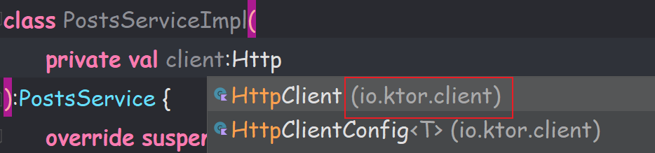

# Ktor-client

## 简介

.....


------


## 使用

[API网站](https://jsonplaceholder.typicode.com/)

### 添加依赖

在==应用级== `build.gradle` 文件里添加以下依赖：

```groovy
plugins{
    ...
    id 'org.jetbrains.kotlin.plugin.serialization'
}


dependencies{
    ....
    def ktor_version = "1.6.3"
	implementation "io.ktor:ktor-client-core:$ktor_version"
	implementation "io.ktor:ktor-client-android:$ktor_version"
	implementation "io.ktor:ktor-client-serialization:$ktor_version"
	implementation "io.ktor:ktor-client-logging:$ktor_version"
	implementation "ch.qos.logback:logback-classic:1.4.11"
	
	implementation "org.jetbrains.kotlinx:kotlinx-serialization-json:1.5.1"
}
```

在==项目级==`build.gradle` 文件里添加以下依赖：

```groovy
buildscript {
    dependencies {
        classpath "org.jetbrains.kotlin:kotlin-serialization:1.5.21"
    }
}
```

------

### 创建请求接口

和`Retrofit`的那个`Service`有点类似，同样也是写具体的请求方法接口，这里以获取帖子和发布帖子为例。

```kotlin
interface PostsService {
	//获取帖子
	suspend fun getPosts(): List<PostResponse>

	//发布帖子
	suspend fun createPost(postRequest: PostRequest): PostResponse?
}
```

### 创建接口实现类

注意这里的包名是`io.ktor.client`



```kotlin
class PostsServiceImpl(
    //声明HttpClient实例对象
	private val client: HttpClient
) : PostsService {
	override suspend fun getPosts(): List<PostResponse> {
		return try {
		      client.get { url(HttpRoutes.POSTS) }
		} catch (e: RedirectResponseException) {
		      // 3xx - response
		      println("Error ${e.response.status.description}")
		      emptyList()
		} catch (e: ClientRequestException) {
		      // 4xx - response
		      println("Error ${e.response.status.description}")
		      emptyList()
		} catch (e: ServerResponseException) {
		      // 5xx - response
		      println("Error ${e.response.status.description}")
		      emptyList()
		} catch (e: Exception) {
		      println("Error ${e.message}")
		      emptyList()
		}
	}
    
    ...
}
```

### 创建HttpClient对象

实际开发中如果使用到依赖注入（DI）可以添加到以来模块中，这里就简单的使用工厂模式构建对象，在 `PostsService` 接口中创建。

```kotlin
companion object {
	fun create(): PostsService {
		return PostsServiceImpl(
			client = HttpClient(Android) {//引擎使用Android平台的
                //安装对应的功能
				install(Logging) {
				      level = LogLevel.ALL
				}
				install(JsonFeature) {
				      serializer = KotlinxSerializer()
				}
			}
		)
	}
}
```


最后，如果因为包含了 `ktor-client` 和 `kotlinx-coroutines` 带来了编译问题，在 `build.gradle`内加入以下代码来解决:

```groovy
packagingOptions {
    exclude 'META-INF/kotlinx-io.kotlin_module'
    exclude 'META-INF/atomicfu.kotlin_module'
    exclude 'META-INF/kotlinx-coroutines-io.kotlin_module'
    exclude 'META-INF/kotlinx-coroutines-core.kotlin_module'
}
```