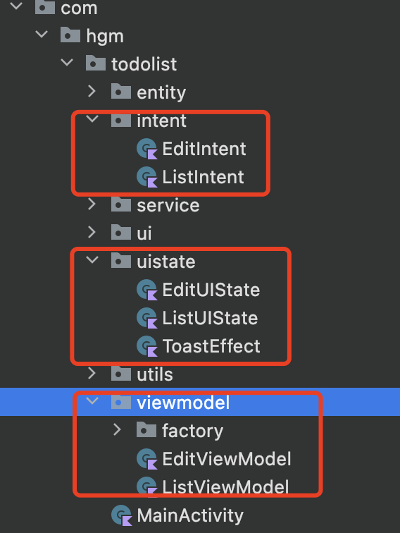
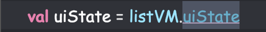
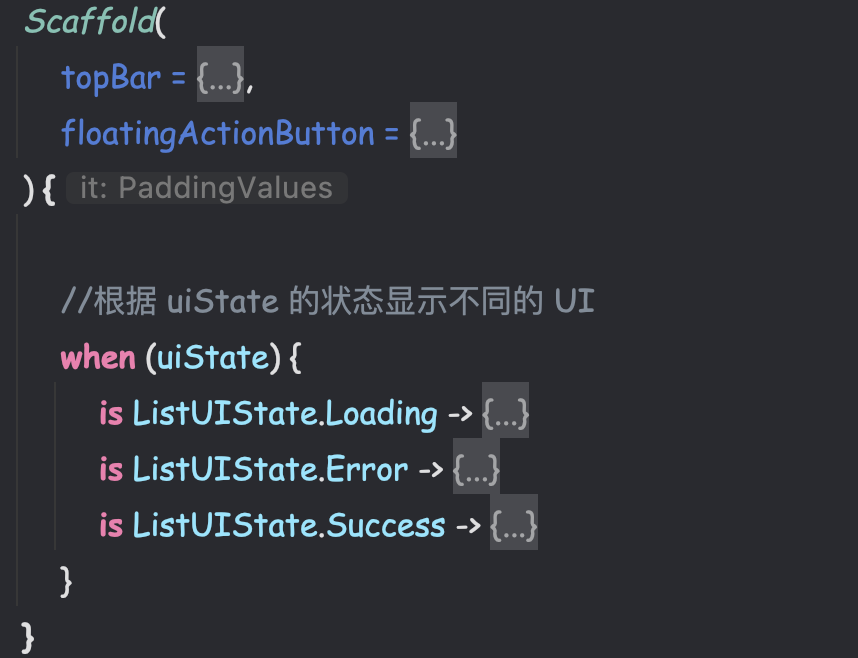

## MVI

### 前言

学习 MVI 架构之前，先复习一下以下知识：

* kotlin 响应式编程flow
   [https://juejin.cn/post/7034379406730592269](https://links.jianshu.com/go?to=https%3A%2F%2Fjuejin.cn%2Fpost%2F7034379406730592269)

* MVVM使用
   https://www.jianshu.com/p/f9d0688b241e

### 什么是MVI

MVI即 Model-View-Intent，它受Cycle.js前端框架的启发，提倡一种单向数据流的设计思想，非常适合数据驱动型的UI展示项目：

* **Model：**
  
  模型是应用程序的业务逻辑部分，负责处理数据和状态。设计模型时，需要考虑模型的数据结构、业务规则以及与外部数据源的交互，与其他 `MVVM` 中的 `Model` 不同的是，`MVI` 的 `Model` 主要指 ==UI状态（State）==、==ViewModel==、==Service==
  
* **View：**
  
  视图是用户界面的部分，负责显示数据和状态，并将用户的操作发送到意图部分。在 `MVI` 中，视图应该尽可能地简单，只负责显示数据和用户操作，而不应该包含业务逻辑。与架构中的View一致，`MVI `中的 `View` ==通过订阅Intent的变化== 实现界面刷新
  
* **Intent：**
  意图是用户操作的==抽象==表示，例如点击按钮、滑动屏幕等。在 `MVI` 中，意图应该是==不可变==的数据结构，并且应该与视图分离开来，以保持业务逻辑的清晰性。用户的任何操作（意图）都被包装成 `Intent` 后发送给 `Model` 进行数据请求

### 单向数据流

用户操作以Intent的形式通知Model => Model基于Intent更新State => View接收到State变化刷新UI。数据永远在一个环形结构中单向流动，不能反向流动：


**单向数据流结构的MVI的优缺点：**

* 优点
  * UI的所有变化来自State，所以只需聚焦State，架构更简单、易于调试
  * 数据单向流动，很容易对状态变化进行跟踪和回溯
  * state实例都是不可变的，确保线程安全
  * UI只是反应State的变化，没有额外逻辑，可以被轻松替换或复用

* 缺点
  * 所有的操作最终都会转换成State，所以当复杂页面的State容易膨胀
  * state是不变的，每当state需要更新时都要创建新对象替代老对象，这会带来一定内存开销
  * 有些事件类的UI变化不适合用state描述，例如弹出一个toast或者snackbar


### Compose项目实例

#### 项目结构

以待办事项App为例子



#### Intent

Intent 就是个枚举，而且是个特殊的枚举，在kotlin中可以通过 `sealed` 关键字来生成封闭类，这个关键字生成的密封类在 `when` 语句中可以不用写 `else` ，而且由于是封闭类，所以可以通过数据对象来实现各种操作。

**Intent（意图）代码如下：**

```kotlin
sealed class ListIntent {
		//用匿名对象获取待办事项数据
		object FetchList : ListIntent()
		
		//用数据类设置待办状态
		data class Done(val todo: Todo,val done:Boolean) : ListIntent()
}
```

如何使用Intent？这里涉及 Kotlin 的概念 ==Channel==

channel 本来是用来做协程之间通讯的，而我们的 view 层的触发操作和 viewModel 层获取数据这个流程恰巧应该是需要完全分离的，并且 channel 具备 flow 的特性，所以用 ==channel 来做 view 和 viewModel 的通讯非常适合==

**ViewModel中引入 Intent：**

```kotlin
class ListViewModel(dao: TodoDao) : ViewModel() {
  	//state
    var uiState by mutableStateOf<ListUIState>(ListUIState.Loading)
        private set
    //intent
    val listIntent = Channel<ListIntent>(Channel.UNLIMITED)

  
    //初始化的时候将 channel 的消费者绑定
    init {
        handleIntent()
    }


    /**
     *  注册消费者
     */
    private fun handleIntent() {
        viewModelScope.launch {
            //将Channel转化为flow，并且注册消费者
            listIntent.consumeAsFlow().collect{
                //这里的it和Channel<ListIntent>泛型保持一致，所以it是封闭类（特殊枚举类）
                when (it) {
                    is ListIntent.Done -> done(it.todo, it.done)
                    ListIntent.FetchList -> fetchList()
                }
            }
        }
    }
}
```

**在View中使用Intent：**

```kotlin
@Composable
fun ListScreen(onNavigateToEditor: (String) -> Unit) {
    val context = LocalContext.current
    val lifecycle = LocalLifecycleOwner.current
    val listVM: ListViewModel = viewModel(factory = TodoViewModelFactory(context = context))
    val toast = listVM.toast
    val uiState = listVM.uiState
    val coroutine = rememberCoroutineScope()


    LaunchedEffect(Unit) {
        listVM.listIntent.send(ListIntent.FetchList)//通过 listIntent 去传递意图给 Model
    }


    LaunchedEffect(toast) {
        lifecycle.repeatOnLifecycle(Lifecycle.State.STARTED) {
            toast.collect {
                when (it) {
                    is ToastEffect.Message -> {
                        Toast.makeText(context, it.content, Toast.LENGTH_SHORT).show()
                    }
                }
            }
        }
    }


    Scaffold(
        //....
    ) {
        //根据 uiState 的状态显示不同的 UI
        when (uiState) {
            is ListUIState.Loading -> {
                //....
            }
            is ListUIState.Error -> {
                //....
            }
            is ListUIState.Success -> {
                LazyColumn() {
                    items(uiState.list) { item ->
                        TodoItem(
                            todo = item,
                            onCheckedChange = {
                                coroutine.launch {
                                    //通过 listIntent 去传递意图给 Model
                                    listVM.listIntent.send(ListIntent.Done(item,it))
                                }
                            },
                            modifier = Modifier.clickable {
                                onNavigateToEditor(item.id)
                            }
                        )
                    }
                }
            }
        }
    }
}
```

#### State

state是个和Intent一样的枚举，但是不同的是intent是个事件流，state是个状态流

**定义和Intent差不多的封装类state：**

```kotlin
sealed class ListUIState {
    //加载态
    object Loading : ListUIState()

    //错误态
    data class Error(val msg: String) : ListUIState()

    //成功态
    data class Success(val list: List<Todo>):ListUIState()
}
```

**把 state 只提供外部读取不能修改，View通过 state 做不同的UI逻辑处理：**





> 完整MVI架构项目代码查看：TodoList（MVI） 、MVI