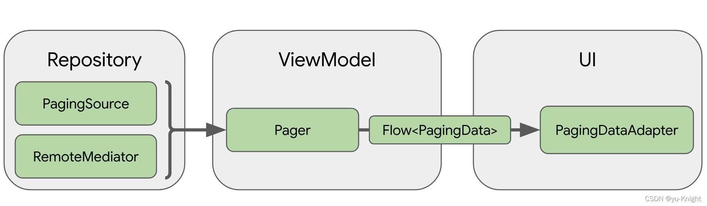
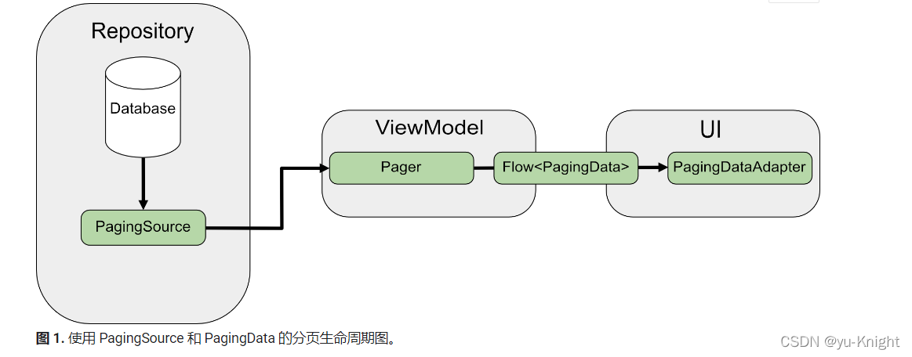
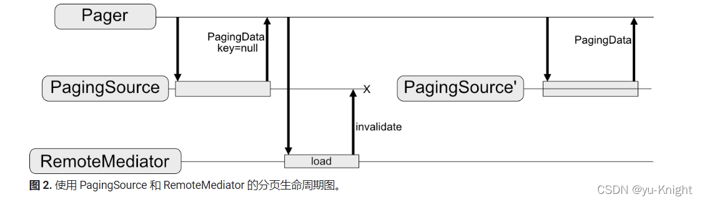
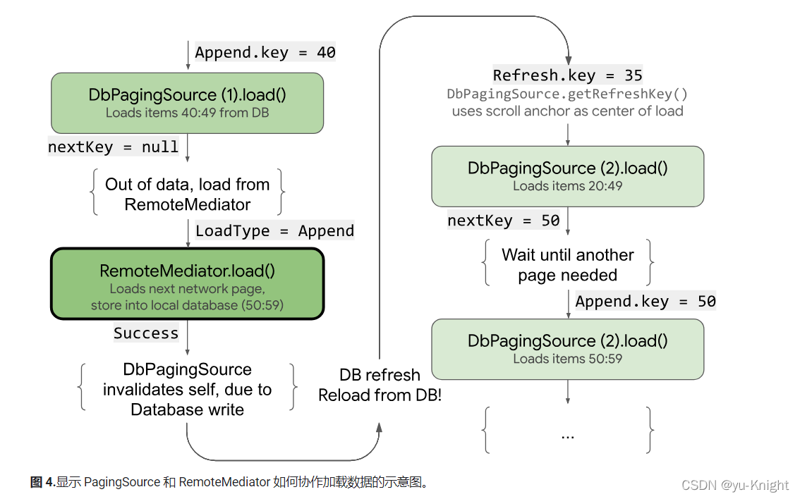
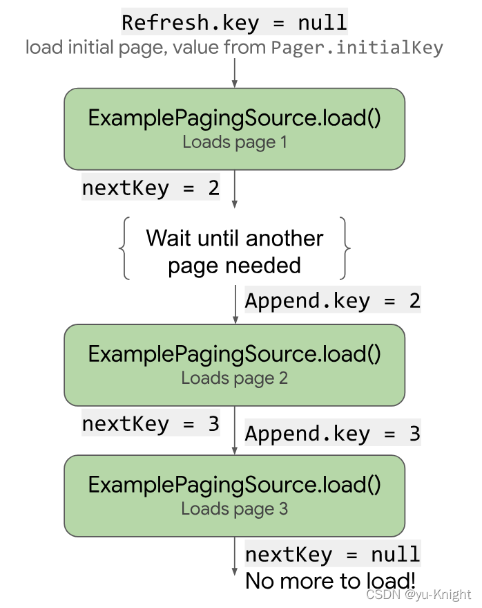

# Paging3

## 简介

`Paging` 库可帮助您==加载和显示来自本地存储或网络中更大的数据集中的数据页面==。此方法可让您的应用更==高效地利用网络带宽和系统资源==。Paging 库的组件旨在契合推荐的 `Android` 应用架构，流畅集成其他 Jetpack 组件，并提供一流的 Kotlin 支持。

### 优势

* 分页数据的内存中缓存。该功能可确保您的应用在处理分页数据时高效利用系统资源。
* 内置的请求重复信息删除功能，可确保您的应用高效利用网络带宽和系统资源。
* 可配置的 `RecyclerView` 适配器，会在用户滚动到已加载数据的末尾时自动请求数据。
* 对 `Kotlin` 协程和 `Flow` 以及 `LiveData` 和 `RxJava` 的一流支持。
* 内置对错误处理功能的支持，包括刷新和重试功能。

### 架构

`Paging` 库直接集成到推荐的 Android 应用架构中。该库的组件在应用的三个层运行：

- Repository 层

- ViewModel 层

- UI 层

  

***(1) Repository层：***

存储库层中的主要 Paging 库组件是 `PagingSource`。每个 PagingSource 对象都==定义了数据源==，以及如何从该数据源检索数据。PagingSource 对象可以从任何单个数据源（包括==网络来源==和==本地数据库==）加载数据。

您可能使用的另一个 Paging 库组件是 `RemoteMediator`。RemoteMediator 对象会==处理来自分层数据源==（例如具有本地数据库缓存的网络数据源）的分页。

***(2) ViewModel层：***

`Pager` 组件提供了一个公共 API，基于 `PagingSource` 对象和 `PagingConfig` 配置对象来构造在==响应式流==中公开的 `PagingData` 实例。

将 `ViewModel` 层连接到界面的组件是 `PagingData`。PagingData 对象是==用于存放分页数据快照的容器==。它会查询 `PagingSource` 对象并存储结果。

***(3) UI层：***

界面层中的主要 Paging 库组件是 `PagingDataAdapter`，它是一种处理分页数据的 `RecyclerView` 适配器。此外，您也可以使用随附的 `AsyncPagingDataDiffer` 组件来构建自己的s自定义适配器。

>  注意：如果您的应用对界面使用 Compose，请改为使用 androidx.paging:paging-compose 工件将 Paging 与您的界面层集成。如需了解详情，请参阅 collectAsLazyPagingItems() 的 API 文档。

### PagingSource

它是一个用于定义如何从数据源加载分页数据的关键接口

***（1）定义数据加载逻辑***

 "PagingSource" 用于描述从数据源（例如本地数据库或网络API）加载数据的方法。你需要实现 "PagingSource" 接口来定义如何获取分页数据。

***（2）分页逻辑***

 "PagingSource" 允许你控制如何进行分页，包括每一页的大小、如何获取数据以及如何处理分页的逻辑。你可以在 "PagingSource" 中定义数据加载的细节，例如如何在数据源中进行分页查询。

### RemoteMediator

用于协调从远程数据源（例如网络API）加载数据并将其保存到本地数据库的过程

***（1）远程调解器***

它负责协调从远程数据源加载数据并将其存储在本地数据库中。它的==作用是在每次需要加载新页面数据时，检查本地数据库中是否存在数据，如果不存在则从远程数据源获取数据并存储在本地==。

***（2）加载新数据***

当用户滚动到列表末尾时，Paging3 会触发 RemoteMediator，询问是否需要加载更多数据。RemoteMediator 可以检查数据库中的数据，确定是否需要从远程数据源获取新的数据页。

***（3）本地数据保持最新***

通过 RemoteMediator，你可以确保本地数据库中的数据始终保持最新，因为它会负责从远程数据源获取最新的数据并将其同步到数据库中。

### 两者关系

实际上，PagingSource 和 RemoteMediator 在功能上是有一些重叠的，但它们在数据加载的时机和用途上有所不同。

* PagingSource：主要用于从数据源（如数据库、网络API等）中加载==已经存在==的分页数据。
* RemoteMediator：主要用于从远程数据源（如网络API）加载尚==未在本地数据库中存在==的新数据。

两者既可以根据需求单独使用，也可以结合搭配，举一个搭配使用的例子：

两个页面（展示新闻列表、搜索新闻列表）

1. **展示列表**：可以使用 RemoteMediator 请求网络获取数据并加载到本地数据库
2. **搜索列表**：因为搜索的数据源来自本地，可以使用 PagingSource 获取数据，从而减少网络花销

------


## 使用

以下代码用 `Jetpack Compose` 作为示例

### 添加依赖库

```kotlin
plugins {
    ...
    id 'kotlin-kapt'
    id 'kotlin-android'
    id 'kotlinx-serialization'
    id 'dagger.hilt.android.plugin'
}

dependencies {
  //paging
	implementation 'androidx.paging:paging-compose:1.0.0-alpha14'
	//kotlin serialization
	implementation "org.jetbrains.kotlinx:kotlinx-serialization-json:1.3.0"
  //retrofit
	implementation 'com.squareup.retrofit2:retrofit:2.9.0'
	implementation 'com.squareup.retrofit2:converter-gson:2.9.0'
	implementation("com.jakewharton.retrofit:retrofit2-kotlinx-serialization-converter:0.8.0")

	//Room
	def room_version = "2.4.0"
	implementation "androidx.room:room-ktx:$room_version"
	annotationProcessor "androidx.room:room-compiler:$room_version"
	kapt "androidx.room:room-compiler:$room_version"
	implementation "androidx.room:room-paging:$room_version"
	implementation "androidx.room:room-runtime:$room_version"
  
  //Dagger - Hilt
  implementation "com.google.dagger:hilt-android:2.38.1"
  implementation "androidx.hilt:hilt-lifecycle-viewmodel:1.0.0-alpha03"
  kapt "com.google.dagger:hilt-android-compiler:2.37"
  kapt "androidx.hilt:hilt-compiler:1.0.0"
}
```

```kotlin
buildscript {
    ext {
        compose_ui_version = '1.1.1'
        kotlin_version = '1.6.0'
    }
    dependencies {
        classpath "com.google.dagger:hilt-android-gradle-plugin:2.38.1"
        classpath "com.android.tools.build:gradle:7.0.4"
        classpath "org.jetbrains.kotlin:kotlin-gradle-plugin:$kotlin_version"
        classpath "org.jetbrains.kotlin:kotlin-serialization:$kotlin_version"
    }
}
```

### 从网络和数据库加载数据

`网络加载`：是同时从网络和本地数据库加载页面。这样，您的应用就会从==本地数据库缓存驱动界面==，并且仅在数据库中==没有数据==时才向网络发出请求。

`数据库加载`：确保您的应用在==网络连接不稳定==或==用户离线时==也可以==正常使用==，从而提供更好的用户体验。

### 协调数据加载

`Paging` 库针对该用例提供了 `RemoteMediator` 组件。当应用的==已缓存数据用尽==时，`RemoteMediator` 会充当来自 `Paging` 库的==信号==。您可以使用此信号从网络加载更多数据并将其存储在本地数据库中，`PagingSource` 可以从本地数据库加载这些数据并将其提供给界面进行显示。

当需要更多数据时，`Paging` 库从 `RemoteMediator` 实现调用 `load()` 方法。这是一项挂起功能，因此可以放心地执行长时间运行的工作。此功能通常从网络源提取新数据并将其保存到本地存储空间。

此过程会处理新数据，但长期存储在数据库中的数据需要进行失效处理（例如，当用户手动触发刷新时）。这由传递到 `load()` 方法的 `LoadType` 属性表示。`LoadType` 会通知 `RemoteMediator` 是需要==刷新现有数据==，还是提取需要==附加（APPEND）==或==前置（PREPEND）==到现有列表的更多数据。

通过这种方式，`RemoteMediator` 可确保您的应用以适当的顺序加载用户要查看的数据。

### Paging 生命周期



直接从网络进行分页时，`PagingSource` 会加载数据并返回 `LoadResult` 对象。`PagingSource` 实现通过 `pagingSourceFactory` 参数传递给 `Pager`。

当界面需要新数据时，`Pager` 会从 `PagingSource` 调用 `load()` 方法并返回一个封装新数据的 `PagingData` 对象流。通常，每个 `PagingData` 对象都会先缓存在 `ViewModel` 中，然后再发送到界面进行显示。



`RemoteMediator` 会更改此数据流。`PagingSource` 仍会加载数据；但在分页数据耗尽时，`Paging` 库会触发 `RemoteMediator` 以从网络源加载新数据。`RemoteMediator` 会将新数据存储在本地数据库中，因此无需在 `ViewModel` 中使用内存缓存。最后，`PagingSource` 会使自身失效，而 `Pager` 会创建一个新实例以从数据库中加载新数据。

### 基础用法

`RemoteMediator` 实现有助于将来自==网络的分页数据加载到数据库中==，但不会直接将数据加载到界面中，而是会将数据库用作可信来源。换句话说，该应用仅显示已在数据库中缓存的数据。`PagingSource` 实现（例如，由 `Room` 生成的实现）可处理将缓存数据从数据库加载到界面的过程。

#### 创建Room实体

```kotlin
@Serializable
@Entity(tableName = UNSPLASH_IMAGE_TABLE)
data class UnsplashImage(
    @PrimaryKey(autoGenerate = false)
    val id: String,
    @Embedded
    val urls: Urls,
    val likes: Int,
    @Embedded
    val user: User
)
```

必须按照使用 `Room DAO` 访问数据中所述为此 `Room` 实体定义数据访问对象 (DAO)。该列表项实体的 `DAO` 必须包含以下方法：

* **insertAll()：** 用于将一系列项插入到表中
* 一个以查询字符串作为参数并返回结果列表的 `PagingSource` 对象的方法。这样，`Pager` 对象就可以将此表用作分页数据源。
* **clearAll()：** 用于删除表中的所有数据。

```kotlin
@Dao
interface UnsplashImageDao {

 		@Insert(onConflict = OnConflictStrategy.REPLACE)
    suspend fun insertAllImages(images: List<UnsplashImage>) 
    
  	@Query("SELECT * FROM unsplash_image_table")
    fun getAllImages(): PagingSource<Int, UnsplashImage>

    @Query("DELETE FROM unsplash_image_table")
    suspend fun clearAllImages()
}
```

#### 实现 RemoteMediator

`RemoteMediator` 的主要作用是：在 `Pager` 耗尽数据或现有数据失效时，从网络加载更多数据。它包含 `load()` 方法，您必须替换该方法才能定义加载行为。

**典型的 `RemoteMediator` 实现包括以下参数：**

* **query：**用于定义要从后端服务检索哪些数据的查询字符串。
* **database：**充当本地缓存的 Room 数据库。
* **networkService：**后端服务的 API 实例。

返回 `RemoteMediator<Key, Value>` 对象。Key 类型和 Value 类型应与针对同一网络数据源定义 `PagingSource` 时相同。

```kotlin
@ExperimentalPagingApi
class UnsplashRemoteMediator(
    private val unsplashApi: UnsplashApi,
    private val unsplashDatabase: UnsplashDatabase
) : RemoteMediator<Int, UnsplashImage>() {
  
  private val unsplashImageDao = unsplashDatabase.unsplashImageDao()
  private val unsplashRemoteKeysDao = unsplashDatabase.unsplashRemoteKeysDao()
  
  override suspend fun load(
    loadType: LoadType,
    state: PagingState<Int, UnsplashImage>
  ): MediatorResult {
    // ...
  }
}
```

`load()` 方法==负责更新后备数据集==以及使 `PagingSource` 失效。某些支持页面加载的库（例如 `Room`）会自动处理使其实现的 PagingSource 对象失效的过程。

**`load()` 方法接受以下两个参数：**

* **PagingState：**包含到目前为止已加载的页面、最近访问的索引以及用于初始化分页数据流的 `PagingConfig` 对象的相关信息。
* **LoadType：**指示加载的类型：`REFRESH`、`APPEND` 或 `PREPEND`。
  load() 方法的返回值是 `MediatorResult` 对象。`MediatorResult` 可以是 `MediatorResult.Error`（包含错误说明）或 `MediatorResult.Success`（包含指示是否有更多数据要加载的信号）。

**`load()` 方法必须执行以下步骤：**

1、根据加载类型和到目前为止已加载的数据，确定要从网络中加载哪个页面。
2、触发网络请求。
3、根据加载操作的结果执行操作：

* 如果加载成功且收到的项列表不是空的，则将相应的列表项存储到数据库中并返回 `MediatorResult.Success(endOfPaginationReached = false)`。存储数据后，使数据源失效，以通知 `Paging` 库新数据的存在。
* 如果加载成功并且接收到的项列表为空或为最后一页索引，则返回 `MediatorResult.Success(endOfPaginationReached = true)`。存储数据后，使数据源失效，以通知 Paging 库新数据的存在。
* 如果请求导致错误，则返回 `MediatorResult.Error`。

#### 定义 initialize 方法

`RemoteMediator` 实现还可以替换 `initialize()` 方法，以检查缓存的数据是否已过期，并决定是否触发远程刷新。此方法在执行任何加载之前运行，因此您可以在触发任何本地或远程加载之前操控数据库（例如，清除旧数据）。

由于 `initialize()` 是一个异步函数，因此您可以加载数据来确定数据库中现有数据的相关性。最常见的情况是缓存的数据仅在特定时间段内有效。`RemoteMediator` 可以检查此到期时间是否已失效，在这种情况下，`Paging` 库需要完全刷新数据。`initialize()` 实现应返回一个 `InitializeAction`，如下所示：

如果需要完全刷新本地数据，`initialize()` 应返回 `InitializeAction.LAUNCH_INITIAL_REFRESH`。这会使 `RemoteMediator` 执行远程刷新以完全重新加载数据。任何远程 `APPEND` 或 `PREPEND` 加载都会等待 `REFRESH` 加载成功，然后再继续。
如果本地数据不需要刷新，`initialize()` 应返回 `InitializeAction.SKIP_INITIAL_REFRESH`。这会使 `RemoteMediator` 跳过远程刷新并加载缓存的数据。

```kotlin
override suspend fun initialize(): InitializeAction {
  val cacheTimeout = TimeUnit.MILLISECONDS.convert(1, TimeUnit.HOURS)
  return if (System.currentTimeMillis() - db.lastUpdated() >= cacheTimeout)
  {
    // Cached data is up-to-date, so there is no need to re-fetch
    // from the network.
    InitializeAction.SKIP_INITIAL_REFRESH
  } else {
    // Need to refresh cached data from network; returning
    // LAUNCH_INITIAL_REFRESH here will also block RemoteMediator's
    // APPEND and PREPEND from running until REFRESH succeeds.
    InitializeAction.LAUNCH_INITIAL_REFRESH
  }
}
```

#### 创建 Pager

最后，您必须创建一个 `Pager` 实例来设置分页数据流。此过程与从简单的网络数据源创建 `Pager` 类似，但在以下两个方面不同：

* 您不能直接传递 `PagingSource` 构造函数，而必须提供从 `DAO` 返回 `PagingSource` 对象的查询方法。
* 您必须提供 `RemoteMediator` 实现的实例作为 `remoteMediator` 参数。

```kotlin
@OptIn(ExperimentalPagingApi::class)
class Repository @Inject constructor(
    private val unsplashApi: UnsplashApi,
    private val unsplashDatabase: UnsplashDatabase
) {

    // 获取网络图片
    fun getAllImages(): Flow<PagingData<UnsplashImage>> {
        return Pager(
            config = PagingConfig(pageSize = ITEMS_PER_PAGE),
            remoteMediator = UnsplashRemoteMediator(//远程调节器
                unsplashApi = unsplashApi,
                unsplashDatabase = unsplashDatabase
            ),
            pagingSourceFactory = { //分页源工厂
                unsplashDatabase.unsplashImageDao().getAllImages()
            }
        ).flow
    }
}
```

#### 处理竞态条件

您的应用从多个来源加载数据时，需要应对以下这种情况：本地已缓存的数据与远程数据源不同步。

当 `RemoteMediator` 实现中的 `initialize()` 方法返回 `LAUNCH_INITIAL_REFRESH` 时，数据会过时，必须替换为新数据。系统会强制任何 `PREPEND` 或 `APPEND` 加载请求等待远程 `REFRESH` 加载成功。由于 `PREPEND` 或 `APPEND` 请求在 `REFRESH` 请求之前排入队列，因此传递给这些加载调用的 `PagingState` 在运行时可能已经过期。

如果对已缓存数据的更改导致失效和提取新数据，您的应用可能会忽略冗余请求，具体取决于本地存储数据的方式。 例如，`Room` 会在插入任何数据时使查询失效。这意味着，将新数据插入数据库时，系统将向待处理的加载请求提供包含已刷新数据的新 `PagingSource` 对象。

解决此数据同步问题是确保用户看到最相关、最新的数据的关键所在。最佳解决方案主要取决于网络数据源对数据进行分页的方式。在任何情况下，您都可以使用远程键保存从服务器请求的最新页面的相关信息。您的应用可以使用此信息来识别和请求接下来要加载的正确数据页面。

#### 管理远程键

远程键供 `RemoteMediator` 实现用来告知后端服务==下一步要加载哪些数据==。在最简单的场景下，每一项分页数据都包含一个可供您轻松引用的远程键。不过，如果远程键不与单个项对应，则必须单独存储它们，并通过 `load()` 方法管理它们。

#### 项键

本部分介绍如何使用与各个项相对应的远程键。通常情况下，==当 API 密钥脱离单个项时，项 ID 会作为查询参数传递==。参数名称指示服务器应该在提供的 `ID` 之前还是之后响应项目。在 `Unsplash` 模型类的示例中，来自==服务器的 id 字段在请求其他数据时被用作远程键==。

当您的 `load()` 方法需要管理项专用的远程键时，这些键通常是从服务器提取的数据的 `ID`。==刷新操作不需要加载键，因为它们只检索最近的数据==。 

* **前置（PREPEND）操作：**不需要提取任何其他数据，因为刷新总是从服务器提取最新数据。
* **附加（APPEND）操作：**确实需要 ID。这要求您从数据库中加载最后一项，并使用其 ID 加载下一页数据。如果数据库中没有任何项目，则 `endOfPaginationReached` 设为 `true`，指示需要刷新数据。

```kotlin
@ExperimentalPagingApi
class UnsplashRemoteMediator(
    private val unsplashApi: UnsplashApi,
    private val unsplashDatabase: UnsplashDatabase
) : RemoteMediator<Int, UnsplashImage>() {

	// 获取数据库 dao 对象
	private val unsplashImageDao = unsplashDatabase.unsplashImageDao()
	private val unsplashRemoteKeysDao = unsplashDatabase.unsplashRemoteKeysDao()

	/*
	    load()方法负责更新后备数据集以及使 PagingSource 失效。某些支持页面加载的库（例如 Room）会自		  动处理使其实现的 PagingSource 对象失效的过程。
	*/
	override suspend fun load(
	    loadType: LoadType,
	    state: PagingState<Int, UnsplashImage>
	): MediatorResult {
	    return try {
				//根据加载类型和到目前为止已加载的数据，确定要从网络中加载哪个页面
				val currentPage = when (loadType) {
				    LoadType.REFRESH -> {
							//...
				    }
				    LoadType.PREPEND -> {
							//...
				    }
				    LoadType.APPEND -> {
							//...
				    }
				}
	
				// 网络请求数据列表
			  val response = unsplashApi.getAllImages(page = currentPage, perPage = ITEMS_PER_PAGE)
				// 标记分页结束 -- 如果列表为空说明分页结束，否则分页未结束
				val endOfPaginationReached = response.isEmpty()
				// 标记上下页
				val prevPage = if (currentPage == 1) null else currentPage - 1
				val nextPage = if (endOfPaginationReached) null else currentPage + 1	
        
        
				unsplashDatabase.withTransaction {
				    if (loadType == LoadType.REFRESH) {
				        unsplashImageDao.clearAllImages()
				        unsplashRemoteKeysDao.deleteAllRemoteKeys()
				    }					
				    // RemoteKey 列表数据
				    val keys = response.map { unsplashImage ->
				        UnsplashRemoteKeys(
				            id = unsplashImage.id,
				            prevPage = prevPage,
				            nextPage = nextPage
				        )
				    }					
				    //添加网络数据到本地数据库
				    unsplashImageDao.insertAllImages(images = response)
				    unsplashRemoteKeysDao.addAllRemoteKeys(remoteKeys = keys)
				}					
        
        
				//如果加载成功且收到的项列表不是空的，则将相应的列表项存储到数据库中并返回
				MediatorResult.Success(endOfPaginationReached = endOfPaginationReached)
        } catch (e: Exception) {
            return MediatorResult.Error(e)
        }
    }

    //获取最接近当前位置的 RemoteKey
    private suspend fun getRemoteKeyClosestToCurrentPosition(
        state: PagingState<Int, UnsplashImage>
    ): UnsplashRemoteKeys? {
        return state.anchorPosition?.let { position ->
            state.closestItemToPosition(position)?.id?.let { id ->
                unsplashRemoteKeysDao.getRemoteKeys(id = id)
            }
        }
    }

    //获取第一个 Item 的 RemoteKey
    private suspend fun getRemoteKeyForFirstItem(
        state: PagingState<Int, UnsplashImage>
    ): UnsplashRemoteKeys? {
        return state.pages.firstOrNull { it.data.isNotEmpty() }?.data?.firstOrNull()
            ?.let { unsplashImage ->
                unsplashRemoteKeysDao.getRemoteKeys(id = unsplashImage.id)
            }
    }

    //获取最后一个 Item 的 RemoteKey
    private suspend fun getRemoteKeyForLastItem(
        state: PagingState<Int, UnsplashImage>
    ): UnsplashRemoteKeys? {
        return state.pages.lastOrNull { it.data.isNotEmpty() }?.data?.lastOrNull()
            ?.let { unsplashImage ->
                unsplashRemoteKeysDao.getRemoteKeys(id = unsplashImage.id)
            }
    }
}
```

#### 添加远程键表

如果远程键未与列表项直接关联，最好将其存储在本地数据库内的单独表中。定义一个代表远程键表的 `Room` 实体：

```kotlin
@Entity(tableName = UNSPLASH_REMOTE_KEYS_TABLE)
data class UnsplashRemoteKeys(
    @PrimaryKey(autoGenerate = false)
    val id: String,
    val prevPage: Int?,
    val nextPage: Int?
)
```

您还必须为该 `RemoteKey` 实体定义一个 `DAO`：

```kotlin
@Dao
interface UnsplashRemoteKeysDao {
    @Insert(onConflict = OnConflictStrategy.REPLACE)
    suspend fun insertAllRemoteKeys(remoteKeys: List<UnsplashRemoteKeys>)

    @Query("SELECT * FROM unsplash_remote_keys_table WHERE id =:id")
    suspend fun getRemoteKeys(id: String): UnsplashRemoteKeys

    @Query("DELETE FROM unsplash_remote_keys_table")
    suspend fun clearAllRemoteKeys()
}
```

#### 使用远程键加载

当 `load()` 方法需要管理远程页面键时，您必须使用与 `RemoteMediator` 的基本用法不同的以下方式来定义它。

* 额外添加一个属性，用于存放对远程键表的 `DAO` 的引用。
* 通过查询远程键表（而不是使用 `PagingState`）确定下一步要加载哪个键。
* 除分页数据本身外，还要从网络数据源插入或存储返回的远程键。

```kotlin
@OptIn(ExperimentalPagingApi::class)
class ExampleRemoteMediator(
  private val query: String,
  private val database: RoomDb,
  private val networkService: ExampleBackendService
) : RemoteMediator<Int, User>() {
  val userDao = database.userDao()
  val remoteKeyDao = database.remoteKeyDao()

  override suspend fun load(
    loadType: LoadType,
    state: PagingState<Int, User>
  ): MediatorResult {
    return try {
      // The network load method takes an optional String
      // parameter. For every page after the first, pass the String
      // token returned from the previous page to let it continue
      // from where it left off. For REFRESH, pass null to load the
      // first page.
      val loadKey = when (loadType) {
        LoadType.REFRESH -> null
        // In this example, you never need to prepend, since REFRESH
        // will always load the first page in the list. Immediately
        // return, reporting end of pagination.
        LoadType.PREPEND -> return MediatorResult.Success(
          endOfPaginationReached = true
        )
        // Query remoteKeyDao for the next RemoteKey.
        LoadType.APPEND -> {
          val remoteKey = database.withTransaction {
            remoteKeyDao.remoteKeyByQuery(query)
          }

          // You must explicitly check if the page key is null when
          // appending, since null is only valid for initial load.
          // If you receive null for APPEND, that means you have
          // reached the end of pagination and there are no more
          // items to load.
          if (remoteKey.nextKey == null) {
            return MediatorResult.Success(
              endOfPaginationReached = true
            )
          }

          remoteKey.nextKey
        }
      }

      // Suspending network load via Retrofit. This doesn't need to
      // be wrapped in a withContext(Dispatcher.IO) { ... } block
      // since Retrofit's Coroutine CallAdapter dispatches on a
      // worker thread.
      val response = networkService.searchUsers(query, loadKey)

      // Store loaded data, and next key in transaction, so that
      // they're always consistent.
      database.withTransaction {
        if (loadType == LoadType.REFRESH) {
          remoteKeyDao.deleteByQuery(query)
          userDao.deleteByQuery(query)
        }

        // Update RemoteKey for this query.
        remoteKeyDao.insertOrReplace(
          RemoteKey(query, response.nextKey)
        )

        // Insert new users into database, which invalidates the
        // current PagingData, allowing Paging to present the updates
        // in the DB.
        userDao.insertAll(response.users)
      }

      MediatorResult.Success(
        endOfPaginationReached = response.nextKey == null
      )
    } catch (e: IOException) {
      MediatorResult.Error(e)
    } catch (e: HttpException) {
      MediatorResult.Error(e)
    }
  }
}
```

#### 就地刷新

如果您的应用只需要像前面的示例那样支持自列表顶部的网络刷新，您的 `RemoteMediator` 就不需要定义前置加载行为。

但是，如果您的应用需要支持将数据从网络逐步加载到本地数据库，您就必须支持从锚点（即用户的滚动位置）开始恢复分页。`Room` 的 `PagingSource` 实现会为您处理此情况，但如果您未使用 `Room`，也可以通过替换 `PagingSource.getRefreshKey()` 来实现此目的。 如需查看 `getRefreshKey()` 的实现示例，请参阅定义 `PagingSource`。

图 4 说明了先从本地数据库加载数据，然后在数据库中不再有数据后从网络加载数据的过程。



#### 定义数据源

第一步是定义用于标识数据源的 `PagingSource` 实现。`PagingSource API` 类包含 `load()` 方法，您必须替换该方法，以指明如何从相应数据源检索分页数据。

直接使用 `PagingSource` 类即可通过 `Kotlin` 协程进行异步加载。`Paging` 库还提供了支持其他异步框架的类：

如需使用 `RxJava`，请改为实现 `RxPagingSource`。
如需使用 `Guava` 中的 `ListenableFuture`，请改为实现 `ListenableFuturePagingSource`。
注意：如需将 `Paging` 库与 `RxJava` 或 `Guava` 一起使用，您必须添加其他依赖项。

#### 选择键和值类型

`PagingSource<Key, Value>` 有两种类型参数：`Key` 和 `Value`。键定义了用于加载数据的标识符，值是数据本身的类型。例如，如果您通过将 `Int` 页码传递给 `Retrofit` 来从网络加载各页 `User` 对象，应选择 `Int` 作为 `Key` 类型，选择 User 作为 `Value` 类型。

#### 定义 PagingSource

下面的示例实现了按页码加载各页对象的 `PagingSource`。`Key` 类型为 `Int`，`Value` 类型为 `Unsplash`。

```kotlin
class SearchPagingSource(
    private val unsplashApi: UnsplashApi,
    private val query: String
) : PagingSource<Int, UnsplashImage>() {

    override suspend fun load(params: LoadParams<Int>): LoadResult<Int, UnsplashImage> {
        val currentPage = params.key ?: 1

        return try {
            // 响应体
            val response = unsplashApi.searchImages(query = query, perPage = ITEMS_PER_PAGE)
            // 标记分页结束
            val endOfPaginationReached = response.images.isEmpty()
            if (response.images.isNotEmpty()) {
                LoadResult.Page(
                    data = response.images,
                    prevKey = if (currentPage == 1) null else currentPage - 1,
                    nextKey = if (endOfPaginationReached) null else currentPage + 1
                )
            } else {
                LoadResult.Page(
                    data = emptyList(),
                    prevKey = null,
                    nextKey = null
                )
            }
        } catch (e: Exception) {
            LoadResult.Error(e)
        }
    }

    override fun getRefreshKey(state: PagingState<Int, UnsplashImage>): Int? {
        return state.anchorPosition
    }

}
```

典型的 `PagingSource` 实现会将其构造函数中提供的参数传递给 `load()` 方法，以便为查询加载适当的数据。在上面的示例中，这些参数包括：

* **backend：**提供数据的后端服务实例。
* **query：**要发送到 backend 指示的服务的搜索查询。

`LoadParams` 对象包含有关要执行的加载操作的信息，其中包括要加载的键和要加载的项数。

`LoadResult` 对象包含加载操作的结果。`LoadResult` 是密封的类，根据 `load()` 调用是否成功，采用如下两种形式之一：

* 如果加载成功，则返回 `LoadResult.Page` 对象。
* 如果加载失败，则返回 `LoadResult.Error` 对象。
  图 1 说明了此示例中的 `load()` 函数如何接收每次加载的键并为后续加载提供键。



`PagingSource` 实现还必须实现 `getRefreshKey()` 方法，该方法接受 `PagingState` 对象作为参数，并且当数据在初始加载后刷新或失效时，该方法会返回要传递给 `load()` 方法的键。在后续刷新数据时，`Paging` 库会自动调用此方法。

#### 处理错误

数据加载请求可能因多种原因而失败，特别是在通过网络加载时。通过从 `load()` 方法返回 `LoadResult.Error` 对象，可报告在加载过程中遇到的错误。

例如，对于上一个示例，您可以通过向 `load()` 方法添加以下内容来捕获和报告 `ExamplePagingSource` 中的加载错误：

```kotlin
catch (e: IOException) {
  // IOException for network failures.
  return LoadResult.Error(e)
} catch (e: HttpException) {
  // HttpException for any non-2xx HTTP status codes.
  return LoadResult.Error(e)
}
```

`PagingSource` 会收集 `LoadResult.Error` 对象并将其传递给界面，以便您对其执行操作。如需详细了解如何在界面中显示加载状态，请参阅管理和显示加载状态。

#### 设置 PagingData 流

接下来，您需要来自 `PagingSource` 实现的分页数据流。通常，您应在 `ViewModel` 中设置数据流。`Pager` 类提供的方法可显示来自 `PagingSource` 的 `PagingData` 对象的响应式流。`Paging` 库支持使用多种流类型，包括 `Flow`、`LiveData` 以及 `RxJava` 中的 `Flowable` 和 `Observable` 类型。

当您创建 `Pager` 实例来设置响应式流时，必须为实例提供 `PagingConfig` 配置对象和告知 `Pager` 如何获取 `PagingSource` 实现实例的函数：

```kotlin
val flow = Pager(
  // Configure how data is loaded by passing additional properties to
  // PagingConfig, such as prefetchDistance.
  PagingConfig(pageSize = 20)
) {
  ExamplePagingSource(backend, query)
}.flow
  .cachedIn(viewModelScope)
```

```kotlin
//项目示例：
fun searchImages(query: String): Flow<PagingData<UnsplashImage>> {
    return Pager(
        config = PagingConfig(pageSize = ITEMS_PER_PAGE),
        pagingSourceFactory = {//分页源工厂
            SearchPagingSource(unsplashApi = unsplashApi, query = query)
        }
    ).flow
}
```

`cachedIn()` 运算符使数据流可共享，并使用提供的 `CoroutineScope` 缓存加载的数据。此示例使用 `Lifecycle lifecycle-viewmodel-ktx` 工件提供的 `viewModelScope`。

`Pager` 对象会调用 `PagingSource` 对象的 `load()` 方法，为其提供 `LoadParams` 对象，并接收 `LoadResult` 对象作为交换。

定义 `RecyclerView` 适配器
您还需要设置一个适配器来将数据接收到 `RecyclerView` 列表中。为此，`Paging` 库提供了 `PagingDataAdapter` 类。s

定义一个扩展 `PagingDataAdapter` 的类。在此示例中，`UserAdapter` 扩展了 `PagingDataAdapter`，用于为 `User` 类型的列表项提供 `RecyclerView` 适配器，并使用 `UserViewHolder` 作为 `ViewHolder`：

```kotlin
class UserAdapter(diffCallback: DiffUtil.ItemCallback<User>) :
  PagingDataAdapter<User, UserViewHolder>(diffCallback) {
  override fun onCreateViewHolder(
    parent: ViewGroup,
    viewType: Int
  ): UserViewHolder {
    return UserViewHolder(parent)
  }

  override fun onBindViewHolder(holder: UserViewHolder, position: Int) {
    val item = getItem(position)
    // Note that item may be null. ViewHolder must support binding a
    // null item as a placeholder.
    holder.bind(item)
  }
}
```

您的适配器还必须定义 `onCreateViewHolder()` 和 `onBindViewHolder()` 方法，并指定 `DiffUtil.ItemCallback`。这与定义 `RecyclerView` 列表 `Adapter` 时的通常做法相同：

```kotlin
object UserComparator : DiffUtil.ItemCallback<User>() {
  override fun areItemsTheSame(oldItem: User, newItem: User): Boolean {
    // Id is unique.
    return oldItem.id == newItem.id
  }

  override fun areContentsTheSame(oldItem: User, newItem: User): Boolean {
    return oldItem == newItem
  }
}
```

#### 在界面中显示分页数据

现在您已经定义了 `PagingSource`，为您的应用创建了生成 `PagingData` 流的方法，还定义了 `PagingDataAdapter`，接下来便可以将这些元素连接起来，在您的 `Activity` 中显示分页数据。

在 `Activity` 的 `onCreate` 或 `Fragment` 的 `onViewCreated` 方法中执行以下步骤：

创建 `PagingDataAdapter` 类的实例。
将 `PagingDataAdapter` 实例传递给您要显示分页数据的 `RecyclerView` 列表。
观察 `PagingData` 流，并将生成的每个值传递给适配器的 `submitData()` 方法。

```kotlin
val viewModel by viewModels<ExampleViewModel>()

val pagingAdapter = UserAdapter(UserComparator)
val recyclerView = findViewById<RecyclerView>(R.id.recycler_view)
recyclerView.adapter = pagingAdapter

// Activities can use lifecycleScope directly, but Fragments should instead use
// viewLifecycleOwner.lifecycleScope.
lifecycleScope.launch {
  viewModel.flow.collectLatest { pagingData ->
    pagingAdapter.submitData(pagingData)
  }
}
```

`RecyclerView` 列表现在会显示来自数据源的分页数据，并会在必要时自动加载另一个页面。

注意：`submitData()` 方法会挂起，并且直到 `PagingSource` 失效或调用适配器的刷新方法后才会返回。这意味着，`submitData()` 调用之后的代码的执行时间可能会显著晚于预期。

------


## 总结

参考博客：<br>https://yuknight.blog.csdn.net/article/details/123234730<br>https://blog.csdn.net/u014657752/article/details/123236467<br>https://yuknight.blog.csdn.net/article/details/123235016<br>https://yuknight.blog.csdn.net/article/details/123236703

参考Demo：<br>Paging3Hilt（图片列表App）
