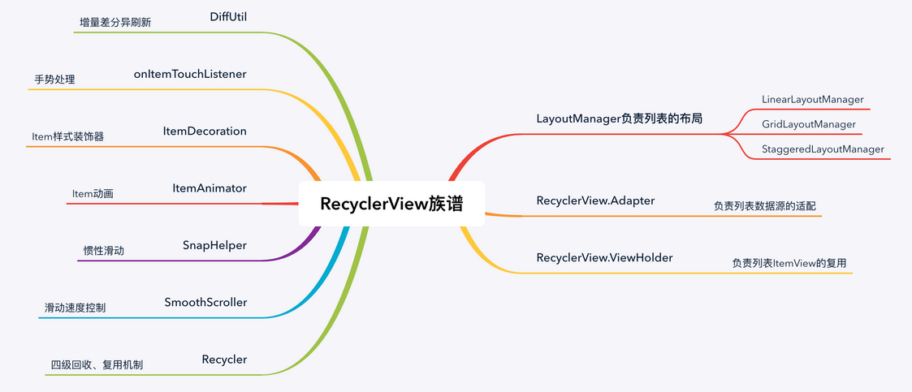
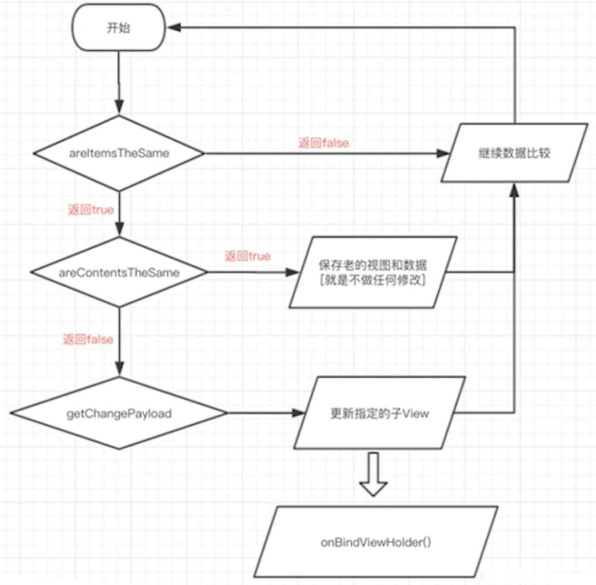
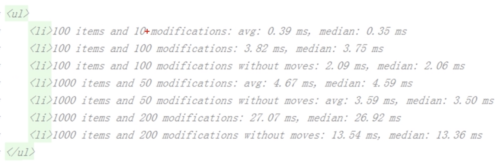
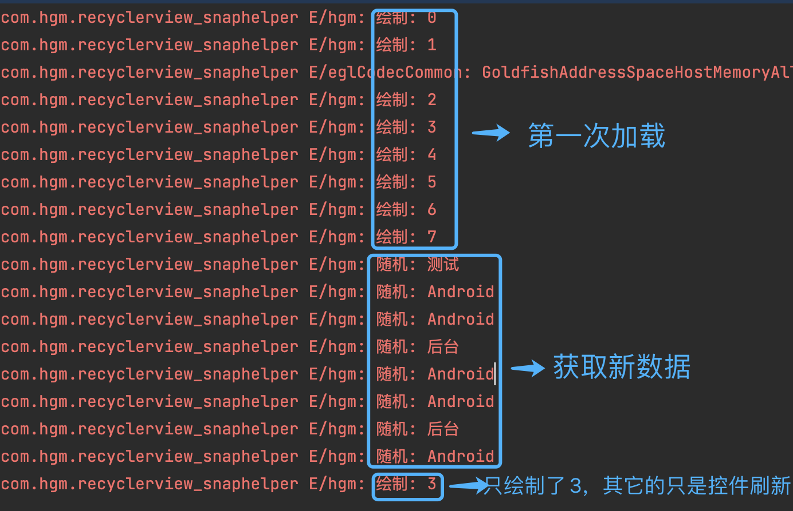
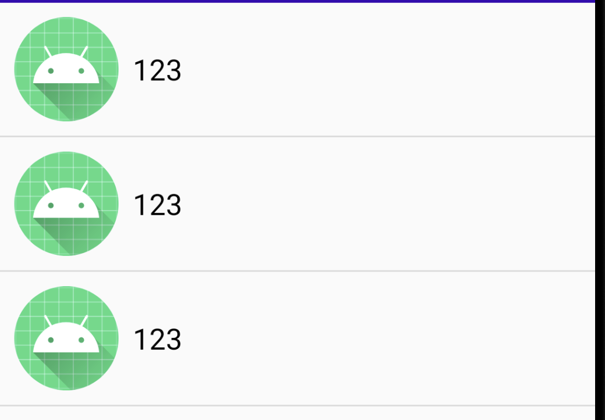

###  简介



------


### 简单使用

***1、xml代码如下：***

```xml
<?xml version="1.0" encoding="utf-8"?>
<LinearLayout xmlns:android="http://schemas.android.com/apk/res/android"
    xmlns:app="http://schemas.android.com/apk/res-auto"
    xmlns:tools="http://schemas.android.com/tools"
    android:layout_width="match_parent"
    android:layout_height="match_parent"
    tools:context=".MainActivity">

    <androidx.recyclerview.widget.RecyclerView
        android:id="@+id/recyclerView"
        android:layout_width="match_parent"
        android:layout_height="match_parent"/>

</LinearLayout>
```

***2、创建item子布局：***

```xml
<?xml version="1.0" encoding="utf-8"?>
<LinearLayout xmlns:android="http://schemas.android.com/apk/res/android"
    android:orientation="horizontal"
    android:layout_width="match_parent"
    android:gravity="center_vertical"
    android:padding="10dp"
    android:layout_height="wrap_content">

    <ImageView
        android:layout_width="wrap_content"
        android:layout_height="wrap_content"
        android:src="@mipmap/ic_launcher"/>


    <TextView
        android:id="@+id/text"
        android:layout_width="wrap_content"
        android:layout_height="wrap_content"
        android:text="123"
        android:layout_marginLeft="10dp"
        android:textColor="@color/black"
        android:textSize="20sp"/>

</LinearLayout>
```

***3、创建Adapter适配器：***

```kotlin
class MyAdapter :RecyclerView.Adapter<MyAdapter.MyViewHolder>(){
		
  	//复用
    inner class MyViewHolder(view:View) :RecyclerView.ViewHolder(view){
				...
    }

    //加载布局
    override fun onCreateViewHolder(parent: ViewGroup, viewType: Int): MyViewHolder {     
        val view = LayoutInflater.from(parent.context).inflate(R.layout.item_list, parent, false)
        return MyViewHolder(view)
    }

  	//数据与控件绑定
    override fun onBindViewHolder(holder: MyViewHolder, position: Int) {
        Log.e("hgm", "onBindViewHolder: ")
				....
    }

  	//一般为集合的size()
    override fun getItemCount(): Int {
        return 50
    }
}
```

***4、MainActivity里配置RecyclerView***

```kotlin
//初始化
binding.recyclerView.apply {
    adapter = MyAdapter()
    layoutManager =
        LinearLayoutManager(this@MainActivity, LinearLayoutManager.VERTICAL, false)
}
```

------


### 全局刷新

Adapter.notifyDataSetChanged()

***优点：***一行代码，简单方便

***缺点：***即使数据没有变化，也会刷新整个 RecyclerView 的可视区域，每个item都会重绘<br>    		无法出发 RecyclerView的item 动画，用户体验差

------


### 局部刷新

#### 刷新方式

局部刷新只会刷新指定的 position 的item，解决了上述简单粗暴的刷新方式的缺点，RecyclerView推出了局部刷新的方式：

* ***增：***Adapter.notifyItemRangeInserted
* ***删：***Adapter.notifyItemRangeRemoved
* ***改：***Adapter.notifyItemRangeChanged
* ***移：***Adapter.notifyItemRangeMoved


#### DiffUtil

为了配合RecyclerView使用，==通过比对新、旧两个数据集的差异==，生成旧数据到新数据的最小变动，然后对有变动的数据项，进行局部刷新。

***（1）DiffUtil.Callback：***

* getOldListSize()：旧数据集的长度；
* getNewListSize()：新数据集的长度；
* areItemsTheSame()：判断是否是同一个item；
* areContentsTheSame()：如果item相同，此方法用于判断是否同一个 Item 的内容也相同；
* getChangePayload() ：如果item相同内容不同，就会调用此方法，具体到控件的刷新，默认返回null，即整个item刷新


***（2）使用方法：***

* 实现DiffUtil.Callback；
* 新老数据集通过 DiffUtil.calculateDiff 计算得到 DiffUtil.DiffResult；
* 通过DiffUtil.DiffResult调用 dispatchUpdatesTo() 刷新数据；

```kotlin
/**
 * 使用DiffUtil
 */
class MyDiffUtil(var oldList: List<User>, var newList: List<User>) :
    DiffUtil.Callback() {//继承DiffUtil.Callback

    //旧的数据集
    override fun getOldListSize(): Int {
        return oldList.size
    }

    //新的数据集
    override fun getNewListSize(): Int {
        return newList.size
    }

    //判断是否同一个item
    override fun areItemsTheSame(oldItemPosition: Int, newItemPosition: Int): Boolean {
        val oldItem = oldList[oldItemPosition]
        val newItem = newList[newItemPosition]
        //一般选具有唯一性的属性来对比Item
        return oldItem.id == newItem.id
    }

    //判断同一个item的内容是否相同
    override fun areContentsTheSame(oldItemPosition: Int, newItemPosition: Int): Boolean {
        val oldItem = oldList[oldItemPosition]
        val newItem = newList[newItemPosition]
        //当item返回true时，选取其他属性对比
        if (!TextUtils.equals(oldItem.name, newItem.name)) {
            return false
        }
        if (!TextUtils.equals(oldItem.job, newItem.job)) {
            return false
        }
        return true
    }

    //（如果需要细化到控件的刷新重写此方法）
    //当areContentsTheSame返回false时，才会调用这个方法
    //override fun getChangePayload(oldItemPosition: Int, newItemPosition: Int): Any? {
    //    val oldItem = oldList[oldItemPosition]
    //    val newItem = newList[newItemPosition]
		//
    //    //如果内容不相同，把新数据存入Bundle
    //    val bundle = Bundle()
    //    if (!TextUtils.equals(oldItem.name, newItem.name)) {
    //        bundle.putString("name", newItem.name)
    //    }
    //    if (!TextUtils.equals(oldItem.job, newItem.job)) {
    //        bundle.putString("job", newItem.job)
    //    }
    //    return bundle //返回的就是item改变的内容
    //}
}
```

```kotlin
var diffResult = DiffUtil.calculateDiff(MyDiffUtil(list, newList))//两个数据集开始比较
list = newList//更新数据
mAdapter.setData(newList)
diffResult.dispatchUpdatesTo(mAdapter)

//注意：比较代码必须写在更新数据前，不然数据相等没有对比意义
```

配合使用适配器里的 override fun onBindViewHolder(holder: MyViewHolder, position: Int, payloads: MutableList<Any>) 方法，第三个参数包含了我们在 getChangePayload() 返回的Any从而完成定向刷新

```kotlin
override fun onBindViewHolder(holder: MyViewHolder, position: Int, payloads: MutableList<Any>) {
    //payloads为null，整条item刷新
    if (payloads.isEmpty()) {
        super.onBindViewHolder(holder, position, payloads)
    } else {//不会更新整个item 更新指定的控件
        var bundle = payloads[0] as Bundle
        var name = bundle.getString("name")
        var job = bundle.getString("job")
        //更新ui
        if (!TextUtils.isEmpty(name)) {
            holder.name.text = name
        }
        if (!TextUtils.isEmpty(job)) {
            holder.job.text = job
        }
    }
}
```

***（3）运行流程：***




#### AsynListDiffer

由于 Diffutil 同步处理大量数据时可能会造成耗时、ANR问题，所以衍生出 AsynListDiffer 异步方案。



***使用步骤：***

* 实现DiffUtil.ItemCallback，给出差异性计算条件
* 将所有对数据的操作代理给 AsynListDiffer
* 使用 submitList() 更新数据，并刷新ui

```kotlin
/**
 * 使用AsynListDiffer
 */
class MyDiffUtil2 : DiffUtil.ItemCallback<User>() {

    override fun areItemsTheSame(oldItem: User, newItem: User): Boolean {
        return oldItem.id == newItem.id
    }

    override fun areContentsTheSame(oldItem: User, newItem: User): Boolean {
        if (!TextUtils.equals(oldItem.name, newItem.name)) {
            return false
        }
        if (!TextUtils.equals(oldItem.job, newItem.job)) {
            return false
        }
        return true
    }

    override fun getChangePayload(oldItem: User, newItem: User): Any? {
        val bundle = Bundle()
        if (!TextUtils.equals(oldItem.name, newItem.name)) {
            bundle.putString("name", newItem.name)
        }
        if (!TextUtils.equals(oldItem.job, newItem.job)) {
            bundle.putString("job", newItem.job)
        }
        return bundle
    }
}
```

```kotlin
class MyAdapter2(var context: Context) : RecyclerView.Adapter<MyAdapter2.MyViewHolder>() {

    var asyncListDiffer: AsyncListDiffer<User> = AsyncListDiffer(this, MyDiffUtil2())

    fun setData(newList: List<User>) {
        asyncListDiffer.submitList(newList)//代理对数据的操作
    }

    inner class MyViewHolder(view: View) : RecyclerView.ViewHolder(view) {
        val name: TextView = view.findViewById(R.id.name)
        val job: TextView = view.findViewById(R.id.job)
    }

    override fun onCreateViewHolder(parent: ViewGroup, viewType: Int): MyViewHolder {
        val view = LayoutInflater.from(context).inflate(R.layout.item_list2, parent, false)
        return MyViewHolder(view)
    }
		
    override fun onBindViewHolder(holder: MyViewHolder, position: Int, payloads: MutableList<Any>) {
        //payloads为null，整条item刷新
        if (payloads.isEmpty() || payloads.size <= 0) {
            super.onBindViewHolder(holder, position, payloads)
        } else {
            //不会更新整个item 更新指定的控件
            var bundle = payloads[0] as Bundle
            var name = bundle.getString("name")
            var job = bundle.getString("job")
            //更新ui
            if (!TextUtils.isEmpty(name)) {
                holder.name.text = name
            }
            if (!TextUtils.isEmpty(job)) {
                holder.job.text = job
            }
        }
    }

    override fun onBindViewHolder(holder: MyViewHolder, position: Int) {
        Log.e("hgm", "绘制: $position")
        val user = getItem(position)
        holder.name.text = user.name
        holder.job.text = user.job
    }

    private fun getItem(position: Int): User {
        return asyncListDiffer.currentList[position]
    }

    override fun getItemCount(): Int {
        return asyncListDiffer.currentList.size
    }
}
```

```kotlin
class MainActivity : AppCompatActivity() {

    private val binding: ActivityMainBinding by lazy {
        ActivityMainBinding.inflate(layoutInflater)
    }
    private lateinit var mAdapter2: MyAdapter2
    private lateinit var list: ArrayList<User>
    private lateinit var jobArray: Array<String>

    override fun onCreate(savedInstanceState: Bundle?) {
        super.onCreate(savedInstanceState)
        setContentView(binding.root)

        //准备数据
        list = arrayListOf<User>()
        jobArray = arrayOf("Android", "产品经理", "测试", "后台", "前端", "Java", "C")
        for (i in 0..7) {
            list.add(User(i, "用户${i}", jobArray[0]))
        }

        //初始化RecyclerView
        mAdapter2 = MyAdapter2(this)
        mAdapter2.setData(list)
        binding.recyclerView.apply {
            adapter = mAdapter2
            layoutManager =
                LinearLayoutManager(this@MainActivity, LinearLayoutManager.VERTICAL, false)
            addItemDecoration(
                DividerItemDecoration(
                    this@MainActivity,
                    DividerItemDecoration.VERTICAL
                )
            )
        }

        //点击刷新（模拟网络请求获取新数据）
        binding.refresh.setOnClickListener {
            var newList = arrayListOf<User>()
            for (i in 0..7) {
                var desc = ""
                desc = if (i % 3 == 0) {
                    jobArray[Random.nextInt(jobArray.size)]
                } else {
                    jobArray[0]
                }
                newList.add(User(i, "用户$i", desc))
                Log.e("hgm", "随机: $desc")
            }
            if (list.size % 2 == 0) {
                newList.add(3, User(100, "用户100", jobArray[1]))
            }

            list = newList//更新数据
            mAdapter2.setData(newList)//把新数据传入adapter即可，适配器会把数据交给 AsynListDiffer 处理
        }
    }
}
```

***log打印：***



==具体效果查看项目：RecyclerView_Refresh==

------


### Item样式装饰器

当我们配置RecyclerView之后，每个item之间是连着的，且没有分割线

***使用系统分割线：***

```kotlin
addItemDecoration(DividerItemDecoration(this@MainActivity , DividerItemDecoration.VERTICAL))
```



***修改分割线颜色，修改values的themes.xml文件，添加以下代码：***

```xml
<item name="android:listDivider">@color/colorAccent</item>
```

------


### 惯性滑动

==SnapHelper== 是 RecyclerView 官方实现的处理惯性滑动（Fling）的帮助类，目前有 ==LinearSnapHelper== 和 ==PagerSnapHelper== 两个官方实现。它们各自提供的功能略有不同。 两者都支持水平和垂直方向。

***LinearSnapHelper：***

适用于较小的项目，并将目标子视图的中心对齐到 RecyclerView 的中心：

```kotlin
//直接在Activity配置
val snapHelper = LinearSnapHelper()
snapHelper.attachToRecyclerView(binding.recyclerView)
```


***PagerSnapHelper：***

适用于全屏项目，其行为类似于ViewPager：

注意： 需要将放入 RecyclerView 的子视图设置为宽高 `MATCH_PARENT`

```kotlin
//直接在Activity配置
val snapHelper2 = PagerSnapHelper()
snapHelper2.attachToRecyclerView(binding.recyclerView)
```


### 滑动

滑动到指定位置，并且有滚动动画效果：

```kotlin
recyclerView.smoothScrollToPosition(position);
```

