# Android存储图文详解

## 简介

### 存储分类

1. **INTERNAL STORAGE（内部存储）**：设备内部的存储介质，用于存放应用程序数据、设置等。私有数据和文件存储在应用专属目录中。对其他应用不可见，确保了隐私和安全性。
2. **EXTERNAL STORAGE（外部存储）**：可移除的存储介质，用于存放媒体文件等。访问外部存储受到权限控制，Android 11 后引入 Scoped Storage，限制了直接访问。

​	每个应用程序在==内部存储==中都有自己的==私有目录==，并且此目录对其他应用程序都不可见。<br>	除了私有目录之外，其他所有内容都被视为共享或外部存储

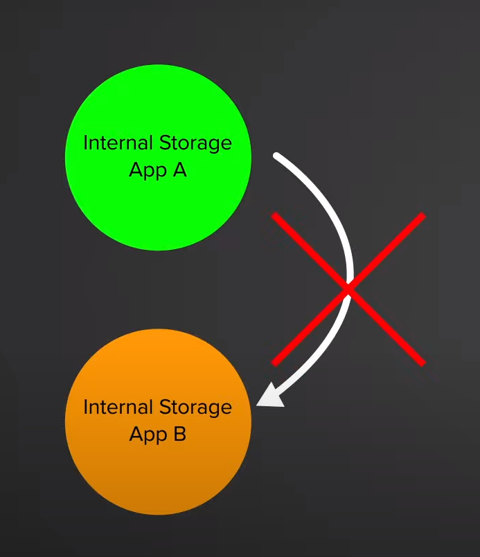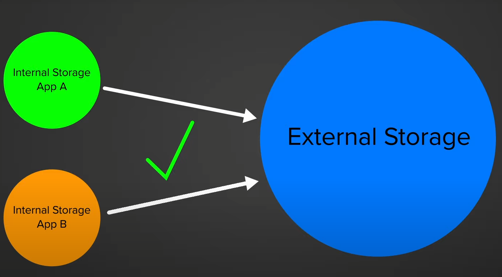

**外部存储最主要的问题：**

1. 很多App需要读取外部存储权限，但大多数只用它做简单的事情，他们不需要访问整个存储
2. 他们可以将文件留在外部存储的某个位置，当它们被卸载时，它们仍然占用着空间

------

### Android 版本的存储变化

1. **Android 10：** 引入 Scoped Storage，加强外部存储的隐私和安全。限制应用对外部存储的直接访问权限，推动应用适应 Scoped Storage。
2. **Android 11：** 进一步强化 Scoped Storage。应用无法访问其他应用数据的绝大部分，需要使用特定的 API （MediaStore）进行访问。

Scoped Storage（作用域存储）很好的解决了这两个问题，让系统知道哪些App创建了哪些文件，一旦卸载App，这些文件也随即跟着被删除。

而且每个App都可以完全访问共享存储中自己的目录，并且每个App都可以在未经许可的情况下将媒体文件保存在集合中。如果我们想修改不属于我们的文件，那么我们可以创建 `createWriteRequest`（写入请求）和 `createDeleteRequest`（删除请求）函数来执行此操作，使用这些函数可以更改很多文件，但是需要用户的批准。

我们也可以将文件放入垃圾箱，垃圾箱的文件不会立马删除而是在30天后删除，在此之前可以恢复文件。

>  总结：作用域存储可以提供用户的隐私，虽然限制了开发者的自由

### 相关API

* **内部存储：**

  * getFilesDir()：获取应用专属内部存储目录
  * getCacheDir：获取应用专属内部缓存目录
  * openFileInput()、openFileOutput()：用于读写应用内部文件

* **外部存储：**

  * Environment.getExternalStorageDirectory()：获取外部存储根目录
  * Environment.getExternalStoragePublicDirectory()：获取公共外部存储目录

* **Scoped Storage：**

  * MediaStore类：用于访问设备上的媒体文件

  * MediaStore.Images.Media.getContentUri(MediaStore.VOLUME_EXTERNAL)、MediaStore.Images.Media.EXTERNAL_CONTENT_URI：获取外部存储卷的内容 URI

    <!-- getContentUri是Android11引入的，在低版本使用EXTERNAL_CONTENT_URI-->

* **Content Provider：**

  * ContentResolver：用于与内容提供者进行交互，进行查询、插入、更新和删除操作

------


## 存储空间

### 空间划分

在 Android 4.4 之前的设备存储由两部分组成（手机自身存储、外置SD卡）。以前老旧设备的存储空间不大，除了手机自身存储的空间（内部存储）还有需要外置SD卡的支持（外部存储）。

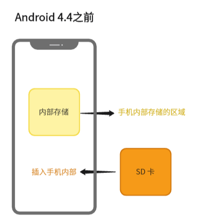

 在 Android 4.4 之后的设备中，手机发展升级机身存储不断扩展，将之前手机自身存储空间从概念上分成了内部存储（Internal Storage) 和外部存储（External Storage) 两部分，其实它们是属于同一块存储空间。我们依然可以插入 SD 卡来增加存储空间，这里称为外置的外部存储，只不过已经不常用了。

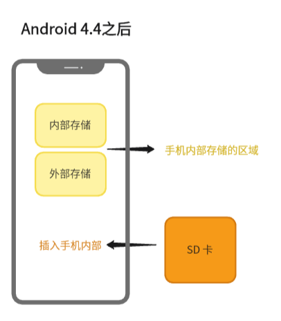

------

### 内部存储

在介绍内部存储之前，可能很多人会感到很晕与内存傻傻分不清，其实这是两个概念。内部存储是用于数据持久化的，比如我们退出应用或者重启手机然后打开应用会发现数据还会存在，没有丢失。所以内部存储属于 `ROM`

而内存是临时存储运行中程序和数据的地方，它用于存放正在运行的应用程序、操作系统、临时数据等等，在退出应用或者断电后数据会清除，所以属于 `RAM`

内部存储在Android系统中的根目录为 `/data/data/`，这个目录用户是看不到也无权访问，只有手机root之后才可以查看，在开发中我们可以查看虚拟机的内部存储目录，在Android Studio找到Device File Explorer即可看到。

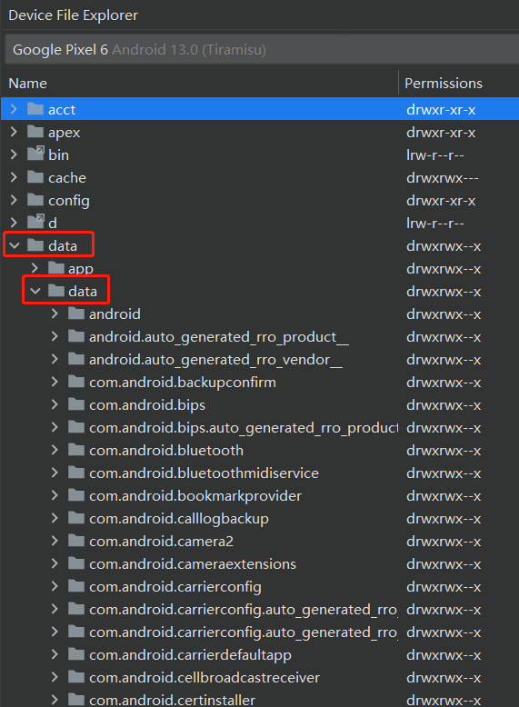

从这幅图可以看到，目录里面的文件都是以包名命名，每个应用都有属于自己的内部存储文件，这个文件是是根据应用的安装自动生成的，也会因为应用卸载而随机删除，并且文件是私有的只能内部访问，其它应用是无权限访问的。

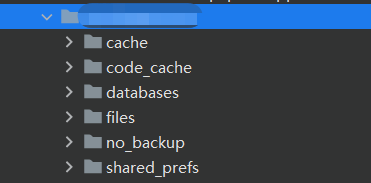

具体应用的内部存储文件如上图所示：每一个文件都有它的作用，因为应用是私人项目有部分技术没用上所以文件没有显示完全。下面介绍每个文件的具体作用：

* **cache：**主要用于存储应用产生的缓存数据
* **code_cacha：**存放运行时代码优化等产生的缓存
* **databases：**主要用于存储数据库类型的数据
* **files：**可以在该目录下存储文件
* **shared_prefs：**用于存储SharedPreference文件
* **lib：**存放App依赖的so库
* **app_webview**：用于存储webview加载过程中的数据，如Cookie，LocalStorage等

------

### 外部存储

外部存储相较于内部存储就好理解多了，毕竟能让真正的看到嘛！一般手机都内置了文件管理应用，里面看到的内容就是外部存储空间，外部存储的根目录为 `storage` （定制的系统可能不一致），在Android Studio可以进行查看。在文件管理应用里查看，所有文件都是对应上的。

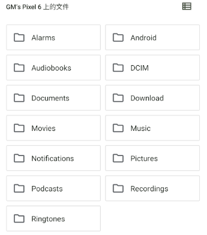

和内部存储不同的是外部存储分为三种类型：==私有目录==、==公共目录==、==其他目录==，私有目录属于外部存储中的私有存储空间，而另外两个属于共享空间。那三种类型如何区分呢，接着往下看....

* **私有目录：**在上图点开Android文件再点开里面的data文件，里有都是由包名组件的文件夹，这些就是外部存储里的私有目录。
* **公共目录：**DCIM、Download、Music、Movies、Pictures、Ringtones 等这种系统为我们创建的文件夹可以所有应用共享，这些就是公共目录。
* **其他目录：**除了私有和公共目录外，比如各大App自己创建的目录，如QQ的目录：com.tencent.mobileqq。

通常来说，应用涉及到的持久化数据分为两类：==应用相关数据==和==应用无关数据==。前者是指专供宿主 App 使用的数据信息，比如一些应用的配置信息，数据库信息，缓存文件等。当应用被卸载，这些信息也应该被随之删除，避免存储空间产生不必要的占用，适合放到（内部存储或外部存储）==“私有目录”==。

后者更偏向于这类信息：当应用被卸载，用户仍然希望保留于设备当中的信息。常见如，拍照类应用的图片文件，用户是使用浏览器手动下载的文件等。应用无关数据应该是宿主应用希望与其他应用共享的数据，适合存放在外部存储空间的==“公共目录”==或==“其他目录”==。

------

### 两者区别

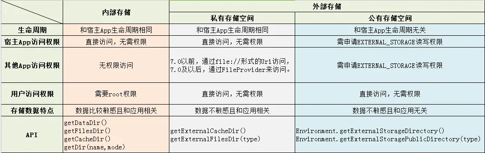

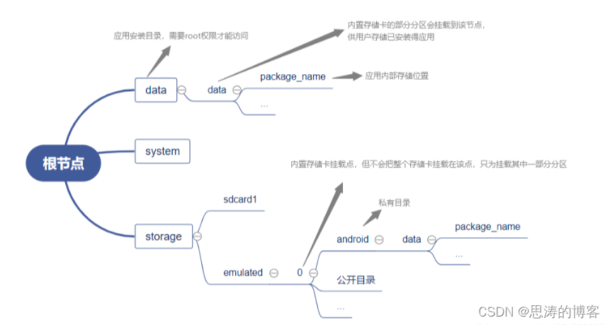

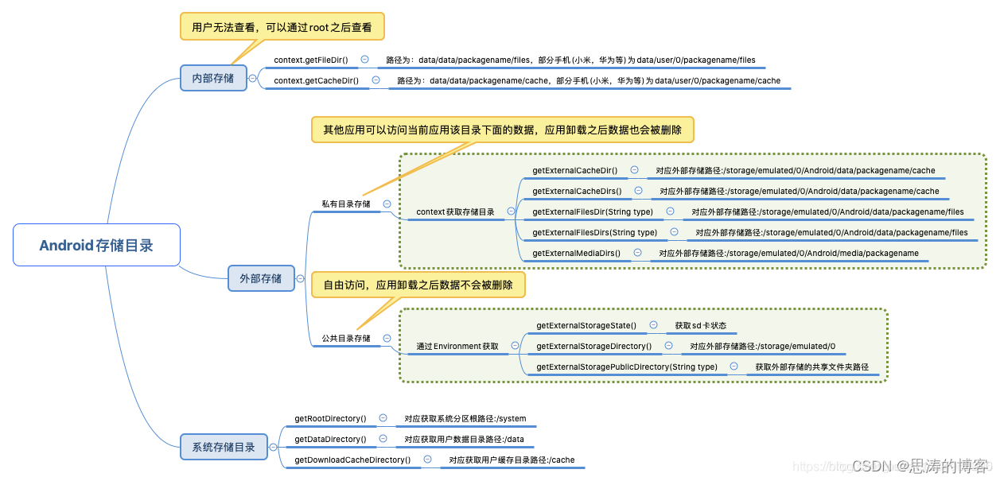

输入流：只能从中读取数据，而不能向其写入数据，由InputStream和Reader作为基类。
输出流：只能向其写入数据，而不能从中读取数据。由OutputStream和Writer作为基类。

相关博客：

[android内部存储和外部存储](https://blog.csdn.net/xiaopangcame/article/details/131317717)

[Android内部存储与外部存储图文详解](http://wed.xjx100.cn/news/204831.html?action=onClick)

------


## 访问文件

### 文件来源

Android系统每次开机都会扫描所有的文件并分类存入数据库，该数据库文件存放在 `/data/data/com.android.providers.media/databases` 或者 `/data/data/com.android.providers.media.module/databases` 目录中。这个数据库文件存放两个数据库文件分为别 `internal.db（内部存储数据库文件）` 和 `external.db（外部存储数据库文件）` ，因此可以访问这两个文件获取媒体文件（文件、图片、音频等等），而不必遍历所有的媒体来获取。

### 文件操作

但是Android设备是禁止应用直接对这两个文件进行数据操作的，而是通过 `ContentProvider` 把数据提供出去，如果应用需要对数据进行操作就要使用 `ContentResolver` 结合Uri进行调用。

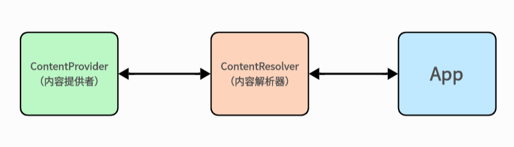

`ContentResolver` 扮演着通信者角色，应用可以通过它的 `Insert、Delete、Query、Update` 方法操作系统的文件。`ContentProvider` 将其存储的数据以==数据表的形式==提供给访问者，在数据表中每一行为一条记录，每一列为具有特定类型和意义的数据。每一条数据记录都包括一个 “_ID” 数值字段，该字段唯一标识一条数据。

`ContentResolver` 是通过Uri来查询 `ContentProvider` 中提供的数据的。所以必须要知道内容提供者的Uri，在正确得到Uri之后，就可以通过ContentResolver对象来操作ContentProvider中的数据了。

**ContentProvider使用的Uri语法结构如下：**

```kotlin
content: //media/external/images/media
```

**获取Uri的方法：**

```kotlin
MediaStore.Images.Media.getContentUri(MediaStore.VOLUME_EXTERNAL)//第一种
MediaStore.Images.Media.EXTERNAL_CONTENT_URI//第二种
```

**每一种媒体文件有两种地址描述方式：**

1. ContentProvider是用来存储和获取公共数据的统一接口，Content Provider为每一类资源分配了URI地址比如图片的Uri地址就包括 `MediaStore.Images.Media.INTERNAL_CONTENT_URI` 和`MediaStore.Images.Media.EXTERNAL_CONTENT_URI` 这两个地址，其值分别是`content://media/internal/images/media` 和 `content://media/external/images/media`，对应内部库和外部库地址。每一张图片的地址基本上是上面的基础URL地址下加上图片的内部ID。例如外部存储上的图片ID为52，其对应的Uri地址就是 `content://media/external/images/media/52`
2. 另外一种描述文件地址标识就是传统的文件路径模式了。比如一张存储卡上的图片地址可能描述为：`/mnt/sdcard/images/52.jpg`。其实这个路径存储在文件储存库中的data字段中，有了这点关联，可以在这两种模式下进行任意切换。

**MediaStore内部类：**

* class MediaStore.Audio：所有音频内容的类。
* class MediaStore.Files：文件储存库中所有文件的索引，包括非媒体文件和媒体文件类。
* class MediaStore.Images：所有图片内容的类。
* interface MediaStore.MediaColumns：文件储存库中表的公共字段。
* class MediaStore.Video：所有视频内容的类。

**Android系统给我们定义好了许多的媒体文件对应的URI路径如下表：**

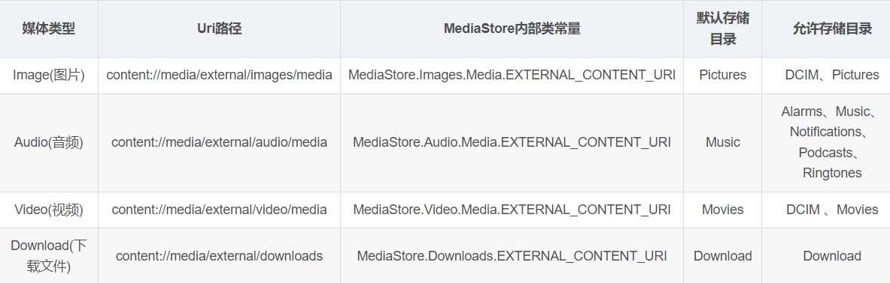

**使用ContentResolver查询数据**

ContentResolver的query方法接受几个参数，参数意义如下:

* Uri：这个Uri代表要查询的内容提供者的Uri。上文说到多媒体类型的Uri一般都直接从MediaStore里取得，例如我要取所有图片的信息，就必须利用MediaStore.Images.Media.EXTERNAL_CONTENT_URI这个Uri。
* projection： 代表告诉Provider要返回的字段内容（列Column），用一个String数组来表示。用null表示返回Provider的所有字段内容（列Column）。
* selection：相当于SQL语句中的where子句，就是代表查询条件。null表示不进行添加筛选查询。
* selectArgs：如果selection里有？这个符号时，这里可以以实际值代替这个问号。如果Selections这个没有？的话，那么这个String数组可以为null。
* sortOrder：说明查询结果按什么来排序。相当于SQL语句中的Order by，升序 asc /降序 desc，null为默认排序。


<video class="dplayer-video dplayer-video-current" webkit-playsinline="" x-webkit-airplay="allow" playsinline="" preload="metadata" src="">
</video>
